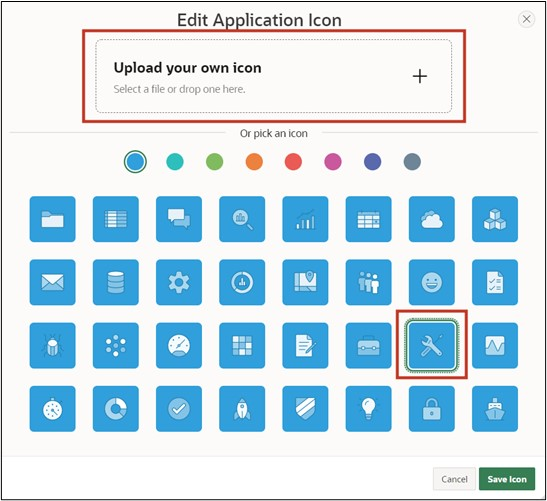
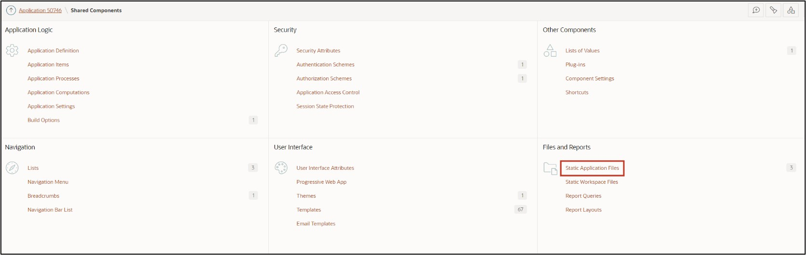
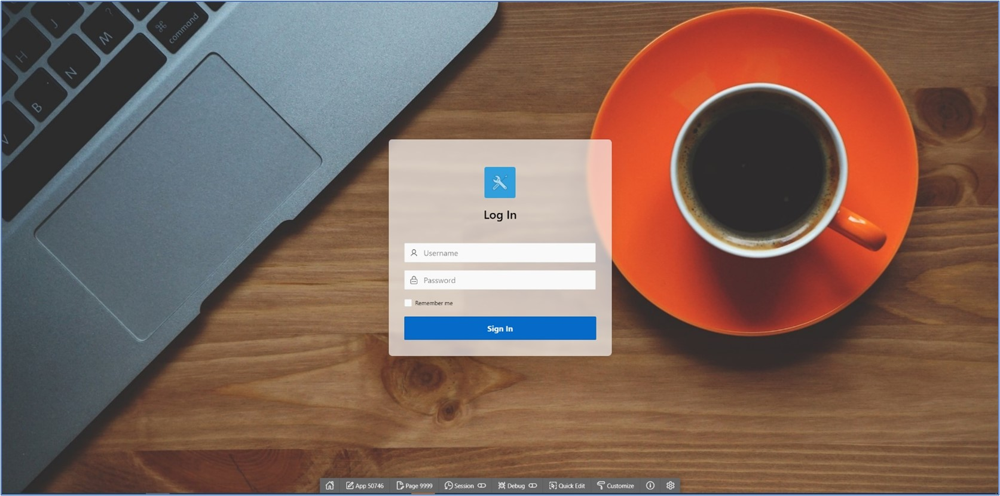

# 11. Optical Adjustments
Different use cases bring different requirements for the user interface of an application. By default, the interface of APEX is kept rather simple, but it can be extensively customized by combining component settings and custom CSS code.

CSS code allows developers to customize the design attributes of pages, regions, and items beyond the default. CSS consists of a list of rules that describe to the web browser how certain elements of a webpage should be displayed. So that not every element needs its own list of rules defined, identical elements can be grouped into classes.

## 11.1. Dark Mode
A dark mode can be activated for both the development environment and the finished application. For the latter, this is set in the theme settings of the application.
- First, open your **application**. Click on **Customize** in the bar at the bottom of the screen, then on **Theme Roller**. Here you can change the theme and make further CSS adjustments.


- Under **Style**, select the theme **Vita – Dark** and set it as the current theme by clicking the **Save** button.


Your created application should now look as follows:


## 11.2. Customizing the Login Screen
After this chapter, your login screen will have a background image and thus appear more appealing.
- First, open the **App Builder** and then click on the **application** you created.
- Click on **Page 9999 - *Login Page***.


A template contains all the elements that users need to create a page, including examples of the elements so developers can see how the individual elements are used. Whenever a new page is created in APEX, a template must be selected for it. Developers have the option to edit existing templates or create new ones.
- Select the **Region TUTORIAL22**. Change the **Name** there to ***Log In***.


- Select the **Item *P9999_USERNAME***. Delete the value of the **Label** field and change the value for **Icon** to **fa-user**.
- Select the **Item *P9999_PASSWORD***. Delete the value of the **Label** field and change the value for **Icon** to **fa-lock-password**.


- The Application Icon can be changed in the ***Shared Components***.


- Click on the ***User Interfaces Attributes*** entry under **User Interface**.


- Click here on ***Change Icon***.


- Here you can upload your own logo or select one from those available. You can also determine the color of the logo here. For example, choose the ***APEX Icon in blue*** and then click ***Save Icon***.



You can now see the changes made on your page. The region is displayed with a different template and the fields Username and Password are displayed with an icon and a placeholder.

Additionally, an icon is displayed above the region's title, which can support the identification of the application.


- The background image for the login page must next be uploaded in the application. Click again on ***Shared Components***.
- Then click on the ***Static Application Files*** entry under **Files**.



Under Static Application Files, you can upload and manage your own files. This is particularly useful for images, CSS, and JavaScript files. Files under Static Application Files are exported with application exports.
- Click on the **Create File** button.


- **Directory** represents the folder path to your file in text form. Enter ***img*** here so that your file is loaded into the **folder *img***. Upload the background.jpg file in the **Content** field. Then click on **Create**.


- Your uploaded file will now be displayed.
Then click on the **Edit Page 9999** button in the **Breadcrumb Bar** to go directly to the Page Designer for the login page.


- Your uploaded file will now be displayed.
Then click on the **Edit Page 9999** button in the **Breadcrumb Bar** to go directly to the Page Designer for the login page.
- Next, add a **Static Content Region** to the **Background Image** position and name it Image.


- Change the **Template** of the region to **Image**. Finally, the **File URL** of the previously uploaded image must be specified. Please enter **„#APP_FILES#img/background.jpg“** here.


- The following additional **CSS code** will be used to make the **Region *Log In*** transparent. Click on the **Page 9999: Login Page** entry on the left and select the **CSS** field **Inline** in the page properties on the right.


- Click on the **icon** above the field to the right to start the code editor. Enter the following CSS specifications there:
 ```css
.t-Login-region {
    opacity: 0.9;
}
 ```


- Click the **Run** button to view the revised page.
You will now see the changes you made.

