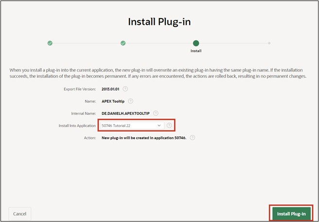
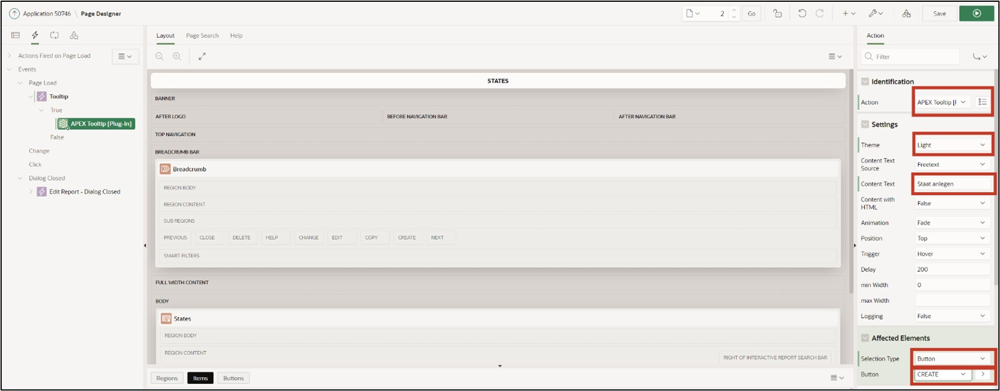

# 12. Plug-Ins

## 12.1. Introduction

Plug-ins are extensions that allow APEX to be expanded with custom item types, region types, processes, and dynamic actions. Components based on plug-ins are created and maintained similarly to standard APEX components. With plug-ins, developers can create customized components to enhance the functionality, appearance, and user-friendliness of their applications. Plug-ins can help make the application more user-friendly and add extras. As part of this task, two plug-ins will be integrated. Below you will incorporate plug-ins into your application. Additional plug-ins, besides those mentioned here, can be found at apex.world, for example:

https://apex.world/ords/f?p=100:700

## 12.2. Plug-Ins

For the completion of these tasks, we will use a plug-in from the following page:

https://api.github.com/repos/Dani3lSun/apex-plugin-apextooltip/zipball.

This plug-in allows the developer to add tooltips to buttons, fields, regions, reports, and other components. The plug-in must first be downloaded and extracted.

### 12.2.1. Importing the Plug-In

- First, open the **App Builder** and your **Application**. Then click on **Shared Components**.

- Under **Other Components**, click on **Plug-Ins**.

- Click on **Import**.

- Upload the plug-in. It should be located in the folder where you extracted the plug-in: **…source\dynamic_action_plugin_de_danielh_apextooltip.sql**.

Drag and drop this file into the corresponding field. Select **Plug-in** as **File Type** and then click **Next**.

- Click **Next** again.

- Select the application with which you are conducting this tutorial and click **Install Plug-In**.

### 12.2.2. Embedding the Plug-In

- The plug-in has now been installed. Click on your application to return.

- Select page 2 - **STATES**.

- Click on **Dynamic Actions** (lightning bolt icon) and right-click under **Page Load** on **Create Dynamic Action**.

Dynamic Actions allow developers to set client-side behavior without JavaScript. The creation wizard can define when certain actions should be performed and which elements are affected by these actions.

- Change the name of the dynamic action to **Tooltip** and then click **Show**.

- Now change the following fields:
  | | |  
  |--|--|
  | **Identification**   Action | APEX Tooltip [Plug-In]|  
  | **Settings**   | Theme   Content Text| |
  | **Affected Elements**   Selection Type   Button | Button     CREATE |

- Now start the application via the **Run** button.
- When you hover the mouse over the Create button, the tooltip will be displayed.

There are many more settings or **Plug-In Settings** that you can use as described above. Feel free to try some of them out.

### 12.2.3. Quality Assurance Plugin 

- Proceed as described in 12.2.1 to install another plug-in. This plug-in allows you to define development guidelines and then automatically shows violations against them on the respective page. You can download the plug-in here: 
https://github.com/mt-ag/apex-qa-plugin/archive/master.zip

- Import the plug-in. It should then be in the folder where you extracted the plug-in: **…src\APEX\region_type_plugin_com_mtag_olemm_qa_region.sql**

- Additionally, database objects must be created for the plug-in using a SQL script. To do this, click on **SQL Workshop**, then **SQL Scripts**. Click on the **Upload** button

- Upload the file **…\src\plugin_qa_install.sql** from the plug-in folder.

- The script can now be executed with the **Run** button and the subsequent **Run Now**.

- Through the **App Builder**, you can now navigate back to the application and call up **Page 0** (Global Page – Desktop).
- Right-click on the **Components** tab and create a new region with **Create Region**.

- Now change the following fields and then press Save:
  | | |  
  |--|--|
  | **Identification**   Title   Type | **QA**   **Quality Assurance – Region [Plug-In]**|  

Since this region was created on the **Global Page – 0**, it will now be displayed on every page of the application.

To allow the plug-in to display violations against the guidelines, these must be defined. Some example rules are already included with the **Plug-in** download. 
- As before, a **SQL script** must now be uploaded and executed via the **SQL Workshop**. You can find the script under: **…src\DML\plugin_qa_rules.sql**

 
- If you now switch to the application and call up a page, the rule violations will be displayed at the bottom of the page in the QA region.

For your own projects, you can define your own rules for this plug-in to ensure compliance with the guidelines.