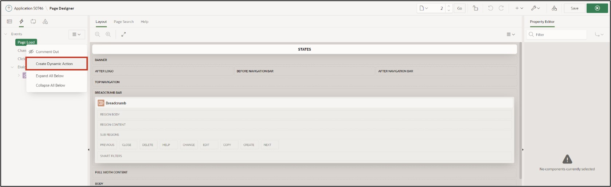

# 12. Plug-Ins

## 12.1 Introduction

Plug-Ins are extensions and allow APEX to be extended with custom item types, region types, processes, and dynamic actions. Components based on plug-ins are created and maintained similarly to standard APEX components. With plug-ins, developers can create customized components to enhance the functionality, appearance, and usability of their applications.

Plug-ins can help make the application more user-friendly and add extras. In this task, two plug-ins will be installed.  
The following will integrate plug-ins into your application.

> Additional plug-ins beyond those mentioned here can be found on apex.world:  
[https://apex.world/ords/f?p=100:700](https://apex.world/ords/f?p=100:700)

## 12.2 Plug-Ins

To complete these tasks, we will use a plug-in from the following page:

[https://api.github.com/repos/Dani3lSun/apex-plugin-apextooltip/zipball](https://api.github.com/repos/Dani3lSun/apex-plugin-apextooltip/zipball)

This plugin allows the developer to incorporate tooltips for buttons, fields, regions, reports, and other components.  
The plug-in must first be downloaded and extracted.

### 12.2.1 Import Plug-In

- First, open the **App Builder** and your **application**. Then click on **Shared Components**.

- Under **Other Components**, click on **Plug-Ins**.

 

- Click on **Import**.

 

- Upload the plug-in. It should be in the folder where you extracted the plug-in:  
**…source\dynamic_action_plugin_de_danielh_apextooltip.sql**.

  Drag and drop this file into the respective field. Select **Plug-in** as **File Type**, and then click **Next**.
  
  

- Click **Next** again.

- Choose the application in which you are conducting this tutorial and click on **Install Plug-In**.

### 12.2.2 Embed Plugin

- The plug-in is now installed. Click on your application to return.

  

- Select page 2 - **STATES**.

- Click on **Dynamic Actions** (lightning icon) and right-click under **Page Load** to **Create Dynamic Action**.

Dynamic actions allow developers to define client-side behavior without JavaScript. With the creation wizard, it can be determined when certain actions should be executed and which elements are affected by these actions.  
- Change the name of the dynamic action to **Tooltip** and then click on **Show**.

- Now modify the following fields:  
  | | |  
  |--|--|
  | **Identification** |
  | Action | APEX Tooltip [Plug-In]|  
  | **Settings** | 
  | Theme | *Light* |
  | Content Text | *Create State* |
  | **Affected Elements** |
  | Selection Type | *Button* | 
  | Button  |  *CREATE* |
  | | |

- Now start the application via the **Run** button.  
- When you hover the mouse over the Create Button, the tooltip will appear.

There are many other settings or **Plug-In Settings** that you can freely use as described above. Feel free to try some of them.

### 12.2.3 Quality Assurance Plugin

- Proceed as described in 12.2.1 to install another plug-in. 
This plug-in allows development guidelines to be defined and then automatically shows violations on the respective page.

> You can download the plug-in here: 
[https://github.com/mt-ag/apex-qa-plugin/archive/master.zip](https://github.com/mt-ag/apex-qa-plugin/archive/master.zip)

- Import the plugin. It should then be in the folder where you extracted the plug-in: 
**…src\APEX\region_type_plugin_com_mtag_olemm_qa_region.sql**

- Additionally, database objects need to be created for the plug-in using a SQL script. To do this, click under **SQL Workshop** on **SQL Scripts**. Click the **Upload** button there.

- Upload the file **…\src\plugin_qa_install.sql** from the plugin folder.

  

- With the **Run** button and the following **Run Now**, the script can now be executed.

  

  

- Through the **App Builder**, you can now navigate back to the application and open **Page 0** (Global Page – Desktop).

- Create a new region via right-click on the **Components** tab using **Create Region**.

  

- Now change the following fields and then press Save:
  | | |  
  |--|--|
  | **Identification** |
  | Title | **QA** |
  | Type | **Quality Assurance – Region [Plug-In]**|  
  | | |

Since this region was created on the **Global Page – 0**, this region will now be displayed on every page of the application.

For the plug-in to display violations against guidelines, these must be defined. When downloading the **Plug-In**, some sample rules are already included. 
- As before, a **SQL script** must be uploaded and executed through the **SQL Workshop**. You can find the script under: **…src\DML\plugin_qa_rules.sql**
 
- If you now switch to the application and access a page, the rule violations will be displayed at the end of the page in the QS region.

For your own projects, you can define your individual rules for this plug-in and thus ensure compliance with the guidelines.