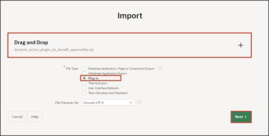
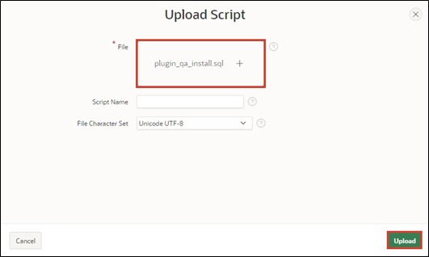
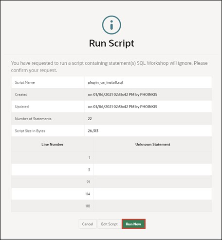

# 12. Plug-Ins

## 12.1. Introduction

Plug-ins are extensions that allow APEX to be extended with custom item types, region types, processes, and dynamic actions. Components based on plug-ins are created and maintained similarly to standard APEX components. With plug-ins, developers can create customized components to enhance the functionality, appearance, and usability of your applications.

Plug-ins can help make the application more user-friendly and add extra features. In the context of this task, two plug-ins will be implemented. The following sections will guide you through integrating plug-ins into your application.

>More plug-ins besides the ones mentioned here can be found on apex.world:  
[https://apex.world/ords/f?p=100:700](https://apex.world/ords/f?p=100:700)

## 12.2. Plug-Ins

For the completion of these tasks, we will use a plug-in from the following site: 

[https://api.github.com/repos/Dani3lSun/apex-plugin-apextooltip/zipball](https://api.github.com/repos/Dani3lSun/apex-plugin-apextooltip/zipball)  

This plugin allows the developer to embed tooltips in buttons, fields, regions, reports, and other components.  
The plug-in must first be downloaded and unpacked.  

### 12.2.1. Import Plug-in

- First, open the **App Builder** and your **Application**. Then click on **Shared Components**.   

- Under **Other Components**, click on **Plug-Ins**.  

 

- Click on **Import**.  

 

- Upload the plug-in. It should be in the folder where you unpacked the plug-in:   
**…source\dynamic_action_plugin_de_danielh_apextooltip.sql**.

  Drag and drop this file into the appropriate field. Select **Plug-in** as **File Type** and then click on **Next**.  
  
  

- Click on **Next** again.  

- Select the application you are using for this tutorial and click on **Install Plug-In**.  

### 12.2.2. Embed Plugin

- The plug-in is now installed. Click on your application to return. 

  

- Select page 2 - **STATES**.  

- Click on **Dynamic Actions** (lightning bolt icon) and right-click under **Page Load** to **Create Dynamic Action**.  

Dynamic Actions allow developers to define client-side behavior without JavaScript. With the creation wizard, you can specify when certain actions should be executed and which elements are affected by these actions.  
- Change the name of the dynamic action to **Tooltip** and then click on **Show**.  

- Now modify the following fields:  
  | | |  
  |--|--|
  | **Identification** |
  | Action | APEX Tooltip [Plug-In]|  
  | **Settings** | 
  | Theme | *Light* |
  | Content Text | *Create State* |
  | **Affected Elements** |
  | Selection Type | *Button* | 
  | Button  |  *CREATE* |
  | | |

- Now start the application using the **Run** button.  
- When you now hover the mouse over the Create button, the tooltip will appear.  

There are many more settings or **Plug-In Settings** that you can use as described above. Feel free to try some of them out.

### 12.2.3. Quality Assurance Plugin 

- Proceed as described in 12.2.1 to install another plug-in. 
The plug-in allows the definition of development guidelines and automatically displays violations thereof on the respective page.  

> The plug-in can be downloaded here: 
[https://github.com/mt-ag/apex-qa-plugin/archive/master.zip](https://github.com/mt-ag/apex-qa-plugin/archive/master.zip)  

- Import the plugin. It should then be in the folder where you unpacked the plug-in: 
**…src\APEX\region_type_plugin_com_mtag_olemm_qa_region.sql**

- Additionally, database objects must be created for the plug-in using an SQL script. To do this, click on **SQL Workshop** under **SQL Scripts**. There, click on the **Upload** button   

- Upload the file **…\src\plugin_qa_install.sql** from the plug-in folder.  

  

- With the **Run** button and the subsequent **Run Now**, the script can now be executed.  

  

  

- You can now navigate back to the application and open **Page 0** (Global Page – Desktop) via the **App Builder**.  

- With a right-click on the **Components** tab, create a new region using **Create Region**.

  

- Now change the following fields and then press Save:
  | | |  
  |--|--|
  | **Identification** |
  | Title | **QA** |
  | Type | **Quality Assurance – Region [Plug-In]**|  
  | | |

Since this region was created on the **Global Page – 0**, this region will now be displayed on every page of the application.

To allow the plug-in to display guideline violations, these must be defined. Some sample rules are already included when downloading the **Plug-In**. 
- As before, a **SQL script** must now be uploaded and applied via the **SQL Workshop**. The script can be found here: **…src\DML\plugin_qa_rules.sql**

 
- When you now switch to the application and open a page, rule violations will be displayed in the QS region at the end of the page.  

  

For your own projects, you can define your own rules for this plug-in to ensure compliance with the guidelines.