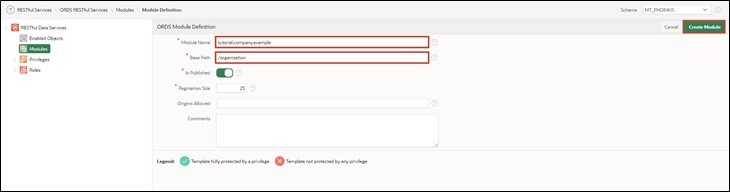
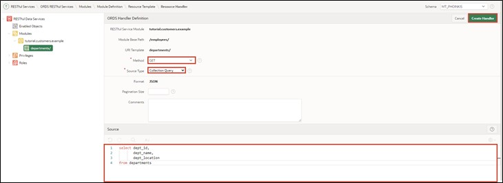
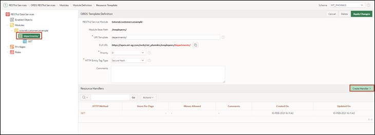
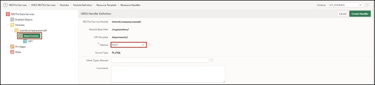
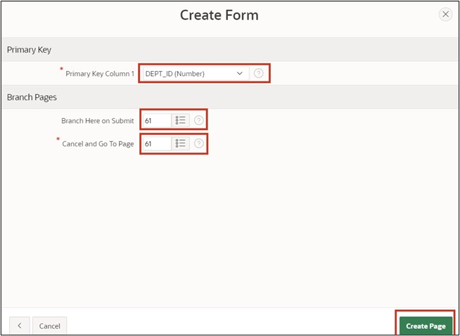

# 13. REST Data Sources
Data Sources enable the integration of REST services. The received data can be used in APEX components like reports or forms. The data is transported as JSON objects between the application and the REST Source. There are various operations corresponding to the HTTP methods (GET, POST, PUT, DELETE) that can be linked with the respective database operations (SELECT, INSERT, UPDATE, DELETE).

## 13.1. Creating a RESTful Service
In this task, you will create your own RESTful service. You can access it from the internet and use it in other services.
- To create the RESTful Service, click on the **SQL Workshop** and then on **RESTful Services**.

- When creating a RESTFUL Service for the first time, you must first register your schema with ORDS (Oracle Data Service) by clicking on the **Register Schema with ORDS** button.


- Click on **Save Schema Attributes** in the dialog that opens.


You will now see the following overview page:


- Click on **Modules** and then on the **Create Module** button.


- Enter **Module Name *tutorial.company.example*** and **Base Path */organization/***. Then click on **Create Module**.



- After your module has been created, create a template for it by clicking on the **Create Template** button.


- Enter **URI Template *departments/*** and create your template by clicking on **Create Template**.


- Now click on **Create Handler** to create the resource handlers. In this tutorial, you will create two handlers (for GET and POST).


- In the first step, you will create the GET method. Select **Method** in the handler as ***GET***. Ensure that **Source Type *Collection Query*** is selected.
- Then enter the following SQL query under **Source**:

 ```sql
select dept_id,
	    dept_name,
        dept_location
from departments
 ```
- You have now entered all the necessary information for the GET query. You can create the handler by clicking on **Create Handler**.



- In the next step, create the POST handling. Click on your **departments/** template and then on **Create Handler**.


 
- Select **Method *POST***.



- Enter the following PL/SQL code under **Source**:
 ```sql
begin
  	insert into departments (
  		dept_name,
 		dept_location)
  	values (
 		:dept_name, 
 		:dept_location);
end;
 ```


- Scroll down to **Parameters** and click on **Add Row**.
- Enter the following information:

**Name: *dept_name***

**Bind Variable: *dept_name***

**Access Method: *IN***

**Source Type: *HTTP HEADER***

**Data Type: *STRING***

- Then add a parameter for location by clicking on Add Row again. Enter the following data:

**Name: *dept_location***

**Bind Variable: *dept_location***

**Access Method: *IN***

**Source Type: *HTTP HEADER***

**Data Type: *STRING***

- After this is done, scroll back up and click on Create Handler.


- With this, your module is fully defined. To check, access the URL you see under Full URL at departments/ with your browser. You should now see the contents of the GET query and the ID, name, and location of the departments.

 ```json
"items": [
    {
      "dept_id": 15,
      "dept_name": "Accounting",
      "dept_location": "New York"
    },
    {
      "dept_id": 16,
      "dept_name": "Research",
      "dept_location": "Dalls"
    },
    {
      "dept_id": 17,
      "dept_name": "Sales",
      "dept_location": "Chicago"
    },
    {
      "dept_id": 18,
      "dept_name": "Operations",
      "dept_location": "Boston"
    }
  ]
 ```
  
## 13.2. Creating a REST Data Source
After creating your own RESTful Service in the previous chapter, we will use it in APEX as a REST Data Source. The procedure shown below also applies similarly to REST data sources that you did not create yourself.
To create the REST Data Source, go to the Shared Components of your application.

- **REST Data Sources** are located in the **Shared Components** under the **Data Sources** section.


- You can create a new REST data source via the **Create** button.


 
- As there are no REST Data Sources in this application yet, you have to create them new, so select **From Scratch**. Click **Next**.


- Select **REST Data Source Type *Oracle REST Data Service***.
Give the REST Data Source the **Name *Departments***. You also need to define the URL endpoint. The URL endpoint can be found in your RESTful Service module.
- Then click on the **Next** button. 


 
- In the second step of the wizard, you need to set up the Service URL Path, i.e., the forwarding within the API. The correct path should already be preset automatically, so you don't have to change anything here and just click **Next**.


- Leave **Authentication Required** off, as the created REST data source does not require authentication. Click the **Discover** button.


Click **Create REST Data Source** in the subsequent window.


- You will now see your newly created REST data source in the overview.
- You can now view your Rest Source. Click the Departments link for this.


 
- Your Rest Source should look similar to the following image:


- Ensure that your settings in the **Data Profile** look like the picture shown and that the two operations ***GET*** and ***POST*** have been defined under **Operations**.
 
## 13.3. Sending Data to a REST Data Source
In this chapter, we will use the previously created REST Source to send our own data. Specifically, we will add new departments. The HTTP-POST method is used for this, which is defined as an operation in the REST Data Source.
- Open the **App Builder** and your application. Click on **Create Page** and create a new page by clicking on **Create Page**.

- Select Page Type as **Form**.


- Enter **Page Number *61*** and **Page Name *Departments***.
- Select **Data Source *REST Data Source*** and then choose ***Departments*** as **REST Data Source**.
- Disable the breadcrumb in the **Navigation** section and click **Next**.

  

- Select **Primary Key Column *DEPT_ID***.
- Enter **Branch Here on Submit *61*** and **Cancel and Go to Page** also as ***61***.
- Now create your page by clicking the **Create Page** button.



- Access the page via the **Run** button.

- You can now add new departments through the form.


## 13.4. Retrieving Data from a REST Data Source
Now we want to use the REST Data Source not only to add data but also to retrieve and display data. The HTTP-GET method, which is defined as an operation in the REST Data Source, is used for this.
- Through the form created in Chapter 13.3, it is now possible to add new departments. To quickly see if adding was successful, you will also create a report on the page.

- In the Page Designer, click on Departments on the left side and then right-click on Departments. Select **Create Region**.

- Select **Type** of your region as ***Classic Report*** and give it the **Title *All Departments***. Select ***REST Source*** as **Location** under Source and then ***Departments*** as **REST Source**.


 
- Access the page via the **Run** button.
- The report now shows you all departments.


Another demo application of MT AG based on REST Data Sources can be found here: https://apex.oracle.com/pls/apex/mt_apisearch/r/datasources