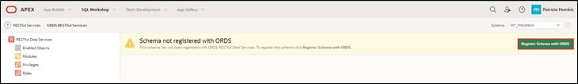
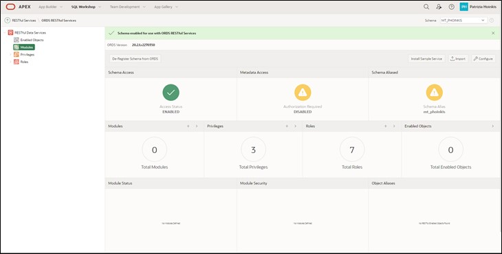
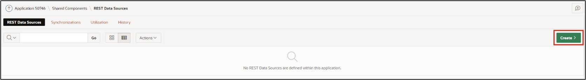
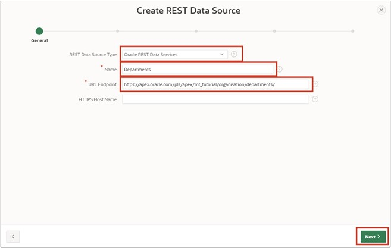
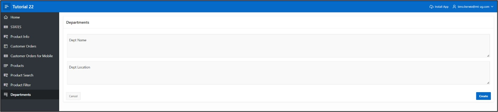

# <a name="rest-data-sources"></a>13. REST Data Sources
Data Sources allow the integration of REST services. The received data can be used in APEX components such as reports or forms. The data is transported as JSON objects between the application and the REST Source. There are various operations corresponding to the HTTP methods (GET, POST, PUT, DELETE) that can be associated with the respective database operation (SELECT, INSERT, UPDATE, DELETE).

## <a name="create-restful-service"></a>13.1 Create RESTful Service
In this task, you will create your own RESTful service. You can call this from the internet and use it in other services.
- To create the RESTful Service, click on the **SQL Workshop** and then on **RESTful Services**.

- When first creating a RESTful service, you must first register your schema with ORDS (Oracle Data Service) by clicking on the button **Register Schema with ORDS**.



- In the dialog that opens, click **Save Schema Attributes**.


Now you see the following overview page:



- Click on **Modules** and then on the **Create Module** button.


- Enter **Module Name *tutorial.company.example*** and **Base Path */organisation/***, then click on **Create Module**.


- After your module has been created, you now create a template for it. Click on the button **Create Template** for this purpose.


- Enter **URI Template *departments/*** and create your template by clicking **Create Template**.


- Now click on **Create Handler** to create the *Resource Handler*. In this tutorial, you will create two handlers (for GET and POST).


- In the first step, you will create the GET method. For this, select **Method** in the handler as ***GET***. Make sure that **Source Type *Collection Query*** is selected.
- Then enter the following SQL query at **Source**:

 ```sql
select dept_id,
	     dept_name,
       dept_location
from departments
 ```
- Now you have entered all the necessary information for the GET query. You can now create the handler by clicking on **Create Handler**.


- In the next step, you create the POST handling. Click on your template **departments/** and then on **Create Handler**.


 
- Select **Method *POST***.


- Enter the following PL/SQL code under **Source**:
 ```sql
begin
  	insert into departments (
  		dept_name,
 		dept_location)
  	values (
 		:dept_name, 
 		:dept_location);
end;
 ```


- Scroll down to **Parameters** and click on **Add Row**.
- Enter the following information:

  |  |  |
  |--|--|
  | **Name** | dept_name |
  | **Bind Variable** | dept_name |
  | **Access Method** | IN |
  | **Source Type** | HTTP HEADER |
  | **Data Type** | STRING |
  |  |  |

- Then add a parameter for the location by clicking on Add Row again. Enter the following data:  

  |  |  |
  |--|--|
  | **Name** | dept_location |
  | **Bind Variable** | dept_location |
  | **Access Method** | IN |
  | **Source Type** | HTTP HEADER |
  | **Data Type** | STRING |
  |  |  |

- Once you have done this, scroll back up and click on **Create Handler**.


- With this, your module is fully defined. For control, call up the URL that you see under **Full URL** for **departments/** with your browser. You should now see the content of the GET query and thus the ID, name, and location of the departments.

 ```json
"items": [
    {
      "dept_id": 15,
      "dept_name": "Accounting",
      "dept_location": "New York"
    },
    {
      "dept_id": 16,
      "dept_name": "Research",
      "dept_location": "Dallas"
    },
    {
      "dept_id": 17,
      "dept_name": "Sales",
      "dept_location": "Chicago"
    },
    {
      "dept_id": 18,
      "dept_name": "Operations",
      "dept_location": "Boston"
    }
  ]
 ```
  
## <a name="create-rest-data-source"></a>13.2 Create REST Data Source
After you created your own RESTful service in the previous chapter, we will use this in APEX as a REST Data Source. The procedure shown below also applies similarly to REST data sources that you have not created yourself.
To create the **REST Data Source**, go to the **Shared Components** of your application.

- The **REST Data Sources** are located in the **Shared Components** under the item **Data Sources**.


- You can create a new REST data source via the **Create** button.


 
- Since there are no REST Data Sources present in this application yet, you must create them anew, so select **From Scratch**. Click **Next**.


- Select **REST Data Source Type *Oracle REST Data Service***.
Give the REST Data Source the **Name *Departments***. In addition, you must define the URL endpoint. You will find the URL endpoint in your RESTful service module.
- Then click the button **Next**.


 
- In the second step of the wizard, you have to set up the service URL path, i.e., the forwarding within the API. The correct path should already be preset automatically, so you do not need to change anything and just click **Next**.


- Leave **Authentication Required** turned off because the created REST data source does not require authentication. Click the **Discover** button.


- In the next window, click on **Create REST Data Source**.


- Now you can see your newly created REST data source in the overview.
- You can now view your REST Source. Click on the Departments link.


 
- Your REST Source should look like the following image:


- Ensure your settings in the **Data Profile** look like those shown in the image and that the two operations ***GET*** and ***POST*** have been created in **Operations**.

## <a name="sending-data-to-rest-data-source"></a>13.3 Sending Data to a REST Data Source
In this chapter, we will use the previously created REST Source to send our own data. Specifically, we will add new departments. The HTTP-POST method, which is defined in the REST Data Source as an operation, will be used for this.
- Open the **App Builder** and your application. Click on **Create Page** and create a new page by clicking **Create Page**.

- Select **Form** as the Page Type.


- Enter **Page Number *61*** and **Page Name *Departments***.
- Select **Data Source *REST Data Source*** and then **Departments** as **REST Data Source**.
- In the **Navigation** section, disable *Breadcrumb* and click **Next**.


- Select **Primary Key Column *DEPT_ID***.
- Enter **Branch Here on Submit *61*** and **Cancel and Go to Page** as ***61***.
- Now create your page by clicking on the **Create Page** button.


- Call up the page via the **Run** button.

- You can now add new departments via the form.



## <a name="retrieve-data-from-rest-data-source"></a>13.4 Retrieve Data from a REST Data Source
Now we want to use the REST Data Source not only for adding data but also for retrieving and displaying data. The HTTP-GET method, which is defined in the REST Data Source as an operation, will be used for this purpose.
- Through the form created in Chapter 13.3, it is now possible to create new departments. To see immediately if the addition was successful, you will also create a report on the page.

- In the Page Designer, click on Departments on the left and then right-click on Body. Select **Create Region**.

- For your region **Type**, select ***Classic Report*** and give it the **Title *All Departments***. Under Source, select ***REST Source*** as **Location** and then ***Departments*** as **REST Source**.


 
- Access the page via the **Run** button.
- The report now shows you all departments.


> An additional demo application of MT - IT Solutions based on REST Data Sources can be found here:  
[https://apex.oracle.com/pls/apex/mt_apisearch/r/datasources](https://apex.oracle.com/pls/apex/mt_apisearch/r/datasources)