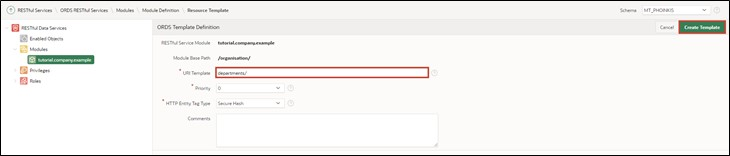
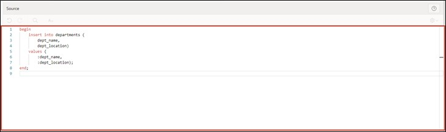
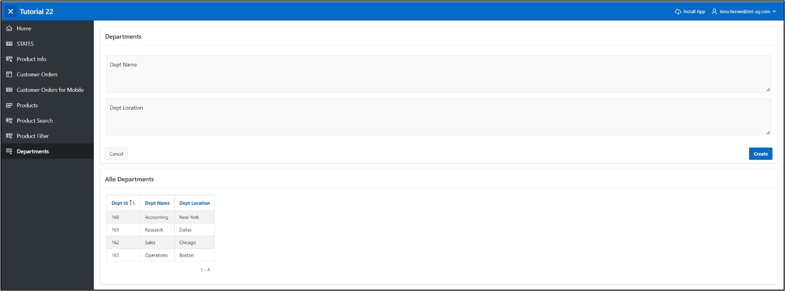

# 13. REST Data Sources
Data Sources allow the integration of REST services. The received data can be used in APEX components such as reports or forms. The data is transported as JSON objects between the application and the REST source. There are various operations corresponding to the HTTP methods (GET, POST, PUT, DELETE) that can be linked to the respective database operations (SELECT, INSERT, UPDATE, DELETE).

## 13.1. Create RESTful Service
In this task, you will create your own RESTful service. This can be accessed from the internet and used in other services.
- To create the RESTful service, click on **SQL Workshop** and then on **RESTful Services**.

- When creating a RESTful service for the first time, you need to register your schema with ORDS (Oracle Data Service) by clicking the **Register Schema with ORDS** button.


- In the dialog that opens, click on **Save Schema Attributes**.


You will now see the following overview page:


- Click on **Modules** and then on the **Create Module** button.


- Enter **Module Name *tutorial.company.example*** and **Base Path */organisation/***. Then click on **Create Module**.


- Once your module is created, create a template for it by clicking the **Create Template** button.


- Enter **URI Template *departments/*** and create your template by clicking **Create Template**.



- Now click on **Create Handler** to create the *Resource Handler*. In this tutorial, you will create two handlers (for GET and POST).


- First, you will create the GET method. For this, select **Method** in the handler ***GET***. Ensure that **Source Type *Collection Query*** is selected.
- Then enter the following SQL query under **Source**:

 ```sql
select dept_id,
	    dept_name,
        dept_location
from departments
 ```  
- Now you have entered all the necessary information for the GET query. You can create the handler by clicking **Create Handler**.


- Next, create the POST handling. For this, click on your template **departments/** and then on **Create Handler**.


 
- Select **Method *POST***.


- Enter the following PL/SQL code under **Source**:
 ```sql
begin
  	insert into departments (
  		dept_name,
 		dept_location)
  	values (
 		:dept_name, 
 		:dept_location);
end;
 ```



- Scroll down to **Parameters** and click **Add Row** there.
- Enter the following information:

  |  |  |
  |--|--|
  | **Name** | dept_name |
  | **Bind Variable** | dept_name |
  | **Access Method** | IN |
  | **Source Type** | HTTP HEADER | 
  | **Data Type** | STRING | 
  |  |  |

- Then add a parameter for the location by clicking Add Row again. Enter the following details:

  |  |  |
  |--|--|
  | **Name** | dept_location |
  | **Bind Variable** | dept_location |
  | **Access Method** | IN |
  | **Source Type** | HTTP HEADER | 
  | **Data Type** | STRING | 
  |  |  |

- Once you have done this, scroll back up and click **Create Handler**.

  

- Your module is now fully defined. To check, access the URL you see under **Full URL** at **departments/** with your browser. You should now see the contents of the GET query, showing the ID, name, and location of the departments.

 ```json
"items": [
    {
      "dept_id": 15,
      "dept_name": "Accounting",
      "dept_location": "New York"
    },
    {
      "dept_id": 16,
      "dept_name": "Research",
      "dept_location": "Dalls"
    },
    {
      "dept_id": 17,
      "dept_name": "Sales",
      "dept_location": "Chicago"
    },
    {
      "dept_id": 18,
      "dept_name": "Operations",
      "dept_location": "Boston"
    }
  ]
 ```
  
## 13.2. Create REST Data Source
After creating your own RESTful service in the previous chapter, we will now use it in APEX as a REST data source. The procedure shown below applies similarly to REST data sources you did not create.  
To create the **REST Data Source**, go to the **Shared Components** of your application.

- The **REST Data Sources** are located in the **Shared Components** under **Data Sources**.

  

- Use the **Create** button to create a new REST data source.


 
- Since there are no REST Data Sources present in this application, you need to create them anew, so select **From Scratch**. Click **Next**.

 

- Choose **REST Data Source Type *Oracle REST Data Service***.
Give the REST Data Source the **Name *Departments***. You also need to define the URL endpoint. You can find the URL endpoint in your RESTful Service module.  
- Then click the **Next** button.
   

 
- In the second step of the wizard, you need to set up the service URL path, i.e., forwarding within the API. The correct path should already be pre-set automatically, so there's nothing to change; just click **Next**.
  


- Leave **Authentication Required** unchecked, as the created REST data source does not require authentication. Click the **Discover** button.
  

 
- In the following window, click **Create REST Data Source**. 
 


- You will now see your newly created REST data source in the overview.
- You can now view your Rest Source. Click on the Departments link.


 
- Your Rest Source should look similar to the image below:


- Check that your settings in the **Data Profile** look like the image shown and that the two operations ***GET*** and ***POST*** have been created at **Operations**.
 
## 13.3. Sending Data to a REST Data Source
In this chapter, we will use the previously created REST source to send custom data. Specifically, we will add new departments using the HTTP-POST method defined as an operation in the REST data source. 
- Open the **App Builder** and your application. Click on **Create Page** and create a new page by clicking **Create Page**.

- Select **Form** as the Page Type.
  


- Enter **Page Number *61*** and **Page Name *Departments***.
- Select **Data Source *REST Data Source*** and then choose ***Departments*** as the **REST Data Source**.
- In the **Navigation** area, disable *Breadcrumb* and click **Next**.   

  

- Choose **Primary Key Column *DEPT_ID***.
- Enter **Branch Here on Submit *61*** and **Cancel and Go to Page** as ***61***.
- Now create your page by clicking the **Create Page** button.


- Access the page via the **Run** button.

- You can now add new departments via the form.


## 13.4. Retrieving Data from a REST Data Source
We now want to use the REST data source not only to add data but also to retrieve and display data. For this, the HTTP-GET method defined as an operation in the REST data source will be used.  
- Through the form created in Chapter 13.3, it is now possible to create new departments. To immediately recognize whether the addition was successful, you will also create a report on the page.

- In the Page Designer, click on Departments on the left side and then right-click on Departments. Choose **Create Region** here.

- Select ***Classic Report*** as the **Type** of your region and give it the **Title *All Departments***. Under Source, select ***REST Source*** for **Location** and then ***Departments*** for **REST Source**.


 
- Access the page via the **Run** button.  
- The report now shows you all the departments.  
 


> You can find another demo application of MT - IT Solutions based on REST Data Sources here:  
[https://apex.oracle.com/pls/apex/mt_apisearch/r/datasources](https://apex.oracle.com/pls/apex/mt_apisearch/r/datasources)