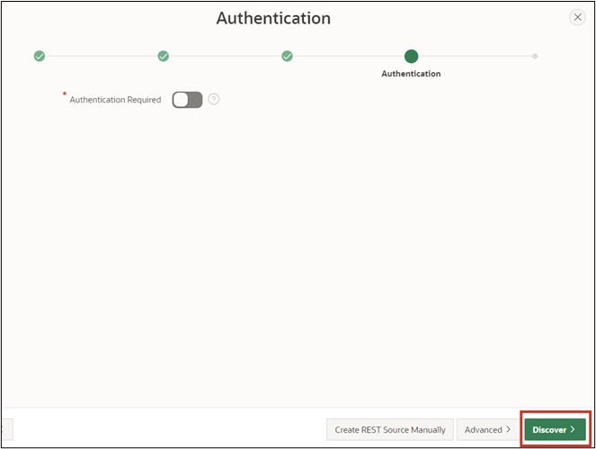

# <a name="rest-data-sources"></a>13. REST Data Sources

Data Sources enable the integration of REST services. The received data can be used in APEX components such as Reports or Forms. The data is transported as JSON objects between the application and the REST Source. There are various operations corresponding to the HTTP methods (GET, POST, PUT, DELETE) which can be linked to the respective database operation (SELECT, INSERT, UPDATE, DELETE).

## <a name="restful-service-erstellen"></a>13.1 Create RESTful Service

In this task, you will create your own RESTful Service. You can call this from the Internet and use it in other services.
- To create the RESTFul Service, click on the **SQL Workshop** and then on **RESTful Services**.

- When creating a RESTFUL Service for the first time, you must first register your schema with ORDS (Oracle Data Service) by clicking the **Register Schema with ORDS** button.


- In the dialog that opens, click **Save Schema Attributes**.


Now you see the following overview page:


- Click on **Modules** and then on the **Create Module** button.


- Enter **Module Name *tutorial.company.example*** and **Base Path */organisation/***. Then click **Create Module**.


- After your module has been created, create a template for it. To do this, click the **Create Template** button.


- Enter **URI Template *departments/*** and create your template by clicking **Create Template**.


- Now click on **Create Handler** to create the *Resource Handler*. In this tutorial, you will create two handlers (for GET and POST).


- In the first step, you will create the GET method. Choose **Method** in the handler ***GET***. Make sure that **Source Type *Collection Query*** is selected.
- Then enter the following SQL query in **Source**:

 ```sql
select dept_id,
       dept_name,
       dept_location
from departments
 ```
- Now you have entered all the necessary information for the GET query. You can now create the handler by clicking **Create Handler**.


- In the next step, you will create the POST handling. To do this, click on your template **departments/** and then on **Create Handler**.


- Choose **Method *POST***.


- Enter the following PL/SQL code under **Source**:
 ```sql
begin
    insert into departments (
        dept_name,
        dept_location)
    values (
        :dept_name, 
        :dept_location);
end;
 ```


- Scroll down to **Parameters** and click **Add Row** there.
- Enter the following information:

  |  |  |
  |--|--|
  | **Name** | dept_name |
  | **Bind Variable** | dept_name |
  | **Access Method** | IN |
  | **Source Type** | HTTP HEADER | 
  | **Data Type** | STRING | 
  |  |  |

- Then also add a parameter for the Location by clicking Add Row again. Enter the following data:

  |  |  |
  |--|--|
  | **Name** | dept_location |
  | **Bind Variable** | dept_location |
  | **Access Method** | IN |
  | **Source Type** | HTTP HEADER | 
  | **Data Type** | STRING | 
  |  |  |

- Once you've done this, scroll back up and click **Create Handler**.


- Your module is now fully defined. To verify, call up the URL you see under **Full URL** at **departments/** with your browser. You should now see the contents of the GET query, including the ID, name, and location of the departments.

 ```json
"items": [
    {
      "dept_id": 15,
      "dept_name": "Accounting",
      "dept_location": "New York"
    },
    {
      "dept_id": 16,
      "dept_name": "Research",
      "dept_location": "Dalls"
    },
    {
      "dept_id": 17,
      "dept_name": "Sales",
      "dept_location": "Chicago"
    },
    {
      "dept_id": 18,
      "dept_name": "Operations",
      "dept_location": "Boston"
    }
  ]
 ```

## <a name="rest-data-source-erstellen"></a>13.2 Create REST Data Source

After creating your own RESTful Service in the previous chapter, we will use it in APEX as a REST Data Source. The procedure shown below also applies to REST data sources that you did not create yourself.
To create the **REST Data Source**, go to the **Shared Components** of your application.

- The **REST Data Sources** can be found in the **Shared Components** under **Data Sources**.


- You can create a new REST data source via the **Create** button.


- Since this application doesn't have any REST Data Sources yet, you need to create them new, so select **From Scratch**. Click **Next**.


- Choose **REST Data Source Type *Oracle REST Data Service***.
Give the REST Data Source the **Name *Departments***. You also need to define the URL endpoint. You can find the URL endpoint in your RESTful Service module.
- Then click the **Next** button.


- In the second step of the wizard, you must set up the service URL path, i.e., the forwarding within the API. The correct path should already be pre-set automatically, so you don't need to change anything and just click **Next**.
 


- Leave **Authentication Required** turned off, as the created REST data source does not require authentication. Click the **Discover** button.
 


- Click **Create REST Data Source** in the subsequent window.
 


- Now you will see your newly created REST data source in the overview.
- You can now view your Rest Source. Click the Departments link for this.
 


- Your Rest Source should look similar to the following image:
 


- Ensure that your settings in the **Data Profile** look as shown in the image and that both Operations ***GET*** and ***POST*** have been created under **Operations**.
 
## <a name="senden-von-daten-an-eine-rest-datenquelle"></a>13.3 Sending Data to a REST Data Source

In this chapter, we will use the previously created REST Source to send our own data. Specifically, we will add new departments. For this, the HTTP-POST method, which was defined as an operation in the REST Data Source, will be used.
- Open the **App Builder** and your application. Click **Create Page** and create a new page by clicking **Create Page**.

- Select **Form** as Page Type.


- Enter **Page Number *61*** and **Page Name *Departments***.
- Select **Data Source *REST Data Source*** and then ***Departments*** as **REST Data Source**.
- In the **Navigation** section, deactivate *Breadcrumb* and click **Next**.


- Choose **Primary Key Column *DEPT_ID***.
- Enter **Branch Here on Submit *61*** and **Cancel and Go to Page** as ***61***.
- Now create your page by clicking on the **Create Page** button.


- Call up the page via the **Run** button.

- You can now add new departments using the form.


## <a name="abrufen-von-daten-aus-einer-rest-data-source"></a>13.4 Retrieving Data from a REST Data Source

Now, we want to use the REST Data Source not only to add data but also to retrieve and display data. For this, the HTTP-GET method, which was defined as an operation in the REST Data Source, will be used.
- Via the form created in chapter 13.3, it is now possible to create new departments. To directly recognize if the addition was successful, you will additionally create a report on the page.

- In the Page Designer, click on Departments on the left side and then right-click on Body. Select **Create Region** here.

- Select **Classic Report** as the **Type** of your region and give it the **Title *All Departments***. Under Source, select ***REST Source*** as **Location** and then ***Departments*** as **REST Source**.


- Call up the page via the **Run** button.
- The report will now show you all departments.


> A further demo application by MT - IT Solutions based on REST Data Sources can be found here:  
[https://apex.oracle.com/pls/apex/mt_apisearch/r/datasources](https://apex.oracle.com/pls/apex/mt_apisearch/r/datasources)