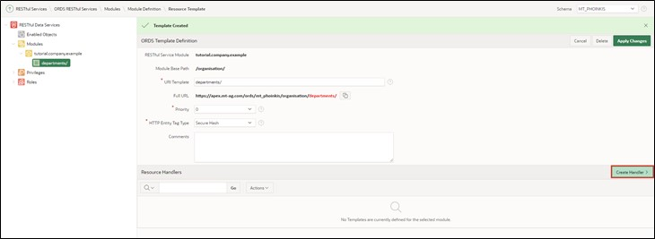
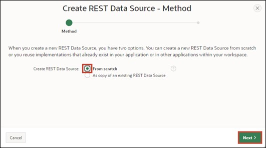

# <a name="rest-data-sources"></a>13. REST Data Sources
Data Sources enable the integration of REST services. The received data can be used in APEX components like reports or forms. The data is transported as JSON objects between the application and the REST source. There are various operations corresponding to the HTTP methods (GET, POST, PUT, DELETE), which can be linked to the respective database operation (SELECT, INSERT, UPDATE, DELETE).

## <a name="restful-service-erstellen"></a>13.1 Create RESTful Service
In this task, you will create your own RESTful service. You can call this service from the internet and use it in other services.
- To create the RESTful Service, click on **SQL Workshop** and then on **RESTful Services**.

- When creating a RESTful Service for the first time, you must first register your schema with ORDS (Oracle Data Service) by clicking on the **Register Schema with ORDS** button.


- Click on **Save Schema Attributes** in the dialog that opens.


Now you will see the following overview page:


- Click on **Modules** and then on the **Create Module** button.


- Enter **Module Name *tutorial.company.example*** and **Base Path */organisation/***. Then click on **Create Module**.


- After your module has been created, you now need to create a template for it. To do this, click on the **Create Template** button.


- Enter **URI Template *departments/*** and create your template by clicking on **Create Template**.


- Now click on **Create Handler** to create the *Resource Handlers*. In this tutorial, you will create two handlers (for GET and POST).



- In the first step, you will create the GET method. For this, select **Method** in the handler ***GET***. Ensure that **Source Type *Collection Query*** is selected. 
- Then enter the following SQL query in **Source**:

 ```sql
select dept_id,
	     dept_name,
       dept_location
from departments
 ```  
- Now you have entered all the necessary information for the GET query. You can now create the handler by clicking on **Create Handler**.


- In the next step, set up the POST handling. For this, click on your **departments/** template and then on **Create Handler**.


- Select **Method *POST*** 


- Enter the following PL/SQL code under **Source**:
 ```sql
begin
  	insert into departments (
  		dept_name,
 		dept_location)
  	values (
 		:dept_name, 
 		:dept_location);
end;
 ```


- Scroll down to **Parameters** and click on **Add Row** there.
- Enter the following information:

  |  |  |
  |--|--|
  | **Name** | dept_name |
  | **Bind Variable** | dept_name |
  | **Access Method** | IN |
  | **Source Type** | HTTP HEADER | 
  | **Data Type** | STRING | 
  |  |  |

- Then also add a parameter for the location by clicking on Add Row again. Enter the following data:  

  |  |  |
  |--|--|
  | **Name** | dept_location |
  | **Bind Variable** | dept_location |
  | **Access Method** | IN |
  | **Source Type** | HTTP HEADER | 
  | **Data Type** | STRING | 
  |  |  |

- Once you have done this, scroll back up and click on **Create Handler**.

  

- Your module is now fully defined. To verify, call the URL you see under **Full URL** at **departments/** with your browser. You should now see the contents of the GET query, including the ID, name, and location of the departments.

 ```json
"items": [
    {
      "dept_id": 15,
      "dept_name": "Accounting",
      "dept_location": "New York"
    },
    {
      "dept_id": 16,
      "dept_name": "Research",
      "dept_location": "Dalls"
    },
    {
      "dept_id": 17,
      "dept_name": "Sales",
      "dept_location": "Chicago"
    },
    {
      "dept_id": 18,
      "dept_name": "Operations",
      "dept_location": "Boston"
    }
  ]
 ```
 
## <a name="rest-data-source-erstellen"></a>13.2 Create REST Data Source
After creating your own RESTful service in the previous chapter, we will now use it in APEX as a REST Data Source. The approach shown here is similar for REST data sources that you have not created yourself.  
To create the **REST Data Source**, go to the **Shared Components** of your application.

- The **REST Data Sources** can be found in the **Shared Components** under the item **Data Sources**.

  

- You can create a new REST Data Source using the **Create** button.


 
- Since there are no REST Data Sources present in this application so far, you need to create them anew, so select **From Scratch**. Click on **Next**.

 

- Choose **REST Data Source Type *Oracle REST Data Service***.
Give the REST Data Source the **Name *Departments***. You also need to define the URL endpoint, which you can find in your RESTful service module.
- Then click on the **Next** button.


 
- In the second step of the wizard, you need to set up the Service URL Path, which is the forwarding within the API. The correct path should automatically be preset here, so you do not need to change anything and just click **Next**.
  


- Keep **Authentication Required** turned off, as the created REST data source does not require authentication. Click on the **Discover** button.
  

 
- Click on **Create REST Data Source** in the subsequent window.
 


- Now you see your newly created REST data source in the overview.
- You can now view your REST Source by clicking on the Departments link.


 
- Your REST Source should look similar to the following image:


- Verify that your settings in the **Data Profile** look as shown in the picture and that both ***GET*** and ***POST*** operations have been set up under **Operations**.
 
## <a name="senden-von-daten-an-eine-rest-datenquelle"></a>13.3 Sending Data to a REST Data Source
In this chapter, we will use the previously created REST Source to send our own data. Specifically, we will add new departments. For this, the HTTP-POST method is used, which has been defined as an operation in the REST Data Source.
- Open the **App Builder** and your application. Click on **Create Page** and create a new page by clicking on **Create Page**.

- Select **Form** as the Page Type.


- Enter **Page Number *61*** and **Page Name *Departments***.
- Select **REST Data Source** under **Data Source** and then choose ***Departments*** as the **REST Data Source**.
- Disable *Breadcrumb* in the **Navigation** section and click on **Next**.

  

- Choose **Primary Key Column *DEPT_ID***.
- Enter **Branch Here on Submit *61*** and **Cancel and Go to Page** also as ***61***.
- Now create your page by clicking on the **Create Page** button.


- Call up the page using the **Run** button.

- Through the form, you can now add new departments.


## <a name="abrufen-von-daten-aus-einer-rest-data-source"></a>13.4 Retrieving Data from a REST Data Source
Now we want to use the REST Data Source not only for adding data but also for retrieving data and displaying it. For this, the HTTP-GET method is used, which has been defined as an operation in the REST Data Source.
- Through the form created in Chapter 13.3, you can now add new departments. To immediately see if the addition was successful, you will also create a report on the page.

- In the Page Designer, right-click on Body on the left side under Departments and select **Create Region**.

- Select ***Classic Report*** as the **Type** of your region and give it the **Title *All Departments***. Under Source, choose ***REST Source*** as the **Location** and then ***Departments*** as the **REST Source**.


 
- Call up the page using the **Run** button.
- The report now shows you all departments.


> Another demo application of MT - IT Solutions based on REST Data Sources can be found here:
[https://apex.oracle.com/pls/apex/mt_apisearch/r/datasources](https://apex.oracle.com/pls/apex/mt_apisearch/r/datasources)