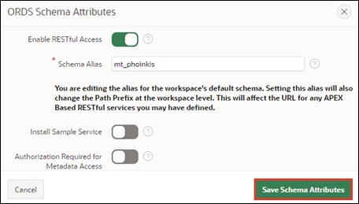
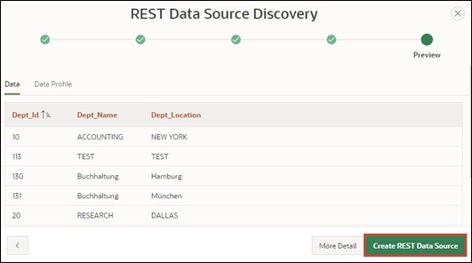

# 13. REST Data Sources
Data Sources enable the integration of REST services. The received data can be used in APEX components such as reports or forms. The data is transported as JSON objects between the application and the REST source. There are various operations corresponding to the HTTP methods (GET, POST, PUT, DELETE) that can be linked with the respective database operation (SELECT, INSERT, UPDATE, DELETE).

## 13.1. Create RESTful Service
In this task, you will create your own RESTful service. You can call it from the internet and use it in other services.
- To create the RESTful service, click on **SQL Workshop** and then on **RESTful Services**.

- When creating a RESTful Service for the first time, you must first register your schema with ORDS (Oracle Data Service) by clicking on the button **Register Schema with ORDS**.


- In the dialog that opens, click on **Save Schema Attributes**.



Now you see the following overview page:


- Click on **Modules** and then on the **Create Module** button.


- Enter **Module Name *tutorial.company.example*** and **Base Path */organisation/*** then click on **Create Module**.


- After your module is created, create a template for it. Click on the button **Create Template** to do so.


- Specify **URI Template *departments/*** and create your template by clicking on **Create Template**.


- Now click on **Create Handler** to create the *Resource Handlers*. In this tutorial, you will create two handlers (for GET and POST).


- In the first step, you will create the GET method. For this, select **Method** in the handler as ***GET***. Ensure that **Source Type *Collection Query*** is selected. 
- Then enter the following SQL query in **Source**:

 ```sql
select dept_id,
	    dept_name,
        dept_location
from departments
 ```  
- Now you have entered all the necessary information for the GET query. You can now create the handler by clicking on **Create Handler**.


- Next, create the POST handling. Click on your template **departments/** and then on **Create Handler**.


- Select **Method *POST***.


- Enter the following PL/SQL code under **Source**:
 ```sql
begin
  	insert into departments (
  		dept_name,
 		dept_location)
  	values (
 		:dept_name, 
 		:dept_location);
end;
 ```


- Scroll down to **Parameters** and click on **Add Row** there.
- Enter the following information:

  |  |  |
  |--|--|
  | **Name** | dept_name |
  | **Bind Variable** | dept_name |
  | **Access Method** | IN |
  | **Source Type** | HTTP HEADER | 
  | **Data Type** | STRING | 
  |  |  |

- Then also add a parameter for the location by clicking on Add Row again. Enter the following data:

  |  |  |
  |--|--|
  | **Name** | dept_location |
  | **Bind Variable** | dept_location |
  | **Access Method** | IN |
  | **Source Type** | HTTP HEADER | 
  | **Data Type** | STRING | 
  |  |  |

- When you have done this, scroll back up and click on **Create Handler**.


- Now your module is fully defined. To check, call the URL you see under **Full URL** at **departments/** with your browser. You should now see the contents of the GET query and thus the ID, name, and location of the departments.

 ```json
"items": [
    {
      "dept_id": 15,
      "dept_name": "Accounting",
      "dept_location": "New York"
    },
    {
      "dept_id": 16,
      "dept_name": "Research",
      "dept_location": "Dalls"
    },
    {
      "dept_id": 17,
      "dept_name": "Sales",
      "dept_location": "Chicago"
    },
    {
      "dept_id": 18,
      "dept_name": "Operations",
      "dept_location": "Boston"
    }
  ]
 ```

## 13.2. Create REST Data Source
After you have created your own RESTful service in the previous chapter, we will use it in APEX as a REST Data Source. The procedure shown below also applies similarly to REST data sources that you have not created yourself.
To create the **REST Data Source**, go to the **Shared Components** of your application.

- The **REST Data Sources** are located in the **Shared Components** under the point **Data Sources**.


- You can create a new REST data source using the **Create** button.


- Since there are no REST data sources in this application yet, you need to create them anew, so choose **From Scratch** and click on **Next**.


- Select **REST Data Source Type *Oracle REST Data Service***.
Give the REST Data Source the **Name *Departments***. You also need to define the URL endpoint. You can find the URL endpoint in your RESTful Service module.
- Then click on the **Next** button.


- In the second step of the wizard, you need to set up the Service URL Path, i.e., the forwarding within the API. The correct path should already be preset automatically, so you don’t need to change anything there; just click on **Next**.


- Leave the **Authentication Required** point off, as the created REST data source does not require authentication. Click on the **Discover** button.


- Click on **Create REST Data Source** in the subsequent window.



- Now you can see your newly created REST data source in the overview.
- You can now look at your Rest Source. To do so, click on the link Departments.


- Your Rest Source should look similar to the following image:


- Ensure that your settings in the **Data Profile** look like the image shown and that the two operations ***GET*** and ***POST*** have been created in **Operations**.

## 13.3. Sending Data to a REST Data Source
In this chapter, we will use the previously created REST source to send our data, specifically adding new departments. For this, the HTTP-POST method is used, which was defined as an operation in the REST Data Source.
- Open the **App Builder** and your application. Click on **Create Page** and create a new page by clicking on **Create Page**.

- Select **Form** as the Page Type.


- Enter **Page Number *61*** and **Page Name *Departments***.
- Select **Data Source *REST Data Source*** and then select ***Departments*** as **REST Data Source**.
- Deactivate the *Breadcrumb* in the **Navigation** area and click on **Next**.


- Select **Primary Key Column *DEPT_ID***.
- Enter **Branch Here on Submit *61*** and also ***61*** at **Cancel and Go to Page**.
- Now create your page by clicking on the **Create Page** button.


- Call the page via the **Run** button.

- You can now add new departments via the form.


## 13.4. Retrieving Data from a REST Data Source
Now we want to use the REST Data Source not only to add data, but also to retrieve and display data. For this, the HTTP-GET method is used, which was defined as an operation in the REST Data Source.
- Through the form created in Chapter 13.3, it is now possible to create new departments. To immediately know if the addition was successful, you will additionally create a report on the page.

- In the Page Designer, click on Departments on the left side and then right-click on Departments. Select **Create Region**.

- Select **Classic Report** as the **Type** of your region and give it the **Title *All Departments***. Under Source, select ***REST Source*** as **Location** and then ***Departments*** as **REST Source**.


- Call the page via the **Run** button.
- The report now shows you all departments.


> A further demo application by MT - IT Solutions based on REST Data Sources can be found here:  
[https://apex.oracle.com/pls/apex/mt_apisearch/r/datasources](https://apex.oracle.com/pls/apex/mt_apisearch/r/datasources)