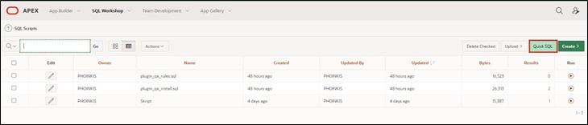
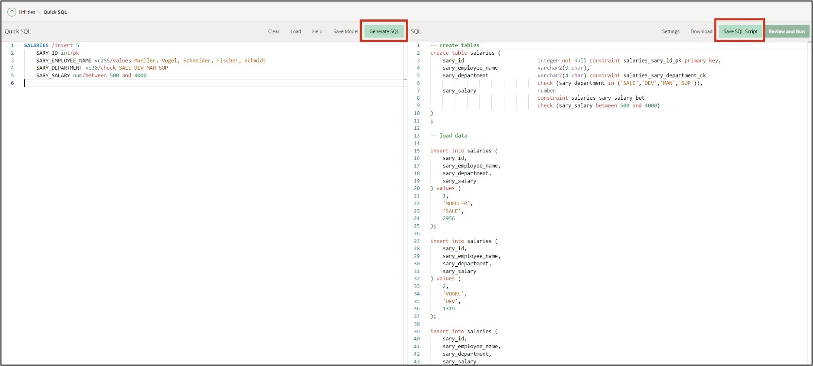
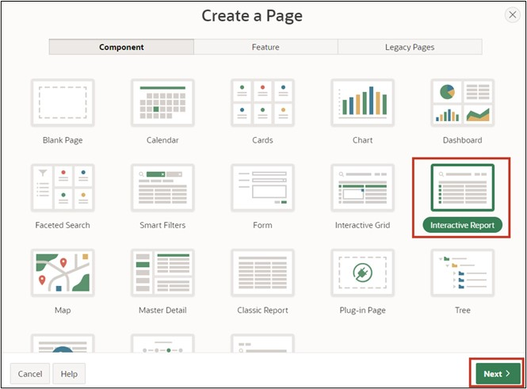
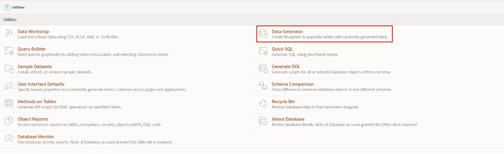
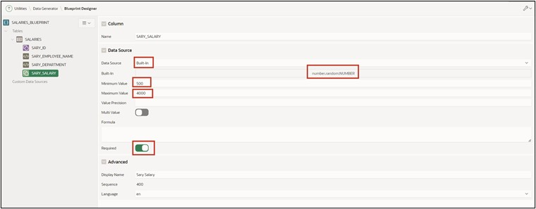
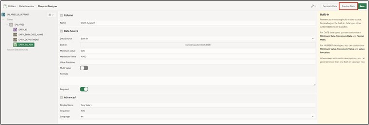

# 14. Excursion: Data Modeling with Quick SQL

With Quick SQL, data models can be quickly designed using a **Markdown-like shorthand syntax**. Main detail relationships can be represented via an **ERM** ("Entity-Relationship Model").

> More information can be found at [https://apex.oracle.com/en/quicksql/](https://apex.oracle.com/en/quicksql/) (Login required).

## 14.1. Creating the Database Table

- Navigate to **SQL Workshop** and then click on **SQL Scripts**.

- Click on **Quick SQL** in the top right corner.



- On the following page, enter the following **Quick SQL code** in the left-hand text area:

 ```sql
SALARIES /insert 5
    SARY_ID int/pk
    SARY_EMPLOYEE_NAME vc255/values Mueller, Vogel, Schneider, Fischer, Schmidt
    SARY_DEPARTMENT vc30/check SALE DEV MAN SUP
    SARY_SALARY num/between 500 and 4000
 ```

>! Please pay attention to the indents shown above when entering the text!

- Then click on **Generate SQL** to translate the code into SQL code. The generated SQL code will then be displayed in the right-hand text area.



- Click on **Save SQL Script** to save the code.
- A window will open where you must assign a name to the script. Name the **script** ***salaries*** and then click on **Save Script**.


- Next, click on **Review and Run**.


- You will see a preview of your SQL code. Start the script by clicking the **Run** button.


- Click on **Run Now**.


- After a successful import, you should see the following output:


## 14.2. Creating an Interactive Report

To visualize the data just created, you will create an Interactive Report in this task.
- To do this, go back to the **App Builder**, then to your **Application** and then click on **Create Page** and select **Interactive Report**.



- In the following window, enter **Page Number *71*** and **Page Name *Salaries***.
- For **Table / View Name**, select ***SALARIES***.
- Disable *Breadcrumb* in the Navigation section and click on **Create Page**.


- The Page Designer will open. If you click on **Run**, the page will load, and you will see the report you just created using Quick SQL.


## 14.3. Generating Sample Data Using Data Generator

Use the Data Generator utility to create **Blueprints** and then generate sample data.
- Navigate to **SQL Workshop** and then click on **Utilities**.
- Then click on **Data Generator**.



- Click on **Create Blueprint** here.


- In the next step, select **Use Existing** Tables to insert sample data into an existing table.


- In the next step, give the *Blueprint* the name **Salaries Blueprint**, and select the previously created table **Salaries**. Finally, click on **Create Blueprint**.


- You will now be automatically directed to the Blueprint Designer. From here, you can define what sample data should be generated.
- For **SARY_EMPLOYEE_NAME**, select the Data Source Built-In and the **Built-In** Type **Last Name**. Since no null values are to be inserted, you also need to set **required**. Finally, set Maximum Length according to the table specification with varchar(9) to **9**.


- For **SARY_SALARY**, choose the Data Source **Built-In** and the Built-In Type **Number** (search for number.random). Set the Minimum Value to **500** and the Maximum Value to **4000**. Since no null values should be inserted here as well, you also need to set **required**.



- The blueprint for the sample data is now configured. Save it first by clicking on **Save**.


- Now click on **Preview Data** to get a preview of the generated data.



- To finally generate the sample data, next click on **Generate Data**.


- Choose **Insert into Database** and the Insert Method Insert Into to insert the data directly into the database table. Then click on **Insert Data**.


- To check the result of the insert, call up the previously created Page 71 in the App Builder again. When you click on **Run** now, the page will load, and you will see the report with the newly inserted data.

