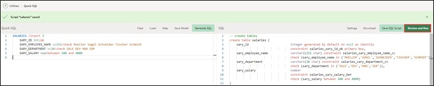
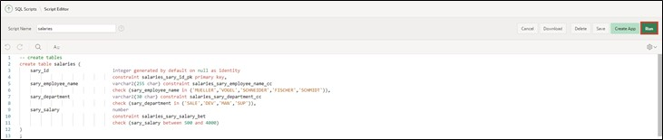
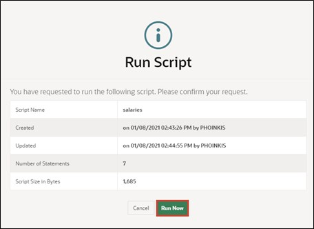
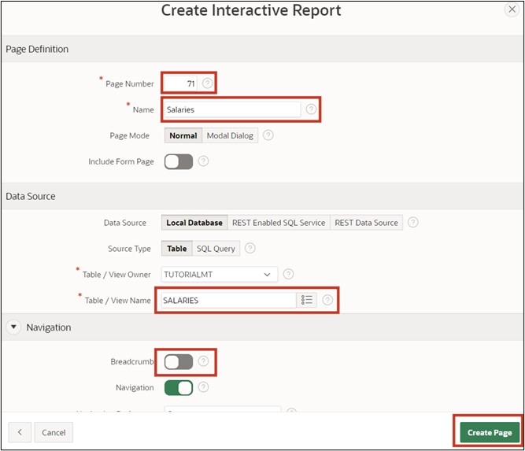
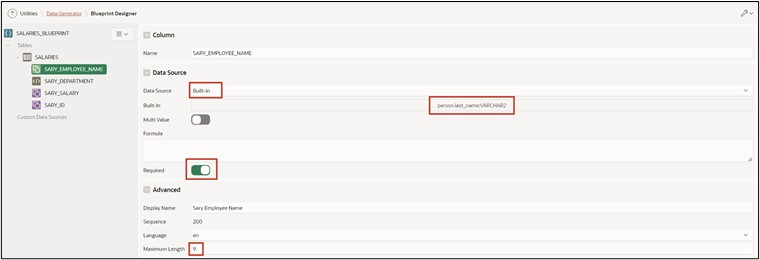
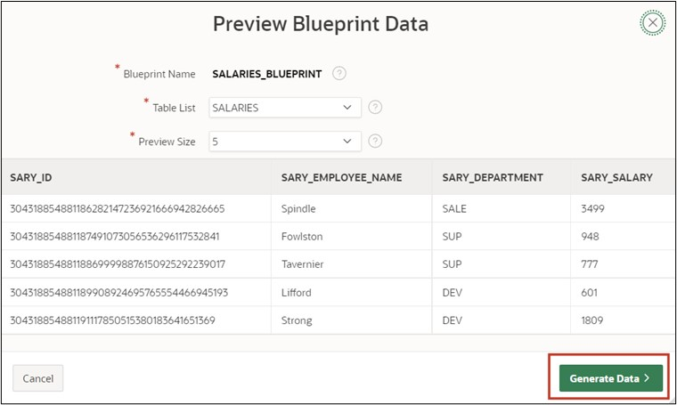
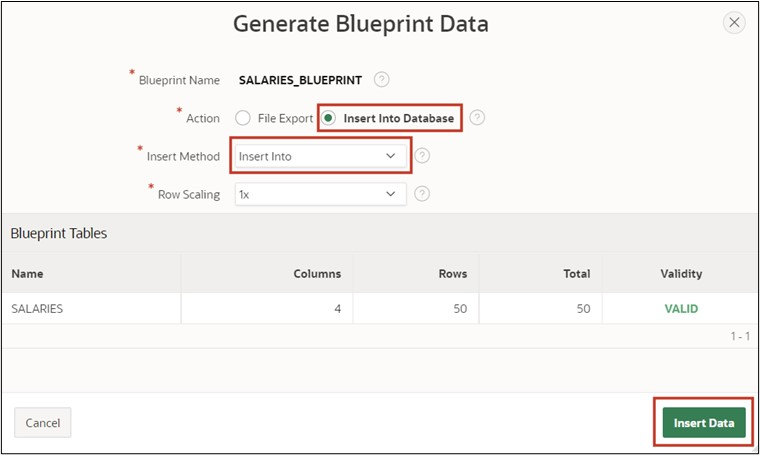

# <a name="exkurs-datenmodellierung-mittels-quick-sql"></a>14. Excursus: Data Modeling Using Quick SQL

With Quick SQL, data models can be quickly designed using a **Markdown-like shorthand syntax**. Main detail relationships can be represented via an **ERM** ("Entity-Relationship Model").

> For more information, please visit [https://apex.oracle.com/en/quicksql/](https://apex.oracle.com/en/quicksql/) (Login required).

## <a name="ex-erstellung-der-datenbank-tabelle"></a>14.1 Creation of the Database Table

- Navigate to **SQL Workshop** and then click on **SQL Scripts**.

- Click on **Quick SQL** at the top right.


 
- On the following page, enter the following **Quick SQL code** in the left text area:

 ```sql
SALARIES /insert 5
    SARY_ID int/pk
    SARY_EMPLOYEE_NAME vc255/values Mueller, Vogel, Schneider, Fischer, Schmidt
    SARY_DEPARTMENT vc30/check SALE DEV MAN SUP
    SARY_SALARY num/between 500 and 4000
 ```

>! Please pay attention to the indentations shown above when entering the code!

- The code is automatically translated into SQL code. The generated SQL code is displayed in the right text area.


- Click on **Save SQL Script** to save the code. 
- A window will open where you need to name the script. Name the **script** as ***salaries*** and then click **Save Script**.


- Then click on **Review and Run**.



- You will see a preview of your SQL code. Start the script by clicking the **Run** button.



- Click on **Run Now**.

 
 
- After the successful import, you should see the following output:


 
## <a name="ex-erstellung-eines-interactive-reports"></a>14.2 Creation of an Interactive Report

To visualize the data just created, create an Interactive Report for this task.
- To do this, go back to the **App Builder**, then to your **Application**, and then click on **Create Page** and select **Interactive Report**.

 
 
- In the next window, enter **Page Number *71*** and **Page Name *Salaries***.
- Select ***SALARIES*** as **Table / View Name**.
- In the Navigation area, disable *Breadcrumb* and click **Create Page**.



- The Page Designer opens. When you click **Run**, the page will load and you'll see the report you just created using Quick SQL.


## <a name="beispieldaten-mittels-data-generator-generieren"></a>14.3 Generate Sample Data Using the Data Generator

Use the Data Generator utility to create **Blueprints** and then generate sample data.
- Navigate to **SQL Workshop** and then click on **Utilities**.
- Then click on **Data Generator**.


- Click on **Create Blueprint** here.


- In the next step, select **Use Existing** Tables to insert sample data into an already existing table.


- In the next step, name the *Blueprint* **Salaries Blueprint**, and select the previously created table **Salaries**. Finally, click on **Create Blueprint**.

 

- Now you will be automatically redirected to the Blueprint Designer. From here, you can define what sample data should be generated.
- For **SARY_EMPLOYEE_NAME**, select the Data Source Built-In and the **Built-In** type **Last Name**. Since no null values should be inserted, **required** must be set. Lastly, the Maximum Length according to the table specification with varchar(9) must be set to **9**.

 
 
- For **SARY_SALARY**, select the Data Source **Built-In** and the Built-In type **Number** (search for number.random). Set **500** as the Minimum Value and **4000** as the Maximum Value. Since no null values should be inserted here either, **required** must also be set here.


- The blueprint for the sample data is now fully configured. Save it first by clicking **Save**.


- Now click on **Preview Data** to get a preview of the generated data.


- To finally generate the sample data, next click on **Generate Data**.



- Select **Insert into Database** and the Insert Method Insert Into to insert the data directly into the database table. Then click on **Insert Data**.
 

 
- To check the result of the insert, call up the previously created Page 71 again in the App-Builder. When you click on **Run** now, the page will load, and you'll see the report with the newly inserted data.

