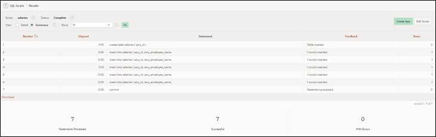
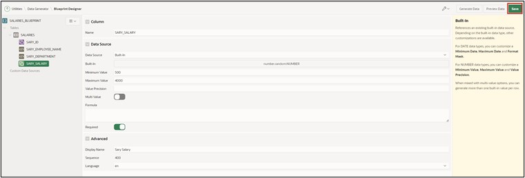
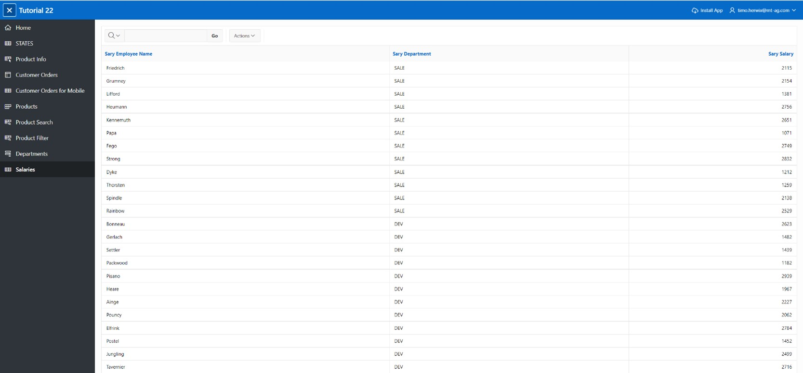

# 14. Excursion: Data Modeling with Quick SQL

With Quick SQL, data models can be quickly designed using a **Markdown-like shorthand syntax**. Primary detail relationships can be represented using an **ERM** ("Entity-Relationship Model"). For more information, visit https://apex.oracle.com/en/quicksql/ (Login required).

## 14.1. Creating the Database Table

- Navigate to **SQL Workshop** and then click on **SQL Scripts**.

- Click on **Quick SQL** in the top right corner.


 
- On the following page, enter the following **Quick SQL code** in the left text area:

 ```sql
SALARIES /insert 5
    SARY_ID int/pk
    SARY_EMPLOYEE_NAME vc255/values Mueller, Vogel, Schneider, Fischer, Schmidt
    SARY_DEPARTMENT vc30/check SALE DEV MAN SUP
    SARY_SALARY num/between 500 and 4000
 ```

! Please pay attention to the indentations shown above when entering!

- Then click on **Generate SQL** to translate the code into SQL code. The generated SQL code will be displayed in the right text area. 


- Click on **Save SQL Script** to save the code. 
- A window will open where you need to give a name for the script. Name the **script** ***salaries*** and then click on **Save Script**. 


- Then click on **Review and Run**. 


- You will see a preview of your SQL code. Start the script by clicking on the **Run** button. 


- Click on **Run Now**.


 
- After successful import, you should see the following output:


 
## 14.2. Creating an Interactive Report

To visualize the data you just created, you will create an Interactive Report in this task.
- Go back to the **App Builder**, then to your **application**, and then click on **Create Page** and select **Interactive Report**.


 
- In the next window, enter **Page Number *71*** and **Page Name *Salaries***.
- For **Table / View Name**, select ***SALARIES***.
- Disable the breadcrumb in the Navigation area and click on **Create Page**.


- The Page Designer opens. When you click on **Run**, the page loads and you will see the report you just created with Quick SQL.


## 14.3. Generate Sample Data via Data Generator

Use the Data Generator utility to create blueprints and then generate sample data.
- Navigate to **SQL Workshop** and then click on **Utilities**.
- Then click on **Data Generator**.


- Click here on **Create Blueprint**.


- In the next step, choose **Use Existing** Tables to insert sample data into an already existing table.


- In the next step, name the blueprint **Salaries Blueprint**, and select the previously created table **Salaries**. Finally, click on **Create Blueprint**.


- You are now automatically redirected to the Blueprint Designer. From here, you can define what sample data should be generated.
- For **SARY_EMPLOYEE_NAME** choose the Data Source Built-In and the **Built-In** type **Last Name**. Since no null values should be inserted, you need to set it as **required**. Finally, to comply with the table specification, set Maximum Length with varchar(9) to **9**.


 
- For **SARY_SALARY**, choose the Data Source **Built-In** and the Built-In type **Number** (search for number.random). Enter **500** as the Minimum Value and **4000** as the Maximum Value. Since no null values should be inserted here either, set it as **required**.


- The blueprint for the sample data is now configured. Save it first by clicking on **Save**.



- Click now on **Preview Data** to view a preview of the generated data.


- To finally generate the sample data, click next on **Generate Data**.


- Choose **Insert into Database** and the Insert Method Insert Into to insert the data directly into the database table. Then click on **Insert Data**.


 
- To check the result of the insert, open the previously created Page 71 in the App Builder again. When you click on **Run**, the page loads and you will see the report with the newly inserted data.

