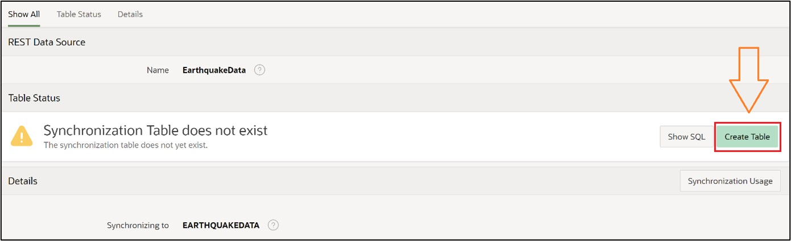

# 15. Create Maps
In this task, you will create an application page with a world map. We will obtain the necessary data through a REST Data Source (introduced in Chapter 13.2).
The goal is to display all earthquakes on earth that occurred in the last 24 hours on a map in APEX.

## 15.1. REST Data Source
To keep the earthquake data of the map up-to-date later, set up a REST Data Source now. You can review the detailed steps of this subsection along with screenshots as needed in Chapter 13.2, so the steps will only be roughly described here.

First, create a new application in the App Builder and name it **Earthquakes**. No further settings are needed. Then, in the Application Overview, select **Shared Components**.

There, click on the option **REST Data Sources** under the category **Data Sources**.

Now click on the **Create** button, in the pop-up window leave the selection at **From Scratch** and enter **EarthquakeData** as the name in the next step. Under URL Endpoint, insert the following URL:  [https://earthquake.usgs.gov/earthquakes/feed/v1.0/summary/all_day.geojson](https://earthquake.usgs.gov/earthquakes/feed/v1.0/summary/all_day.geojson)  

Then, without changing anything, click Next until the window closes again and the REST Data Source has been created.

To update the data every day with a local table, you will now set up synchronization. To do this, select the newly created REST Data Source. Now click on the field shown in the image:

Now, change nothing except the name and enter **EarthquakeData** in the **Table Name** field. After clicking **Save** to store, you will encounter the options shown in the image. Click on the marked field:

This creates a table in which the data retrieved from the previously entered URL will be stored in the future. Now set the synchronization times for the data. To do this, click again on the fields marked in the next image:

After clicking on the second field, a pop-up window appears where you can now configure the synchronization. Since we want to refresh the data once a day, select **daily**. Fill in the **Execution Hour** and **Execution Minute** fields with any time. After clicking on **Set Execution Interval**, click on **Save and Run**, which will fill the table with data once. Now the table will be updated every day.

The table along with the current earthquake data can now be found in the **Object Browser**.
 
## 15.2. Creating the Map on a New Application Page
Make sure you now navigate to the application overview of the application you created at the beginning.

- There, select **Create Page**.

- In the opened pop-up window, click on **Map** and then **Next**.

- In the overview that appears, enter an arbitrary page name.
- Under **Local Database**, select the just-created table **EARTHQUAKEDATA** under **Table / View Name**.
- In the Navigation area, deactivate the *Breadcrumb* and click **Next**.

In the next overview, you can choose between different display options on how to represent the locations.
- Since you are creating an overview of earthquakes, do not choose **Points**, which would only mark the locations of earthquakes, but select **Heat Map** to later recognize the location and get a sense of the scale on the map.

- Now, you only need to change the field **Geometry-Column** from the selection options displayed there. Select the **Geometry** column there.

After clicking on **Create Page**, you can start the application and navigate to the created page.

There you will see all the stored earthquakes and get an impression of their magnitude.

