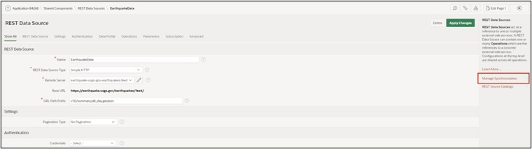
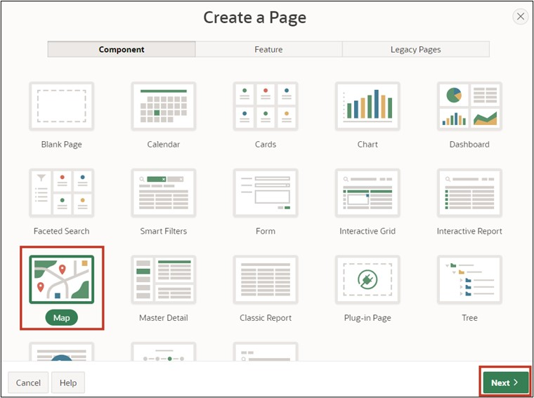

# 15. Creating Maps 
In this task, you will create an application page with a world map. The necessary data for this will be obtained via a REST Data Source introduced in Chapter 13.2. The goal is to display all earthquakes around the world that occurred in the last 24 hours on a map in APEX.

## 15.1. REST Data Source 
To keep the earthquake data on the map up to date, you will now set up a REST Data Source. You can refer back to Chapter 13.2 for detailed steps of this subchapter, complete with screenshots, if needed. Below, the steps are only roughly described.

First, create a new application in the App-Builder and name it "Earthquakes." No further settings are necessary. In the application overview, select "Shared Components."

Once there, click on the option "REST Data Sources" under the "Data Sources" category.

Now click on the "Create" button, leave the selection at "From Scratch" in the popup window, and enter "EarthquakeData" as the name in the next step. Under URL Endpoint, enter the following URL: https://earthquake.usgs.gov/earthquakes/feed/v1.0/summary/all_day.geojson.

Then click next until the window closes and the REST Data Source is created.

To keep the data updated every day with a local table, you will now set up a synchronization. Select the REST Data Source you just created. Now click on the field shown in the image:

Now change nothing but the name, and type "EarthquakeData" into the "Table Name" field. After clicking "Save," you will encounter the options shown in the image. Click on the highlighted field:

This creates a table where the data retrieved from the previously entered URL will be stored in the future. Now set the synchronization times for the data. Click again on the fields marked in the next image:

After clicking the second field, a popup window opens where you can configure the synchronization. Since we want to refresh the data once every day, choose "daily." Fill the "Execution Hour" and "Execution Minute" fields with any desired time. After clicking "Set Execution Interval," click on the "Save and Run" field, which will fill the created table with data once. Now the table will be updated daily.

The table with the current earthquake data can now be found in the Object Browser.

 
## 15.2. Creating the Map on a New Application Page
Ensure you navigate to the application overview of the application you created at the beginning.

Select "Create Page."

In the popup window, click on **Map** and then **Next**. 

 
In the ensuing overview, enter any desired page name. Under **"Local Database,"** select the table **"EARTHQUAKEDATA"** under "Table / View Name." Deactivate the Breadcrumb in the Navigation area and click **Next**. 

 
 
In the next overview, you can choose different display options for how locations should be shown. Since you are creating an overview of earthquakes, do not choose "Points," which would only mark the earthquake locations, but select **"Heat Map"** to later see the location and get a sense of the scale on the map. Now, you only need to change the "Geometry-Column" field out of the displayed options. Select the **"Geometry"** column there.

 

After clicking **"Create Page,"** you can start the application and navigate to the created page.

There you will see all stored earthquakes and get a sense of their scale.

