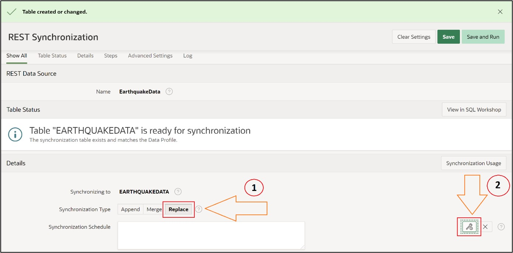

# 15. Creating Maps
In this task, you will create an application page with a world map. The necessary data will be obtained through a REST Data Source (introduced in Chapter 13.2).
The goal is to display all earthquakes on Earth that have occurred in the last 24 hours on a map in APEX.

## 15.1 REST Data Source
To later keep the earthquake data of the map up-to-date, you will now set up a REST Data Source. The detailed steps of this subchapter can be reviewed with screenshots in Chapter 13.2 if needed. The steps will therefore only be roughly described below.

To start, create a new application in the App Builder and name it **Earthquakes**. You do not need to make any further settings. In the application overview, then select **Shared Components**.

Once there, under the category **Data Sources**, click on the option **REST Data Sources**.

Click the **Create** button, let the selection in the pop-up window remain on **From Scratch**, and in the next step, enter **EarthquakeData** as the name. Under URL Endpoint, enter the following URL: [https://earthquake.usgs.gov/earthquakes/feed/v1.0/summary/all_day.geojson](https://earthquake.usgs.gov/earthquakes/feed/v1.0/summary/all_day.geojson).

Now click Next without changing anything until the window closes again and the REST Data Source has been created.

To ensure the data is updated with a local table every day, you will now set up a synchronization. Select the REST Data Source you just created. Now click on the field shown in the image:

Now change nothing except for the name and enter **EarthquakeData** into the **Table Name** field. After clicking **Save**, you will encounter the options shown in the image.
Click on the marked field:

You have now created a table into which the data retrieved from the previously entered URL will be stored in the future. Now set the synchronization times for the data. Click again on the fields marked in the next image:

After clicking the second field, a pop-up window will open where you can now configure the synchronization. Since we want to refresh the data once a day, choose **daily**. Fill the **Execution Hour** and **Execution Minute** fields with a time of your choice. After clicking on **Set Execution Interval**, click on **Save and Run**, which will fill the created table with data once. The table will now be updated every day.

The table, along with the current earthquake data, can now be found in the **Object Browser**.

## 15.2 Creating the Map on a New Application Page
Ensure that you are now navigating to the application overview of the application you created at the beginning.

- There, select **Create Page**.

- In the opened pop-up window, click **Map** and then **Next**.

- In the following overview, enter any page name.
- Under **Local Database**, select the table you just created **EARTHQUAKEDATA** under **Table / View Name**.
- In the Navigation area, deactivate the *Breadcrumb* and click on **Next**.

In the next overview, you can choose between different display options for how the locations should be represented.
- Since you are creating an overview of earthquakes, do not select **Points**, which would only mark the locations of the earthquakes, but select **Heat Map** to later recognize the location and a certain impression of the scale on the map.

- Now you only need to change the **Geometry-Column** field from the displayed options. There, select the **Geometry** column.

After clicking on **Create Page**, you can start the application and navigate to the created page.

There you will now see all stored earthquakes and get an impression of their scale.

