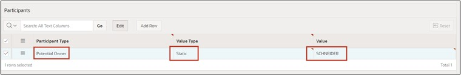
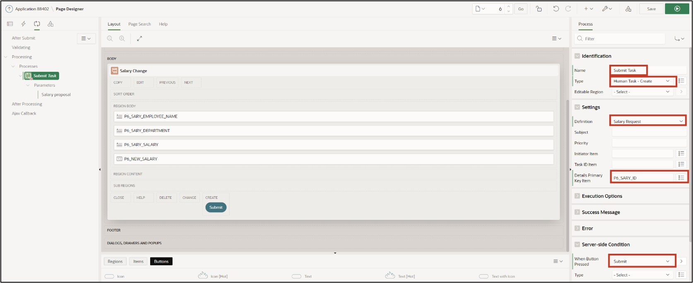
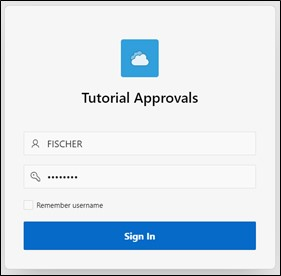
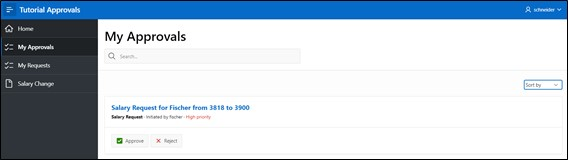

# <a name="genehmigungsprozess-erstellen"></a>16. Creating an Approval Process

In this task, you will create an application intended to adjust employees' salaries. We have already inserted the necessary data in Chapter 14. The goal is for each employee to adjust their salary accordingly, thus initiating an approval process. Subsequently, the supervisor must handle the process and either approve or reject it.

## <a name="task-erstellen-einer-anwendung"></a>16.1 Creating an Application

- For this task, an **application** will be created. First, open the **App Builder** and click on the **Create** button. The App Builder displays all installed applications.


- The application creation wizard will start. Click **New Application** to create a new application.

 

- Now enter the application's name (e.g., Tutorial Approvals).

 

- You do not need to make any further settings initially. Click **Create Application** to create the new application.

## <a name="erstellen-einer-task-definition"></a>16.2 Creating a Task Definition

- Then click on **Shared Components**.

 

- Click on **Task Definitions** under **Workflows and Automations**.

 

- Click on **Task Definitions** under **Workflows and Automations**.   
- Click **Create** here.

  

- Enter the following values here:

  | | |  
  |--|--|
  | **Name** | *Salary Request* | 
  | **Subject** | *Salary Request for &EMPLOYEE_NAME. from &SALARY. to &P_NEW_SALARY.*| 
  | **Priority** | *2-High*  | 
  | | |  

- Then click **Create**.


- Once the task is created, you will receive an overview. 
- Change the Action Source to **SQL Query** and enter the following **Action SQL Query**.

 ```sql
select initcap(sary_employee_name) as employee_name,
       sary_salary as salary 
  from salaries
 where sary_id = :APEX$TASK_PK
 ```  

 

- Next, the **Task Details Page** will be created. Click the **Create Task Detail Page** button for this.

  

- The appearing dialog can be confirmed with **OK**.  
- You are now returned to your tasks overview. Click on the previously created task **Salary Request** to add participants in the next step.

  

- In the Participants section, for the **Potential Owner**, select the Value Type **Static** and enter the Value **SCHNEIDER**.

  

- As a parameter, enter **P_NEW_SALARY** with the label **Salary Proposal** and the Data Type **String**.

 

- Now click **Apply Changes** to save all entries and then switch again into the task to add an action. For this, click **Add Action** in the lower area.

  

- A new dialog for the action is opened.  
- Enter the following inputs here:

  | | |  
  |--|--|
  | **Name** | *ON_APPROVE* | 
  | **Type** | *Execute Code* | 
  | **Executoin Sequence** | *1*  | 
  | **On Event** | *Complete*  | 
  | **Outcome** | *Approved*  | 
  | **Success Message** | *Salary change approved*  | 
  | | |  

  

- Finally, enter the following SQL Query.

 ```sql
update salaries
   set sary_salary = :P_NEW_SALARY
 where sary_id = :APEX$TASK_PK;
 ```  

- Click **Create** to finish.  

  

- The task is now completed, so you can next switch back to the application overview.  

  

## <a name="erstellen-der-my-approvals-und-my-request-seite"></a>16.3 Creating the "My Approvals" and "My Request" Page

- Click **Create Page** and select **Unified Task List**. Then click **Next**.

  

- Enter the following values:

|  |  |
|--|--|
| **Page Number** | 4 |
| **Page Name** | My Approvals |
| **Request Context** | My Tasks |
|  |  |  

- Then click **Create Page**.

 

- The page is now created and displayed. Switch back to the page overview and click **Create Page** again.

- Select the **Unified Task List** component once more.

- Then enter the following values:

|  |  |
|--|--|
| **Page Number** | 5 |
| **Page Name** | My Requests |
| **Request Context** | Initiated by Me |
|  |  |  

- Then click **Create Page**.

 

## <a name="erstellen-der-salary-change-seite"></a>16.4 Creating the "Salary Change" Page

- Click **Create Page** and select **Blank Page**.  
- Then click **Next**.


- Enter the Page Number 6 and the Page Name **Salary Change**.   
- Disable *Breadcrumb* and then click the **Create Page** button.

 

- You are now in the Page Editor.  
- Add a Region Form to the **Body** area.
- Change the Title to **Salary Change**.
- Under Source, select the table **Salaries**.
- Modify the Page Items **P6_SARY_ID** as follows:
  - Type: Hidden
  - Primary Key: True
- Modify the Page Items **P6_SARY_EMPLOYEE_NAME** as follows:
  - Type: Display Only
  - Label: Employee Name
- Modify the Page Items **P6_SARY_DEPARTMENT** as follows:
  - Type: Display Only
  - Label: Department
- Modify the Page Items **P6_SARY_Salary** as follows:
  - Type: Display Only
  - Label: Current Salary
- Then add a new Page Item **P6_NEW_SALARY**:
  - Type: Number Field
  - Label: New Salary
  - Minimum Value: 500
  - Maximum Value: 4000
  - Number Alignment: Start


- In the **Pre-Rendering** area, change the process **Initialize form Salary Request**.  
- Rename it to **Fetch Employee Details for User**.  
- Change the Type to **Execute Code**.  
- In the PL/SQL Code Editor, enter the following SQL-Query:

 ```sql
select sary_id, sary_employee_name, sary_department, sary_salary
  into :P6_SARY_ID, :P6_SARY_EMPLOYEE_NAME, :P6_SARY_DEPARTMENT, :P6_SARY_SALARY
  from salaries
 where initcap(sary_employee_name) = initcap(:APP_USER)
AND ROWNUM = 1;
 ```

  

- Then add a button to the page and name it **Submit**.  
- Position the button to **Create** and activate **Hot**.  

  

- Switch to **Processes** and add a new process there.  
- Name the *Process* **Submit Task** and change the following values:  
  - Type: Human Task - Create  
  - Definition: Salary Request  
  - Details Primary Key Item: P6_SARY_ID  
  - When Button pressed: Submit  

  

- Adjust the parameter **Salary Proposal** applied to the process accordingly:
  - Type: Item
  - Item: P6_NEW_SALARY


- Finally, add an **After Processing Branch** and name it **Go To Page 5**.
- Choose **Page 5** as the target.
- Then save the page by clicking the **Save** button.


The application is now fully created.

## <a name="task-user-erstellen"></a>16.5 Creating a User

Before the application can be started and simulated, the corresponding users must be created in the Workspace. In this example, an employee who can request a salary adjustment, as well as an admin user who can handle the process, will be created.

It is important that you sign in to your Workspace as an administrator so that you have permission to create new users.
- Switch back to the **Application Builder** and click the **Administration** icon at the top right and select the **Manage Users and Groups** entry.


- Click **Create User** here.


- Enter the following:
  - Name: FISCHER
  - Email Address: fischer@fischer.de
  - Password: 12345678
  - Confirm Password: 12345678
  - Require Change of Password on First Use: No
- Click **Create and Create Another** and repeat the entries for the user **SCHNEIDER**.


- Finish the entry by clicking on **Create User**.

## <a name="task-anwendung-ausfuehren"></a>16.6 Execute Application

- Switch back to the Application Builder and start the previously created application **Tutorial Approvals**. 
- First, log in as employee **FISCHER**.



- Switch to the **Salary Change** page and enter the value **3900** for **New Salary**.  
- Then click **Submit**.  

  

- From there, you are taken to the **My Requests** page and can see the just requested salary adjustment.   

- Now click on the title of the request. A slider with all task details appears.  

  

- Next, log out of the application.  

- Now log in with the user SCHNEIDER.  

  

- Switch to the **My Approvals** page. You see all the requests there.  

  

- Now click on the title of the request. A slider with all task details appears.  
- If you now click **Approve**, the request will be approved. Clicking **Reject** would reject the request. Click **Approve**.

  

- The request has been approved, and the salary for employee **FISCHER** has been adjusted accordingly.