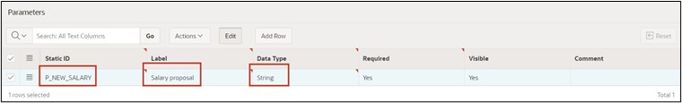
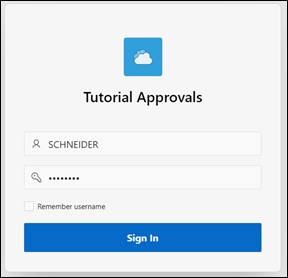

# 16. Create Approval Process

In this task, you will create an application that is used to adjust employee salaries. The necessary data for this has already been included in Chapter 14. The goal is for each employee to be able to adjust their salary accordingly, initiating an approval process. Subsequently, the supervisor must process the application and either approve or reject it.

## 16.1. Creating an Application

- For this task, an **application** will be created. First, open the **App Builder** and click on the **Create** button. The App Builder shows all installed applications.


- The application creation wizard will start. Click on **New Application** to create a new application.

 

- Now enter the application's name (e.g. Tutorial Approvals).

 

- You do not need to make any further settings initially. Click on **Create Application** to create the new application.

## 16.2. Creating a Task Definition

- Then click on **Shared Components**. 

 

- Under **Workflows and Automations**, click on **Task Definitions**.

 

- Under **Workflows and Automations**, click on **Task Definitions**.  
- Click on **Create**.

  

- Enter the following values:  

  | | |  
  |--|--|
  | **Name** | *Salary Request* | 
  | **Subject** | *Salary Request for &EMPLOYEE_NAME. from &SALARY. to &P_NEW_SALARY.*| 
  | **Priority** | *2-High*  | 
  | | |  

- Then click on **Create**.


- Once the task is created, you receive an overview. 
- Here change the Action Source to **SQL Query** and enter the following **Action SQL Query**.

 ```sql
select initcap(sary_employee_name) as employee_name,
       sary_salary as salary 
  from salaries
 where sary_id = :APEX$TASK_PK
 ```  

 

- Next, the **Task Details Page** will be created. Click the **Create Task Detail Page** button for that.

  

- The appearing dialog can be confirmed with **OK**.  
- You will now return to your tasks overview. Click on the previously created task **Salary Request** to add participants in the next step.

  

- In the Participants area, choose **Static** for the **Potential Owner** value type and enter the value **SCHNEIDER**.

  

- Enter **P_NEW_SALARY** as the parameter with the label **Salary Proposal** and the data type **String**.

 

- Now click **Apply Changes** to save all entries and then switch back to the task to add an action. To do this, click on **Add Action** in the lower area.

  

- A new action dialog will open.  
- Enter the following inputs:  

  | | |  
  |--|--|
  | **Name** | *ON_APPROVE* | 
  | **Type** | *Execute Code* | 
  | **Execution Sequence** | *1*  | 
  | **On Event** | *Complete*  | 
  | **Outcome** | *Approved*  | 
  | **Success Message** | *Salary change approved*  | 
  | | |  

  

- Finally, enter the following SQL Query.

 ```sql
update salaries
   set sary_salary = :P_NEW_SALARY
 where sary_id = :APEX$TASK_PK;
 ```  

- Lastly, click on **Create**.

  

- The task is now completed, so you can switch back to the application overview next.

  

## 16.3. Creating the “My Approvals” and “My Request” Page

- Click on **Create Page** and select **Unified Task List**. Then click **Next**.

  

- Enter the following values:  

|  |  |
|--|--|
| **Page Number** | 4 |
| **Page Name** | My Approvals |
| **Request Context** | My Tasks |
|  |  |  

- Then click on **Create Page**.

 

- The page will now be created and displayed. Switch back to the page overview and click **Create Page** again.

- Again, select the Component **Unified Task List**.

- Then enter the following values:  

|  |  |
|--|--|
| **Page Number** | 5 |
| **Page Name** | My Requests |
| **Request Context** | Initiated by Me |
|  |  |  

- Then click on **Create Page**.

 

## 16.4. Creating the “Salary Change” Page

- Click on **Create Page** and select **Blank Page**.  
- Then click **Next**.


- Enter the Page Number 6 and the Page Name **Salary Change**.   
- Deactivate the *Breadcrumb* here and then click the **Create Page** button.  

 

- You will now be taken to the Page Editor.  
- Add a region form to the **Body** area.
- Change the title to **Salary Change**.
- Under Source, choose the Table **Salaries**.
- Change the page item **P6_SARY_ID** as follows:
  - Type: Hidden
  - Primary Key: True
- Change the page item **P6_SARY_EMPLOYEE_NAME** as follows:
  - Type: Display Only
  - Label: Employee Name
- Change the page item **P6_SARY_DEPARTMENT** as follows:
  - Type: Display Only
  - Label: Department
- Change the page item **P6_SARY_SALARY** as follows:
  - Type: Display Only
  - Label: Current Salary
- Then add a new page item **P6_NEW_SALARY**:
  - Type: Number Field
  - Label: New Salary
  - Minimum Value: 500
  - Maximum Value: 4000
  - Number Alignment: Start


- In the **Pre-Rendering** area, change the process **Initialize form Salary Request**.
- Please change the name to **Fetch Employee Details for User**.  
- Change the type to **Execute Code**.  
- In the PL/SQL Code Editor, please enter the following SQL-Query:

 ```sql
select sary_id, sary_employee_name, sary_department, sary_salary
  into :P6_SARY_ID, :P6_SARY_EMPLOYEE_NAME, :P6_SARY_DEPARTMENT, :P6_SARY_SALARY
  from salaries
 where initcap(sary_employee_name) = initcap(:APP_USER);
 ```

  

- Then add a button to the page and name it **Submit**.  
- Place the button at position **Create** and activate **Hot**.  

  

- Then switch to **Processes** and add a new process there.  
- Name the *Process* **Submit Task** and change the following values:  
  - Type: Human Task - Create  
  - Definition: Salary Request  
  - Details Primary Key Item: P6_SARY_ID  
  - When Button pressed: Submit  

  

- Adjust the parameter **Salary Proposal** corresponding to the process:
  - Type: Item
  - Item: P6_NEW_SALARY


- Finally, add an **After Processing Branch** and name it **Go To Page 5**.
- Select **Page 5** as the target.
- Then save the page by clicking the **Save** button.


The application is now fully created.

## 16.5. Create a User

Before the application can be started and simulated, the appropriate users must be created in the workspace. In this example, an employee will be created who can request a salary adjustment, as well as an admin user who can process the application.

It is important that you are logged in as an administrator in your workspace so that you are authorized to create new users.
- Switch back to the **Application Builder** and click the **Administration** icon in the upper right and select the entry **Manage Users and Groups**.


- Click on **Create User**.


- Enter the following:
  - Name: FISCHER
  - Email Address: fischer@fischer.de
  - Password: 12345678
  - Confirm Password: 12345678
  - Require Change of Password on First Use: No
- Then click **Create and Create Another** and repeat the entries for the user **SCHNEIDER**.


- Finish the entry with a click on **Create User**.

## 16.6. Running the Application

- Now switch back to the Application Builder and start the previously created application **Tutorial Approvals**. 
- First, log in as employee **FISCHER**.


- Go to the **Salary Change** page and enter the value **3900** for **New Salary**.  
- Then click **Submit**.

  

- You will be taken to the **My Requests** page and see the salary adjustment that was just requested.

- Now click on the request title. A slider will then appear with all the task details.  

  

- Then log out of the application.

- Now log in with the user SCHNEIDER.

  

- Go to the **My Approvals** page. You see all requests there.

  

- Now click on the request title. A slider will appear with all the task details.  
- If you now click on **Approve**, the application will be approved. Clicking on **Reject** would reject the request. Click on **Approve**.  

  

- The application has been approved, and the salary of employee **FISCHER** has been adjusted accordingly.  