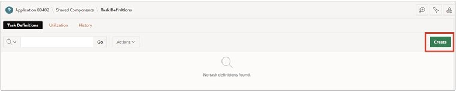
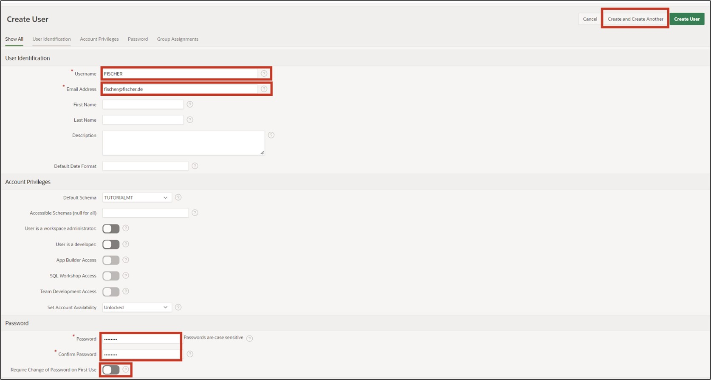
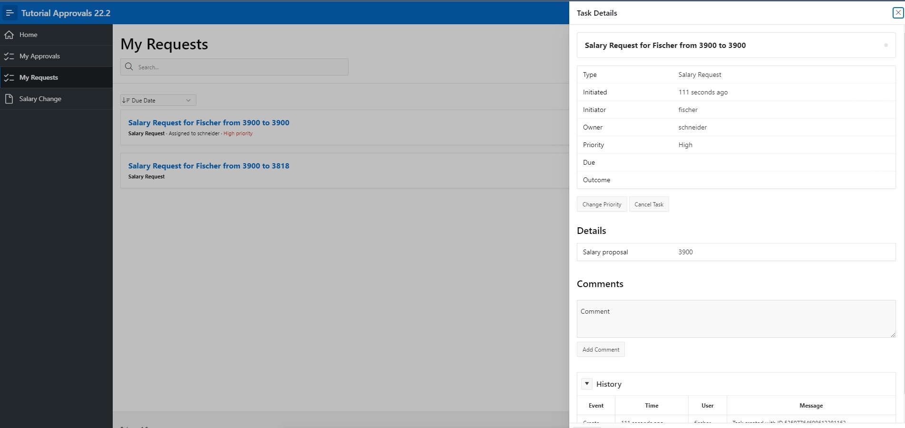

# <a name="create-approval-process"></a>16. Create Approval Process

In this task, you will create an application to adjust employee salaries. The necessary data was already entered in Chapter 14. The goal is for each employee to adjust their salary accordingly, triggering an approval process. The supervisor must then review the process and either approve or reject it.

## <a name="task-create-an-application"></a>16.1 Create an Application

- For this task, an **application** will be created. First, open the **App Builder** and click the **Create** button. The App Builder displays all installed applications.


- The application creation wizard will start. Click **New Application** to create a new application.

 
 
- Now enter the name of the application (e.g. Tutorial Approvals).

 

- No further settings are needed for now. Click **Create Application** to create the new application.

## <a name="create-a-task-definition"></a>16.2 Create a Task Definition

- Then click on **Shared Components**. 

 

- Under **Workflows and Automations** click on **Task Definitions**.

 

- Under **Workflows and Automations** click on **Task Definitions**.   
- Click here on **Create**.  

  

- Enter the following values:  

  | | |  
  |--|--|
  | **Name** | *Salary Request* | 
  | **Subject** | *Salary Request for &EMPLOYEE_NAME. from &SALARY. to &P_NEW_SALARY.*| 
  | **Priority** | *2-High*  | 
  | | |  

- Then click on **Create**.  


- After the task is created, you will get an overview. 
- Change the Action Source to **SQL Query** and enter the following **Action SQL Query**.

 ```sql
select initcap(sary_employee_name) as employee_name,
       sary_salary as salary 
  from salaries
 where sary_id = :APEX$TASK_PK
 ```  

 
 
- Next, the **Task Details Page** will be created. Click the **Create Task Detail Page** button for this.  

  

- Confirm the emerging dialog with **OK**.  
- You will now return to your tasks overview. Click the previously created task **Salary Request** to add participants in the next step.  

  

- In the Participants section, select **Static** for the **Potential Owner** value type and enter the value **SCHNEIDER**.  

  

- As a parameter, enter **P_NEW_SALARY** with the label **Salary Proposal** and the data type **String**.  

 
 
- Now click **Apply Changes** to save all entries and then return to the task to add an action. Click **Add Action** in the lower area for this.  
 
  

- A new dialog for the action will open.  
- Enter the following inputs:  

  | | |  
  |--|--|
  | **Name** | *ON_APPROVE* | 
  | **Type** | *Execute Code* | 
  | **Executoin Sequence** | *1*  | 
  | **On Event** | *Complete*  | 
  | **Outcome** | *Approved*  | 
  | **Success Message** | *Salary change approved*  | 
  | | |  


  

- Finally, enter the following SQL Query.  

 ```sql
update salaries
   set sary_salary = :P_NEW_SALARY
 where sary_id = :APEX$TASK_PK;
 ```  
 
- Lastly, click **Create**.  

  

- The task is now completed, so you can next return to the application overview.  
 
  

## <a name="create-the-my-approvals-and-my-request-page"></a>16.3 Create the "My Approvals" and "My Request" Page

- Click on **Create Page** and select **Unified Task List**, then click **Next**.  

  

- Enter the following values:  

|  |  |
|--|--|
| **Page Number** | 4 |
| **Page Name** | My Approvals |
| **Request Context** | My Tasks |
|  |  |  

- Then click on **Create Page**.  

 

- The page will be created and displayed. Return to the page overview and click **Create Page** again.  

 
- Once again, choose the Component **Unified Task List**.  

- Then enter the following values:  

|  |  |
|--|--|
| **Page Number** | 5 |
| **Page Name** | My Requests |
| **Request Context** | Initiated by Me |
|  |  |  

- Then click on **Create Page**.  
 
  
 
## <a name="create-the-salary-change-page"></a>16.4 Create the "Salary Change" Page

- Click on **Create Page** and select **Blank Page**.  
- Then click **Next**.  


- Enter the Page Number 6 and the Page Name **Salary Change**.   
- Disable the *Breadcrumb* here and then click the **Create Page** button.  
 
  
 
- You will now reach the Page Editor.  
- Add a Form Region to the **Body** area.
- Change the Title to **Salary Change**.
- Under Source, select the Table **Salaries**.
- Change the Page Items **P6_SARY_ID** as follows:
  - Type: Hidden
  - Primary Key: True
- Change the Page Items **P6_SARY_EMPLOYEE_NAME** as follows:
  - Type: Display Only
  - Label: Employee Name
- Change the Page Items **P6_SARY_ DEPARTMENT** as follows:
  - Type: Display Only
  - Label: Department
- Change the Page Items **P6_SARY_ Salary** as follows:
  - Type: Display Only
  - Label: Current Salary
- Then add a new Page Item **P6_NEW_SALARY**:
  - Type: Number Field
  - Label: New Salary
  - Minimum Value: 500
  - Maximum Value: 4000
  - Number Alignment: Start


- In the **Pre-Rendering** area, change the Process **Initialize form Salary Request**.  
- Change the name to **Fetch Employee Details for User**.  
- Change the Type to **Execute Code**.  
- In the PL/SQL Code Editor, please enter the following SQL Query:  

 ```sql
select sary_id, sary_employee_name, sary_department, sary_salary
  into :P6_SARY_ID, :P6_SARY_EMPLOYEE_NAME, :P6_SARY_DEPARTMENT, :P6_SARY_SALARY
  from salaries
 where initcap(sary_employee_name) = initcap(:APP_USER)
AND ROWNUM = 1;
 ```

  

- Then add a button to the page and name it **Submit**.  
- Place the button at the position **Create** and enable **Hot**.  

  

- Go to **Processes** and add a new process there.  
- Name the *Process* **Submit Task** and change the following values:  
  - Type: Human Task - Create  
  - Definition: Salary Request  
  - Details Primary Key Item: P6_SARY_ID  
  - When Button pressed: Submit  

  

- Adjust the parameter **Salary Proposal** created for the process accordingly:
  - Type: Item
  - Item: P6_NEW_SALARY


- Finally, add an **After Processing Branch** and name it **Go To Page 5**.
- Select **Page 5** as the target.
- Then save the page by clicking the **Save** button.


The application is now fully created.

## <a name="task-create-user"></a>16.5	Create User

Before the application can be started and simulated, appropriate users need to be created in the Workspace. In this example, an employee who can request a salary adjustment and an admin user who can process the process will be created.

It is important that you are logged in to your Workspace as an administrator, so you have the permission to create new users.
- Return to the **Application Builder** and click on the **Administration** icon in the top right, then select **Manage Users and Groups**.


- Click on **Create User**.


- Enter the following:
  - Name: FISCHER
  - Email Address: fischer@fischer.de
  - Password: 12345678
  - Confirm Password: 12345678
  - Require Change of Password on First Use: No
- Click **Create and Create Another** and repeat the entries for the user **SCHNEIDER**.



- Complete the entry by clicking **Create User**.
 
## <a name="task-run-application"></a>16.6	Run Application

- Return to the Application Builder and start the previously created application **Tutorial Approvals**. 
- First, log in as employee **FISCHER**.


- Navigate to the **Salary Change** page and enter the value **3900** for **New Salary**.  
- Then click **Submit**.  

  

- From there you will reach the **My Requests** page and see the salary adjustment request just made.   
 
- Click on the title of the request. Then a slider with all task details will appear.  

  

- Next, log out of the application.  

- Now log in with the user SCHNEIDER.  

  

- Navigate to the **My Approvals** page. You will see all requests there.  

  

- Now click on the title of the request. A slider with all task details will appear.  
- If you now click **Approve**, the request will be approved. Clicking **Reject** would deny the request. Click **Approve**.  

  

- The request has been approved, and the salary of employee **FISCHER** has been adjusted accordingly.