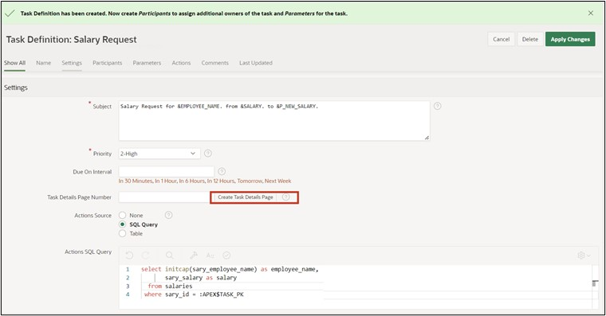
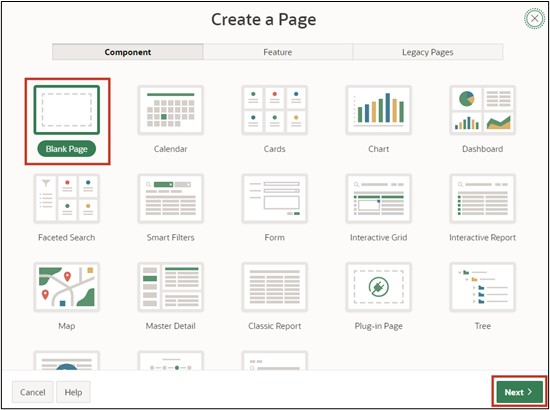
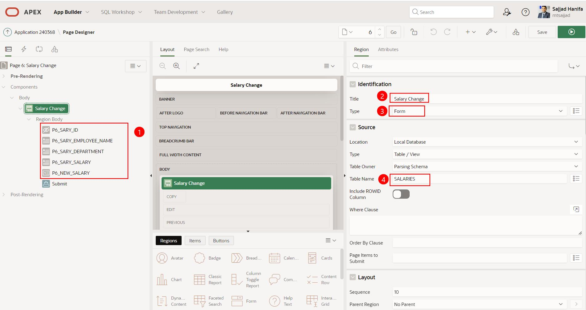

# 16. Create Approval Process

In this task, you will create an application to adjust employee salaries. We have already inserted the necessary data in Chapter 14. The goal is for each employee to adjust their salary accordingly, which initiates an approval process. Subsequently, the supervisor must process the request and either approve or reject it.

## 16.1. Creating an Application

- For this task, an **application** will be created. First, open the **App Builder** and click on the **Create** button. The App Builder shows all installed applications.


- The application creation wizard starts. Click on **New Application** to create a new application.

 
 
- Now enter the name of the application (e.g., Tutorial Approvals).

 

- No further settings are needed at the moment. Click **Create Application** to create the new application.

## 16.2. Creating a Task Definition

- Then click on **Shared Components**. 
 
 

- Under **Workflows and Automations**, click on **Task Definitions**.

 

- Under **Workflows and Automations**, click on **Task Definitions**.   
- Click on **Create** here.  

  

- Enter the following values here:  

  | | |  
  |--|--|
  | **Name** | *Salary Request* | 
  | **Subject** | *Salary Request for &EMPLOYEE_NAME. from &SALARY. to &P_NEW_SALARY.*| 
  | **Priority** | *2-High*  | 
  | | |  

- Then click on **Create**.  


- After the task is created, an overview is displayed. 
- Change the Action Source to **SQL Query** and enter the following **Action SQL Query**.

 ```sql
select initcap(sary_employee_name) as employee_name,
       sary_salary as salary 
  from salaries
 where sary_id = :APEX$TASK_PK
 ```  

 
 
- Next, the **Task Details Page** is created. Click the **Create Task Detail Page** button.  

  

- Confirm the appearing dialog with **OK**.  
- You are now back to the overview of your tasks. Click on the previously created task **Salary Request** to add participants in the next step.  

  

- In the Participants section, select the **Potential Owner** Value Type **Static** and enter the Value **SCHNEIDER**.  

  

- For parameters, enter **P_NEW_SALARY** with the Label **Salary Proposal** and the Data Type **String**.  

 
 
- Now click **Apply Changes** to save all entries, then go back to the task to add an action. Click on **Add Action** at the bottom.  
 
  

- A new dialog for the action opens.  
- Enter the following details here:  

  | | |  
  |--|--|
  | **Name** | *ON_APPROVE* | 
  | **Type** | *Execute Code* | 
  | **Execution Sequence** | *1*  | 
  | **On Event** | *Complete*  | 
  | **Outcome** | *Approved*  | 
  | **Success Message** | *Salary change approved*  | 
  | | |  


  

- Lastly, enter the following SQL Query.  

 ```sql
update salaries
   set sary_salary = :P_NEW_SALARY
 where sary_id = :APEX$TASK_PK;
 ```  
 
- Finally click on **Create**.  

  

- The task is now completed, so you can next switch back to the application overview.  
 
  

## 16.3. Creating the “My Approvals” and “My Request” Page

- Click on **Create Page** and select **Unified Task List**. Then click **Next**.  

  

- Enter the following values:  

|  |  |
|--|--|
| **Page Number** | 4 |
| **Page Name** | My Approvals |
| **Request Context** | My Tasks |
|  |  |  

- Then click on **Create Page**.  

 

- The page is now created and displayed. Go back to the page overview and click on **Create Page** again.  

 
- Again, select the Component **Unified Task List** here.  

- Then enter the following values:  

|  |  |
|--|--|
| **Page Number** | 5 |
| **Page Name** | My Requests |
| **Request Context** | Initiated by Me |
|  |  |  

- Then click on **Create Page**.  
 
  
 
## 16.4. Creating the “Salary Change” Page

- Click on **Create Page** and select **Blank Page**.  
- Then click **Next**.  



- Enter the Page Number 6 and the Page Name **Salary Change**.   
- Disable the *Breadcrumb* here and then click on the **Create Page** button.  
 
  
 
- You are now in the Page Editor.  
- Add a region form to the **Body** area.
- Change the Title to **Salary Change**.
- Under Source, select the Table **Salaries**.
- Change the Page Items **P6_SARY_ID** as follows:
  - Type: Hidden
  - Primary Key: True
- Change the Page Items **P6_SARY_EMPLOYEE_NAME** as follows:
  - Type: Display Only
  - Label: Employee Name
- Change the Page Items **P6_SARY_DEPARTMENT** as follows:
  - Type: Display Only
  - Label: Department
- Change the Page Items **P6_SARY_SALARY** as follows:
  - Type: Display Only
  - Label: Current Salary
- Then add a new Page Item **P6_NEW_SALARY**:
  - Type: Number Field
  - Label: New Salary
  - Minimum Value: 500
  - Maximum Value: 4000
  - Number Alignment: Start



- In the **Pre-Rendering** area, change the Process **Initialize form Salary Request**.  
- Change the name to **Fetch Employee Details for User**.  
- Change the Type to **Execute Code**.  
- In the PL/SQL Code Editor, please enter the following SQL-Query:  

 ```sql
select sary_id, sary_employee_name, sary_department, sary_salary
  into :P6_SARY_ID, :P6_SARY_EMPLOYEE_NAME, :P6_SARY_DEPARTMENT, :P6_SARY_SALARY
  from salaries
 where initcap(sary_employee_name) = initcap(:APP_USER);
 ```

  

- Then add a button to the page and name it **Submit**.  
- Place the button at the position **Create** and enable **Hot**.  

  

- Then switch to **Processes** and add a new process there.  
- Name the *Process* **Submit Task** and change the following values:  
  - Type: Human Task - Create  
  - Definition: Salary Request  
  - Details Primary Key Item: P6_SARY_ID  
  - When Button pressed: Submit  

  

- Adjust the parameter **Salary Proposal** created for the process:
  - Type: Item
  - Item: P6_NEW_SALARY


- Lastly, add an **After Processing Branch** and name it **Go To Page 5**.
- Select **Page 5** as the Target.
- Then save the page by clicking the **Save** button.


The application is now completely created.

## 16.5. Create Users

Before the application can be started and simulated, the corresponding users must be created in the workspace. In this example, an employee who can request a salary adjustment will be created, as well as an admin user who can process the request.  

It is important that you are logged in as an administrator in your workspace so that you have the permission to create new users.
- To do so, switch back to the **Application Builder** and click the **Administration** icon on the top right, then select the entry **Manage Users and Groups**.


- Click on **Create User** here.


- Enter the following details:
  - Name: FISCHER
  - Email Address: fischer@fischer.de
  - Password: 12345678
  - Confirm Password: 12345678
  - Require Change of Password on First Use: No
- Then click on **Create and Create Another** and repeat the entries for the user **SCHNEIDER**.


- Finish the input here by clicking on **Create User**.
 
## 16.6. Execute Application

- Now switch back to the Application Builder and start the previously created application **Tutorial Approvals**. 
- First, log in as employee **FISCHER**.


- Switch to the page **Salary Change** and enter the value **3900** under **New Salary**.  
- Then click **Submit**.  

  

- You are taken to the page **My Requests** where you can see the recently requested salary adjustment.   
 
- Click on the title of the request. A slider with all task details appears.  

  

- Next, log out of the application.  

- Now log in with the user SCHNEIDER.  
 
  

- Switch to the page **My Approvals**. You will see all requests there.  

  

- Click on the title of the request. A slider with all task details appears.  
- If you click **Approve** now, the application will be approved. A click on **Reject** would deny the request. Click on **Approve**.  

  

- The request has been approved and the salary of employee **FISCHER** has been adjusted accordingly.  