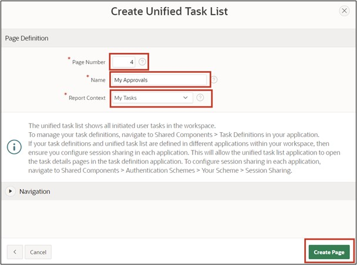
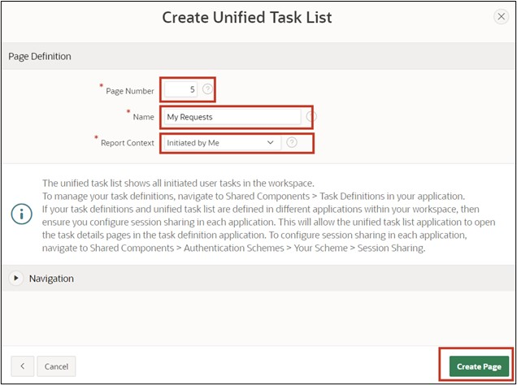
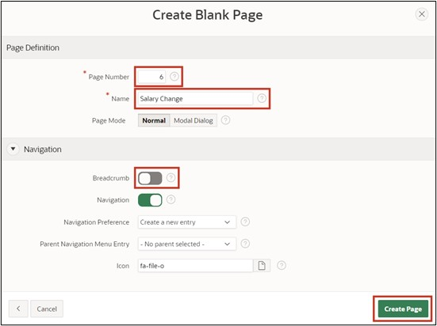

# 16. Creating an Approval Process

In this task, you will create an application that serves to adjust employees' salaries. The necessary data for this has already been inserted in Chapter 14.
The goal is for each employee to adjust their salary accordingly, thus starting an approval process. Afterwards, the supervisor must process the request and either approve or reject it.

## 16.1. Creating an Application

- For this task, an **application** will be created. First, open the **App Builder** and click the **Create** button. The App Builder displays all installed applications.


- The application creation wizard will start. Click **New Application** to create a new application.


- Now enter the name of the application (e.g., Tutorial Approvals).


- You don't need to make any further settings for now. Click **Create Application** to create the new application.

## 16.2. Creating a Task Definition

- Then click **Shared Components**.


- Under **Workflows and Automations**, click **Task Definitions**.


- Under **Workflows and Automations**, click **Task Definitions**.
- Click **Create** here.


- Enter the following values here:

  | | |  
  |--|--|
  | **Name** | *Salary Request* | 
  | **Subject** | *Salary Request for &EMPLOYEE_NAME. from &SALARY. to &P_NEW_SALARY.*| 
  | **Priority** | *2-High*  | 

- Then click **Create**.


- After the task is created, you will see an overview.
- Change the Action Source to **SQL Query** and enter the following **Action SQL Query**.

 ```sql
select initcap(sary_employee_name) as employee_name,
       sary_salary as salary 
  from salaries
 where sary_id = :APEX$TASK_PK
 ```


- Next, the **Task Details Page** is created. Click the **Create Task Detail Page** button for this.


- The upcoming dialog can be confirmed with **OK**.
- You will now return to the overview of your tasks. Click on the previously created task **Salary Request** to add participants in the next step.


- In the Participants area, select the **Potential Owner** Value Type as **Static** and enter the Value **SCHNEIDER**.


- As a parameter, enter **P_NEW_SALARY** with the label **Salary Proposal** and the Data Type **String**.


- Click **Apply Changes** to save all entries, and then switch back to the task to add an action. Click **Add Action** at the bottom area for this.


- A new dialog for the action will open.
- Enter the following inputs here:

  | | |  
  |--|--|
  | **Name** | *ON_APPROVE* | 
  | **Type** | *Execute Code* | 
  | **Execution Sequence** | *1*  | 
  | **On Event** | *Complete*  | 
  | **Outcome** | *Approved*  | 
  | **Success Message** | *Salary change approved*  | 


- Lastly, enter the following SQL Query.

 ```sql
update salaries
   set sary_salary = :P_NEW_SALARY
 where sary_id = :APEX$TASK_PK;
 ```

- Finally, click **Create**.


- The task is now complete, so you can proceed to the application overview next.


# 16.3. Creating the “My Approvals” and “My Requests” Page

- Click **Create Page** and select **Unified Task List**. Then click **Next**.


- Enter the following values:
  - Page Number: 4
  - Page Name: My Approvals
  - Request Context: My Tasks
- Then click **Create Page**.



- The page will now be created and displayed. Switch back to the page overview and click **Create Page** again.

- Choose the **Unified Task List** component again here.
- Then enter the following values:
  - Page Number: 5
  - Page Name: My Requests
  - Request Context: Initiated by Me 
- Then click **Create Page**.



# 16.4. Creating the “Salary Change” Page

- Click **Create Page** and select **Blank Page**.
- Then click **Next**.


- Enter the Page Number 6 and the Page Name **Salary Change**.
- Disable the Breadcrumb here and then click the **Create Page** button.



- You'll reach the Page Editor now.
- Add a Region Form to the **Body** area.
- Change the Title to **Salary Change**.
- Under Source, select the Table **Salaries**.
- Change the Page Items **P6_SARY_ID** as follows:
  - Type: Hidden
  - Primary Key: True
- Change the Page Items **P6_SARY_EMPLOYEE_NAME** as follows:
  - Type: Display Only
  - Label: Employee Name
- Change the Page Items **P6_SARY_ DEPARTMENT** as follows:
  - Type: Display Only
  - Label: Department
- Change the Page Items **P6_SARY_ Salary** as follows:
  - Type: Display Only
  - Label: Current Salary
- Then add a new Page Item **P6_NEW_SALARY**:
  - Type: Number Field
  - Label: New Salary
  - Minimum Value: 500
  - Maximum Value: 4000
  - Number Alignment: Left


- In the **Pre-Rendering** area, change the Process **Initialize form Salary Request**.
- Change the name to **Fetch Employee Details for User**.
- Change the Type to **Execute Code**.
- In the PL/SQL Code Editor, enter the following SQL Query:

 ```sql
select sary_id, sary_employee_name, sary_department, sary_salary
  into :P6_SARY_ID, :P6_SARY_EMPLOYEE_NAME, :P6_SARY_DEPARTMENT, :P6_SARY_SALARY
  from salaries
 where initcap(sary_employee_name) = initcap(:APP_USER);
 ```


- Then add a button to the page and name it **Submit**.
- Place the button at the position **Create** and activate **Hot**.


- Then switch to **Processes** and add a new Process there.
- Name the Process **Submit Task** and change the following values:
  - Type: Human Task - Create
  - Definition: Salary Request
  - Details Primary Key Item: P6_SARY_ID
  - When Button pressed: Submit


- Adjust the parameter **Salary Proposal** created for the process accordingly:
  - Type: Item
  - Item: P6_NEW_SALARY


- Lastly, add an **After Processing Branch** and name it **Go To Page 5**.
- Choose the **Page 5** as the Target.
- Finally, save the page by clicking the **Save** button.


The application is now fully created.

# 16.5. Creating a User

Before the application can be started and simulated, appropriate users must be created in the workspace. In this example, an employee will be created who can request a salary adjustment, as well as an admin user who can process the request.
It's important that you are logged in as an administrator in your workspace, so you have the permission to create new users.
- To do this, go back to the **Application Builder** and click on the **Administration** icon at the top right and select the **Manage Users and Groups** entry.


- Click **Create User** here.


- Enter the following:
  - Name: FISCHER
  - Email Address: fischer@fischer.de
  - Password: 12345678
  - Confirm Password: 12345678
  - Require Change of Password on First Use: No
- Then click **Create and Create Another** and repeat the entries for user **SCHNEIDER**.


- Conclude the entry by clicking **Create User**.

# 16.6. Running the Application

- Now switch back to the Application Builder and start the previously created application **Tutorial Approvals**.
- First, log in as employee **FISCHER**.


- Switch to the **Salary Change** page and enter **3900** under **New Salary** there.
- Then click **Submit**.


- You will be taken to the **My Requests** page and see the requested salary adjustment there.

- Now click on the title of the request. A slider with all task details will then appear.


- Next, log out of the application.

- Now log in with user SCHNEIDER.


- Switch to the **My Approvals** page. You will see all requests there.


- Now click on the title of the request. A slider with all task details will appear.
- If you now click **Approve**, the request will be approved. Clicking **Reject** would reject the request. Click **Approve**.


- The request has been approved, and employee **FISCHER**'s salary has been adjusted accordingly.

Congratulations!
You have successfully completed the tutorial.
If you want to learn more about APEX, feel free to visit our APEX portal:

https://apex.mt-ag.com/from-zero-to-hero