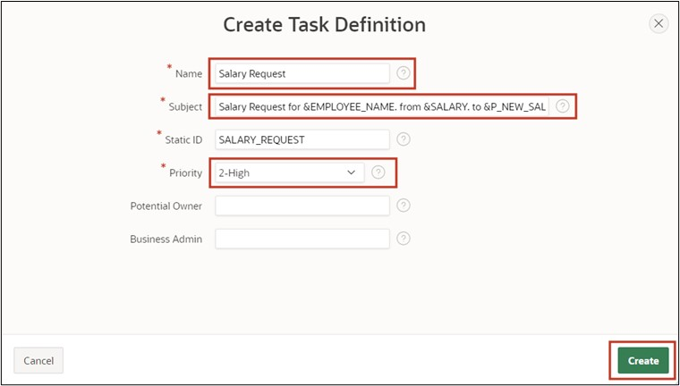
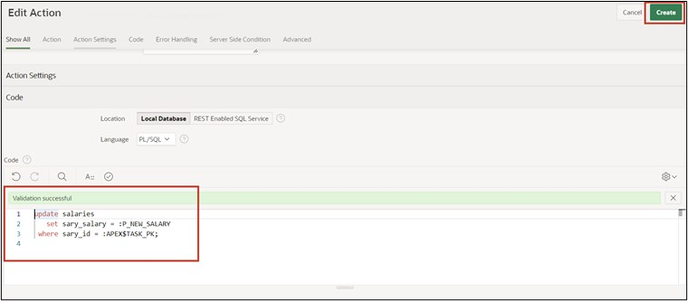
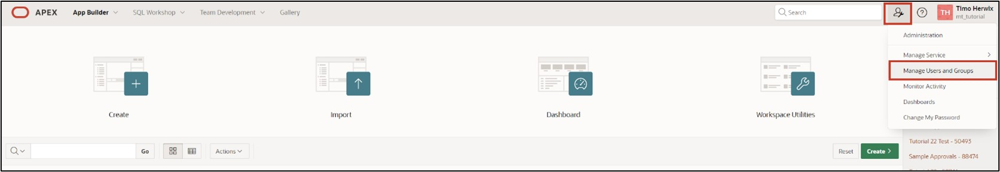

# <a name="genehmigungsprozess-erstellen"></a>16. Creating an Approval Process

In this task, you will create an application to adjust employee salaries. The necessary data for this has already been inserted in Chapter 14. The goal is for each employee to adjust their salary accordingly, triggering an approval process. Subsequently, the supervisor must process the request and either approve or reject it.

## <a name="task-erstellen-einer-anwendung"></a>16.1 Creating an Application

- For this task, an **application** will be created. First, open the **App Builder** and click the **Create** button. The App Builder shows all installed applications.


- The wizard for creating applications starts. Click **New Application** to create a new application.


- Now enter the name of the application (e.g., Tutorial Approvals).


- No further settings are necessary for now. Click **Create Application** to create the new application.

## <a name="erstellen-einer-task-definition"></a>16.2 Creating a Task Definition

- Then click on **Shared Components**.


- Under **Workflows and Automations**, click on **Task Definitions**.


- Under **Workflows and Automations**, click on **Task Definitions**. 
- Click here on **Create**.


- Enter the following values here:

  | | |  
  |--|--|
  | **Name** | *Salary Request* | 
  | **Subject** | *Salary Request for &EMPLOYEE_NAME. from &SALARY. to &P_NEW_SALARY.*| 
  | **Priority** | *2-High*  | 
  | | |  

- Then click on **Create**.



- After the task is created, you will receive an overview.
- Change the Action Source to **SQL Query** and enter the following **Action SQL Query**.

 ```sql
select initcap(sary_employee_name) as employee_name,
       sary_salary as salary 
  from salaries
 where sary_id = :APEX$TASK_PK
 ```  


- Next, create the **Task Details Page**. Click the button **Create Task Detail Page**.


- Confirm the dialog with **OK**.
- You will now return to your task overview. Click on the previously created task **Salary Request** to add participants in the next step.


- In the Participants section, select the **Value Type** **Static** for **Potential Owner** and enter the value **SCHNEIDER**.


- As a parameter, enter **P_NEW_SALARY** with the label **Salary Proposal** and the data type **String**.


- Click **Apply Changes** to save all inputs, and then return to the task to add an action. Click **Add Action** at the bottom.


- A new dialog for the action will open.
- Enter the following:

  | | |  
  |--|--|
  | **Name** | *ON_APPROVE* | 
  | **Type** | *Execute Code* | 
  | **Execution Sequence** | *1*  | 
  | **On Event** | *Complete*  | 
  | **Outcome** | *Approved*  | 
  | **Success Message** | *Salary change approved*  | 
  | | |  


- Finally, enter the following SQL Query.

 ```sql
update salaries
   set sary_salary = :P_NEW_SALARY
 where sary_id = :APEX$TASK_PK;
 ```

- Click **Create** at the end.



- The task is now complete, allowing you to return to the application overview.


## <a name="erstellen-der-my-approvals-und-my-request-seite"></a>16.3 Creating the “My Approvals” and “My Request” Page

- Click on **Create Page** and select **Unified Task List**. Then click **Next**.


- Enter the following values:

|  |  |
|--|--|
| **Page Number** | 4 |
| **Page Name** | My Approvals |
| **Request Context** | My Tasks |
|  |  |  

- Then click **Create Page**.


- The page is now created and displayed. Return to the page overview and click **Create Page** again.

- Again, select the **Unified Task List** component.

- Then enter the following values:

|  |  |
|--|--|
| **Page Number** | 5 |
| **Page Name** | My Requests |
| **Request Context** | Initiated by Me |
|  |  |  

- Then click **Create Page**.


## <a name="erstellen-der-salary-change-seite"></a>16.4 Creating the “Salary Change” Page

- Click on **Create Page** and select **Blank Page**.
- Then click **Next**.


- Enter the Page Number 6 and the Page Name **Salary Change**.
- Deactivate the *Breadcrumb* and click the **Create Page** button.


- You will now reach the Page Editor.
- Add a Form region to the **Body** section.
- Change the title to **Salary Change**.
- Under Source, select the table **Salaries**.
- Change the Page Items **P6_SARY_ID** as follows:
  - Type: Hidden
  - Primary Key: True
- Change the Page Items **P6_SARY_EMPLOYEE_NAME** as follows:
  - Type: Display Only
  - Label: Employee Name
- Change the Page Items **P6_SARY_DEPARTMENT** as follows:
  - Type: Display Only
  - Label: Department
- Change the Page Items **P6_SARY_Salary** as follows:
  - Type: Display Only
  - Label: Current Salary
- Then add a new Page Item **P6_NEW_SALARY**:
  - Type: Number Field
  - Label: New Salary
  - Minimum Value: 500
  - Maximum Value: 4000
  - Number Alignment: Start


- Change the process **Initialize form Salary Request** in the **Pre-Rendering** section.
- Rename it to **Fetch Employee Details for User**.
- Change the type to **Execute Code**.
- Enter the following SQL query in the PL/SQL Code Editor:

 ```sql
select sary_id, sary_employee_name, sary_department, sary_salary
  into :P6_SARY_ID, :P6_SARY_EMPLOYEE_NAME, :P6_SARY_DEPARTMENT, :P6_SARY_SALARY
  from salaries
 where initcap(sary_employee_name) = initcap(:APP_USER);
 ```


- Then add a button to the page and name it **Submit**.
- Place the button at the **Create** position and activate **Hot**.


- Then go to **Processes** and add a new process there.
- Name the *Process* **Submit Task** and change the following values:
  - Type: Human Task - Create
  - Definition: Salary Request
  - Details Primary Key Item: P6_SARY_ID
  - When Button pressed: Submit


- Adjust the parameter **Salary Proposal** created for the process accordingly:
  - Type: Item
  - Item: P6_NEW_SALARY


- Finally, add an **After Processing Branch** and name it **Go To Page 5**.
- Select **Page 5** as the target.
- Save the page by clicking the **Save** button.


The application is now fully created.

## <a name="task-user-erstellen"></a>16.5 Creating a User

Before the application can now be started and simulated, corresponding users must be created in the workspace. In this example, an employee who can apply for a salary adjustment and an admin user who can process the request will be created.

It is important that you are logged in as an administrator in your workspace, so you have the authorization to create new users.
- Return to the **Application Builder** and click on the **Administration** icon at the top right, and select the entry **Manage Users and Groups**.



- Click on **Create User**.


- Enter the following:
  - Name: FISCHER
  - Email Address: fischer@fischer.de
  - Password: 12345678
  - Confirm Password: 12345678
  - Require Change of Password on First Use: No
- Then click **Create and Create Another** and repeat the entries for the user **SCHNEIDER**.


- Finish the input by clicking **Create User**.

## <a name="task-anwendung-ausfuehren"></a>16.6 Running the Application

- Now return to the Application Builder and start the previously created application **Tutorial Approvals**.
- Log in as employee **FISCHER** first.


- Navigate to the **Salary Change** page and enter the value **3900** for **New Salary**.
- Then click **Submit**.


- You will be taken to the **My Requests** page and see the salary adjustment request you just made.

- Now click on the title of the request. A slider with all task details will appear.


- Next, log out from the application.

- Now log in with the user SCHNEIDER.


- Go to the **My Approvals** page. You will see all requests there.


- Now click on the title of the request. A slider with all task details will appear.
- If you click on **Approve** now, the request will be approved. Clicking **Reject** would reject the request. Click on **Approve**.


- The request has been approved, and the salary of employee **FISCHER** has been adjusted accordingly.