# 17. <a name="application-search-suchregionen-und-suchkonfigurationen-erstellen"></a>Application Search: Creating Search Regions and Search Configurations

In this task, you will create a search region and search configurations that look for results in multiple data sources. You will need the knowledge described in Chapter 13.  

The goal is to provide your users with a search engine-style powerful function that can search multiple data sources for results in minutes and display them in a single unified search results region.  

## <a name="erstellen-eine-suchkonfiguration"></a>17.1 Creating a Search Configuration

This new shared component defines the data sources to be searched and the display of the results. The search can be based on local data, APEX lists, REST-enabled SQL services, or REST services.  

In the following two examples, the search is performed once with local data and once with a REST data source.  

### <a name="lokalen-daten-datenquelle"></a>17.1.1 Local Data Data Source

- A **View** is required to perform this task.  

- Name your **View** ***TUTO_P0081_VW***:  
  Query:  
  ```sql
  select prdt_info_id,
         prdt_info_name,
         prdt_info_descr,
         prdt_info_category,
         prdt_info_avail,
         prdt_info_list_price,
         prdt_info_product_image,
         prdt_info_mimetype,
         prdt_info_filename,
         prdt_info_image_last_update,
         prdt_info_tags
    from product_info
  ```

- Open the **App Builder**, select your application (see Chapter 2) and click on **Shared Components**.  

- Click on the **Search Configurations** entry under **Navigation and Search**.  

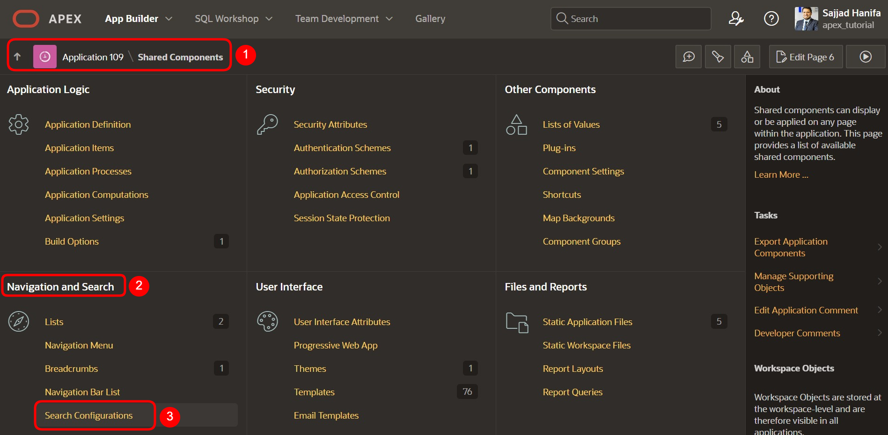  

- Click on **Create**.  

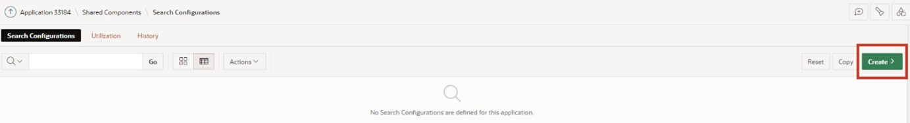  

- Enter the following values here and click on **Next**:  

  | | |  
  |--|--|
  | **Name** | *Product_Search* | 
  | **Search Type** | *Standard*| 
  | | |

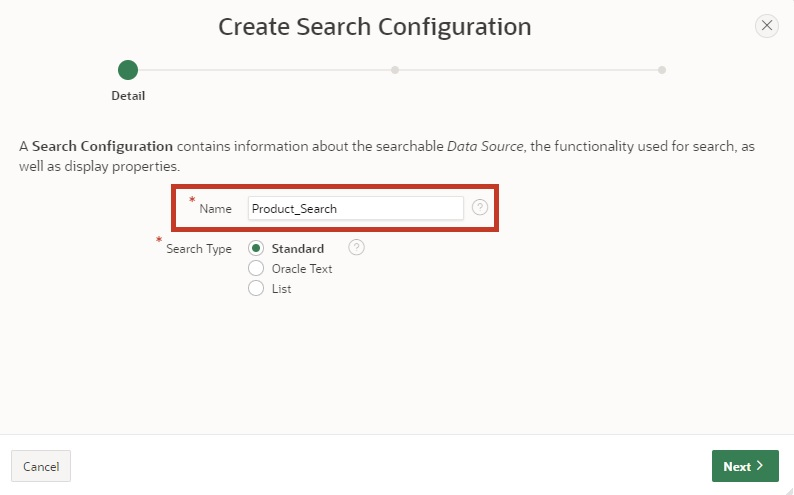  

- Choose the following values and then click on **Next**:  

  | | |  
  |--|--|
  | **Data Source** | *Local Database* | 
  | **Source Type** | *Table*| 
  | **Table / View Name** | *TUTO_P0081_VW*| 
  | | |  

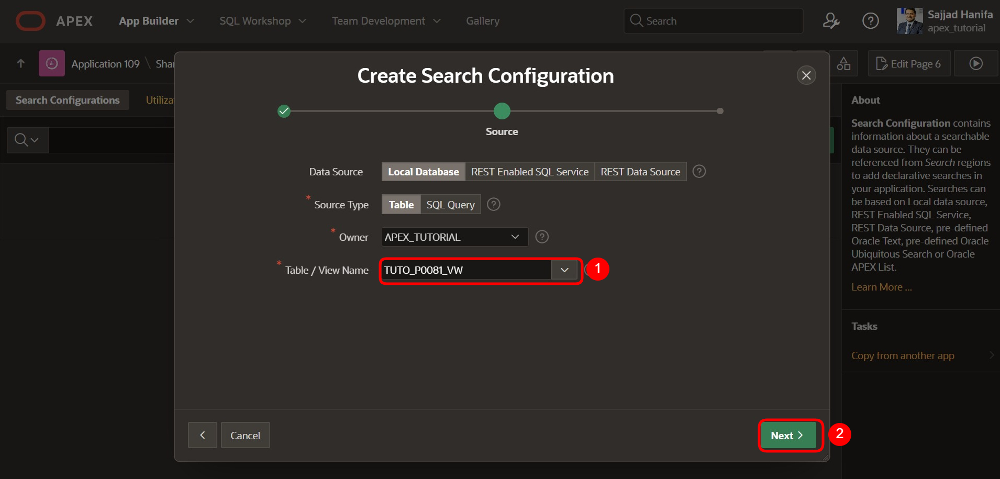  

- Choose the following values and subsequently click on **Create Search Configuration**:  

  | | |  
  |--|--|
  | **Primary Key Column** | *PRDT_INFO_ID* | 
  | **Title Column** | *PRDT_INFO_NAME*| 
  | **Description Column** | *PRDT_INFO_DESCR*| 
  | **Icon Source** | *Initials*| 
  | | |  

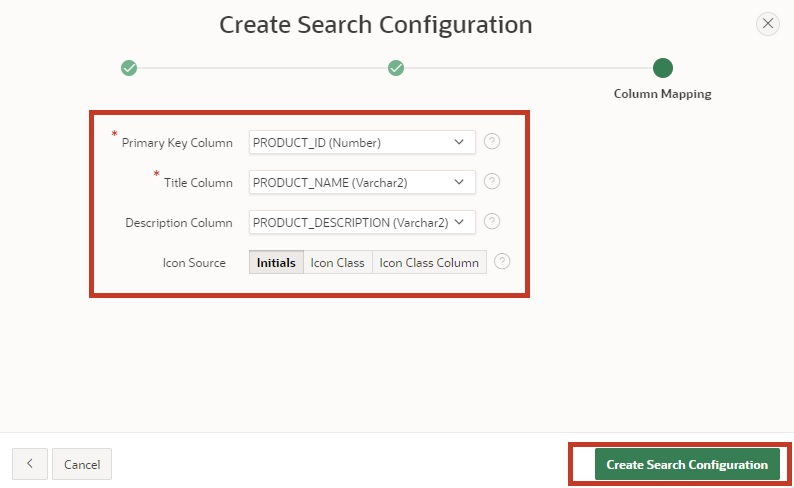  

  Note that the searchable column(s) must be varchar columns.  

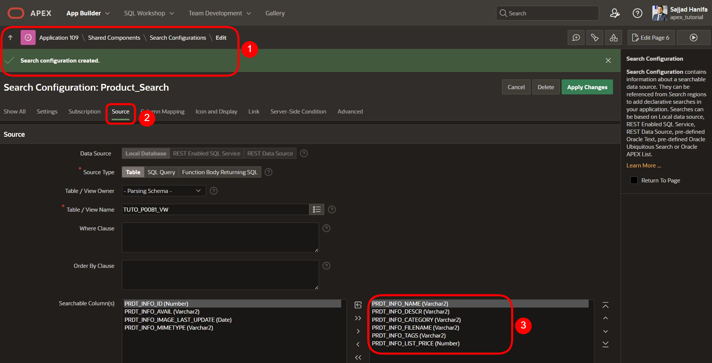

  The **Column Mapping** represents the columns displayed in the user interface:
  A numerical column (e.g., column **PRDT_INFO_LIST_PRICE**) can be used for the **Score Column**, which is used to rate the search result.  

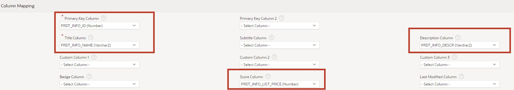  

- Under **Icon and Display**, select the following values:  

  | | |  
  |--|--|
  | **Icon Source** | *Image BLOB Column* | 
  | **Icon BLOB Column Name** | *PRDT_INFO_PRODUCT_IMAGE*| 
  | **Icon Mime Type Column Name** | *PRDT_INFO_MIMETYPE*| 
  | | |  

  Further down, a **No Results Found Message** can also be added.  

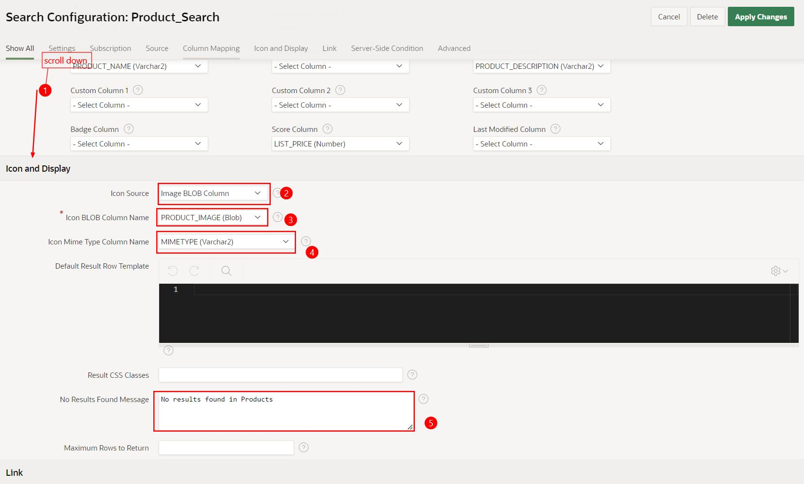  

- Finally, click the **Apply Changes** button to save the changes.  

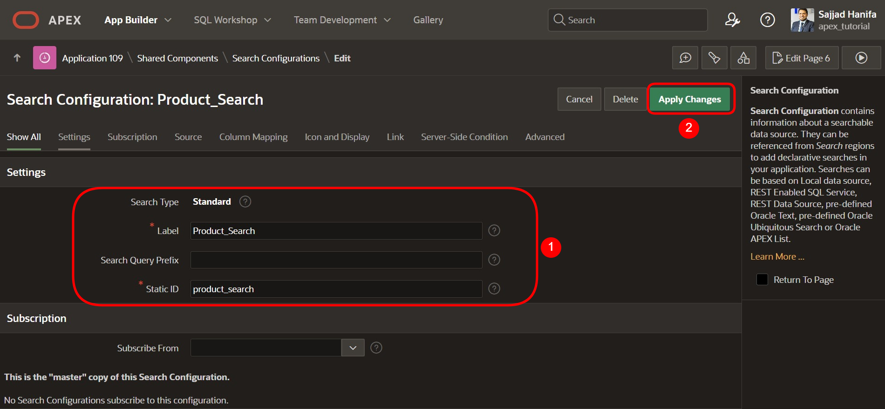  
    
### <a name="suche-rest-datenquelle"></a>17.1.2 REST Data Source

Using the RESTful Service and the REST Data Source created in Chapter 13, we will create a search configuration based on the REST Data Source **Departments**.  

- Click on **Shared Components**  

- Click on the **Search Configurations** entry under **Navigation and Search**.  

- Click on **Create**.  

- Enter the following values here and click on **Next**:  

  | | |  
  |--|--|
  | **Name** | *Department_Search* | 
  | **Search Type** | *Standard*| 
  | | |  

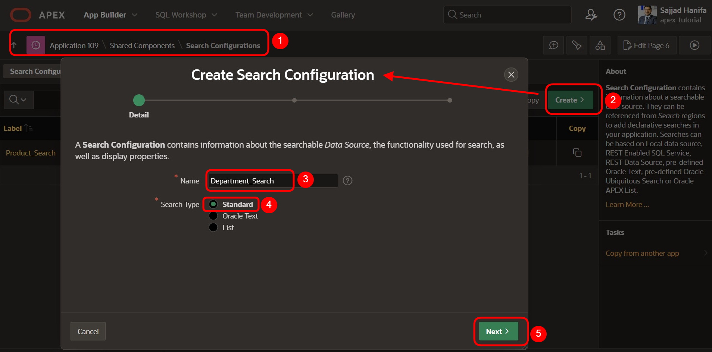  

- Choose the following values here, then click on **Next**:  

  | | |  
  |--|--|
  | **Data Source** | *REST Data Source* | 
  | **REST Data Source** | *Departments*| 
  | | |  

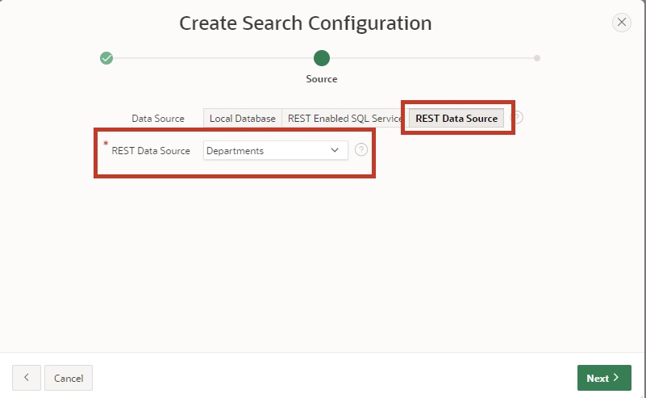  

- Choose the following values here. Subsequently, click on **Create Search Configuration**:  

  | | |  
  |--|--|
  | **Primary Key Column** | *DEPT_ID* | 
  | **Title Column** | *DEPT_NAME*| 
  | **Description Column** | *DEPT_LOCATION*| 
  | **Icon Source** | *Icon Class*| 
  | **Icon CSS Classes** | *fa-sitemap*| 
  | | |  

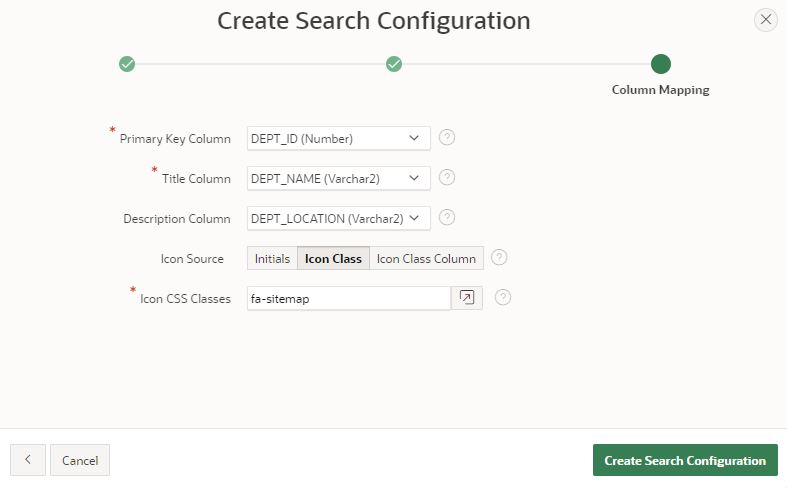  

## <a name="suchkonfigurationen-in-der-anwendung-verwenden"></a>17.2 Using Search Configurations in the Application  

To use the search configurations, create a page that displays the search results and a search box where you can enter the search term.  

### <a name="suchseite-erstellen"></a>17.2.1 Creating a Search Page 

- In the **App Builder**, click on **Create Page**.  
- Select the page type **Component**.  
- Choose the region type **Search Page**.  

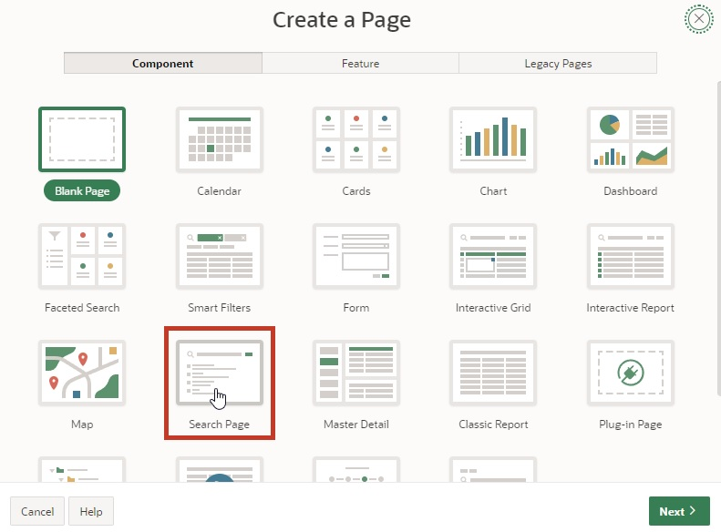  

- Enter as **Page Number**: **81** and as **Page Name**: **My Search Results**. 
A search configuration list is already available. Select the search configurations **Department_Search** and **Product_Search**. The page can search multiple configurations. 

- Under **Navigation**, turn off **Use Breadcrumb** and **Use Navigation** and then click on **Create Page**. The page is created.  
  
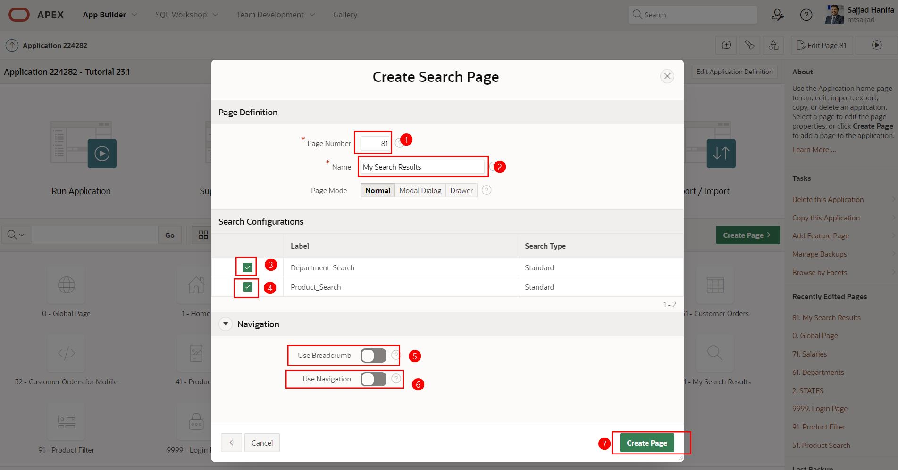  

- Under **Body**, click on **Search Results** region, and then on **Attributes**.  
- Enter as **No Results Found Message** *No Results found*.  
- Click on **Save and Run Page**.  

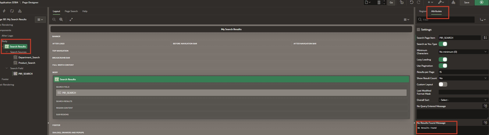  

- Enter **shoe** in the search box. The search result is displayed directly on the **My Search Results** page.  

  


## <a name="suchfeld-in-die-navigationsleiste-einbauen"></a>17.3 Integrating the Search Box into the Navigation Bar