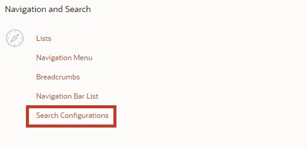
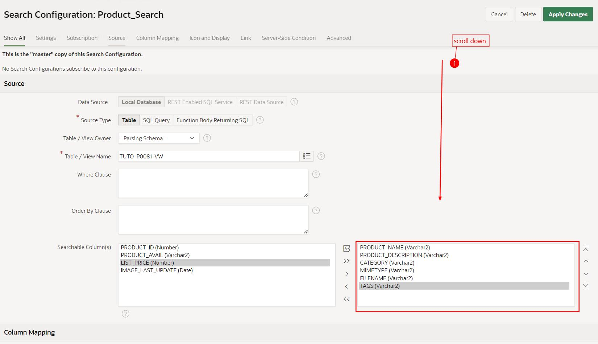
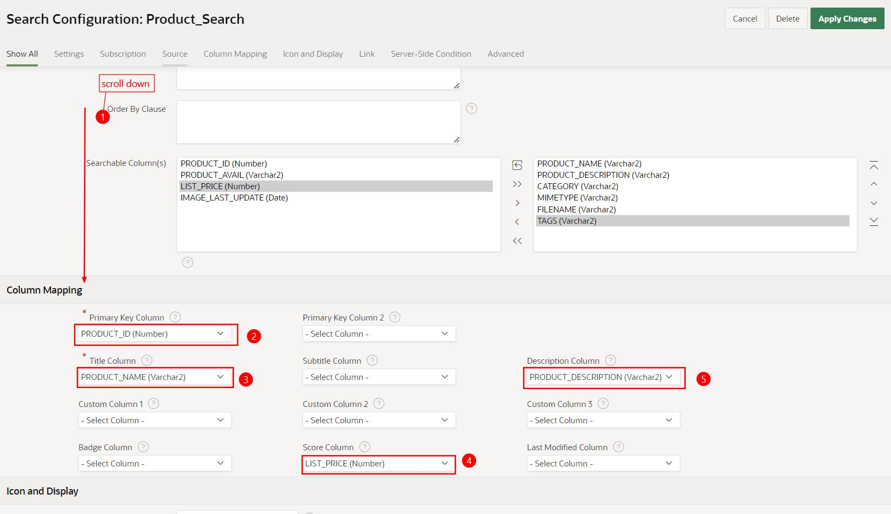
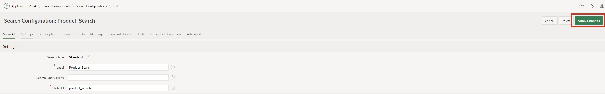

# 17. <a name="application-search-suchregionen-und-suchkonfigurationen-erstellen"></a>Application Search: Create Search Regions and Search Configurations

In this task, you will create a search region and search configurations that search across multiple data sources for results. You will need the knowledge described in Chapter 13 for this.

The goal is to provide your users with a powerful search engine-style function that searches multiple data sources for results within minutes and displays them in a single unified search result region.

## <a name="erstellen-eine-suchkonfiguration"></a>17.1 Create a Search Configuration

This new shared component defines the data sources to be searched and the display of results. The search can be based on local data, APEX lists, REST-enabled SQL Services, or REST Services.

In the following two examples, the search is performed once in the local data and once with a REST data source.

### <a name="lokalen-daten-datenquelle"></a>17.1.1 Local Data Data Source

- For this task, a **View** is needed.

- Name your **View** ***TUTO_P0081_VW***:  
  Query:  
  ```sql
  select prdt_info_id,
         prdt_info_name,
         prdt_info_descr,
         prdt_info_category,
         prdt_info_avail,
         prdt_info_list_price,
         prdt_info_product_image,
         prdt_info_mimetype,
         prdt_info_filename,
         prdt_info_image_last_update,
         prdt_info_tags
    from product_info
  ```

- Open the **App Builder**, select your application (see Chapter 2) and click on **Shared Components**.

- Click on the **Search Configurations** entry under **Navigation and Search**.



- Click on **Create**.


- Enter the following values here and click on **Next**:

  | | |  
  |--|--|
  | **Name** | *Product_Search* | 
  | **Search Type** | *Standard*| 
  | | |


- Select the following values here and then click on **Next**:

  | | |  
  |--|--|
  | **Data Source** | *Local Database* | 
  | **Source Type** | *Table*| 
  | **Table / View Name** | *TUTO_P0081_VW*| 
  | | |  


- Select the following values here, then click on **Create Search Configuration**:

  | | |  
  |--|--|
  | **Primary Key Column** | *PRDT_INFO_ID* | 
  | **Title Column** | *PRDT_INFO_NAME*| 
  | **Description Column** | *PRDT_INFO_DESCR*| 
  | **Icon Source** | *Initials*| 
  | | |  


  Note that the searchable column(s) must be varchar columns.



  The **Column Mapping** represents the columns displayed in the user interface:
  A numeric column (e.g., column **PRDT_INFO_LIST_PRICE**) can be used for the **Score Column**, which serves to rate the search result.



- Under **Icon and Display** select the following values:

  | | |  
  |--|--|
  | **Icon Source** | *Image BLOB Column* | 
  | **Icon BLOB Column Name** | *PRDT_INFO_PRODUCT_IMAGE*| 
  | **Icon Mime Type Column Name** | *PRDT_INFO_MIMETYPE*| 
  | | |  

  Further below, a **No Results Found Message** can also be added.


- Finally, click the **Apply Changes** button to save the changes.



### <a name="suche-rest-datenquelle"></a>17.1.2 REST Data Source

Using the RESTful Service and REST Data Source created in Chapter 13, we create a search configuration based on the **Departments** REST data source.

- Click on **Shared Components**

- Click on the **Search Configurations** entry under **Navigation and Search**.

- Click on **Create**.

- Enter the following values here and click on **Next**:

  | | |  
  |--|--|
  | **Name** | *Department_Search* | 
  | **Search Type** | *Standard*| 
  | | |


- Select the following values here, then click on **Next**:

  | | |  
  |--|--|
  | **Data Source** | *REST Data Source* | 
  | **REST Data Source** | *Departments*| 
  | | |  


- Select the following values here. Then click on **Create Search Configuration**:

  | | |  
  |--|--|
  | **Primary Key Column** | *DEPT_ID* | 
  | **Title Column** | *DEPT_NAME*| 
  | **Description Column** | *DEPT_LOCATION*| 
  | **Icon Source** | *Icon Class*| 
  | **Icon CSS Classes** | *fa-sitemap*| 
  | | |  


## <a name="suchkonfigurationen-in-der-anwendung-verwenden"></a>17.2 Use Search Configurations in the Application

To use the search configurations, create a page that displays the search results and a search field where you can enter the search term.

### <a name="suchseite-erstellen"></a>17.2.1 Create Search Page

- In the **App Builder** click on **Create Page**.  
- Select the **Component** page type.  
- Select the **Search Page** area type.  


- Enter **Page Number**: **81** and **Page Name**: **My Search Results**. 
A search configuration list is already available. Select the search configurations **Department_Search** and **Product_Search**. The page can search multiple configurations. 

- Under **Navigation** disable **Use Breadcrumb** and **Use Navigation** then click on **Create Page**. The page will be created.


- Under **Body** click on **Search Results** region, then on **Attributes**.  
- Enter as **No Results Found Message** *No Results found*.  
- Click on **Save and Run Page**.  


- Enter **shoe** in the search field. The search result will be displayed directly on the **My Search Results** page.  


## <a name="suchfeld-in-die-navigationsleiste-einbauen"></a>17.3 Integrate Search Field into the Navigation Bar
