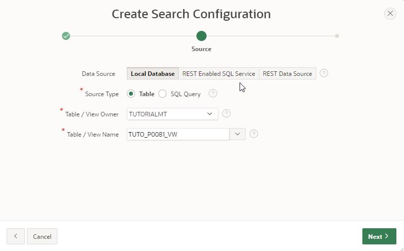
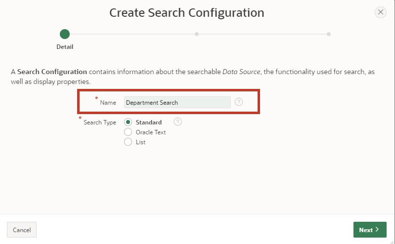
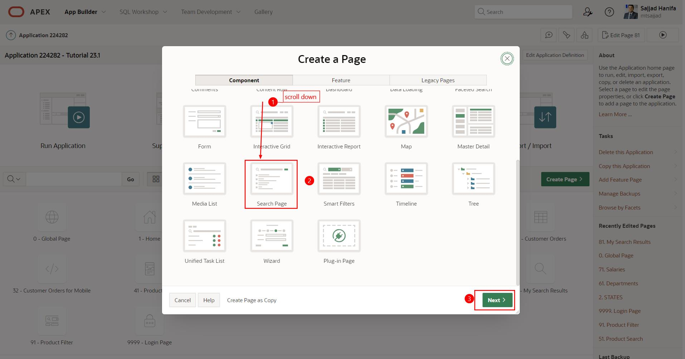
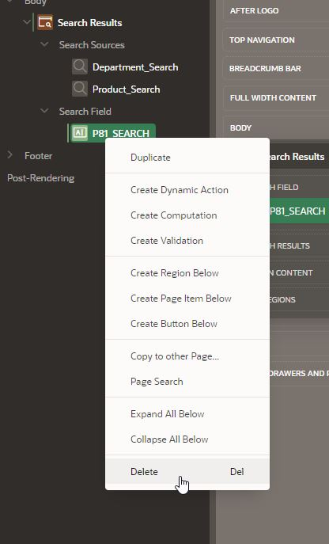

# 17. Application Search: Creating Search Regions and Configurations

In this task, you will create a search region and configurations that search for results across multiple data sources. You will need the knowledge described in Chapter 13 for this.  

The goal is to provide your users with a powerful search engine-like feature that searches multiple data sources for results within minutes and displays them in a single, unified search result region.  

## 17.1. Creating a Search Configuration 

This new shared component defines the data sources to be searched and the display of the results. The search can be based on local data, APEX lists, REST-enabled SQL Services, or REST Services.  

In the following two examples, the search is performed once in the local data and once with a REST data source.  

### 17.1.1. Local Data Source

- A **View** is required to complete this task.  

- Name your **View** ***TUTO_P0081_VW***:  
  Query:  
  ```sql
  select prdt_info_id as product_id,
         prdt_info_name as product_name,
         prdt_info_descr as product_description,
         prdt_info_category as category,
         prdt_info_avail as product_avail,
         prdt_info_list_price as list_price,
         prdt_info_product_image as product_image,
         prdt_info_mimetype as mimetype,
         prdt_info_filename as filename,
         prdt_info_image_last_update as image_last_update,
         prdt_info_tags as tags
    from product_info
  ```

- Open the **App Builder**, select your application (see Chapter 2), and click on **Shared Components**.  

- Click on the **Search Configurations** entry under **Navigation and Search**.  

  

- Click on **Create**.  

  

- Enter the following values here and click **Next**:  

  | | |  
  |--|--|
  | **Name** | *Product_Search* | 
  | **Search Type** | *Standard*| 
  | | |

  

- Select the following values and then click **Next**:  

  | | |  
  |--|--|
  | **Data Source** | *Local Database* | 
  | **Source Type** | *Table*| 
  | **Table / View Name** | *TUTO_P0081_VW*| 
  | | |  

  

- Select the following values and then click on **Create Search Configuration**:  

  | | |  
  |--|--|
  | **Primary Key Column** | *PRODUCT_ID* | 
  | **Title Column** | *PRODUCT_NAME*| 
  | **Description Column** | *PRODUCT_DESCRIPTION*| 
  | **Icon Source** | *Initials*| 
  | | |  

  


  
  Note that the searchable column(s) must be varchar columns.  


  The **Column Mapping** represents the columns displayed in the user interface:
  A numeric column (e.g., column **PRDT_INFO_LIST_PRICE**) can be used for the **Score Column** to evaluate the search result.  

  

- Under **Icon and Display**, select the following values:  

  | | |  
  |--|--|
  | **Icon Source** | *Image BLOB Column* | 
  | **Icon BLOB Column Name** | *PRODUCT_IMAGE*| 
  | **Icon Mime Type Column Name** | *MIMETYPE*| 
  | | |  

  **No Results Found Message** can be added:  

  

- Finally, click the **Apply Changes** button to save the changes.  

  
    
### 17.1.2. REST Data Source

Using the RESTful Service and the REST Data Source created in Chapter 13, we create a search configuration based on the **Departments** REST Data Source.  

- Click on **Shared Components**  

- Click on the **Search Configurations** entry under **Navigation and Search**.  

- Click on **Create**.  

- Enter the following values here and click **Next**:  

  | | |  
  |--|--|
  | **Name** | *Department_Search* | 
  | **Search Type** | *Standard*| 
  | | |  

  

- Select the following values and then click **Next**:  

  | | |  
  |--|--|
  | **Data Source** | *REST Data Source* | 
  | **REST Data Source** | *Departments*| 
  | | |  

  

- Select the following values. Then click on **Create Search Configuration**:  

  | | |  
  |--|--|
  | **Primary Key Column** | *DEPT_ID* | 
  | **Title Column** | *DEPT_NAME*| 
  | **Description Column** | *DEPT_LOCATION*| 
  | **Icon Source** | *Icon Class*| 
  | **Icon CSS Classes** | *fa-sitemap*| 
  | | |  

  

## 17.2. Using Search Configurations in the Application  

To use the search configurations, create a page that displays the search results and a search field where you can enter the search term.  

### 17.2.1. Creating a Search Page 

- In the **App Builder**, click on **Create Page**.  
- Select the page type **Component**.  
- Choose the region type **Search Page**.  

  

- Enter **Page Number**: **81** and **Page Name**: **My Search Results**. 
A list of search configurations is already available. Select the search configurations **Department_Search** and **Product_Search**. The page can search multiple configurations. 

- Under **Navigation**, turn off **Use Breadcrumb** and **Use Navigation**, then click **Create Page**. The page will be created.  
  
  


- Under **Body**, click on the **Search Results** region, and then on **Attributes**.  
- Enter **No Results Found Message** as *No Results found*.  
- Click on **Save and Run Page**.  

  

- Enter **shoe** in the search field. The search result will be displayed directly on the **My Search Results** page.  

  


## 17.3. Incorporating the Search Field into the Navigation Bar  

- Create an item on the global page with the following settings:  

  | | |  
  |--|--|
  | **Name** | *P0_SEARCH* | 
  | **Type** | *Text Field*| 
  | **Label** | *Search*| 
  | **Position** | *After Logo*| 
  | **Icon** | *fa-search*| 
  | **Value Placeholder** | *Search*| 
  | | |  
  
-  In **Template Options**, choose **Stretch Form Item** and **Size Large**.  
  
  

- Create a **Dynamic Action** on the **P0_SEARCH** item with the following settings:  

  | | |  
  |--|--|
  | **Name** | *Redirect to Results* | 
  | **Event** | *Key Press*| 
  | **Client-side Condition** | *JavaScript expression*| 
  | **JavaScript Expression** | *this.browserEvent.keyCode === 13*| 
  | | |  

  

The **Dynamic Action** includes three **True Actions**:  

  

- The first action is of the type *Execute JavaScript Code* with the following settings:  

  | | |  
  |--|--|
  | **Name** | *Prevent Default Page Submit* | 
  | **Action** | *Execute JavaScript Code*| 
  | **Code** | *this.browserEvent.preventDefault();*| 
  | | |  


- The second action is of the type *Execute Server-side Code* with the following settings:

  | | |  
  |--|--|
  | **Name** | *Submit Search Item* | 
  | **Language** | *PL/SQL*| 
  | **PL/SQL Code** | *null;*| 
  | **Items to Submit** | *P0_SEARCH*| 
  | | | 


- And the third action is again of the type *Execute JavaScript Code* with the following settings:

  | | |  
  |--|--|
  | **Name** | *Redirect to Results Page* | 
  | **Action** | *Execute JavaScript Code*| 
  | **Code** | *apex.navigation.redirect ( "f?p=&APP_ID.:81:&APP_SESSION.::NO:RP::" );*| 
  | | |  

  


- Delete the search field **P81_SEARCH** on **Page 81**.  

  

- Under **Body**, click on the **Search Results** region, and then on **Attributes**.  

- Enter the **Search Page Item**: **P0_SEARCH** and then click **Save**.  

  
    

<br>  

The search field now appears in the navigation bar, is available on every page, and redirects you to the search result page when a search value is entered and the enter key is pressed.  

