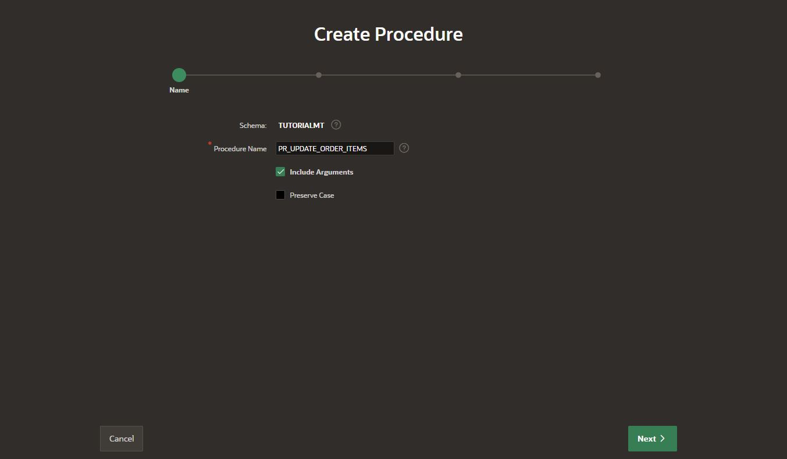
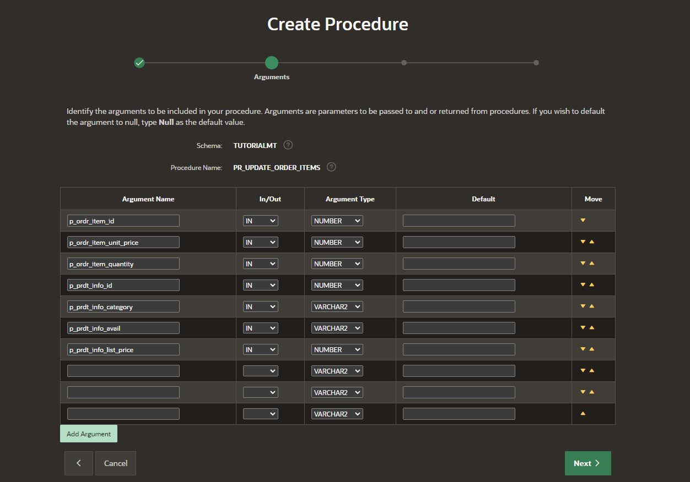
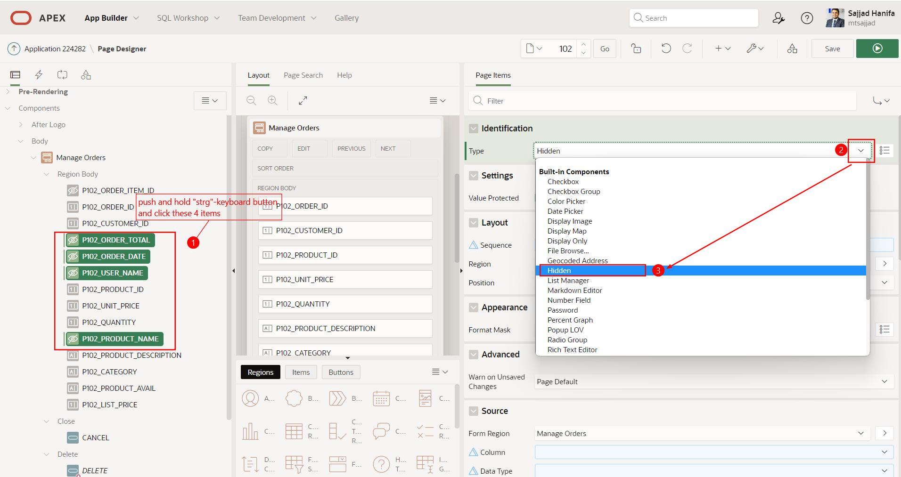
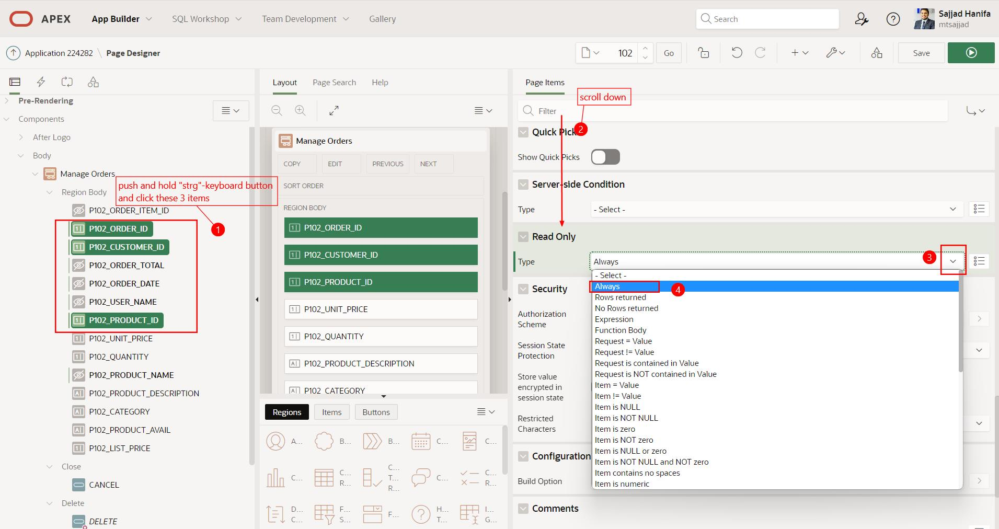
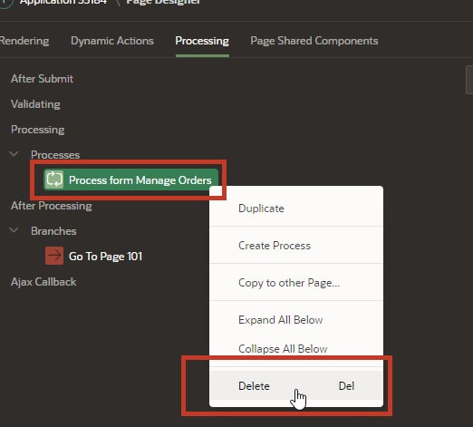
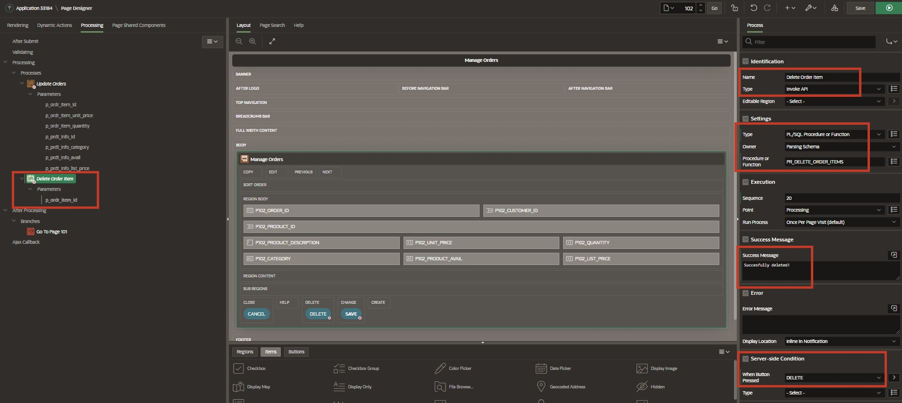
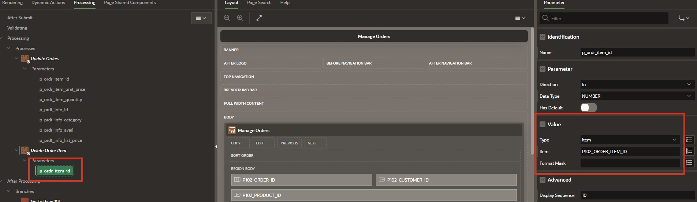
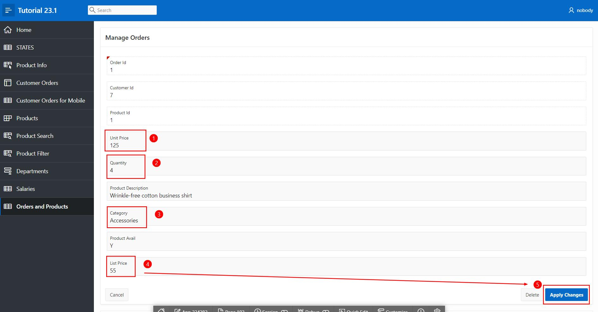

# <a name="invoke-api-process-type"></a>18. Invoke API Process Type

The *Process Type* **Invoke API** allows for completely declarative execution of procedures and functions without the need to write PL/SQL code. Procedures and functions can be standalone or part of a package. The **Page Designer** automatically pre-defines the parameters and assigns them to the corresponding page elements or interactive grid columns, if available.

An example of an API call process can be seen on the **Login Page** in the application, where the **Set Username Cookie** process and the **Login** process use the API call process.

- Open the **App Builder**, select your application (see Chapter 2) and the **Login Page**

- Click on the **Processing** tab to view the processes with the **Invoke API** type.


In this chapter, a procedure will be created to use the above-mentioned functions.

## <a name="api-creation-of-required-objects"></a>18.1 Creation of the Required Objects

For this chapter, a **procedure** and a **view** must first be created.

### <a name="api-creation-of-view"></a>18.1.1 Creation of the View

- A **view** is required for editing this task.

- Name your **view** ***TUTO_P0101_VW***
  ```sql
  select o.ordr_id,
         o.ordr_ctmr_id,
         o.ordr_total,
         o.ordr_dd,
         o.ordr_user_name,
         oi.ordr_item_id,
         oi.ordr_item_prdt_info_id,
         oi.ordr_item_unit_price,
         oi.ordr_item_quantity,
         p.prdt_info_name,
         p.prdt_info_descr,
         p.prdt_info_category,
         p.prdt_info_avail,
         p.prdt_info_list_price
    from order_items oi
    join product_info p
      on oi.ordr_item_prdt_info_id = p.prdt_info_id
    join orders o
      on oi.ordr_item_ordr_id = o.ordr_id
  ```

### <a name="api-creation-of-procedure"></a>18.1.2 Creation of the Procedure

- Similarly to creating a **view**, start the wizard to create a **procedure**. To do this, open the dropdown menu via the **+** and click on the **Procedure** entry.

> For more information about a procedure, please visit the following link:   
[Oracle Documentation CREATE PROCEDURE Statement](https://docs.oracle.com/en/database/oracle/oracle-database/21/lnpls/CREATE-PROCEDURE-statement.html#GUID-5F84DB47-B5BE-4292-848F-756BF365EC54)


The window for creating a procedure opens.  
Enter the appropriate name **PR_UPDATE_ORDER_ITEMS** here. To achieve a uniform naming convention across different applications, it is recommended to use naming conventions.

In this case, the designation of the view is composed as follows:  
**PR_<DOMAIN_NAME>**



- Then click the **Create Procedure** button.

- In the following window, insert the code for the procedure.
    ```sql
      create or replace procedure "PR_UPDATE_ORDER_ITEMS"
  ( p_ordr_item_id            IN  NUMBER, 
    p_ordr_item_unit_price    IN  NUMBER, 
    p_ordr_item_quantity      IN  NUMBER, 
    p_prdt_info_id            IN  NUMBER,
    p_prdt_info_category      IN  VARCHAR2, 
    p_prdt_info_avail         IN  VARCHAR2, 
    p_prdt_info_list_price    IN  NUMBER   
  )
  as
  begin

        update order_items
          set ordr_item_unit_price   = p_ordr_item_unit_price
            , ordr_item_quantity     = p_ordr_item_quantity
        where ordr_item_id           = p_ordr_item_id;
    
        update product_info
          set prdt_info_category    = p_prdt_info_category
            , prdt_info_avail       = p_prdt_info_avail
            , prdt_info_list_price  = p_prdt_info_list_price
        where prdt_info_id          = p_prdt_info_id;

  end "PR_UPDATE_ORDER_ITEMS";
  /
    ```



- Then click on the **Save and Compile** button. A message will appear indicating that the procedure has been successfully compiled.

- Create another procedure **PR_DELETE_ORDER_ITEMS** with the following code:

  ```sql
  create or replace procedure "PR_DELETE_ORDER_ITEMS"
  (
      p_ordr_item_id    IN  NUMBER
  )
  as
  begin
      delete 
        from order_items
        where ordr_item_id = p_ordr_item_id;
  end "PR_DELETE_ORDER_ITEMS";
  /
  ```

  

- Then again click on **Save and Compile**.

## <a name="invoke-api-process-use"></a>18.2 Use Invoke API Process

- To use an Invoke API Process, create an editable page.

- In the **App Builder** click **Create Page**.
- Select the page type **Component**.
- Select the region type **Interactive Report**.


- Enter **Page Number**: *101* and **Page Name**: *Orders and Products*. 
- Enable **Include Form Page**.
- Enter **Form Page Number**: *102* and **Form Page Name**: *Manage Orders* and **Form Page Mode**: *Normal*.

- Select **TUTO_P0101_VW** as the **Data Source**.

- Under **Navigation**, turn off **Use Breadcrumb** and then click **Next**.


- Select **ORDR_ITEM_ID** as the primary key and then click **Create Page**.


- Once the page is created, delete the **Create** button


- Click **Save** and then navigate to **Page 102**

- Also remove the **Create** button on **Page 102**

- Set the type of the following elements to **Hidden**:



- Set the **Read Only** type of the following elements to **Always**:



- Remove the default process and create two new processes under **Processing**:



- A process with the following settings (via right-click and **Create Process**):


- The Page Designer automatically pre-defines the parameters. Check if each parameter is assigned to the corresponding element/value.

  | | |  
  |--|--|
  | **p_ordr_item_id** | *P102_ORDR_ITEM_ID*| 
  | **p_ordr_item_unit_price** | *P102_ORDR_ITEM_UNIT_PRICE*| 
  | **p_ordr_item_quantity** | *P102_ORDRD_ITEM_QUANTITY*| 
  | **p_prdt_info_id** | *P102_PRDT_INFO_ID*| 
  | **p_prdt_info_category** | *P102_PRDT_INFO_CATEGORY*| 
  | **p_prdt_info_avail** | *P102_PRDT_INFO_AVAIL*| 
  | **p_prdt_info_list_price** | *P102_PRDT_INFO_LIST_PRICE*| 
  | | |


- Create a second process with the following settings:



- Also check here, if the parameter is assigned to the corresponding element/value.

  | | |  
  |--|--|
  | **p_ordr_item_id** | *P102_ORDR_ITEM_ID*| 
  | | |



- Click **Save** and run the application from page 101.

- Navigate to the page **Orders and Products**. 
- Select an **Order Item**.


- Edit the marked fields or delete the selected **Order Item**  

