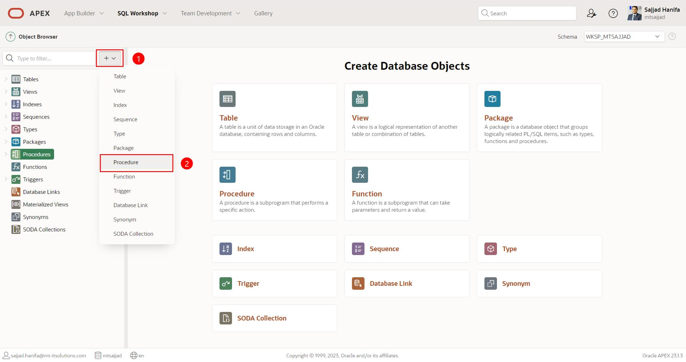
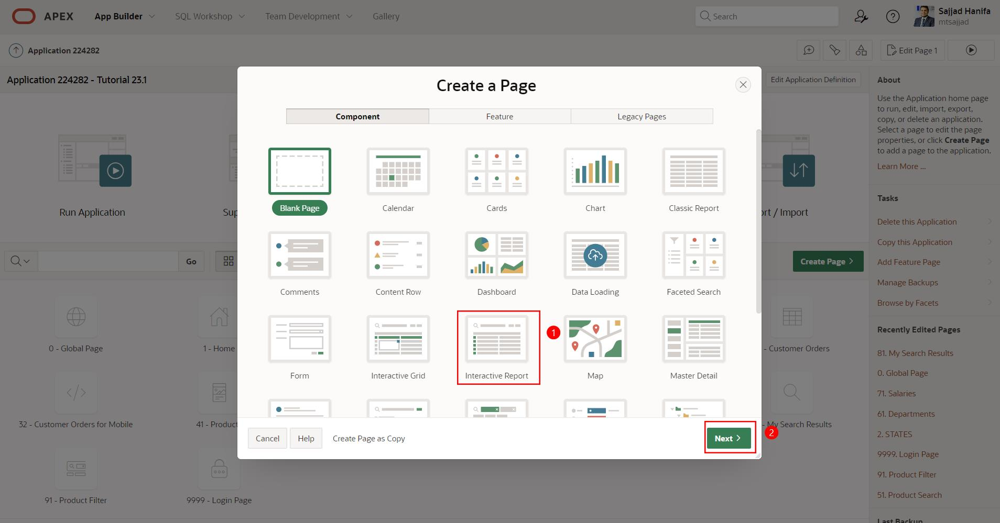
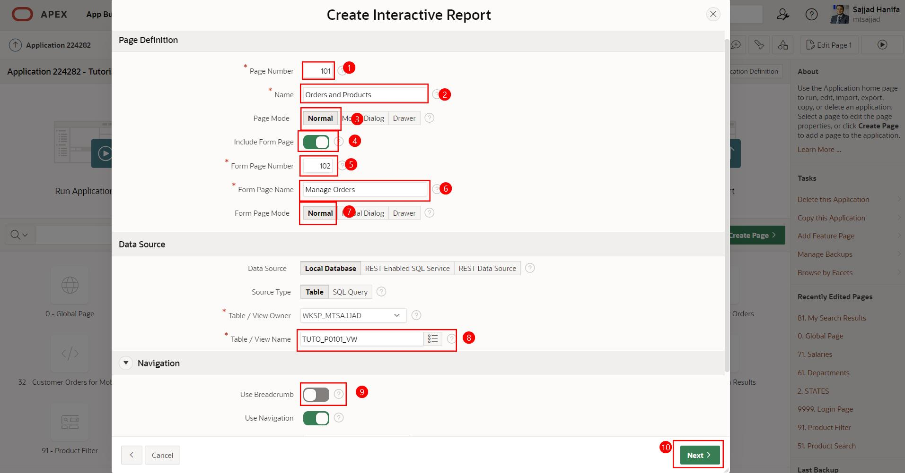
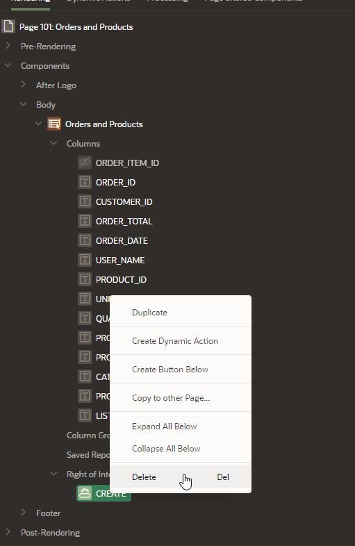
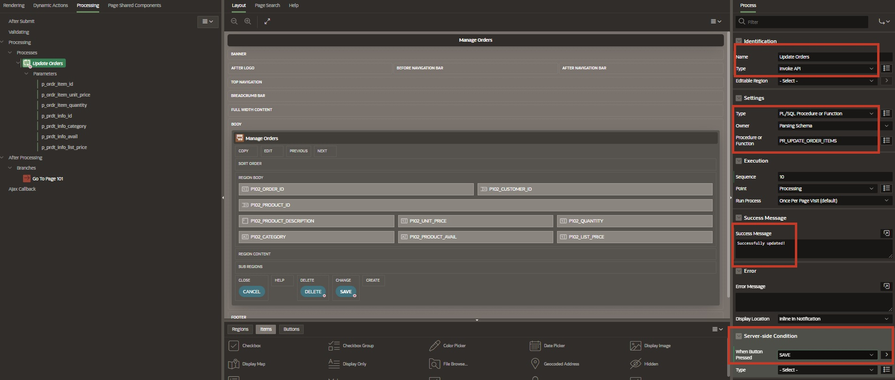
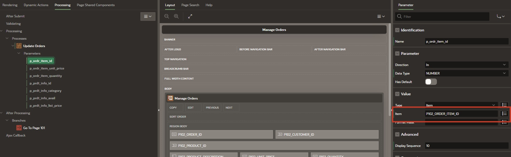
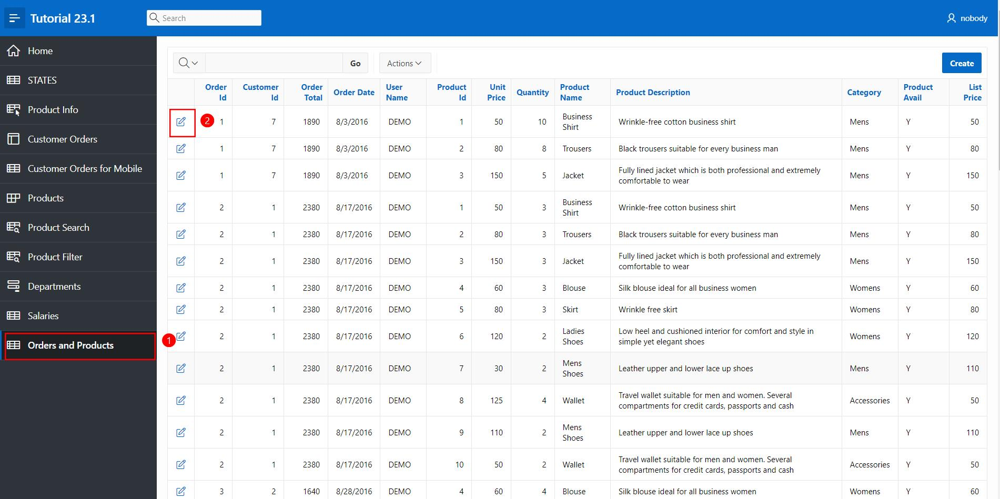

# 18. Invoke API Process Type

The *Process Type* **Invoke API** allows for completely declarative execution of procedures and functions without needing to write PL/SQL code. Procedures and functions can be standalone or part of a package. The **Page Designer** automatically predefines the parameters and assigns them to the corresponding page items or columns of interactive grids, if available.

An example of an API invocation process can be seen on the **Login Page** in the application, where the process **Set Username Cookie** and the **Login** process use the API invocation process.

- Open the **App Builder**, select your application (see Chapter 2) and the **Login Page**

- Click on the **Processing** tab to view the processes with the type **Invoke API**.


In this chapter, a procedure will be created to utilize the functionalities mentioned above.

## 18.1. Creation of Required Objects

For this chapter, a **Procedure** and a **View** must first be created.

### 18.1.1. Creating the View

- A **View** is required to complete this task.

- Name your **View** ***TUTO_P0101_VW***
  ```sql
  select o.ordr_id as order_id,
         o.ordr_ctmr_id as customer_id,
         o.ordr_total as order_total,
         o.ordr_dd as order_date,
         o.ordr_user_name as user_name,
         oi.ordr_item_id as order_item_id,
         oi.ordr_item_prdt_info_id as product_id,
         oi.ordr_item_unit_price as unit_price,
         oi.ordr_item_quantity as quantity,
         p.prdt_info_name as product_name,
         p.prdt_info_descr as product_description,
         p.prdt_info_category as category,
         p.prdt_info_avail as product_avail,
         p.prdt_info_list_price as list_price
    from order_items oi
    join product_info p
      on oi.ordr_item_prdt_info_id = p.prdt_info_id
    join orders o
      on oi.ordr_item_ordr_id = o.ordr_id
  ```

### 18.1.2. Creating the Procedure

- Similar to creating a **View**, start the assistant for creating a **Procedure**. Open the dropdown menu via the **+** and click on the entry **Procedure**.

> For more information on procedures, refer to the following link:  
[Oracle Documentation CREATE PROCEDURE Statement](https://docs.oracle.com/en/database/oracle/oracle-database/21/lnpls/CREATE-PROCEDURE-statement.html#GUID-5F84DB47-B5BE-4292-848F-756BF365EC54)



A wizard for creating the procedure will open.  
You must now enter the appropriate name **PR_UPDATE_ORDER_ITEMS** as well as the **Return Data Type** as **VARCHAR2** for the procedure. To achieve consistent naming across different applications, naming conventions are recommended.

In this case, the naming of the view consists of the following:  
**PR_<FUNCTIONAL_NAME>**


- Click the **Next** button.

- Enter the following parameters:

  | | | |
  |--|--|--|
  | **Argument Name** | **In/Out** |  **Argument Type** | 
  | *p_ordr_item_id* | *IN* | *NUMBER*| 
  | *p_ordr_item_unit_price* | *IN* | *NUMBER*| 
  | *p_ordr_item_quantity* | *IN* | *NUMBER*| 
  | *p_prdt_info_id* | *IN* | *NUMBER*| 
  | *p_prdt_info_category* | *IN* | *VARCHAR2*| 
  | *p_prdt_info_avail* | *IN* | *VARCHAR2*| 
  | *p_prdt_info_list_price* | *IN* | *NUMBER*| 
  | | |


- Insert the corresponding code.
    ```sql
    begin

      update order_items
        set ordr_item_unit_price   = p_ordr_item_unit_price
          , ordr_item_quantity     = p_ordr_item_quantity
      where ordr_item_id           = p_ordr_item_id;

      update product_info
        set prdt_info_category    = p_prdt_info_category
          , prdt_info_avail       = p_prdt_info_avail
          , prdt_info_list_price  = p_prdt_info_list_price
      where prdt_info_id          = p_prdt_info_id;

    end;
    ```


- Click the **Next** button and then on **Create Procedure**.

- Create another procedure **PR_DELETE_ORDER_ITEMS** with **Return Data Type** as **VARCHAR2**.

- Enter the following parameters:

  | | | |
  |--|--|--|
  | **Argument Name** | **In/Out** |  **Argument Type** | 
  | *p_ordr_item_id* | *IN* | *NUMBER*| 
  | | |

- Enter the corresponding code.
  ```sql
  begin
    delete 
      from order_items
      where ordr_item_id = p_ordr_item_id;
  end;
  ```

- Click the **Next** button and then on **Create Procedure**.

## 18.2. Using Invoke API Process

- To use an Invoke API Process, create an editable page.

- In the **App Builder**, click on **Create Page**.
- Select the page type **Component**.
- Select the region type **Interactive Report**.



- Enter **Page Number**: *101* and **Page Name**: *Orders and Products*. 
- Enable **Include Form Page**.
- Enter **Form Page Number**: *102* and **Form Page Name**: *Manage Orders* and **Form Page Mode**: *Normal*.

- Select the **Data Source** as the view **TUTO_P0101_VW**.

- Under **Navigation**, disable **Use Breadcrumb** and then click **Next**.



- Select **ORDER_ITEM_ID** as the primary key and then click **Create Page**.


- Once the page is created, delete the **Create** button.



- Click on **Save** and then navigate to **Page 102**

- Also, remove the **Create** button on **Page 102**

- Set the type of the following items to **Hidden**:


- Set the **Read Only** type of the following items to **Always**:


- Remove the default process and create two new processes under **Processes**:


- A process with the following settings:



- The Page Designer automatically predefines the parameters. Assign each parameter to the corresponding item/value.

  | | |  
  |--|--|
  | **p_ordr_item_id** | *P102_ORDER_ITEM_ID*| 
  | **p_ordr_item_unit_price** | *P102_UNIT_PRICE*| 
  | **p_ordr_item_quantity** | *P102_QUANTITY*| 
  | **p_prdt_info_id** | *P102_PRODUCT_ID*| 
  | **p_prdt_info_category** | *P102_CATEGORY*| 
  | **p_prdt_info_avail** | *P102_PRODUCT_AVAIL*| 
  | **p_prdt_info_list_price** | *P102_LIST_PRICE*| 
  | | |



- Create a process with the following settings:


- Assign the parameter to the corresponding item/value.

  | | |  
  |--|--|
  | **p_ordr_item_id** | *P102_ORDER_ITEM_ID*| 
  | | |


- Click on **Save** and execute the application.

- Navigate to the page **Orders and Products**. 
- Select an **Order Item**.



- Edit the highlighted fields or delete the selected **Order Item** 

  


<br><br>
Congratulations!  
You have successfully completed the tutorial.  
If you want to learn more about APEX, feel free to check out our APEX Portal:  
[apex.mt-itsolutions.com/from-zero-to-hero](https://apex.mt-itsolutions.com/from-zero-to-hero)