# <a name="template-components"></a>19. Template Components

**Template Components** are a new type of plug-in in APEX. They allow you to define an HTML template (with or without additional CSS and JavaScript) and use placeholders. They are much simpler to use than a complete regions plug-in, where you do not need in-depth knowledge of the plug-in APIs.

On each page, you can then create an area of this plug-in type, place a query, and then get an instance of this template filled with the data for each returned row. You can also render a single instance in a region or even use them in columns of interactive reports.

## <a name="erstellung-eines-template-components-apex-plugin"></a>19.1 Creation of a "Template Components" (APEX Plugin) 

1. Open the **Shared Components**, click on **Plug-ins**, and then on **create**

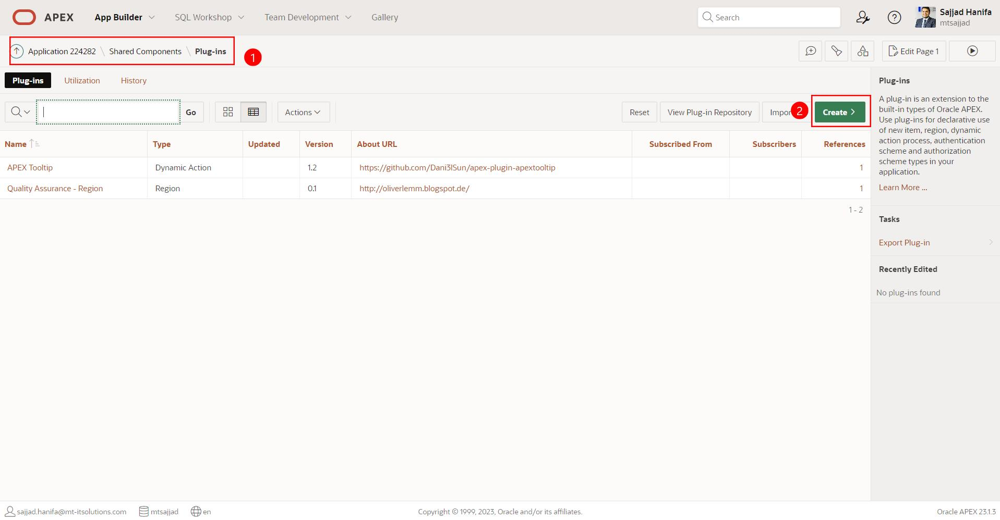

2. Click on **Next**

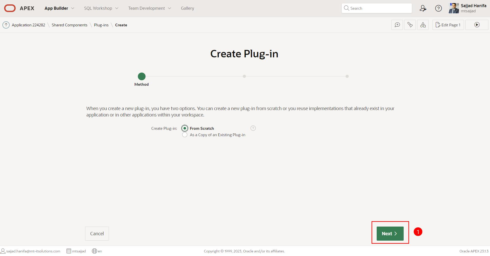

3. Enter the values as follows:

| | | |
|--|--|--|
| **Field Name** | **Value** |
| Name | Progress Bars | 
| Internal Name | PROGRESS_BARS | 
| Type | Template Components | 
| Available as Single | Checkbox: YES | 
| Available as Multiple | Checkbox: YES | 
| | |

Finally, press the **Create Plug-in** Button
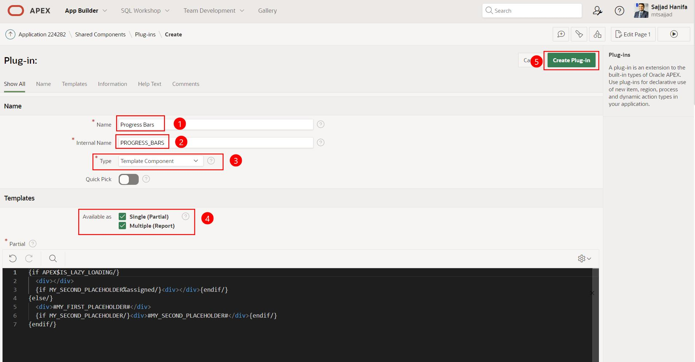

4. In the next step, insert the following code in **Partial**, **Report Body**, and **Report Row** at the appropriate positions according to the screenshot. Finally, press the **Create Plug-in** Button.

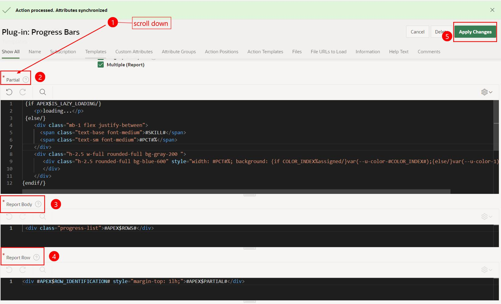

Insert the HTML code in **Partial**
   ```html
    {if APEX$IS_LAZY_LOADING/}
       <p>loading...</p>
    {else/}
       <div class="mb-1 flex justify-between">
         <span class="text-base font-medium">#SKILL#</span>
         <span class="text-sm font-medium">#PCT#%</span>
       </div>
   
       <div class="h-2.5 w-full rounded-full bg-gray-200 ">
          <div class="h-2.5 rounded-full bg-blue-600" style="width: #PCT#%; background: {if COLOR_INDEX%assigned/}var(--u-color-#COLOR_INDEX#);{else/}var(--u-color-1);{endif/}">
          </div>
       </div>
   {endif/}
  ```

Insert the HTML code in **Report Body**

   ```html
    <div class="progress-list">#APEX$ROWS#</div>
  ```
Insert the HTML code in **Report Row**

   ```html
    <div #APEX$ROW_IDENTIFICATION# style="margin-top: 1lh;">#APEX$PARTIAL#</div>
  ```

5. You have successfully created the **Progress Bars** Plugin. Click on the plugin name **Progress Bars** to continue editing.

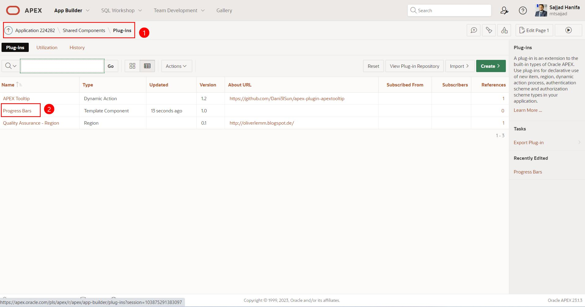

6. In the next step, scroll down to **Custom Attributes**, delete all existing attributes, and click on **Synchronize from Templates**. 

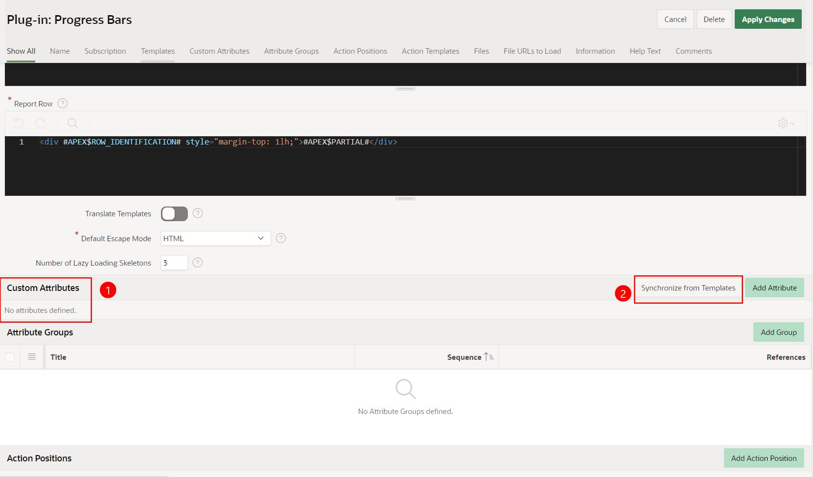

7. Now, only 3 attributes should be visible. Click on the first attribute **Color Index**

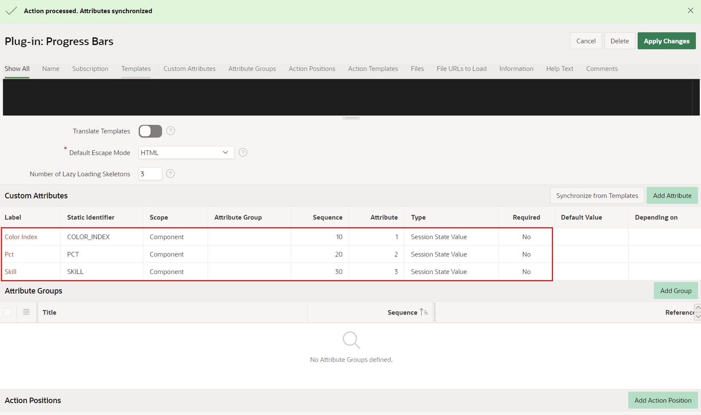

8. Enter the values for the 3 attributes as follows and press **Apply Changes**.

| | | |
|--|--|--|
| **Color Index** | **Value** |
| Static ID | COLOR_INDEX | 
| Required | YES | 
| Data Types | Number |  
| | |

| | | |
|--|--|--|
| **Pct** | **Value** |
| Static ID | PCT | 
| Required | YES | 
| Data Types | Number |  
| | |

| | | |
|--|--|--|
| **Skill** | **Value** |
| Static ID | SKILL | 
| Required | YES | 
| Data Types | Varchar2 |  
| | |

9. In the next step, a **CSS file** is created.

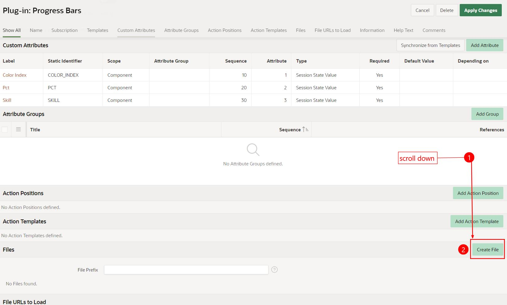


10. The **CSS file** is created with the following name.

| | | |
|--|--|--|
| **Input-Field** | **Value** |
| File Name | styles.css |   
| | |

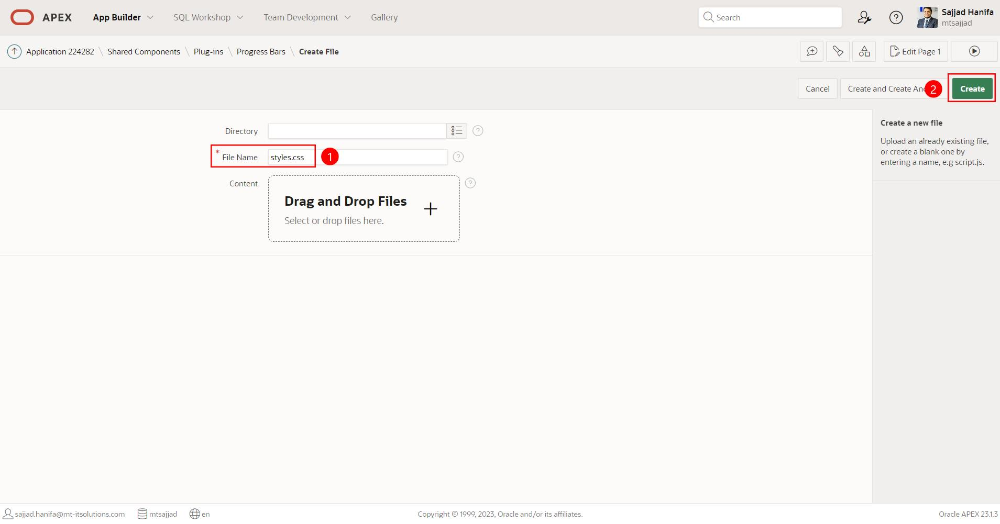


11. Copy the **CSS Code** below and paste it into APEX. Note the **Reference** link at the end; we will need it shortly.

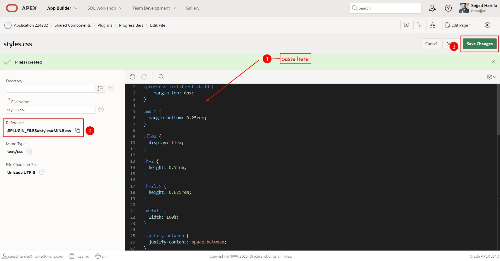

   ```css
.progress-list:first-child {
    margin-top: 0px;
}

.mb-1 {
  margin-bottom: 0.25rem;
}

.flex {
  display: flex;
}

.h-2 {
  height: 0.5rem;
}

.h-2\.5 {
  height: 0.625rem;
}

.w-full {
  width: 100%;
}

.justify-between {
  justify-content: space-between;
}

.rounded-full {
  border-radius: 9999px;
}

.bg-blue-600 {
  --tw-bg-opacity: 1;
  background-color: rgb(37 99 235 / var(--tw-bg-opacity));
}

.bg-gray-200 {
  --tw-bg-opacity: 1;
  background-color: rgb(229 231 235 / var(--tw-bg-opacity));
}

.text-base {
  font-size: 1rem;
  line-height: 1.5rem;
}

.text-sm {
  font-size: 0.875rem;
  line-height: 1.25rem;
}

.font-medium {
  font-weight: 500;
}

.text-blue-700 {
  --tw-text-opacity: 1;
  color: rgb(29 78 216 / var(--tw-text-opacity));
}

  ```

12. Insert the copied **Reference** link as shown in the screenshot at the appropriate position and save.

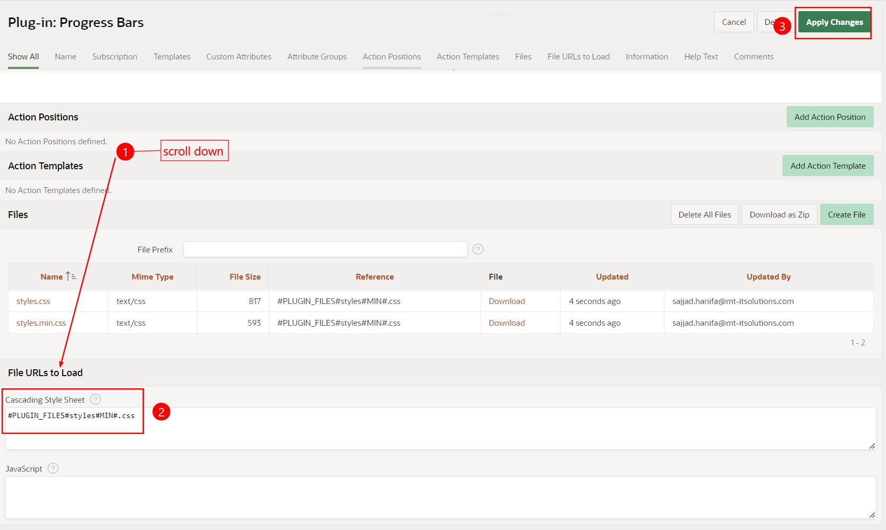

Until this step, the **Plug-in** has been successfully created.

13. In the next step, a new APEX page is created with the plugin.

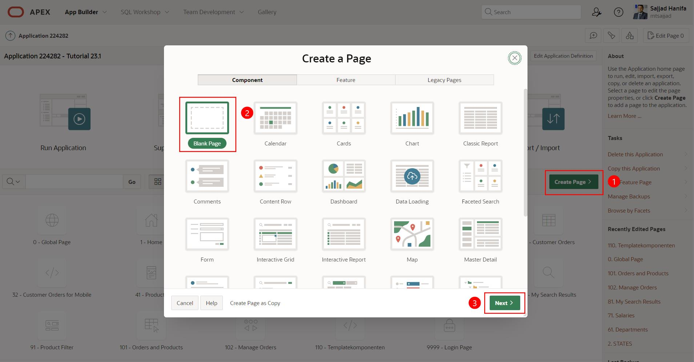

14. Create the new page as follows and click on **create Page**:

| | | |
|--|--|--|
| **Field** | **Value** |
| Page Number | 120 | 
| Name | Progress Bars | 
| Use Breadcrumb | Disable |  
| Icon | fa-bar-chart-horizontal |  
| | |

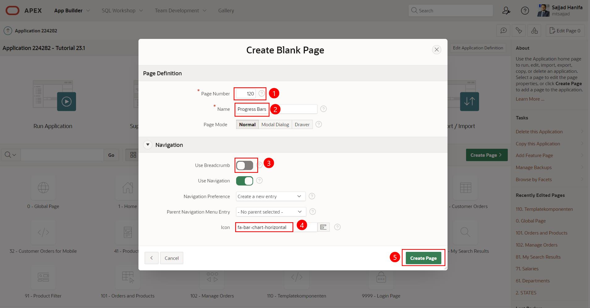

15. Create a new region on the page with the title: **Progress Bars**. Then select the previously created plug-in: **Progress Bars** as the type.

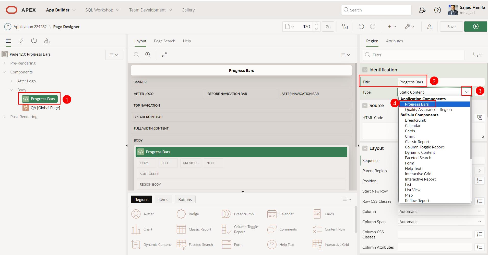

16. Then select **SQL Query** as the type and insert the SQL code below in the **SQL-Query**. Then switch to the **Attributes** tab.

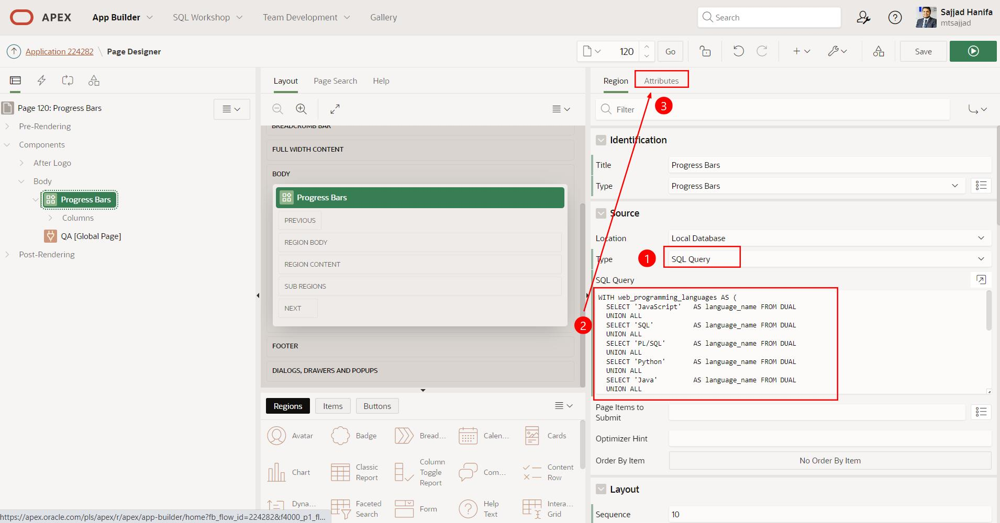

   ```sql
WITH web_programming_languages AS (
  SELECT 'JavaScript'   AS language_name FROM DUAL
  UNION ALL
  SELECT 'SQL'          AS language_name FROM DUAL
  UNION ALL
  SELECT 'PL/SQL'       AS language_name FROM DUAL
  UNION ALL
  SELECT 'Python'       AS language_name FROM DUAL
  UNION ALL
  SELECT 'Java'         AS language_name FROM DUAL
  UNION ALL
  SELECT 'C#'           AS language_name FROM DUAL
  UNION ALL
  SELECT 'PHP'          AS language_name FROM DUAL
  UNION ALL
  SELECT 'Ruby'         AS language_name FROM DUAL
  UNION ALL
  SELECT 'TypeScript'   AS language_name FROM DUAL
  UNION ALL
  SELECT 'Swift'        AS language_name FROM DUAL 
)
SELECT language_name                        as SKILLS
     , FLOOR(DBMS_RANDOM.VALUE(0, 100))     as PCT
     , FLOOR(DBMS_RANDOM.VALUE(0, 45))      as COLOR_INDEX
  FROM web_programming_languages
;
  ```

17. In the **Attributes** tab, adjust the values as follows:

| | | |
|--|--|--|
| **Field** | **Value** |
| Display | Multiple (Report) | 
| Color Index | COLOR_INDEX | 
| Pct | PCT |  
| Skill | SKILLS |  
| | |

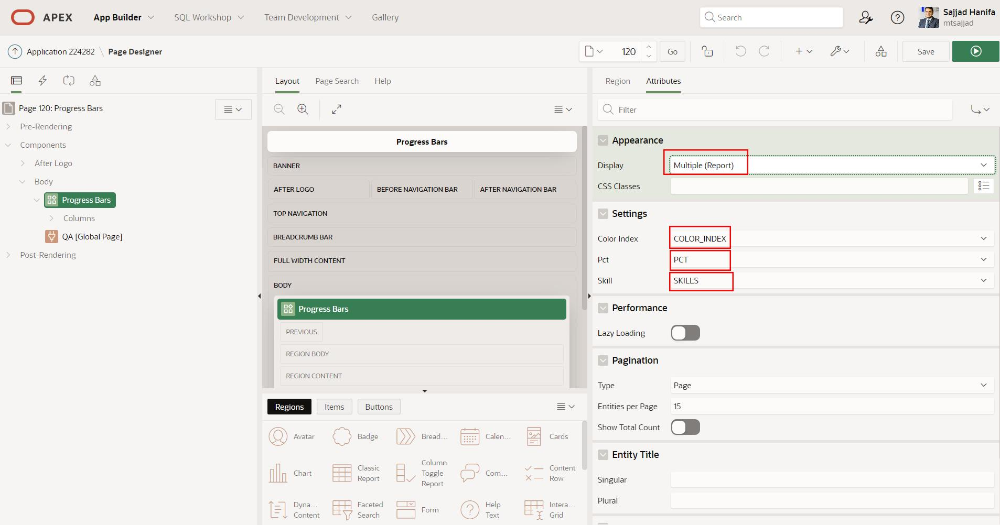

18. Finally, only a button is created here, and the APEX page is saved.

Create a button with the following settings:

| | | |
|--|--|--|
| **Field** | **Value** |
| Button Name | P120_REFRESH_PAGE | 
| Label | Refresh Page | 
|   |  
| Region | Progress Bars |  
| Position | Next |  
|   |  
| Button Template | Text with Icon |  
| icon | fa-refresh |  
|   |  
| Action | Submit Page |  
| | |

Click on **Template Options**

| | | |
|--|--|--|
| **Field** | **Value** |
| Type | success | 
| Icon Hover Animation | Push | 
| Width | Stretch |   
| | |

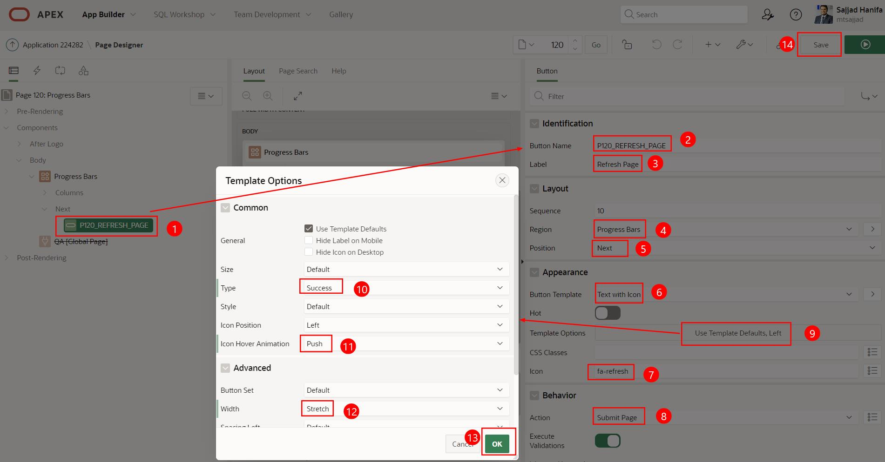

19. Finally, the page looks like this. Press the Refresh Button to reload **Random** values.

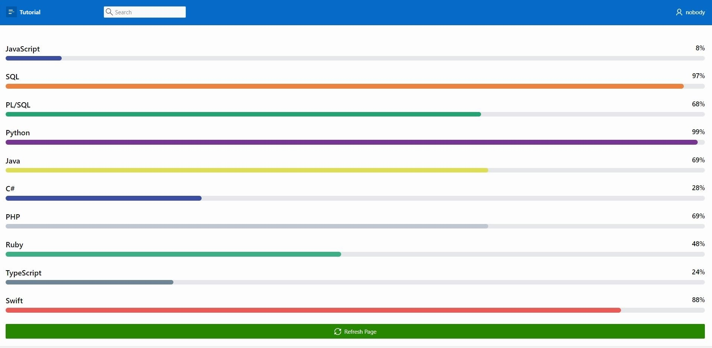