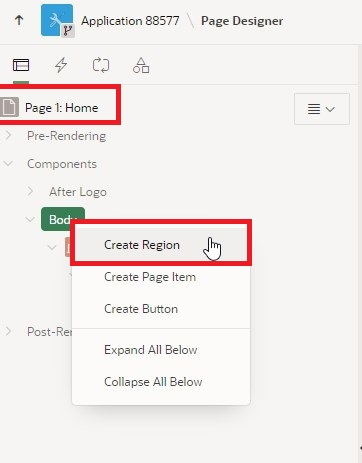

# <a name="working-copy"></a>20. Working Copy

With APEX 23.2, a new collaborative feature has been introduced in APEX - the Working Copy. The Working Copy allows you to create a working version of an app that can be further developed while leaving the main version of the app untouched. If you have experience with other version control systems, much of this chapter will be familiar to you.

## <a name="create-working-copy"></a>20.1 Create Working Copy

As a starting point for the task in this chapter, we assume that the homepage of our APP needs to be revised. Specifically, it involves adding another chart to show the sum of orders broken down by states. However, the development should take place in a completely independent **branch**. Therefore, a working copy is created in which the feature can be developed (in a team).   

- First, create a Working Copy using the **Create Working Copy** command in the App Builder.


- Name the working copy **Apex Tutorial - Working Copy** and add a description.  


- The Working Copy is created. Note that you will see some new options and information in the App Builder.
 After deployment, you will automatically switch to the working copy. The marking in the App Builder shows that you are in the working copy. 


## <a name="complete-task"></a>20.2 Complete Task

- The next step is to carry out the actual task. For this, we need another **View**.

- Name your **View** ***TUTO_P0001_CHART_2_VW***:  
  Query:  
  ```sql
  select sum(ordr_total) as total,
         stts_state_name
    from orders
    join customers
      on ordr_ctmr_id = ctmr_id
    join states 
      on stts_st = ctmr_state
    group by stts_state_name
    order by stts_state_name;
  ```
- Create a new **Region** on page 1 of the application. 



- Use the following settings in the new region:

  | | |  
  |--|--|
  | **Title** | *Order Totals per State* | 
  | **Type** | *Chart*|
  | **Source** | *Local Database*|
  | **Table Name** | *TUTO_P0001_CHART_2_VW*|  
  | | |


- Under **Attributes** and **Type**, select **Pie**.


- Now select the **Series**. Here you can use the name **Totals**. Again, use the same **Source**.


- In **Column Mapping**, choose **STTS_STATE_NAME** for the label column and **TOTAL** for the value column.


- When you save and run the page, you will see the newly added pie chart.

## <a name="comparison-between-branch-and-main"></a>20.3 Comparison between Branch and Main


- Return to the overview page in the App Builder. In the **Tutorial 24.1 Working Copy** menu, you can use the **Compare Changes** option to perform a comparison between the main version and the working version.


- Select this option and wait briefly for the comparison to be created.


- You will see a list of differences between the working copy and the main version. Under the **Diff** section, you can further break down where the differences between the versions lie.


- The changes marked in green have been added compared to the original version. Based on the code, it is recognizable that this is the region just created on the page.


- Also note that the created view did not cause a difference between the versions; it is available to both apps. Only changes in the app are considered.

## <a name="change-in-main"></a>20.4 Change in Main

- Close the display and switch from the Working Copy to the **main version of the app**.


- We continue to work in **Main** and now take a brief look at what happens if you - or someone else - make changes to the same page in the main version of the app while the working copy is being worked on.

- First, create a **copy of the view TUTO_P0001_VW** and name it **TUTO_P0001_CHART_1_VW**. The code of the view remains unchanged.

- Now go to page 1 of the app and change the source of the region-series **Orders** to the view **TUTO_P0001_CHART_1_VW** you just created.


- Save the page and then switch back to the working copy.


- Let's assume that the work on the copy has been successfully completed and the version can be merged with the main version of the app. To do this, perform a **Merge into Main** of the working copy and the main version next.


- You will arrive at the familiar version comparison. Open **Diff** to access the version comparison.


- In the comparison, you can see that not only the changes in the Working Copy are listed, but also the new source of the Series **Order** in the left part of the comparison.


- Return to the merge screen and click on **Next**. Make sure that the changes you want to adopt are selected. In this case, we include all changes in the merge.


- In the next dialog, you can ensure that your changes can be rolled back through the merge with a **Backup target App first**. Then click on **Confirm Merge**.


- You should receive a success message when the merge is performed.


- Switch to page 1 in the main version of the app. In the Series **Orders**, you can see under **Table Name** that the change in the main version has been overwritten again by the contents of the Working Copy through the merge.


- To prevent this, changes from the main version can first be brought up to date in a working copy. This is accomplished in the working copy menu by a **Refresh Working Copy**.

- First, repeat the work step on page 1 of the app and change the source of the region-series **Orders** in **Main** back to the view **TUTO_P0001_CHART_1_VW**. Switch to the Working Copy and initiate an update.


- You will arrive at the refresh dialog and can again view the differences between the versions here.


- This time, the main version is on the right side of the split view, and the change of source is displayed in green.


- Close the view and click on **Confirm Refresh**.


- After the working copy has been brought up to the working version status, you can see on page 1 of the application in the working copy that the source of the series **Orders** is now the corresponding view.


- After all work on the Working Copy is completed and the versions have been successfully merged, a working copy can usually be deleted. To do this, select the **Delete Working Copy** option in the working copy menu.


- In the following dialog, confirm the deletion of the working copy.


- You have successfully completed the chapter on versioning in APEX 24.1 - the **Working Copy**.