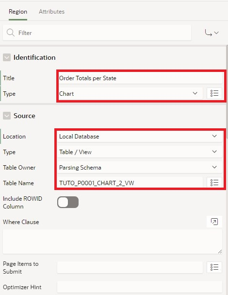
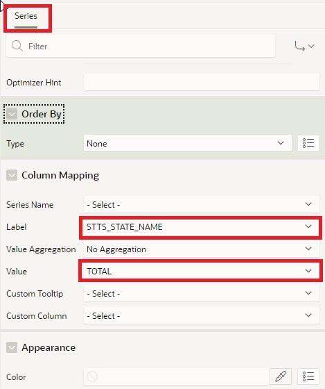
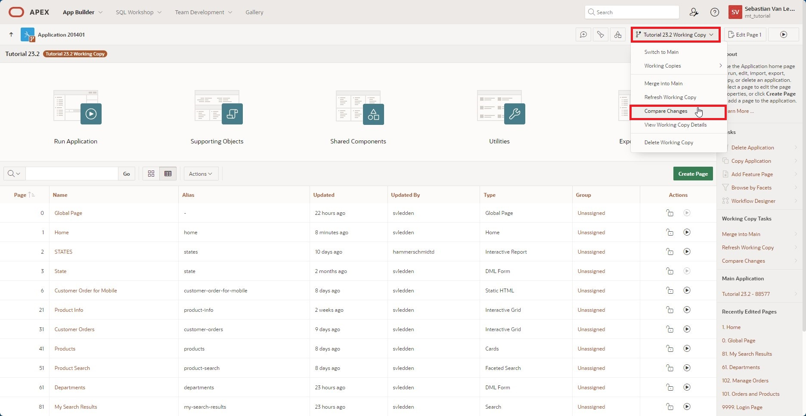

# <a name="working-copy"></a>20. Working Copy

With APEX 23.2, a new collaborative feature has been introduced to APEX - the Working Copy. With the Working Copy, a working copy of an app can be created, allowing further development while leaving the main version of the app untouched. If you have already worked with other version control systems, much in this chapter will be familiar to you.

## <a name="arbeitskopie-erstellen"></a>20.1 Create Working Copy

As the starting point for the task in this chapter, we assume that the homepage of our APP is to be revised. Specifically, it involves another chart for the total of orders broken down by states. However, development should take place in a completely separate **Branch**. Therefore, a working copy is created in which the feature can be developed (as a team).

- First, create a Working Copy using the **Create Working Copy** command in the App Builder.


- Name the working copy **Apex Tutorial - Working Copy** and add a description.


- The Working Copy is created. Note that you will be presented with some new options and information in the App Builder. After deployment, you will automatically switch to the working copy. The marking in the App Builder shows you that you are in the working copy.


## <a name="arbeitsaufgabe-erledigen"></a>20.2 Complete Work Task

- The next step is to complete the actual work task. You need another **View**.

- Name your **View** ***TUTO_P0001_CHART_2_VW***:  
  Query:  
  ```sql
  select sum(ordr_total) as total,
         stts_state_name
    from orders
    join customers
      on ordr_ctmr_id = ctmr_id
    join states 
      on stts_st = ctmr_state
    group by stts_state_name
    order by stts_state_name;
  ```
- Create a new **Region** on page 1 of the application.


- Use the following settings in the new region:

  | | |  
  |--|--|
  | **Title** | *Order Totals per State* | 
  | **Type** | *Chart*|
  | **Source** | *Local Database*|
  | **Table Name** | *TUTO_P0001_CHART_2_VW*|  
  | | |



- Under **Attributes** and **Type**, select **Pie**.


- Now select the **Series**. Here you can use the name **Totals**. Use the same **Source** here as well.


- In the **Column Mapping**, choose the column **STTS_STATE_NAME** for the label and **TOTAL** for the value column.



- If you now save and execute the page, you will see the newly added pie chart.

## <a name="vergleich-zwischen-branch-und-main"></a>20.3 Comparison Between Branch and Main


- Go back to the overview page in the App Builder. In the **Tutorial 24.1 Working Copy** menu, you can perform a comparison between the main version and the working version under the **Compare Changes** item.



- Select this item and wait a moment for the comparison to be created.


- You will see a list of differences between the working copy and the main version. Under the **Diff** item, you can break down the differences between the versions in more detail.


- The changes marked in green are those added compared to the base version. Based on the code, it's noticeable that this is the newly created region on the page.


- Note also that the created view did not trigger a difference between versions; it is available to both apps. Only changes in the app are considered.

## <a name="aenderung-in-main"></a>20.4 Changes in Main

- Close the view and switch from the Working Copy to the **main version of the app**.


- We continue working in **Main** and now briefly look at what happens if you - or someone else - makes changes on the same page in the main version of the app while the working copy is being edited.

- First, create a **copy of the view TUTO_P0001_VW**, naming it **TUTO_P0001_CHART_1_VW**. The code of the view remains unchanged otherwise.

- Go to page 1 of the app and change the source of the region series **Orders** to the just-created view **TUTO_P0001_CHART_1_VW**.


- Save the page and then switch back to the working copy.


- Let's assume the work on the copy is successfully completed and the version can be merged with the main version of the app. Next, perform a **Merge into Main** of the working copy and the main version.


- You will reach the familiar version comparison. Open **Diff** to view the version comparison.


- In the comparison, you see not only the changes in the Working Copy but also the new source of the series **Order** on the left side of the comparison.


- Return to the Merge screen and click **Next**. Ensure that the changes you want to adopt are selected. In this case, we take all changes in the merge.


- In the next dialog, ensure your changes can be undone by the merge with a **Backup target App first**. Then click **Confirm Merge**.


- You should receive a success message once the merge has been conducted.


- Switch to the main version of the app on page 1. In the series **Orders**, you will now see under **Table Name** that the change in the main version was overwritten by the contents of the Working Copy due to the merge.


- To prevent this, changes from the main version of a working copy can first be updated to the latest version. This is done through the working copy menu with a **Refresh Working Copy**.

- First, repeat the work step on page 1 of the app, and change the source of the region series **Orders** in **Main** back to the view **TUTO_P0001_CHART_1_VW**. Switch to the Working Copy and trigger an update.


- You will reach the refresh dialog and can look at the differences between the versions again.


- This time the main version is on the right side of the split view, with the source change highlighted in green.


- Close the view and click **Confirm Refresh**.


- After the working copy has been updated to the state of the work version, you see on page 1 of the application in the working copy that the source of the series **Orders** is now the corresponding view.


- Once all work on the Working Copy is completed and the versions have been successfully merged, a working copy can generally be deleted. Select the **Delete Working Copy** item from the working copy menu.


- In the following dialog, confirm the deletion of the working copy.


- You have successfully completed the chapter on the versioning capability in APEX 24.1 - the **Working Copy**.