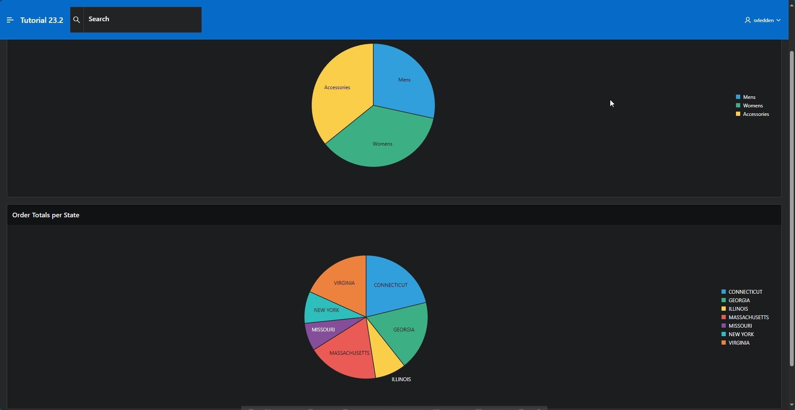

# <a name="working-copy"></a>20. Working Copy

With APEX 23.2, a new collaborative feature called Working Copy has been introduced into APEX. The Working Copy allows you to create a working copy of an app that can be further developed while leaving the main version of the app unaffected. If you've worked with other version control systems before, much of this chapter will feel familiar to you.

## <a name="create-working-copy"></a>20.1 Create Working Copy

As a starting point for the task in this chapter, we assume that the homepage of our APP needs to be revised. Specifically, it’s about adding another chart to display the sum of orders broken down by state. However, the development should take place in a completely separate **branch**. Therefore, a working copy is created where the feature can be developed (in a team).

- First, create a Working Copy using the **Create Working Copy** command in the App Builder.


- Name the working copy **Working Copy Tutorial 23.2** and add a description.


- The Working Copy is created. Note that some new options and information appear in the App Builder.
  After deployment, you automatically switch to the working copy. The marking in the App Builder indicates that you are in the working copy.


## <a name="complete-task"></a>20.2 Complete Task

- The next step involves the actual task. For this, we need another **View**.

- Name your **View** ***TUTO_P0001_CHART_2_VW***:  
  Query:  
  ```sql
  select sum(ordr_total) as total,
         stts_state_name
    from orders
    join customers
      on ordr_ctmr_id = ctmr_id
    join states 
      on stts_st = ctmr_state
    group by stts_state_name
    order by stts_state_name;
  ```
- Create a new **Region** on page 1 of the application.


- Use the following settings in the new region:

  | | |  
  |--|--|
  | **Title** | *Order Totals per State* | 
  | **Type** | *Chart*|
  | **Source** | *Local Database*|
  | **Table Name** | *TUTO_P0001_CHART_2_VW*|  
  | | |


- Under **Attributes** and **Type** select **Pie**.


- Now select the **Series**. Here you can use the name **Totals**. Again, use the same **Source**.


- In **Column Mapping** choose the column **STTS_STATE_NAME** as the label and **TOTAL** for the value column.


- When you save and run the page, you will see the newly added pie chart.

## <a name="comparison-branch-main"></a>20.3 Comparison between Branch and Main



- Return to the overview page in the App Builder. In the **Tutorial 23.2 Working Copy** menu, you can perform a comparison between the main version and the working version under **Compare Changes**.


- Select this option and wait briefly while the comparison is created.


- You see a list of differences between the working copy and the main version. Under **Diff**, you can break down the differences between the versions in more detail.


- The changes marked in green have been added compared to the original version. The code indicates that this is the region just created on the page.


- Note also that the created view does not trigger a difference between the versions; it is available to both apps. Only changes in the app are considered.

## <a name="changes-in-main"></a>20.4 Changes in Main

- Close the display and switch from the working copy to the **main version of the app**.


- We continue working in **Main** and now briefly look at what happens if you — or someone else — makes changes on the same page in the main version of the app while working on the working copy.

- First, create a **copy of the view TUTO_P0001_VW**, which you name **TUTO_P0001_CHART_1_VW**. The code of the view remains unchanged.

- Now go to page 1 of the app and change the source of the region-series **Orders** to the view **TUTO_P0001_CHART_1_VW** you just created.


- Save the page and then switch back to the working copy.


- Let's assume that the work on the copy is now successfully completed and the version can be merged with the main version of the app. Next, perform a **Merge into Main** of the working copy and the main version.


- You will be taken to the known version comparison. Open **Diff** for the version comparison.


- In the comparison, you see not only the changes in the Working Copy but also the new source of the series **Order** on the left side of the comparison.


- Return to the merge screen and click **Next**. Ensure that the changes you want to adopt are selected. In this case, we are taking all changes into the merge.


- In the next dialog, you can ensure that your changes can be undone with a **Backup target App first** through the merge. Then click **Confirm Merge**.


- You should receive a success message when the merge has been conducted.


- In the main version of the app, switch to page 1. In the series **Orders**, you now see under **Table Name** that the change in the main version was overwritten by the contents of the Working Copy through the merge.


- To prevent this, changes from the main version can first be brought up to date in a working copy before a merge. This is done via **Refresh Working Copy** in the working copy menu.

- First, repeat the step on page 1 of the app and change the source of the region-series **Orders** back to the view **TUTO_P0001_CHART_1_VW** in **Main**. Switch to the working copy and trigger an update.


- You reach the refresh dialog and can view the differences between the versions again here.


- This time, the main version is on the right side of the split view, the source change is displayed in green.


- Close the view and click **Confirm Refresh**.


- Once the working copy is brought up to date with the work version, you see on page 1 of the application in the working copy that the source of the series **Orders** is now the appropriate view.


- After all work on the Working Copy is complete and the versions have been successfully merged, a working copy can usually be deleted. To do this, select **Delete Working Copy** in the working copy menu.


- Confirm the deletion of the working copy in the following dialog.


- You have successfully completed the chapter on the new versioning option in APEX 23.2 — the **Working Copy**.