# <a name="apex-workflow"></a>21. APEX Workflow

From APEX 23.2, workflows are directly integrated into APEX. With **APEX Workflow**, business processes can be created and executed using a graphical editor. Users who want to map processes using **Business Process Model and Notation (BPMN 2.0)** will find a suitable extension with the closely related **Flows for APEX** extension from MT - IT Solutions. For more information, visit [https://flowsforapex.org/](https://flowsforapex.org/).

In the following chapter, we use workflows to create a demo version of a simplified restaurant table reservation. The demo is based on the blog post **Simplify Business Process Management Using APEX Workflow** by Ananya Chatterjee. [Link to Blog](https://blogs.oracle.com/apex/post/simplify-business-process-management-using-apex-workflow-create-doctor-appointment-application)

## <a name="starting-point-use-case-and-flow-chart"></a>21.1 Starting Point Use Case and Flow-Chart

As a starting point for the task in this chapter, we assume that a restaurant wants to implement a simple booking form on their website. In the form, guests can submit a reservation request for a table. In the next step, the system first checks whether a table is available for the desired number of people at the requested time. If not, an email is immediately sent to the guest with a cancellation of the appointment. If a table is available, the request is forwarded to a restaurant employee. The employee decides whether to accept the reservation. If it is declined, another cancellation is sent by email; if accepted, the reservation is saved and the guest is informed of the successful reservation by email.

- The following **Flow-Chart** visualizes this use case.

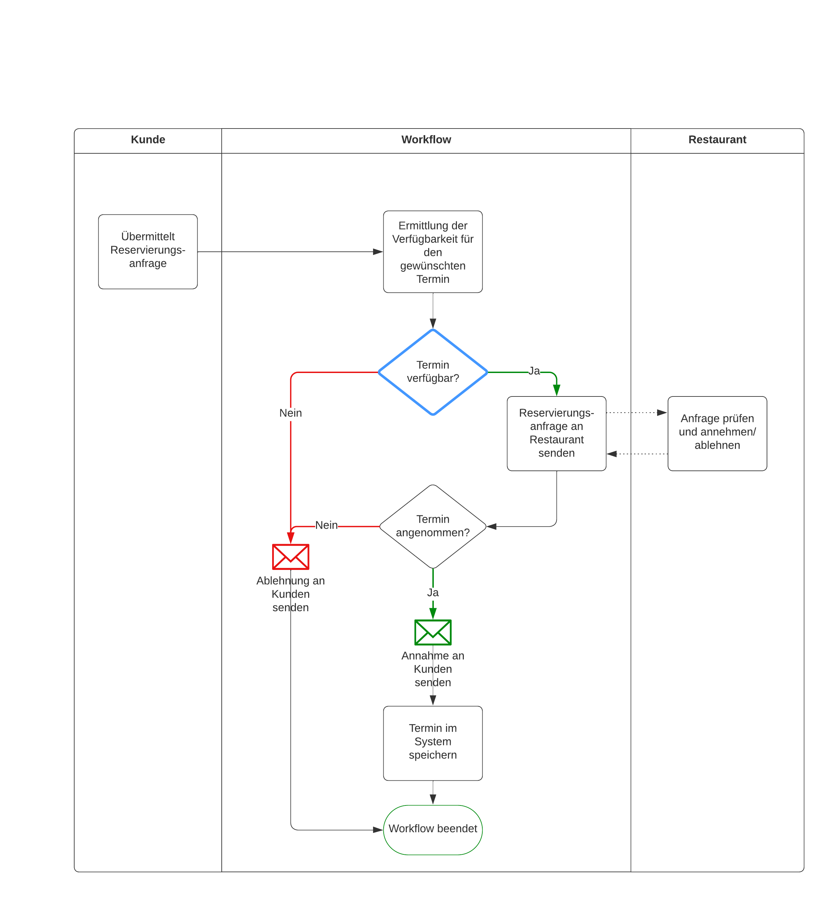

## <a name="workflow-setup-of-the-required-elements"></a>21.2 Setup of the Required Elements

- The necessary tables and packages were already installed through the **Script for the Tutorial** in Chapter 1.

- For the APP, you need a user named **KOCH** who will later be responsible for processing the reservation requests. Create a corresponding user.

- Click the **Administration** icon in the top right and select **Manage Users and Groups**.

- Click **Create User**.

- Enter the following:
  - Name: KOCH
  - Email Address: test@abc.com
  - Password: 12345678
  - Confirm Password: 12345678
  - Require Change of Password on First Use: No

- Then create a new APP via the **App Builder** and **Create**. Give the app the title **MT Tutorial - Dinner Reservation**.

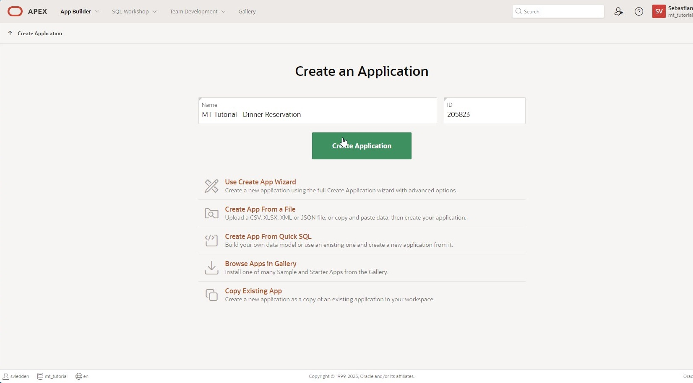

## <a name="creating-the-workflow"></a>21.3 Creating the Workflow

- The next step is to tackle the actual task. Here we first create a **Workflow**.

- Go back to the **Application Builder** of the new app and click on **Shared Components**.

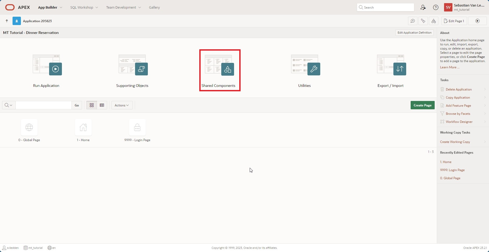

- In the Shared Components, select **Workflows** under **Workflows and Automations**.

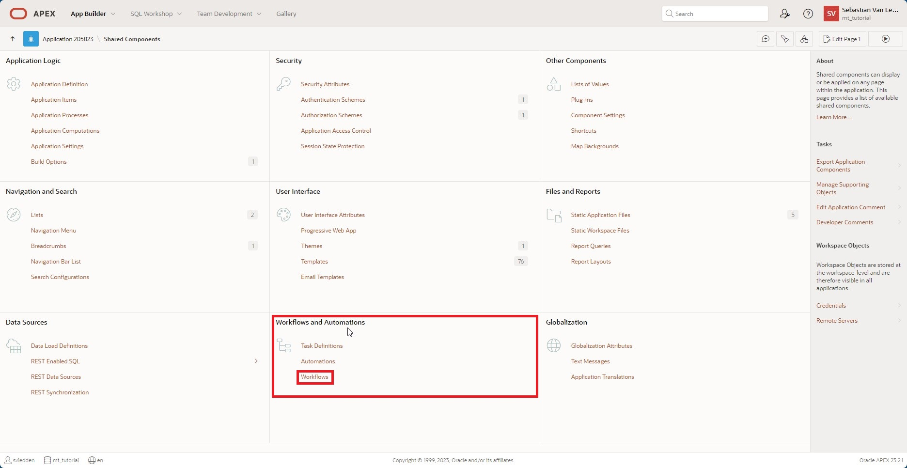

- Create a new workflow by clicking **Create**. You will then be directed to the **Workflow Editor**. A basic workflow is already visible in the center of the **Diagram Builder**.

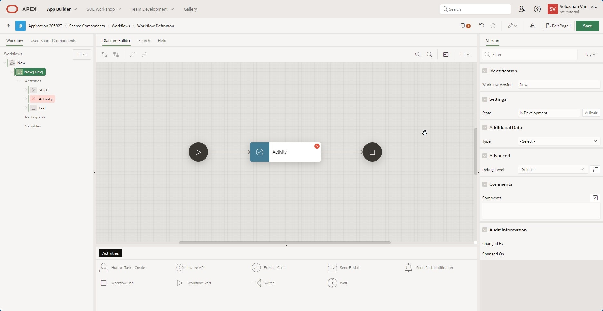

- Set the name of the workflow to **Dinner Reservation** and the **Static ID** to **DINNERRSVRT**. Set the title to: **Workflow for Guest &GUEST_NAME. &GUEST_LAST_NAME.**.

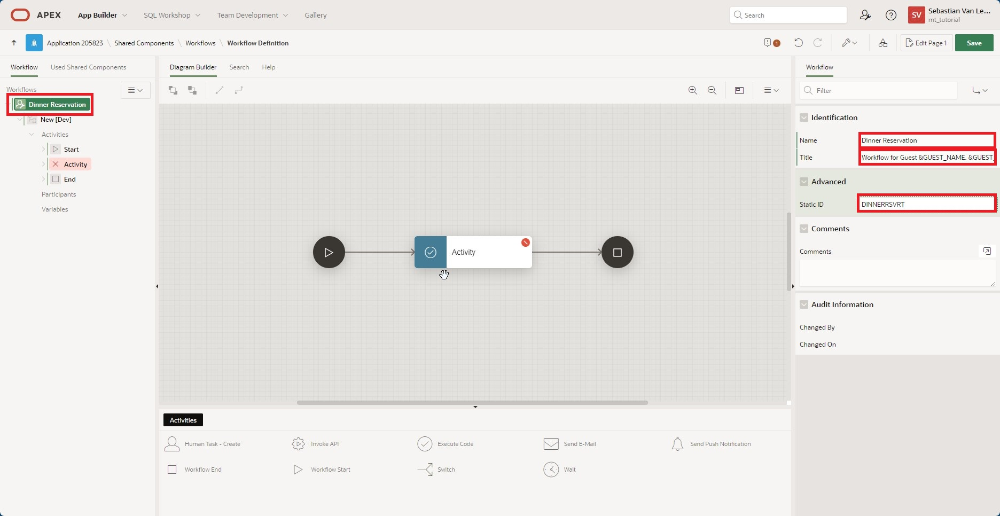

- Set the **Workflow Version** to **1.0**.

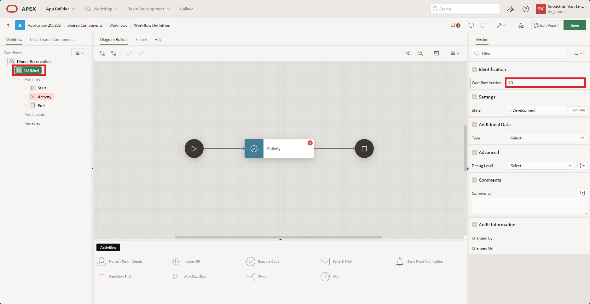

- Currently, there is an error because the automatically created activity has not been set yet. To be able to save, delete the activity. To do this, right-click on the **Activity** in the left column and select **Delete**. Alternatively, you can select the activity in the editor and click the three-dot symbol.

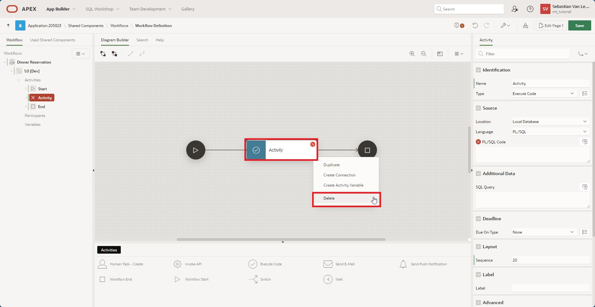

- Only the **Start of the activity**, the **Arrow**, and the **Endpoint** remain. Drag the **Arrowhead** in the editor to the **Endpoint** and then save.

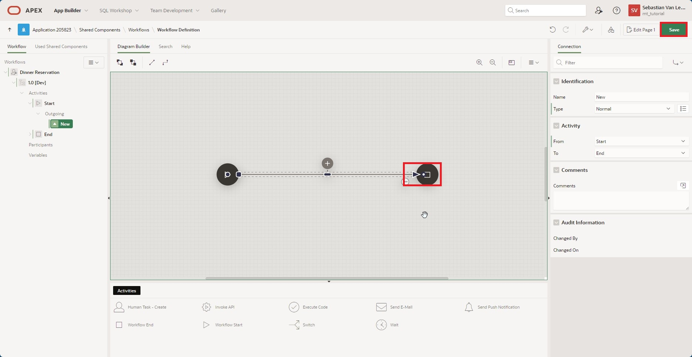

- In the next step, create a series of **Input Parameters** that will provide the workflow with data. Right-click on the workflow and select **Create Parameter**.

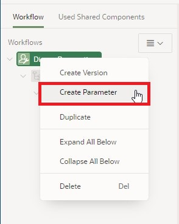

- Give the first parameter the **Static ID: GUEST_NAME**, the **Label: Guest Name**. It is of **Data Type: VARCHAR2**.

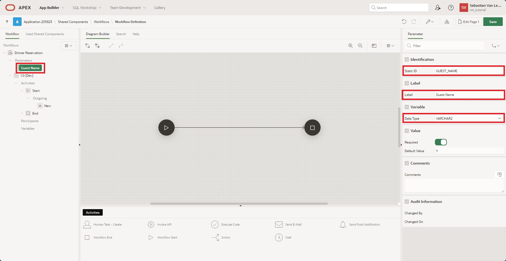

- Create the following additional parameters:

  | | |  
  |--|--|
  | **GUEST_LAST_NAME** | *VARCHAR2*|
  | **GUEST_EMAIL** | *VARCHAR2* | 
  | **GUEST_COUNT** | *NUMBER*|  
  | **REQUEST_START_DATE** | *TIMESTAMP*|
  | **REQUEST_END_DATE** | *TIMESTAMP*|
  | | |

- The parameters **REQUEST_START_DATE** and **REQUEST_END_DATE** use the format mask **DD.MM.YYYY HH24:MI** under **Session State Format Mask**.

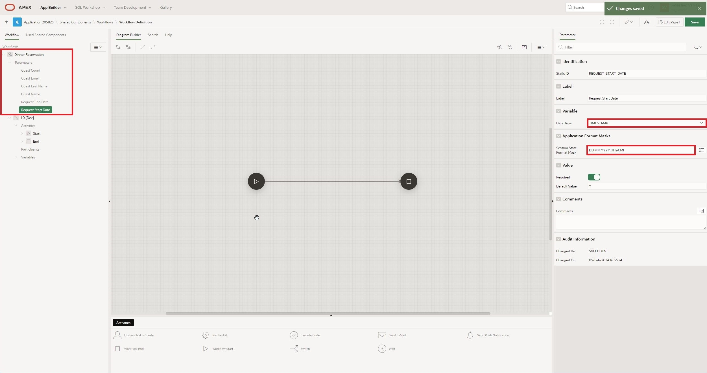

- Now, link the table **T_RESTAURANT_STAFF** under **Additional Data** in Workflow 1.0. This will later ensure that created tasks can be assigned to appropriate staff members. Additionally, the table's columns are available as bind variables for the workflow. Choose the **Primary Key Column** as **RST_ID**.

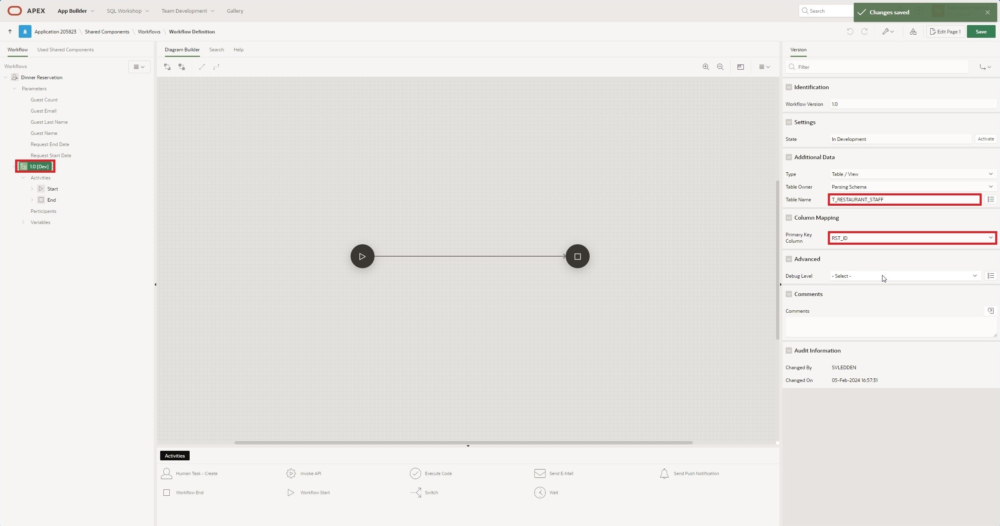

- Besides the input parameters, the workflow also requires variable variables that can be used in the process. Create **Workflow Variables** in the next step. Right-click again on the workflow 1.0 and select **Create Variable**.

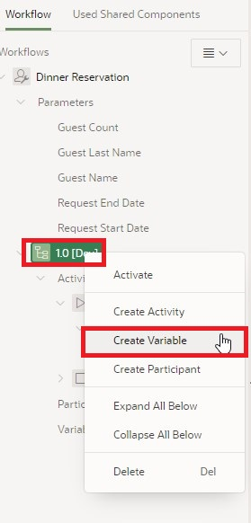

- Give the first variable the **Static ID: RESERVATION_ID** and the **Label: Reservation ID**. The **Data Type** is **NUMBER**. The variable will be assigned a value at a later date, so the **Value** is initially **Null**.

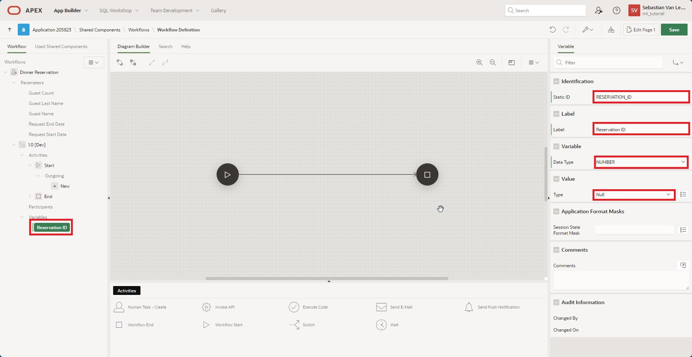

- Now create the variable **TABLE_ID** following the same pattern: **Static ID: TABLE_ID**, **Label: Table ID**, and **Data Type** is **NUMBER**. Again, set **Value** to **Null**.

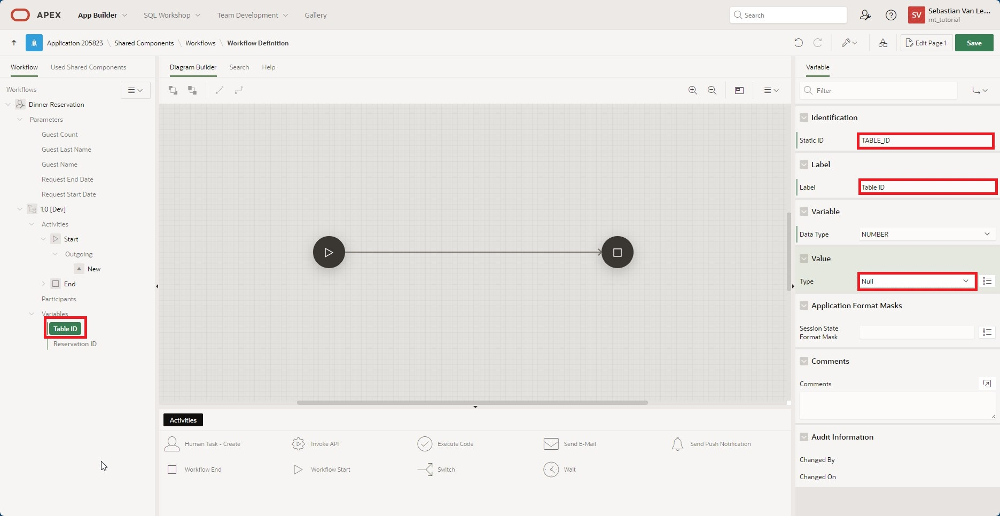

- As the next variable, create **AVAILABILITY**. It is of type **BOOLEAN**. Enter **AVAIL** under **True Value** and **UNAVAIL** under **False Value**. These are the two possible return values of a function that will later be integrated into the workflow. Then save the workflow using **Save**.

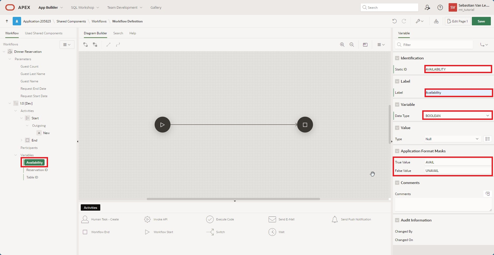

## <a name="creating-the-task-for-reservation-request"></a>21.4 Creating the Task for Reservation Request

- In the next step, create the task to confirm (or reject) the reservation request. Switch to **Shared Components** and go to **Task Definitions**. Click **Create** to create a new task.

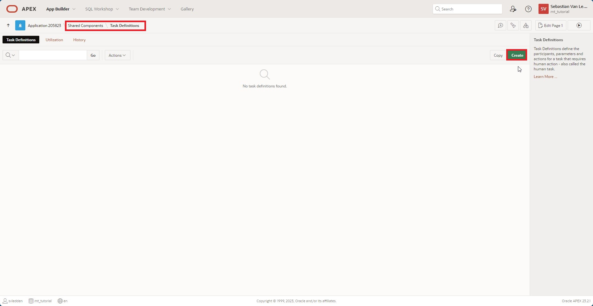

- In the **Task Definition** creation dialog, give the task the name **Reservation Request** and the **Subject: Reservation for Guest &GUEST_NAME. &GUEST_LAST_NAME.** The **Static ID** is **RESERVATION_REQUEST**. Then click **Create**.

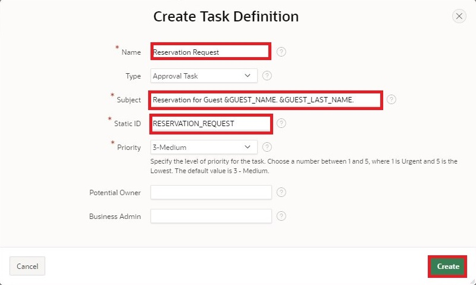

- In the next step, set the **Action Source** to **SQL Query**. Enter the following query in the query field:

```sql
  select * from t_restaurant_staff where rst_id = :APEX_TASK_PK
  ```

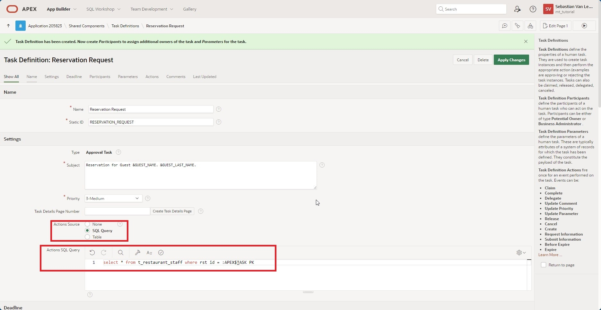

- Create a new row in the **Participants** table. The **Participant Type** is **Potential Owner**, the **Value Type** is **Expression**, and the **Value** is **:RST_NAME**. This refers to the corresponding column in the employee table **T_RESTAURANT_STAFF**, allowing them to process tasks.

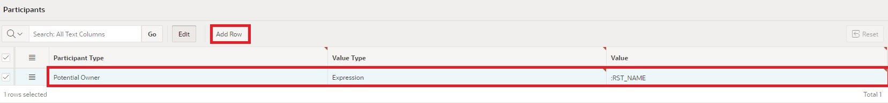 

- Parameters are also provided for the task. Add the following rows to the parameter table:

  | | | |  
  |--|--|--|
  | **NAME_GUEST** | Name Guest | *String* |
  | **LAST_NAME_GUEST** | Last Name Guest | *String* | 
  | **COUNT_GUEST** | Count Guest | *String*|  
  | **RESERVATION_DATE_START** | Reservation Date Start | *String* |
  | **RESERVATION_DATE_END** | Reservation Date End | *String* |
  | | | |

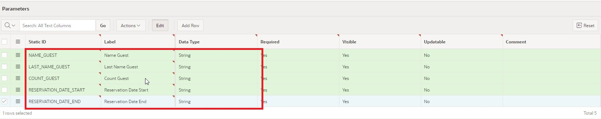

- Confirm the additions to the task with the **Apply Changes** button. You will first return to the **Task Definitions**. Return to the **Reservation Request** task and under **Task Details Page**, create a new page. Give the page the number **11**.

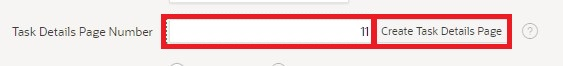

## <a name="completing-the-workflow"></a>21.5 Completing the Workflow

- The next step involves continuing work on the workflow. Switch back to **Workflows** in **Shared Components** and click on **Dinner Reservation**.

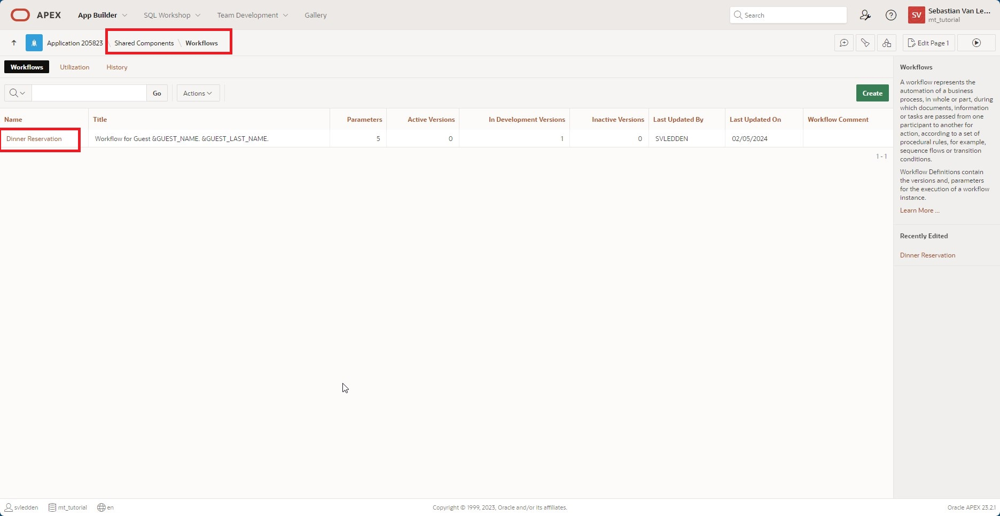

- In **Workflow 1.0**, right-click to create a new activity under **Activities**.

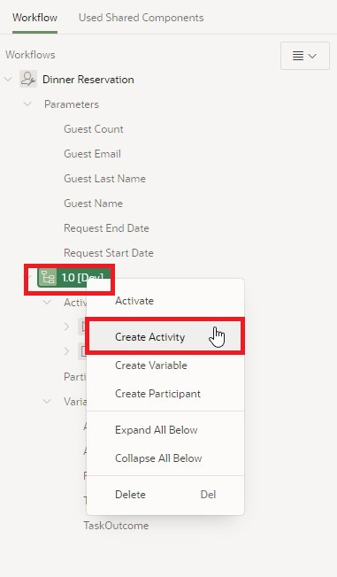

- Name the new activity **Check Availability** and set the Type to **Invoke API**. Choose the package **DINNER_RESERVATION_DEMO** and the function **CHECK_AVAILABILITY**.

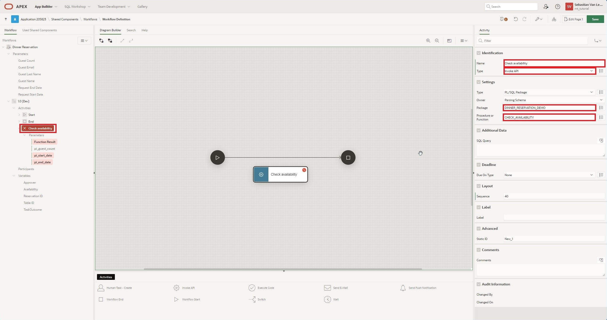

- The result of the function is passed in the **Function Result** parameter to **Item** using the **Version Variable** **Availability**.

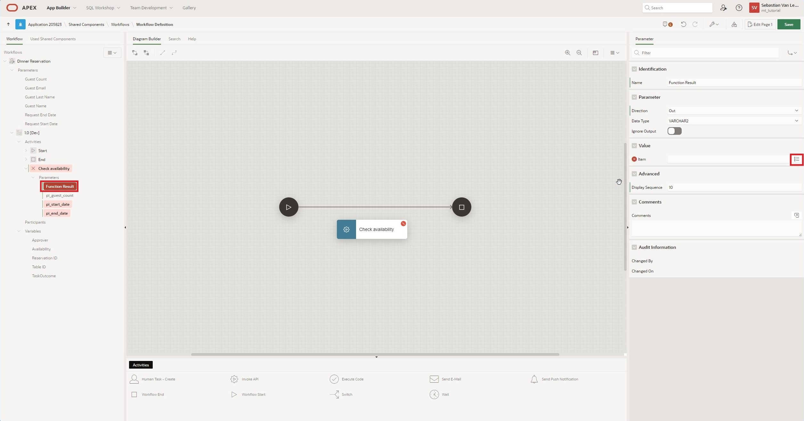

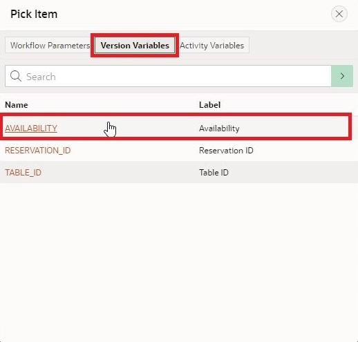

- For the parameters **pi_guest_count**, **pi_start_date**, and **pi_end_date**, set the **Value** to Type **Item** and then select the following **Workflow Parameters** and **Format Masks**:

  | Parameter | Item | Format Mask |
  | --- | --- | --- |  
  | **pi_guest_count** | GUEST_COUNT | |
  | **pi_start_date** | REQUEST_START_DATE | DD.MM.YYYY HH24:MI |
  | **pi_end_date** | REQUEST_END_DATE | DD.MM.YYYY HH24:MI |
  | | | |

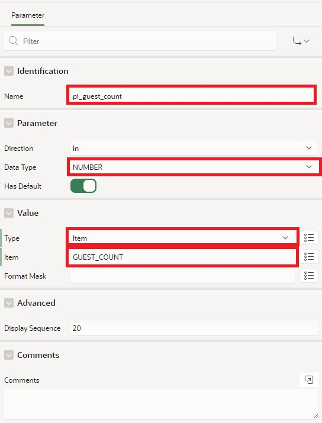

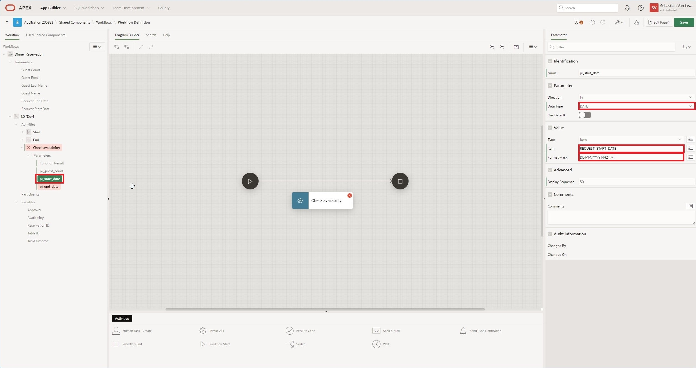

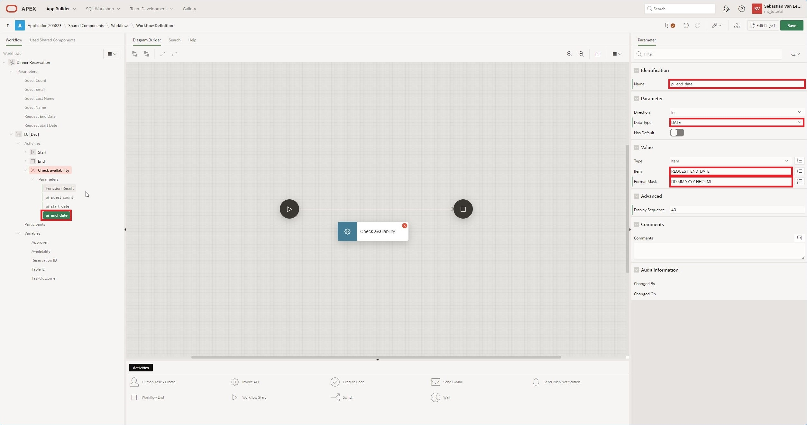

- Connect the arrow from the start of the workflow to the activity.

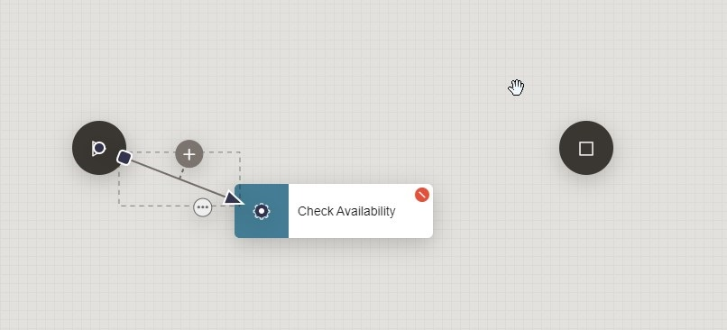

- To deal with the result of the query activity, you now need a **Switch**. Create one by dragging it into the diagram builder.

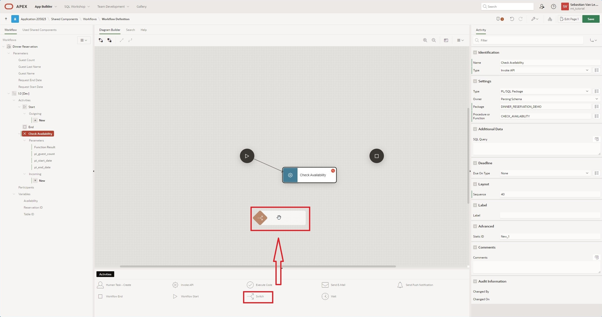

- The new **Name** of the switch will be **Decide availability**. In **Condition**, select **Condition Type: Workflow Variable = Value**, the **Workflow Variable: AVAILABILITY**, and the value **AVAIL**, which the function outputs if a table is available for the requested number of people on the desired date.

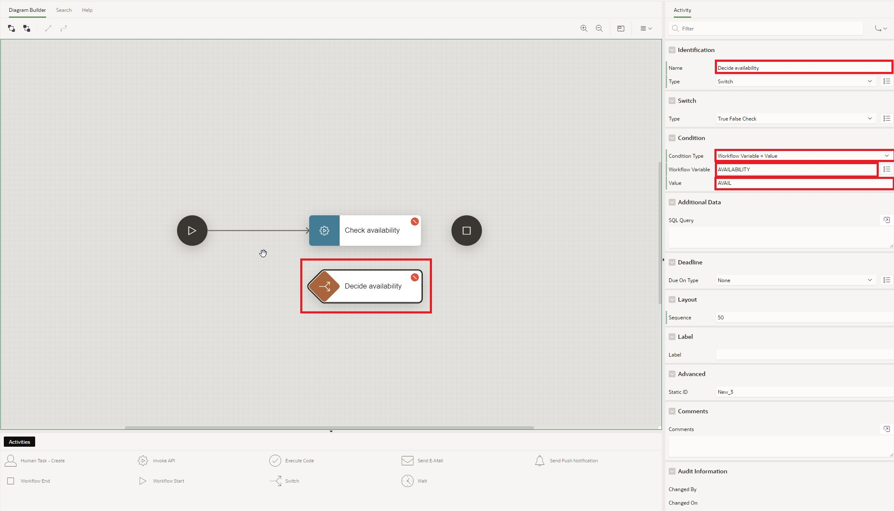

- Connect the two activities **Check availability** and **Decide availability**. Use the plus symbol to draw a new arrow and connect it to the target activity.

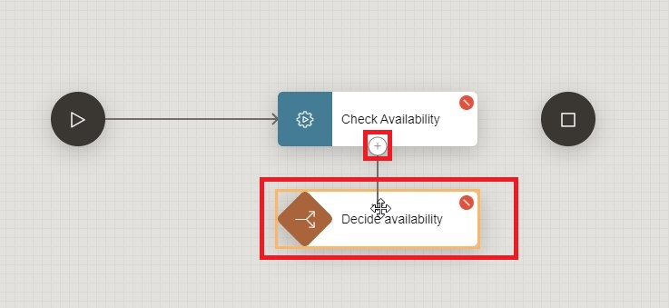

- It continues with the first possible result of the check: the case where the check shows that **no table** is available. In this case, an email should be sent notifying the requester that no table is available. To do this, create a **Send Email Activity**.

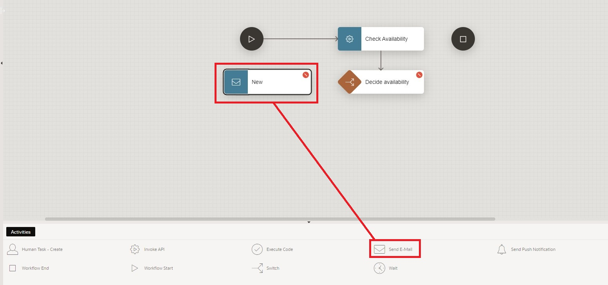

- The name of this activity will be **Send Mail unavailable**. In the **To-Field**, enter the parameter with the guest's email using **&GUEST_EMAIL.**. The **Subject** field is for the email subject. Set it to **Your reservation: No table available**. Enter the following email text in the **Body Plain Text** field:

```
Dear &GUEST_NAME. &GUEST_LAST_NAME., 

unfortunately there is no table available at the requested time. Please try another time! 

With kind regards
The Restaurant Team
```
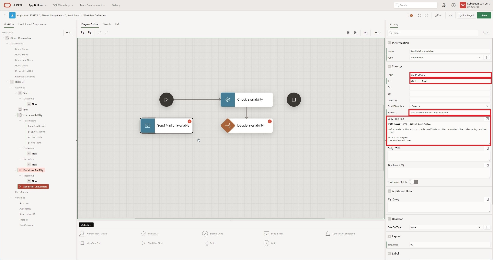

- Connect the switch with the email activity using an arrow.

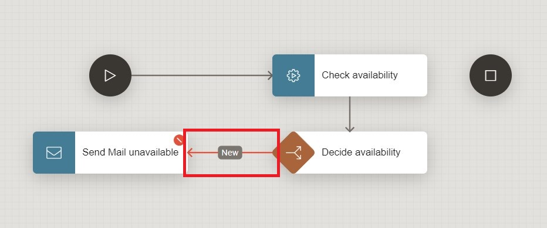

- Select the arrow and give the connection the title **Unavailable** under **Name**. In this case, the **Condition** is **FALSE** because the email should be sent when the check indicates that there is no table available.

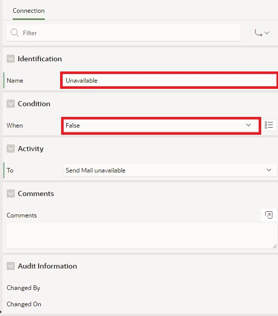

- Create another **Workflow End** and connect it to the mail-send activity. Then you can save the workflow temporarily.

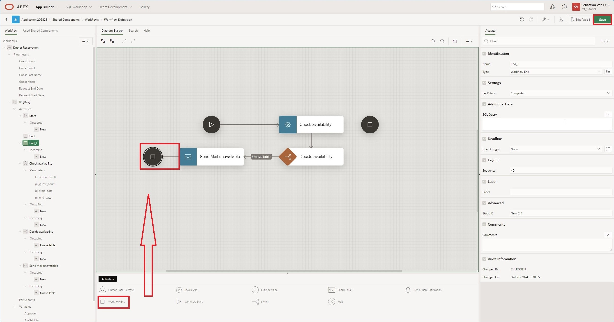

- Now, proceed with the case where the initial check shows that a table is available. In this case, an employee should decide whether to accept the reservation. To do this, first create a **Human Task - Create** activity. Give the activity the name **Create Reservation Request**, and in **Definition**, select the previously created task **Reservation Request**. The **Details Primary Key Item** is set to **RST_ID**. For **Outcome**, choose the automatically created **Variable** **TASK_OUTCOME**, and for **Owner**, the automatically created **Variable** **APPROVER**.

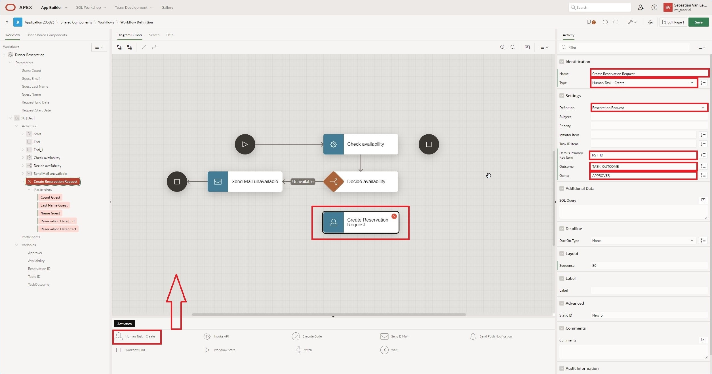

- Next, set the **Parameters** of this activity to the following values:

  | Name | Type | Item |
  | --- | --- | --- |  
  | **Count Guest** | Item | *GUEST_COUNT*|
  | **Last Name Guest** | Item | *GUEST_LAST_NAME*| 
  | **Name Guest** | Item | *GUEST_NAME*|  
  | **Reservation Date Start** | Item | *REQUEST_START_DATE*|
  | **Reservation Date End** | Item | *REQUEST_END_DATE*|
  | | | |

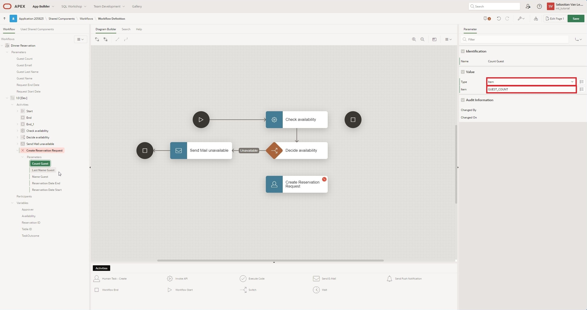

- Connect the switch **Decide availability** with the activity **Create Reservation Request** using a new arrow. This connection gets the name **Available** and the **Condition** when **True**.

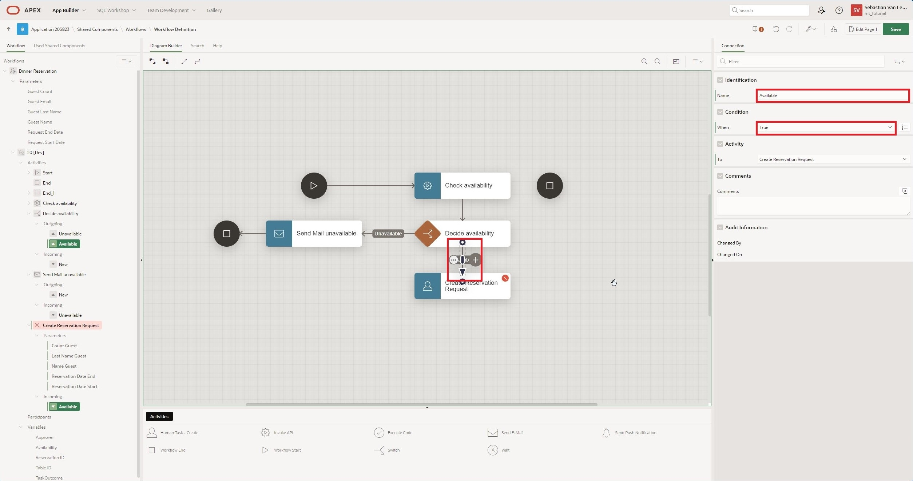

- To process the decision from the task, you need a **Switch** again. Create a new switch and name it **Decide Reservation approved**. The **Switch-Type** is **Check Workflow Variable**. The variable compared in **Compare Variable** is set to **TASK_OUTCOME**.

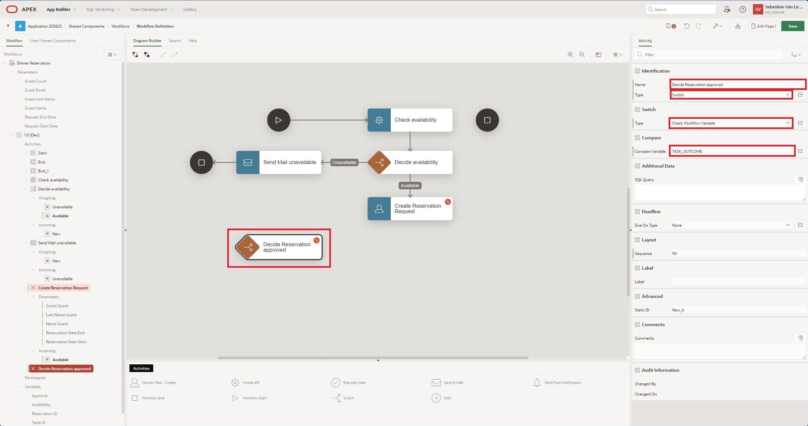

- Connect **Create Reservation Request** using an arrow with **Decide Reservation approved**.

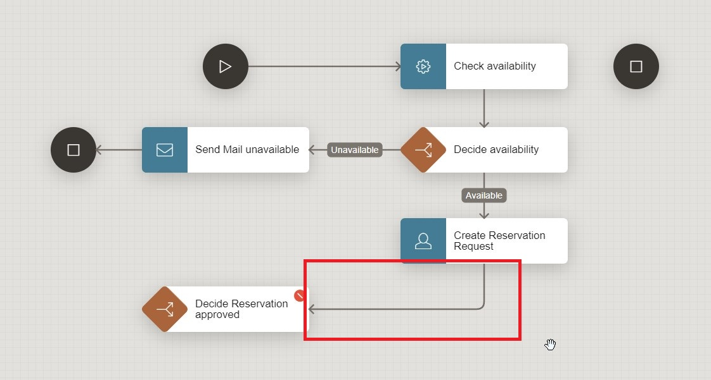

- As a rejection of the reservation by the employee should also result in a cancellation email, connect **Decide Reservation approved** with **Send Mail unavailable**. Set the name to **Rejected**. The **Operator** is **Is Equal to**, and the **Value** is the result **REJECTED** from the human task. Then you can save again.

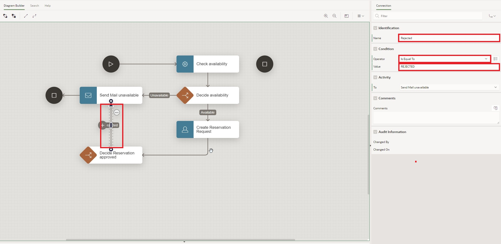

- In the case of approval, the next activity determines a free table number to be assigned to the reservation. Add an **Invoke API** activity. Name it **Get free table**. The corresponding package is **DINNER_RESERVATION_DEMO**, and the **Function** is **GET_FREE_TABLE_ID**.  

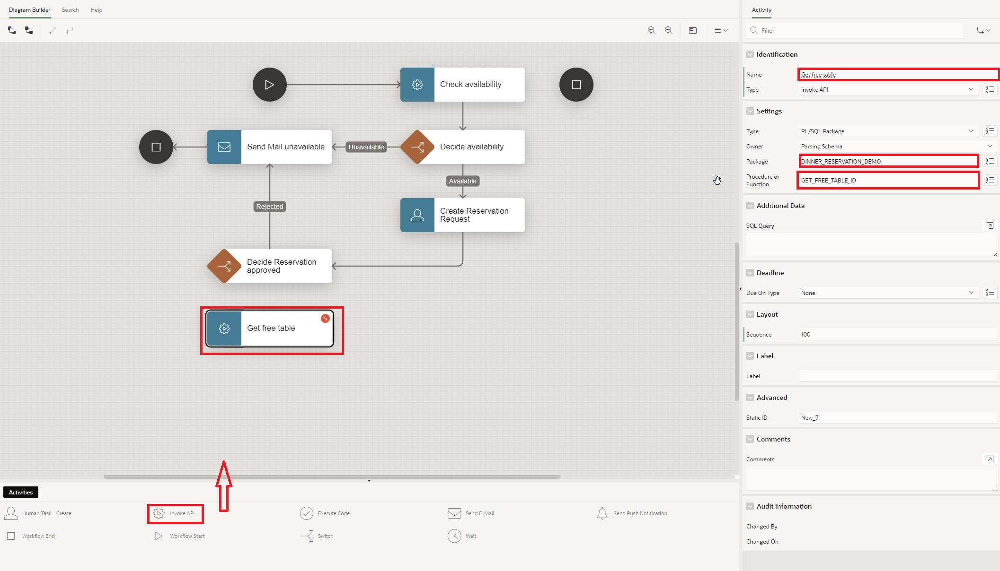

- **Function Result** of the activity is passed under **Item** to the variable **TABLE_ID**.

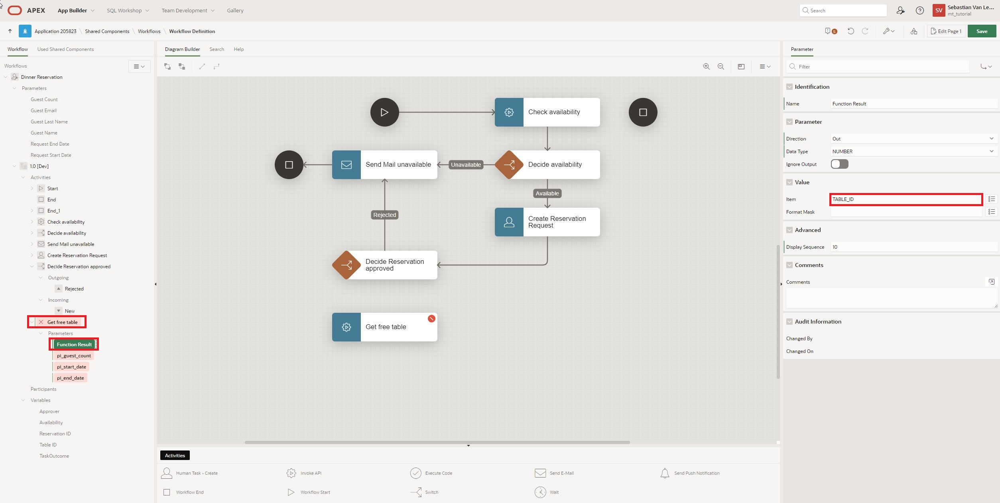

- Set the additional parameters to the following values (analogous to **Check availability**). 

  | Parameter | Item | Format Mask |
  | --- | --- | --- |  
  | **pi_guest_count** | GUEST_COUNT | |
  | **pi_start_date** | REQUEST_START_DATE | DD.MM.YYYY HH24:MI |
  | **pi_end_date** | REQUEST_END_DATE | DD.MM.YYYY HH24:MI |
  | | | |

- Connect the switch **Decide Reservation approved** with the **Get free table** activity. Set the connection's name to **Approved**, the operator to **Is Equal to**, and the value to **APPROVED**.

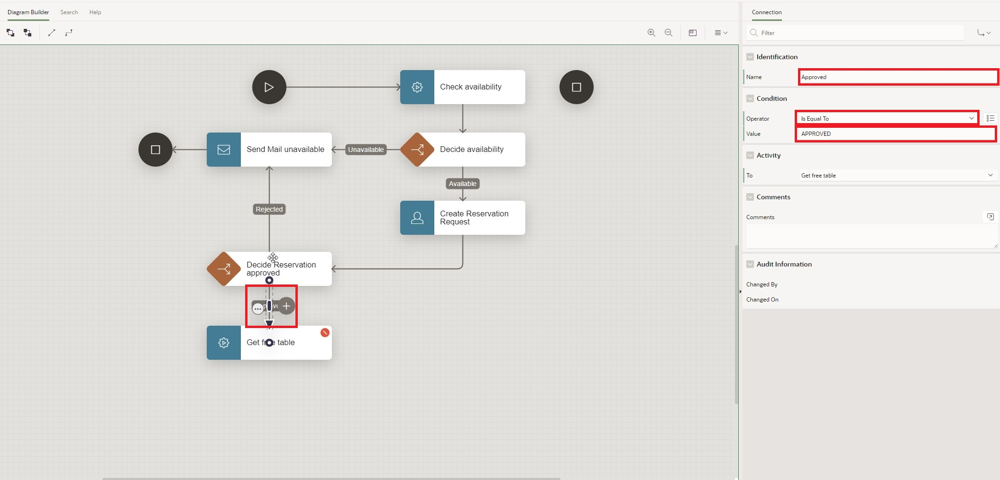

- Now all the information needed is available to save the approved reservation. Add another **Invoke API** activity. Name it **Set reservation**. The corresponding package is **DINNER_RESERVATION_DEMO**, and the **Function** is **SET_RESERVATION**.

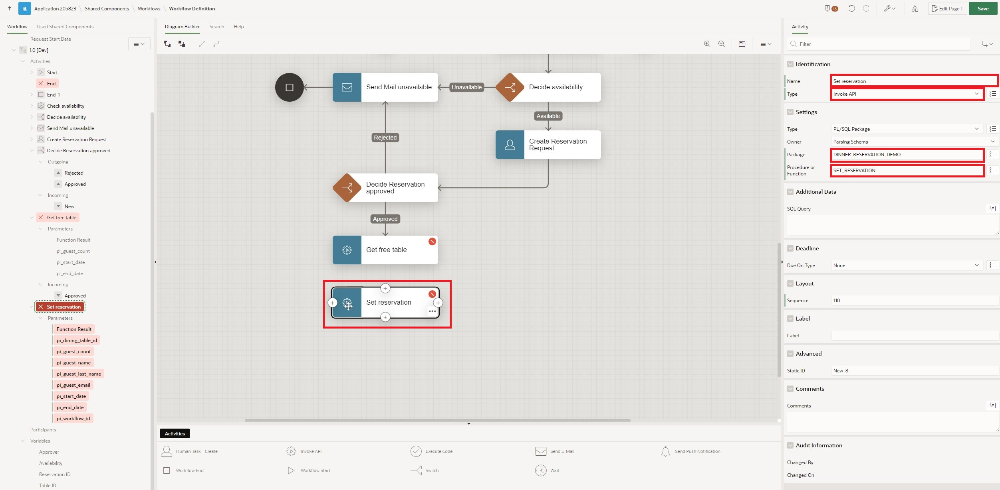

- The result of the function under **Function Result** in **Parameters** is set to the variable **RESERVATION_ID**. Fill out the other parameters as follows: 

  | Parameter | Item | Format Mask |
  | --- | --- | --- |  
  | **pi_dining_table_id** | TABLE_ID | |
  | **pi_guest_count** | GUEST_COUNT | |
  | **pi_guest_name** | GUEST_NAME | |
  | **pi_guest_last_name** | GUEST_LAST_NAME | |
  | **pi_guest_email** | GUEST_EMAIL | |
  | **pi_start_date** | REQUEST_START_DATE | DD.MM.YYYY HH24:MI |
  | **pi_end_date** | REQUEST_END_DATE | DD.MM.YYYY HH24:MI |
  | | | |

- The **pi_workflow_id** expects the workflow ID of the current workflow. You can also pass the workflow ID to the procedure using a **Static Value**. Enter **&APEX_WORKFLOW_ID.**. Connect **Get free table** and **Set reservation**.


- After saving, the customer should then be informed by email that the reservation has been accepted. Set up the corresponding **Send Email** activity next and name it **Send confirmation**. In the **To** field, enter **&GUEST_EMAIL.** - similar to the cancellation email. The subject will be **Reservation Confirmation**. Use the following **Body Plain Text**: 

```
Dear &GUEST_NAME. &GUEST_LAST_NAME., 

hereby we confirm your reservation! We are looking forward to your stay on the following date: &REQUEST_START_DATE.!

With kind regards
The Restaurant Team
```


- Now connect the activities to each other and incorporate the free-standing **Workflow End** as the endpoint of the workflow. Then save the workflow.


## <a name="workflow-creating-the-app-pages"></a>21.6 Creating the App Pages

- With the created workflow, proceed to build the actual app. First switch to **Shared Components** and **Static Application Files**. 


Add the attached image **reservation_bckgrnd.jpg** as a new file in the **images/** folder. 


- The reference created in **Reference** on the file **#APP_FILES#images/reservation_bckgrnd.jpg** will be needed shortly. First, go to Page 1 of your Application in the **Page Designer** and add the following code in the **Inline CSS** of the page; the part after **APP_FILES** is the reference to the file: 

```css
body {
    background: url(#APP_FILES#images/reservation_bckgrnd.jpg) no-repeat center center fixed; 
    -webkit-background-size: cover;
    -moz-background-size: cover;
    -o-background-size: cover;
    background-size: cover;
}
```


- Add a new region named **Book a table** to the body of the page. Set the **Column Span** to **5**. 


- Now create the following **Page Items** in the new region: 

  | Name | Type | Label |
  | --- | --- | --- |  
  | **P1_GUEST_NAME** | Text Field | Guest Name |
  | **P1_GUEST_LAST_NAME** | Text Field | Guest Last Name |
  | **P1_GUEST_EMAIL** | Text Field | Guest Email |
  | **P1_GUEST_COUNT** | Select List | Guest Count |
  | **P1_START_DATE** | Date Picker | Start Date & Time |
  | **P1_END_DATE** | Date Picker | End Date & Time |
  | | | |


- Set the **Value Required** for the Page Items **P1_GUEST_NAME, P1_GUEST_LAST_NAME, P1_GUEST_EMAIL, P1_START_DATE, and P1_END_DATE** to yes.


- Populate the new Select List **P1_GUEST_COUNT** with **Static Values** from 1 - 8. Disable **Display Extra Values** and **Display Null Value**. Set **Warn on Unsaved Changes** to **Ignore**.


- Add a **Button** to the region named **Request_reservation** with the label **Request Reservation**. Enable **Hot** and under **Template Options**, set the **Style** to **Simple**. The **Behavior** is **Submit Page**.


- For the purpose of the demo, add a choice setting for the employee responsible for making the reservation decision. Add another Page Item **P1_APPROVER** to the page. Set **Column Span** to **5**. Under **List of Value**, use the following **SQL Query**: 

```sql
select rst_name as d, rst_id as r from tutowf_staff_vw
```


- Disable **Display Extra Values** and **Display Null Value**, and set **Default** to **Static** with the value **1**.


- The next Page Item is named **P1_TODAY** and the Type set to **Hidden**.


- Set up a Computation for the Page Item using the following **SQL Query (return single value)**: 

```sql
select to_char(systimestamp, 'DD.MM.YYYY HH24:MI') from dual
```


- Enable **Show Time** for the Page Item **P1_START_DATE**. For **Minimum Date**, select **Item** and the **Minimum Item** will be **P1_TODAY**. Enter **DD.MM.YYYY HH24:MI** as **Format Mask**. 


- Similarly, enable **Show Time** for the Page Item **P1_END_DATE**. Here set the **Minimum Item** to **P1_START_DATE**. Enter **DD.MM.YYYY HH24:MI** as **Format Mask**.


- In the Processing tab of the page, create a new Process. Name the Process **Submit Reservation Workflow**, the **Type** is **Workflow**, and the **Definition** is our workflow **Dinner Reservation**. The **Details Primary Key Item** is **P1_APPROVER**—this assigns the task to the employee selected in the Page Item. Enter the following in the **Success Message**: **Reservation request successfully submitted!** and **Error Message**: **Something went wrong**. The **Server-side Condition** is **When Button Pressed** and the button is **Request_reservation**.


- Set the **Parameters** as follows, with **Type** being **Item**:

  | Parameter | Item |
  | -- | -- |  
  | **Guest Count** | *P1_GUEST_COUNT* |   
  | **Guest Email** | *P1_GUEST_EMAIL* |
  | **Guest Last Name** | *P1_GUEST_LAST_NAME* |
  | **Guest Name**| *P1_GUEST_NAME* |
  | **Request Start Date** | *P1_END_DATE* |
  | **Request End Date** | *P1_START_DATE* |
  | | |
 
 

 - Create a new **Branch** under **After Processing** named **Go to Page 1**. The **Behavior** is **Type Page or URL (Redirect)**.
 
  
 
 - Set the Target to Page 1. The cache of Page 1 should be cleared. Save the page afterward.


- Switch to the App Builder and create a new page in your application. Create a **Calendar page** as Page 2 of the application.


- The page title will be **Reservations**, and the view used is **TUTOWF_RESERVATION_VW**. Use **Navigation** and set the **Parent Navigation Menu Entry** to **Home**.


- Now select the following settings:

  | | |  
  |--|--|
  | **Display Column** | *RES_GUEST_LAST_NAME*|
  | **Start Date Column** | *RES_START_DATE* | 
  | **End Date Column** | *RES_END_DATE*|  
  | **Show Time** | *Yes*|
  | | |


- On the new Page 2, select the **Region** **Reservations**. Under **Attributes**, set the **Primary Key Column** to **ID**. In **Supplemental Information**, enter the following text:

```
Table &RES_DINING_TABLE_ID.: &RES_GUEST_NAME. &RES_GUEST_LAST_NAME. with &RES_GUEST_COUNT. guests.
```


## <a name="workflow-creating-a-unified-task-list"></a>21.7 Creating a Unified Task List

- Now create another new page, a **Unified Task List**. This Task List allows restaurant staff to view incoming reservation requests and decide on them.


- Name the page **Incoming Reservations**, with **Report Context** set to **My Tasks**. In navigation, choose **Create a new entry** under the parent entry **Home**.


## <a name="creating-the-workflow-console"></a>21.8 Creating the Workflow Console

- In the **App Builder**, create another page—you still need the **Workflow Console** to get an overview of the initiated workflows.


- Name the new page **Workflows** with the page number **20**. The **Report Context** is **Initiated by me**. A detail page is created directly for the console. Name this **Form Page** with the page number **21** and the name **Reservation Workflow Details**. In navigation, you can again choose **Home** as the new **Parent Navigation Menu Entry**.


## <a name="workflow-customizing-the-application-logo"></a>21.9 Customizing the Application Logo

- To refine the app a bit, set a new icon under **Shared Components** in **Application Definition** and under the **User Interface** section.


- Choose the icon that resembles a calendar and save the change.


- Launch the app and in the **Theme Roller** under **Customize**, set the theme to **Vita - Dark**.


- Save the settings.


- With this step, the application is complete! The next section offers a brief exploration tour of the reservation demo.

## <a name="workflow-tour-of-the-new-app"></a>21.10 Tour of the New App

- Begin the tour with a log-in using your account. Visit the reservation form and write an entry similar to the example (ideally using your own email address). Submit the complete entry.


- Then log out and log back in as the **KOCH** user.


- On the **Incoming Reservations** page, you should now be able to see the test reservation you just created.


- Clicking on the title leads to the reservation details.


- Confirm the reservation either via the detail or the overview page. Then go to the **Reservations** page. The test reservation should now be visible on the calendar.


- Log out the user and log back in with your own username. On the **Workflows** page, you get an overview of created workflows. It should now contain the completed workflow from the test reservation.


- Clicking on the workflow's title opens the **Reservation Workflow Details** page. Here you can see the workflow's progress and view the contents of the variables and parameters.


- Meanwhile, you may have received the email confirming the reservation. It should look something like this.


- With this, you have successfully completed the introduction to APEX Workflow. We hope that this chapter has provided you with a small insight into the possibilities of APEX Workflow!