# <a name="oracle-apex-und-ai"></a> 22. Oracle APEX and AI
# <a name="testen-von-funktionen-oracle-apex-und-ai"></a>22.1 Part 1: Testing Three Different Functions with Oracle APEX and AI

In this chapter, we will test three different AI functions in combination with Oracle APEX. We will focus on using AI to assist in SQL query creation, app generation, and task automation within an application.

## <a name="unterstuetzung-bei-der-erstellung-von-abfragen"></a>1. Assistance in SQL Query Creation

In this section, we test how AI can aid us in creating SQL queries. AI will be used to efficiently and accurately generate complex SQL queries based on the requirements of the database tables and business logic.

**Objective:** Create various SQL queries that run on the databases and optimize the process by incorporating AI.

## <a name="automatisierte-app-erstellung"></a>2. Automated App Creation with AI

The second test focuses on AI's ability to generate a complete application with Oracle APEX. This application will link various tables and allow for data management, including **Insert**, **Update**, and **Delete** functions. Additionally, the app should include the following features:

- **Report Page**: A report that displays and can filter the data from the tables.
- **Dashboard**: A dashboard with key metrics, such as the number of customers, orders, or sales, visualized through charts.
- **Search Functionality**: A search page where specific orders or customers can be searched.

**Objective:** Use AI to create a fully functional application in Oracle APEX that allows for the management of data from various tables, including a dashboard, a report page, and a search function.

## <a name="aufgabenautomatisierung-durch-ai"></a>3. Task Automation Within the Application by AI

In the third function, we test how AI can take over tasks within the application. The focus here is specifically on AI processing incoming emails and generating automatic responses. For example, when an email arrives, AI should draft a response based on it.

**Objective:** Use AI to automatically generate email responses. This function should enhance efficiency by creating context-based replies with AI.

## <a name="schritt-zugriff-auf-den-app-builder"></a>Step 1: Accessing the App Builder

To start creating the AI service, first navigate to the **App Builder**.

1. Click on **App Builder** in the main menu.
2. Then select **Workspace Utilities** to access additional tools.

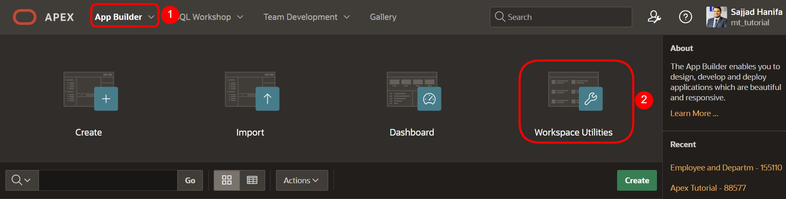

---

## <a name="schritt-zugriff-auf-den-ai-generator"></a>Step 2: Accessing the AI Generator

Once in the **Workspace Utilities** area:

1. Click **Generator AI** to start the AI service.

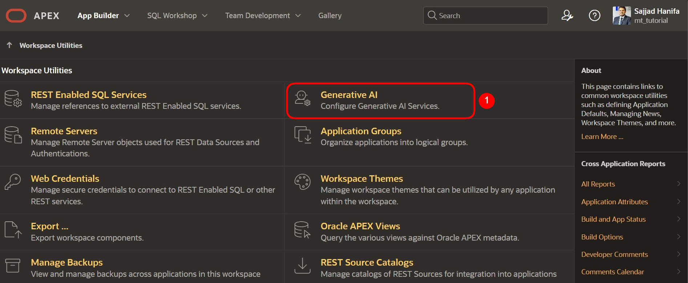

---

## <a name="schritt-erstellen-eines-ai-services"></a>Step 3: Creating an AI Service

To configure the AI service:

1. Click the **Create** button to create a new AI service.

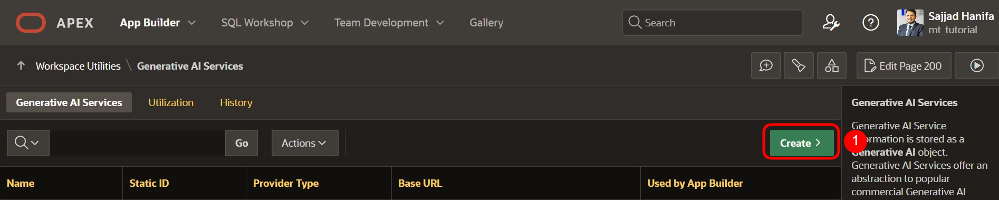

---

## <a name="schritt-ai-service-konfigurieren"></a>Step 4: Configuring the AI Service

Define the settings for the AI service as shown in the image:

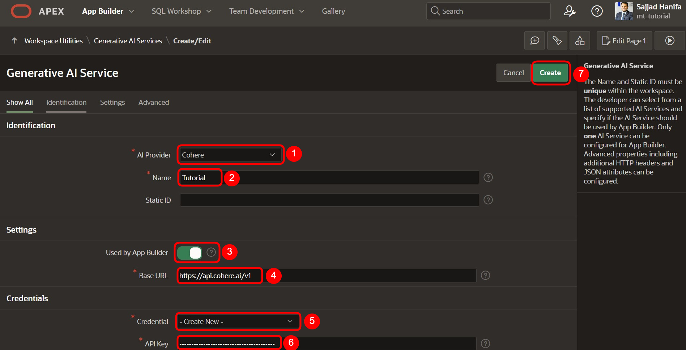

---

## <a name="schritt-wechsel-zum-sql-workshop"></a>Step 5: Switching to the SQL Workshop

Once the AI service is set up, navigate to the **SQL Workshop**.

1. Go to the **SQL Commands** area.
2. Click on the **APEX Assistant** button to get assistance for SQL queries.

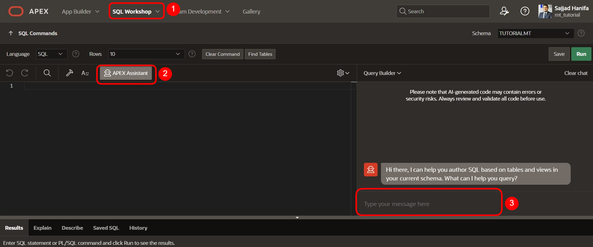

---

## <a name="schritt-nutzung-des-apex-assistant"></a>Step 6: Using the APEX Assistant for SQL Queries

In the **APEX Assistant** field, you can get help in creating SQL queries. For example, enter the following example text:

**Query Description:**  
> Create a SQL query that finds all customers from the "CUSTOMERS" table whose credit limit is greater than 5000. Only return important information like name, city, email, and credit limit of the customers.

```sql
select ctmr_frst_name,
       ctmr_last_name,
       ctmr_city,
       ctmr_email,
       ctmr_credit_limit
  from customers
 where ctmr_credit_limit > 5000
```

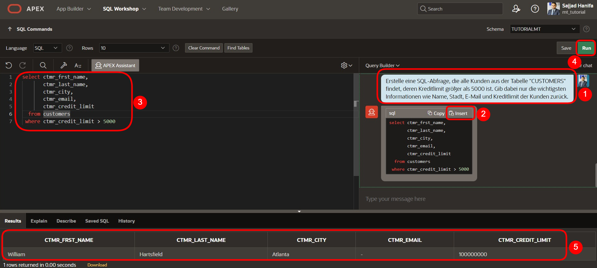

---

## <a name="schritt-sql-query-vorschlaege"></a>Step 7: SQL Query Suggestions

After entering the text, you will receive suggestions for SQL queries. Here is an example:

**Query Description:** 
> Search for all customers and return the full name of the customer (first name and last name), their email address, and the number of orders each customer has made. Use the data from tables "CUSTOMERS" and "ORDERS", where customers are stored in "CUSTOMERS" and their orders in "ORDERS". Link the two tables by customer ID. Only output the full name, email address, and number of orders.

```sql
select ctmr.ctmr_frst_name || ' ' || ctmr.ctmr_last_name as full_name,
       ctmr.ctmr_email,
       count(ord.ordr_id)                          as order_count
  from customers ctmr
  left join orders ord
    on ctmr.ctmr_id = ord.ordr_ctmr_id
 group by ctmr.ctmr_frst_name,
          ctmr.ctmr_last_name,
          ctmr.ctmr_email
```

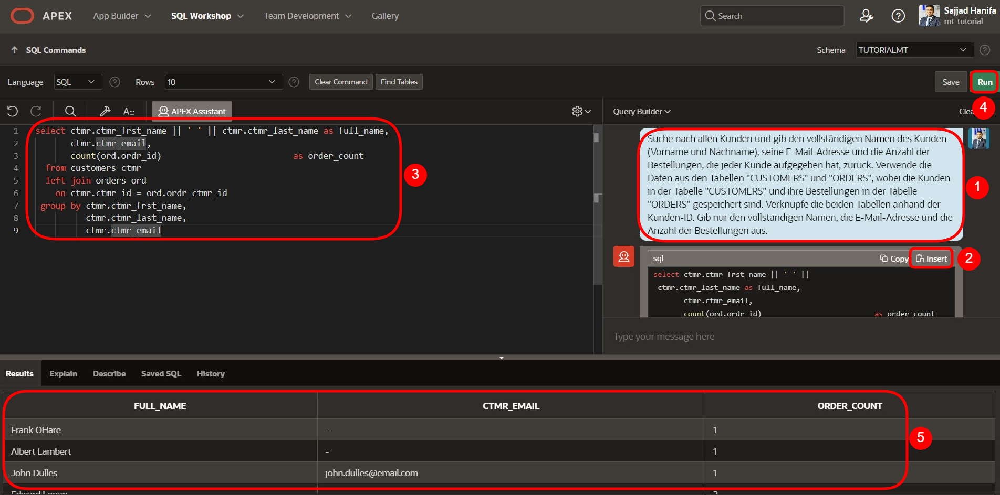

---

## <a name="schritt-weiteres-sql-beispiel"></a>Step 8: Further SQL Example

Here is another example of a SQL query:

**Query Description:** 
> Search for all customers and return the full name of the customer (first name and last name), their email address, and the number of orders each customer has made since 2016. Only consider orders with a total value (ORDR_TOTAL) of more than 100. Customer information comes from the "CUSTOMERS" table, and orders are stored in the "ORDERS" table. Link the two tables using the customer ID. Only return the following information: full name, email address, and number of qualified orders since 2016.

```sql
select ctmr.ctmr_frst_name || ' ' || ctmr.ctmr_last_name as full_name,
       ctmr.ctmr_email,
       count(ordr.ordr_id)                     as order_count
  from customers           ctmr
  join orders              ordr
    on ctmr.ctmr_id = ordr.ordr_ctmr_id
 where ordr.ordr_dd >= to_date('2016-01-01', 'YYYY-MM-DD')
   and ordr.ordr_total > 100
 group by ctmr.ctmr_frst_name,
          ctmr.ctmr_last_name,
          ctmr.ctmr_email
```

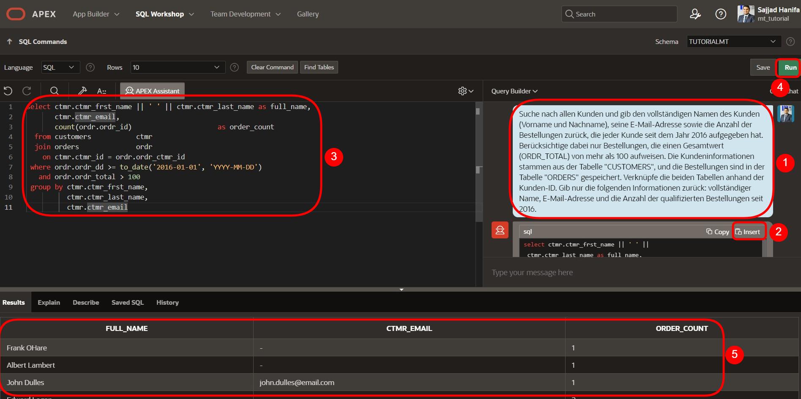

---

That was the first part of the guide showing how AI can help you create SQL queries based on your own database.

# <a name="erstellen-einer-app-mit-ai"></a>22.1 Part 2: Creating an App with the Help of AI in Oracle APEX

## <a name="schritt-zugriff-auf-den-app-builder-2"></a>Step 1: Accessing the App Builder

To create an application with the help of AI, follow these steps:

1. Navigate to the **App Builder**.
2. Click **Create** to start the process of creating a new app.

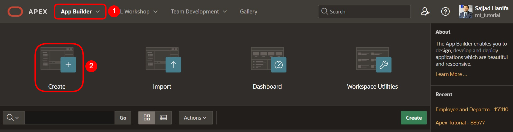

---

## <a name="schritt-app-erstellung-mit-ai-starten"></a>Step 2: Starting App Creation with AI

Instead of entering a name for the application, click **Create app using generative AI**.

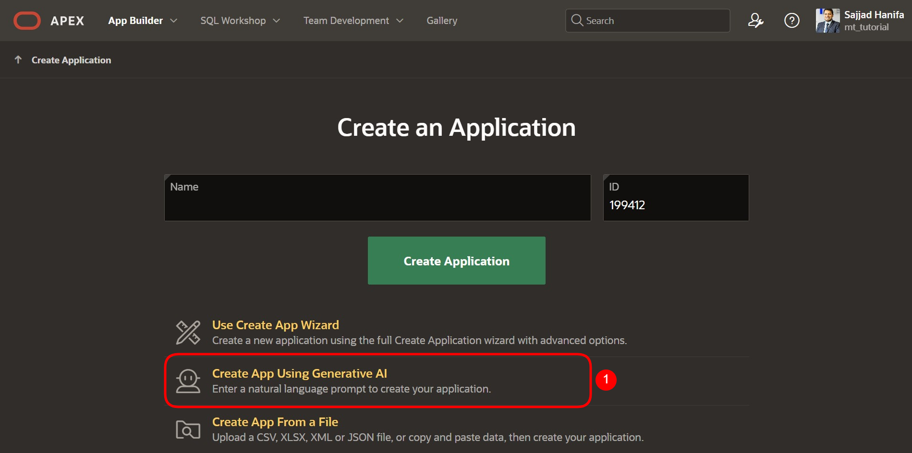

---

## <a name="schritt-eingeben-eines-prompts"></a>Step 3: Entering a Prompt

In the search bar, you can now enter a prompt describing the application you want to create. For example, enter a description of your tables and requirements and click the small arrow.

**Prompt Description:** 
> Create a full application to manage the following tables: CUSTOMERS, ORDERS, ORDER_ITEMS, PRODUCT_INFO, STATES, and DEPARTMENTS. The application should allow me to create, update, and delete records for all these tables.
> 
> Additionally, provide the following functionalities:
> 
> Search Page: Create a search page where I can search for the orders of any customer by customer name, order date, or other relevant criteria.
> 
> Report Page: Create a report page that shows how many sales I have made, including the total revenue. The report should allow filtering by date range, customer, and product.
> 
> Dashboard: Create a dashboard that displays key metrics, such as the total number of customers, total sales, and the most frequently ordered products. Visualize this data with charts and summary figures.
> 
> Ensure the application has a user-friendly interface with the ability to easily navigate between the search page, report page, and dashboard. Include necessary validations, dynamic actions, and form handling where appropriate. Also, provide a security mechanism that allows role-based access to certain features, such as administrative actions.

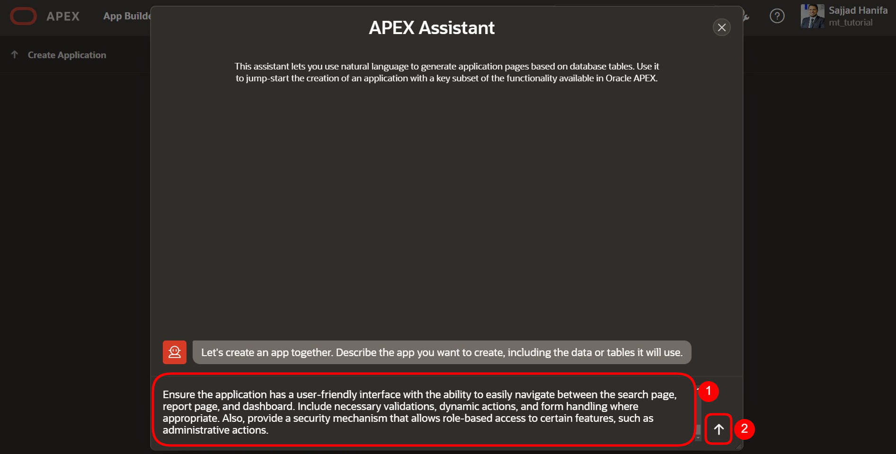

---

## <a name="schritt-app-wird-generiert"></a>Step 4: App being generated

Once you enter the prompt, AI will start creating the app. You will see the progress bar by dots representing the status of the creation process.

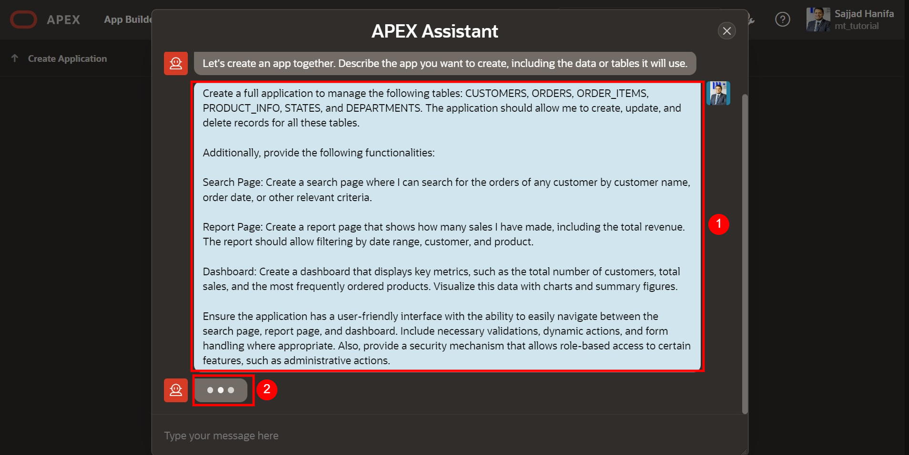

---

## <a name="ueberpruefung-der-generierten-app"></a>Step 5: Reviewing the Generated App

After the app is generated, you will receive an overview of all tables and the pages the app includes. Here you can see which functions are intended for which tables. If everything is correct, simply click on **Create Application**.

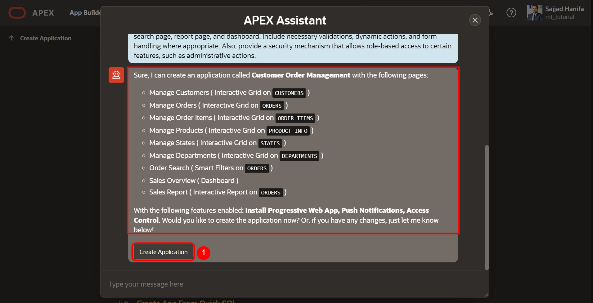

---

## <a name="schritt-seitenuebersicht-anpassen"></a>Step 6: Adjusting the Page Overview

On the next page, a brief overview of the automatically created pages is displayed. If you want to make changes, you can do so here. Otherwise, click **Create Application**.

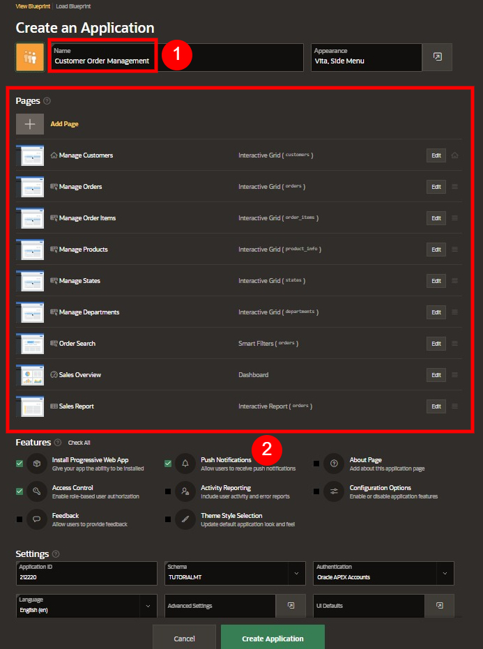

---

## <a name="schritt-erstellung-der-app"></a>Step 7: Creating the App

Within a few seconds, the application will be created.

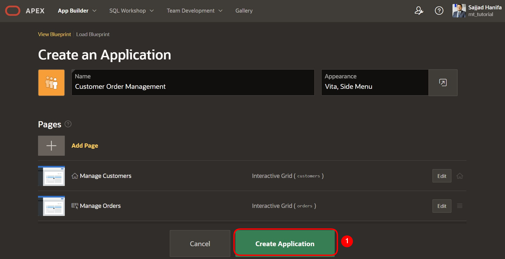

---

## <a name="schritt-starten-der-anwendung"></a>Step 8: Launching the Application

When you run the application, you will see several buttons on the navigation bar. You can now navigate through the application and insert, edit, and manage various data. Additionally, there is a **Search Page** and a **Dashboard Page** offering additional functionalities.

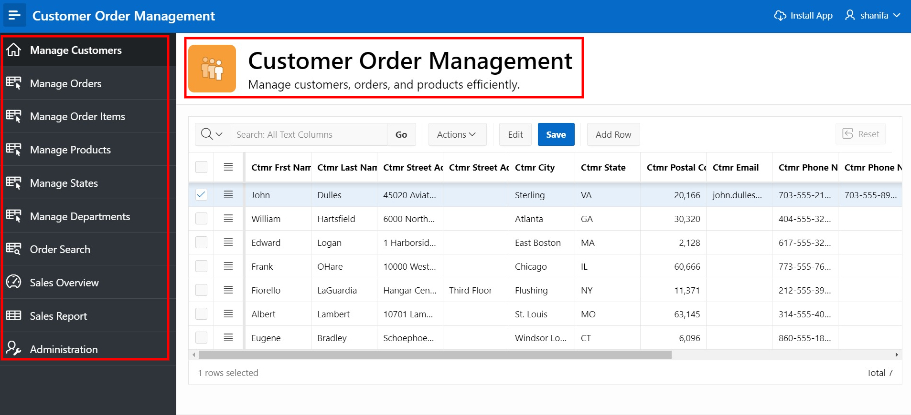

---

That was the second part of the guide showing how you can use AI in Oracle APEX to create an application. This process facilitates the management of your data and allows you to efficiently create your app with generative AI, including dashboards, search pages, and much more.

# <a name="erstellen-einer-email-reply-funktion-mit-ai"></a>22.1 Part 3: Creating an Email Reply Function with AI in Oracle APEX

## <a name="schritt-erstellen-einer-neuen-leeren-seite"></a>Step 1: Creating a New Blank Page

1. In your application, go to **Create** and create a new **Blank Page**.
2. Click **Next** to continue.

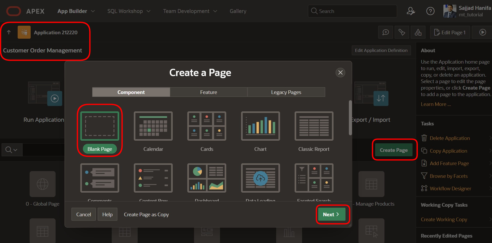

---

## <a name="schritt-seiteneinstellungen"></a>Step 2: Page Settings

Enter the settings as shown in the image and click **Create Page**.

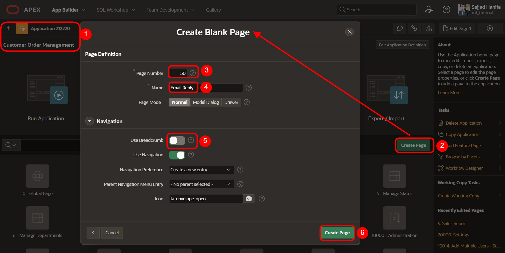

---

## <a name="schritt-erstellen-einer-region"></a>Step 3: Creating the Region

Create a region named **Email Reply**.

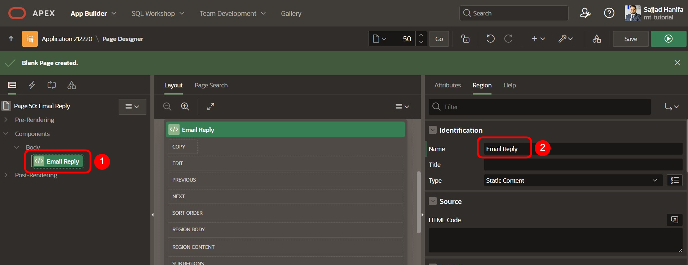

---

## <a name="schritt-hinzufuegen-eines-items"></a>Step 4: Adding an Item

Add a new item:

- **Item Name**: `P50_MAIL`
- **Label**: `MAIL`

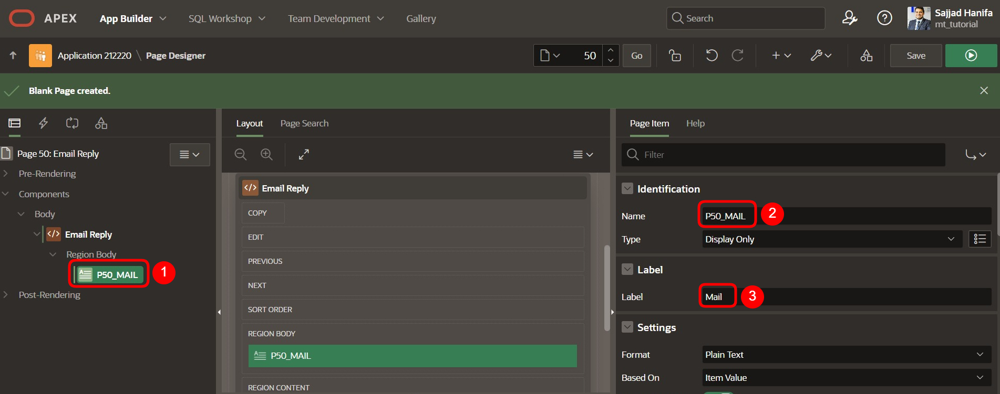

Scroll down and enter the desired email in the **Static Value** field. Then click **OK**.

> Subject: Urgent: Password Recovery Assistance Required
> 
> Dear Our Company,
> 
> I hope this message finds you well. I am writing to request your urgent assistance in recovering my password for my account with your services. Unfortunately, I am currently unable to access my account and have been unsuccessful in using the standard password recovery options provided.
> 
> Here are my account details for your reference:
> 
> Account Holder Name: John Doe
> Username/Email Associated with Account: john.doe@example.com
> Could you please assist me in resetting my password at your earliest convenience? If there are any additional steps or verification processes required, please let me know so that I can promptly provide the necessary information.
> 
> Thank you for your immediate attention to this matter. I appreciate your help and look forward to resolving this issue as soon as possible.
> 
> Best regards,
> 
> Edward Logan
> 
> Edward.Logan@example.com
> 
> (123) 456-7890

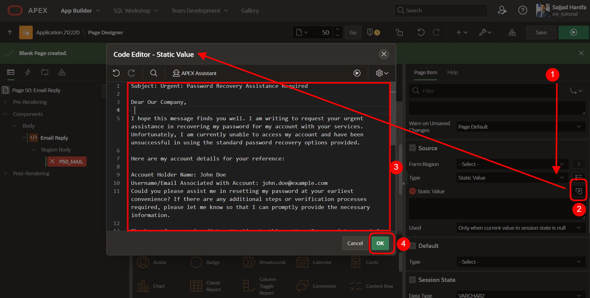

---

## <a name="schritt-erstellen-eines-buttons"></a>Step 5: Creating a Button

Create a new button with the shown settings.

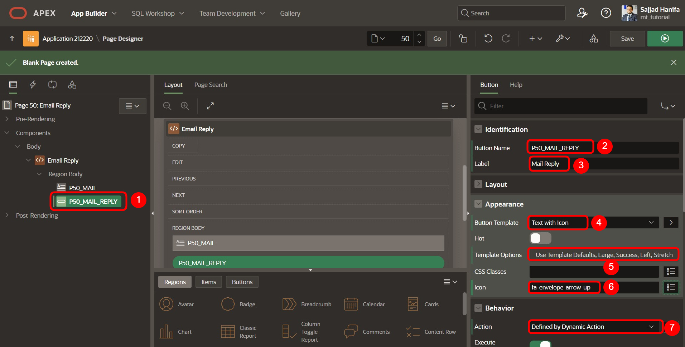

---

## <a name="schritt-hinzufuegen-einer-dynamic-action"></a>Step 6: Adding a Dynamic Action

Select the button created previously and add a **Dynamic Action** named **click on mail reply button**.

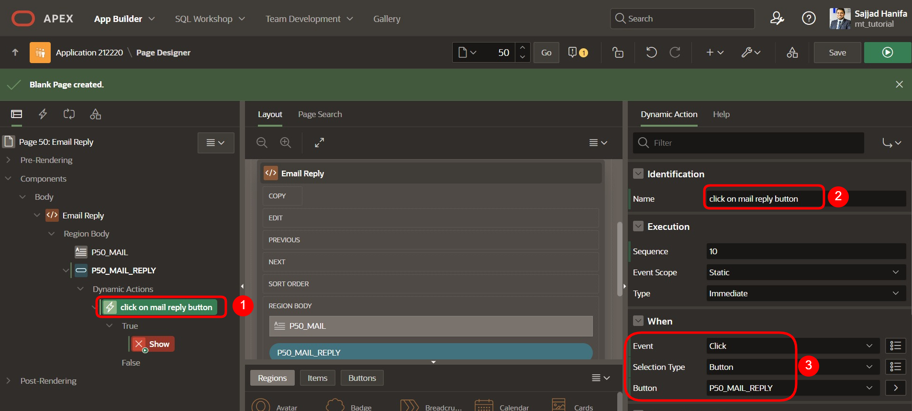

---

## <a name="schritt-konfigurieren-der-dynamic-action"></a>Step 7: Configuring the Dynamic Action

- **Action Name**: `ai mail reply`
- **Action**: Select **Open AI Assistant**.
- Select the AI service **Tutorial** created earlier.

Enter the system prompt as follows:

- **System Prompt**: `Here is an E-Mail, please reply the E-Mail`.
- **Display As**: Keep the default setting as **Dialog**.

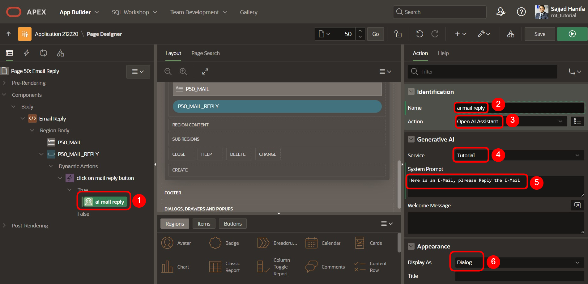

---

## <a name="schritt-system-prompt-und-anzeigeneinstellungen"></a>Step 8: System Prompt and Display Settings

Scroll down and configure the following settings:

- **Initial Prompt**: Select **Item** and then choose the item **P50_MAIL**.
- **Message**: Enter here, for example: `Here is an E-Mail, please reply the E-Mail`.

Afterwards, save the page and execute it.

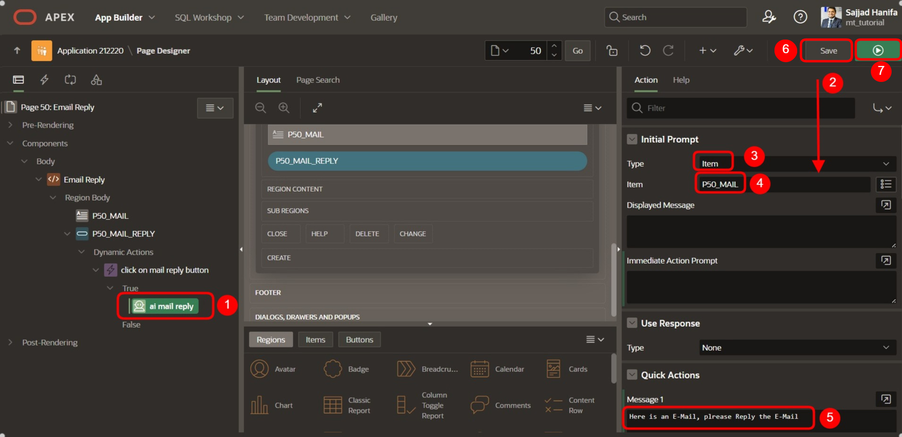

---

## <a name="schritt-ausfuehren-der-seite"></a>Step 9: Executing the Page

After saving, the page appears as follows. You can now click the **Mail Reply** button.

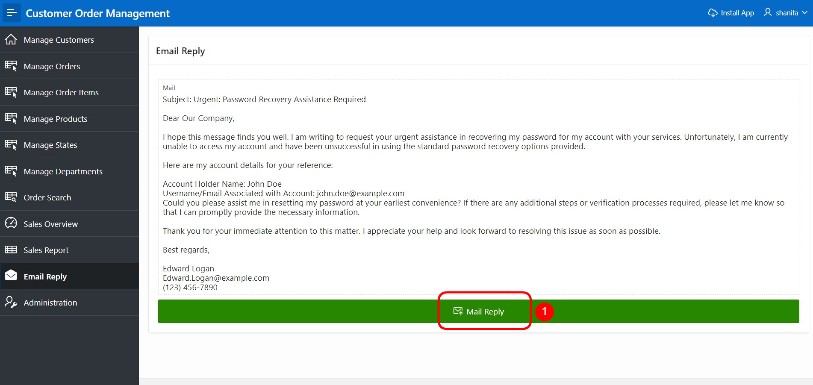

---

## <a name="schritt-email-verarbeitung-durch-ai"></a>Step 10: Email Processing by AI

After clicking **Here is an E-Mail, Please Reply the E-Mail**, AI provides a response to the email.

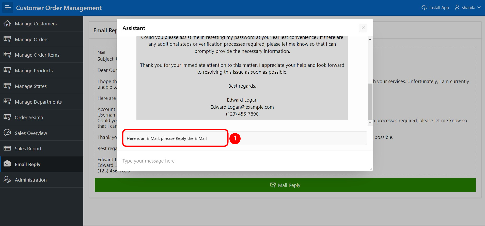

---

That was the third part of the guide where you learned how to create an email reply function with AI in Oracle APEX.

Thank you for working through this guide. You now have the tools to create SQL queries, efficiently develop applications, and automatically respond to emails. This demonstrates how powerful Oracle APEX can be in combination with generative AI.

We hope this guide has helped you better understand and productively apply the integration of AI in Oracle APEX. If you have further questions or new challenges, we are glad to assist.

Good luck with your projects!