# <a name="ai-basierte-artikelgenerierung"></a>22. AI-based Article Generation for Webshops

In this tutorial, we will show you how to automatically create articles for a webshop using AI. The AI is used to generate the following for each product:

- **Article Name** 
- **Article Description** 
- **Article Price** 
- **Article Image (as URL)**

## <a name="eine-view-erstellen"></a>1. Create a View

- A **View** is needed to complete this task.

- Name your **View***TUTO_P0200_VW***:  

```sql
CREATE VIEW TUTO_P0200_VW AS
SELECT AIGE_ID
     , AIGE_NAME
     , AIGE_DESCRIPTION
     , AIGE_PRICE
     , AIGE_URL
     , AIGE_IMAGE
     , AIGE_MIME_TYPE
  FROM AI_GENERATED_ARTICLE
;
```

1. Next, create a new page with **Cards**:
  
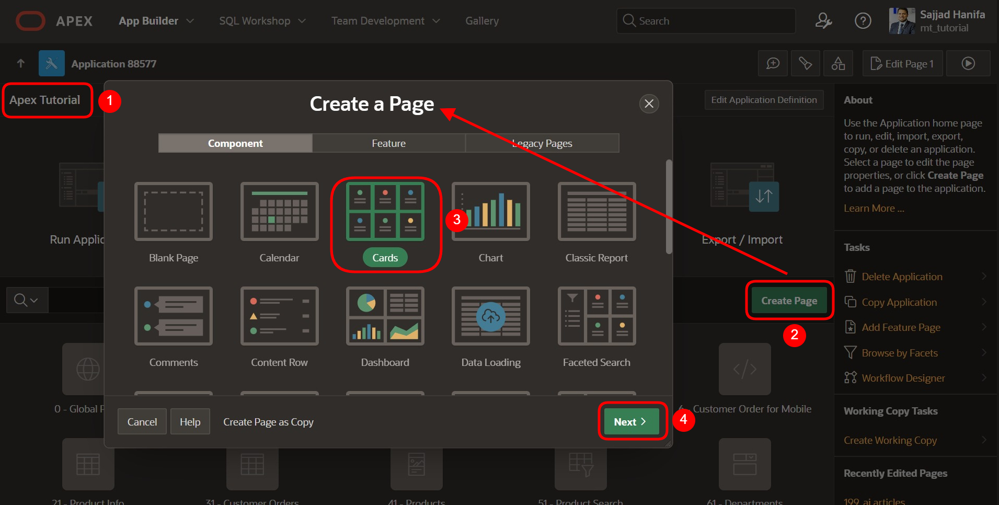

## <a name="konfiguration-des-kartenlayouts"></a>2. Configure the Card Layout

1. Create the page with the number 200 and select the view ***TUTO_P0200_VW***. Then click **Next**:

  | | |  
  |--|--|
  | **Page Number** | *200* | 
  | **Name** | *Webshop*| 
  | **Table/View Name** | *TUTO_P0200_VW*| 
  | | |

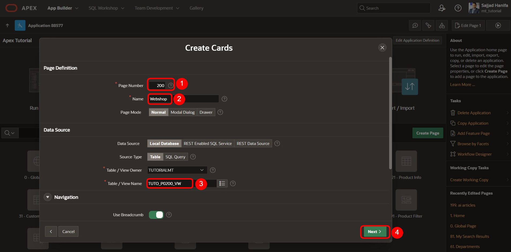

2. On the page, select the **Grid-Layout** for the cards and define it as follows:

  | | |  
  |--|--|
  | **Title** | *AIGE_NAME* | 
  | **Body** | *AIGE_DESCRIPTION*| 
  | **Badge** | *AIGE_PRICE*| 
  | | |

3. Then click on **Create Page**:

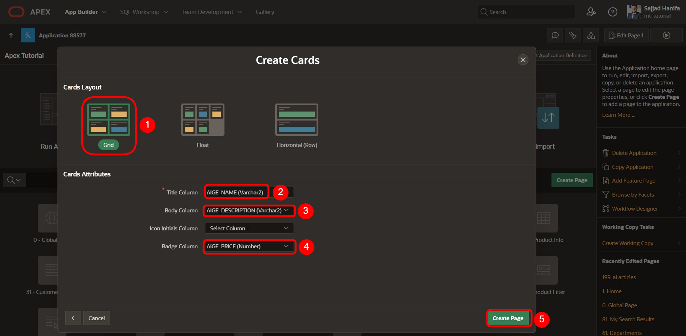

## <a name="region-erstellen"></a>3. Create Region

1. Create a new region with the name: **Define a new Article**:
  
  | | |  
  |--|--|
  | **Name** | *Define a new Article* |  
  | | |

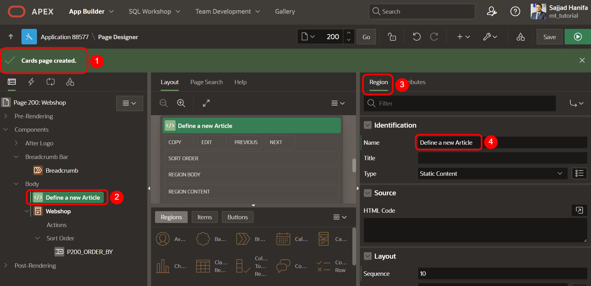

## <a name="erstellung-eines-textfelds-und-eines-buttons"></a>4. Create a Text Field and a Button

1. Create a new APEX **Text Item** with the name: `P200_NEW_ARTICLE`

  | | |  
  |--|--|
  | **Name** | *P200_NEW_ARTICLE* | 
  | **Label** | *New Article*| 
  | | |

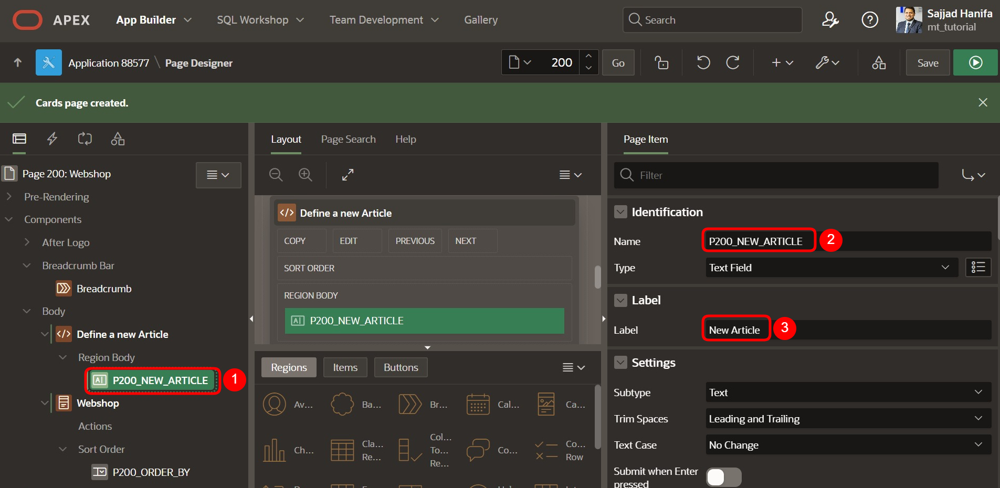

2. Create a new button with the name: `P200_ADD_ARTICLE`

  | | |  
  |--|--|
  | **Button Name** | *P200_ADD_ARTICLE* | 
  | **Label** | *Add Article*| 
  | **Button Template** | *Text with Icon*| 
  | **Icon** | *fa-cart-plus*|  
  | | |

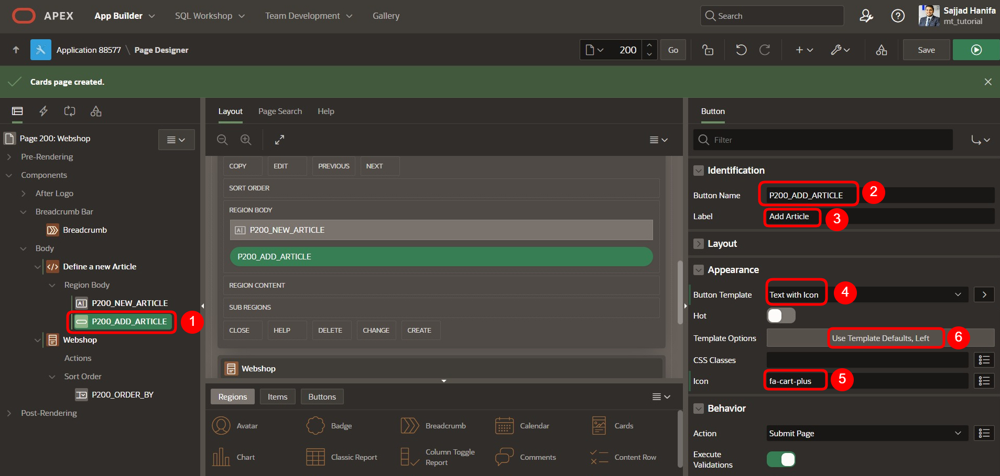

3. Set the following settings for the button design:
  
  | | |  
  |--|--|
  | **Size** | *Large* | 
  | **Type** | *Success*| 
  | **Icon Hover Animation** | *Push*| 
  | **Width** | *Stretch*|  
  | | |

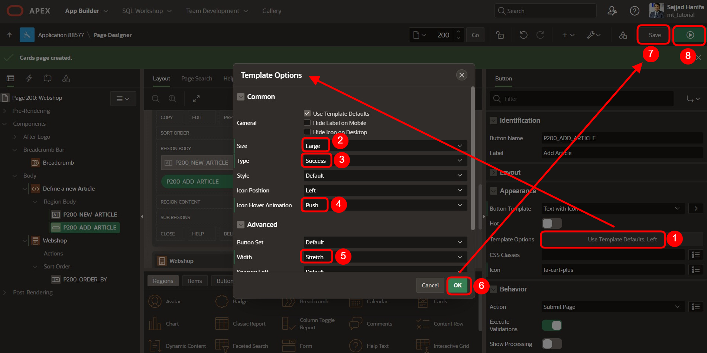

4. Save the page and open the preview. Now you should see a search input field and an **Add** button, but the **Card Report** region is still empty. The goal is to add items using a function.
  
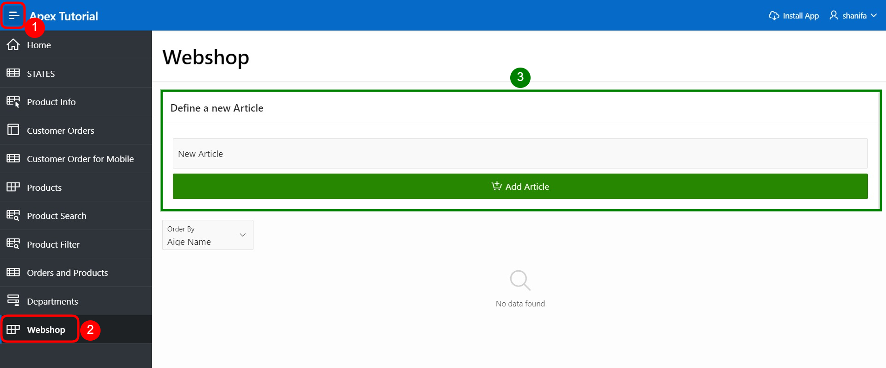

## <a name="erstellung-eines-pakets-für-den-ai-webshop"></a>5. Create a Package for the AI-Webshop

1. Next, create a package to store the functions and procedures for automated article creation:

- 1. Click on **SQL Workshop**.
- 2. Then select **Object Browser**.
- 3. Click on the small **Plus symbol** next to the search bar.
- 4. Then select **Package** to create a new package.
  
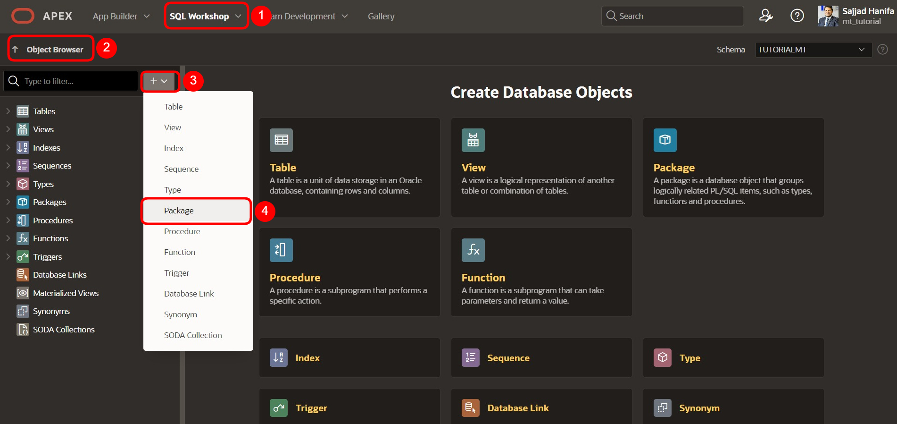

2. Next, a **Popup window** opens. Enter the name **AI_WEBSHOP** here. 
Turn off the **Include Sample Code** option so it turns gray. Then press **Create Package**.

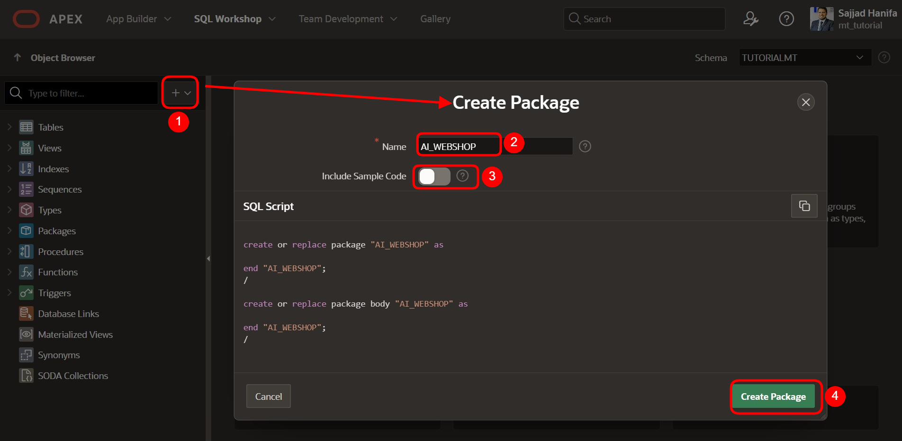

### <a name="erstellung-der-paketspezifikation">5.1. Create the Package Specification

1. Here is the code for the package specification to store the functions and procedures:

```sql
create or replace PACKAGE AI_WEBSHOP AS

    -- Function to get a response from ChatGPT (returns text as CLOB)
    FUNCTION get_chatgpt_response(p_prompt IN VARCHAR2) 
    RETURN CLOB;

    -- Function to get an image URL from DALL·E (returns the image URL as VARCHAR2)
    FUNCTION get_dalle_image(p_prompt IN VARCHAR2) 
    RETURN VARCHAR2;

    -- Procedure to generate an article and store it in the database
    PROCEDURE generate_article(
        p_new_article IN VARCHAR2
    );

END AI_WEBSHOP;
/
```
2. After inserting the code, click the **Save and Compile** button.
  
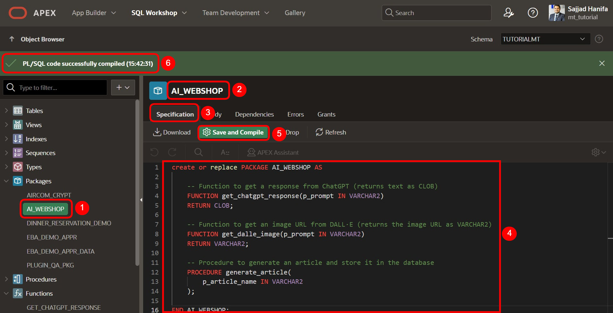

### <a name="erstellung-des-package-body">5.2. Create the Package Body

1. Here is the code for the Package Body:

Note: In the functions **get_chatgpt_response** and **get_dalle_image**, find the variable **l_api_key** in the code. 
Replace the placeholder `'Bearer API_KEY'` with your valid API key.

In both functions at the following point: 
```sql
l_api_key VARCHAR2(500) := 'Bearer API_KEY';
```

```sql
create or replace PACKAGE BODY AI_WEBSHOP AS

    -- Function to get a response from ChatGPT (returns text as CLOB)
    FUNCTION get_chatgpt_response(p_prompt IN VARCHAR2) 
    RETURN CLOB
    IS
        l_response          CLOB;
        l_url               VARCHAR2(500) := 'https://api.openai.com/v1/chat/completions';
        l_body              CLOB;
        l_chat_response     CLOB; -- Variable to store the chat response
        l_api_key           VARCHAR2(500) := 'Bearer API_KEY'; -- A valid API key must be inserted here:
    BEGIN
        -- Set necessary headers for JSON Content-Type and Authorization
        apex_web_service.g_request_headers(1).name := 'Content-Type';
        apex_web_service.g_request_headers(1).value := 'application/json';
        apex_web_service.g_request_headers(2).name := 'Authorization';
        apex_web_service.g_request_headers(2).value := l_api_key; 
        
        -- Body for the POST request with the prompt, provided by the user
        l_body := '{
            "model": "gpt-3.5-turbo",
            "messages": [{"role": "user", "content": "' || p_prompt || '"}],
            "max_tokens": 100
        }';

        -- Execute the POST request
        l_response := apex_web_service.make_rest_request(
            p_url => l_url,
            p_http_method => 'POST',
            p_body => l_body
        );

        -- Parse the response using JSON_TABLE to extract the description
        FOR r IN (
            SELECT message_content
            FROM JSON_TABLE(
                l_response, '$'
                COLUMNS (
                    message_content CLOB PATH '$.choices[0].message.content'
                )
            )
        ) LOOP
            -- Store the chat response in the variable
            l_chat_response := r.message_content;
        END LOOP;

        -- Return the extracted response
        RETURN l_chat_response;

    EXCEPTION
        WHEN OTHERS THEN
            RETURN 'Error: ' || SQLERRM;
    END;


    -- Function to get an image URL from DALL·E (returns the image URL as VARCHAR2)
    FUNCTION get_dalle_image(p_prompt IN VARCHAR2) 
    RETURN VARCHAR2
    IS
        l_response          CLOB;
        l_url               VARCHAR2(500) := 'https://api.openai.com/v1/images/generations';
        l_body              CLOB;
        l_image_url         VARCHAR2(1000);                     -- To store the image URL from the API response
        l_blob              BLOB;                               -- To store the downloaded image as BLOB
        l_api_key           VARCHAR2(500) := 'Bearer API_KEY';  -- A valid API key must be inserted here:
    BEGIN
        -- Set necessary headers for JSON Content-Type and Authorization
        apex_web_service.g_request_headers(1).name := 'Content-Type';
        apex_web_service.g_request_headers(1).value := 'application/json';
        apex_web_service.g_request_headers(2).name := 'Authorization';
        apex_web_service.g_request_headers(2).value := l_api_key;
        
        -- Body for the POST request with the prompt, provided by the user
        l_body := '{
            "prompt": "' || p_prompt || '",
            "n": 1,
            "size": "256x256"
        }';

        -- Execute the POST request to generate the image
        l_response := apex_web_service.make_rest_request(
            p_url => l_url,
            p_http_method => 'POST',
            p_body => l_body
        );

        -- Parse the response to extract the image URL
        FOR r IN (
            SELECT image_url
            FROM JSON_TABLE(
                l_response, '$'
                COLUMNS (
                    image_url VARCHAR2(1000) PATH '$.data[0].url'
                )
            )
        ) LOOP
            -- Store the image URL in the variable
            l_image_url := r.image_url;
        END LOOP;

        -- Return the URL containing the image
        RETURN l_image_url;

    EXCEPTION
        WHEN OTHERS THEN
            -- If an error occurs, return NULL or handle it accordingly
            RETURN NULL;
    END;


    -- Procedure to generate an article and store it in the database
    PROCEDURE generate_article(
        p_new_article IN VARCHAR2
    ) 
    IS
        v_article        CLOB;
        v_article_desc   CLOB;
        v_AIGE_URL       VARCHAR2(1000);
        v_AIGE_PRICE     CLOB;
        v_AIGE_PRICE_nr  NUMBER;
    BEGIN

        -- Get the article name from ChatGPT
        v_article := get_chatgpt_response(
            'I have an online shop. Please provide the perfect name for this product, limited to a maximum of 80 characters. The product is: ' || p_new_article
        );

        -- Get the article description from ChatGPT
        v_article_desc := get_chatgpt_response(
            'I have an online shop. Please provide the perfect description for this product, limited to a maximum of 4000 characters. The product is: ' || p_new_article
        );

        -- Get the image URL from DALL·E
        v_AIGE_URL := get_dalle_image(
            'I have an online shop. Please generate the perfect image for this product. The product is: ' || p_new_article
        );

        -- Get the price from ChatGPT
        v_AIGE_PRICE := get_chatgpt_response(
            'I have an online shop. Please provide the perfect price for this product as a number, formatted like 22.40 with no currency symbol. The product is: ' || p_new_article
        );

        -- Convert the price to a number
        v_AIGE_PRICE_nr := TO_NUMBER(v_AIGE_PRICE);

        -- Insert the generated article into the AI_GENERATED_ARTICLE table
        INSERT INTO AI_GENERATED_ARTICLE (AIGE_NAME, AIGE_DESCRIPTION, AIGE_URL, AIGE_PRICE)
        VALUES (v_article, v_article_desc, v_AIGE_URL, v_AIGE_PRICE_nr);

        -- Commit the transaction
        COMMIT;

        DBMS_OUTPUT.put_line('Article successfully generated and stored.');

    EXCEPTION
        WHEN OTHERS THEN
            DBMS_OUTPUT.put_line('Error: ' || SQLERRM);
            ROLLBACK;
    END generate_article;

END AI_WEBSHOP;
/
```
2. After inserting the API key, click the **Save and Compile** button.
  
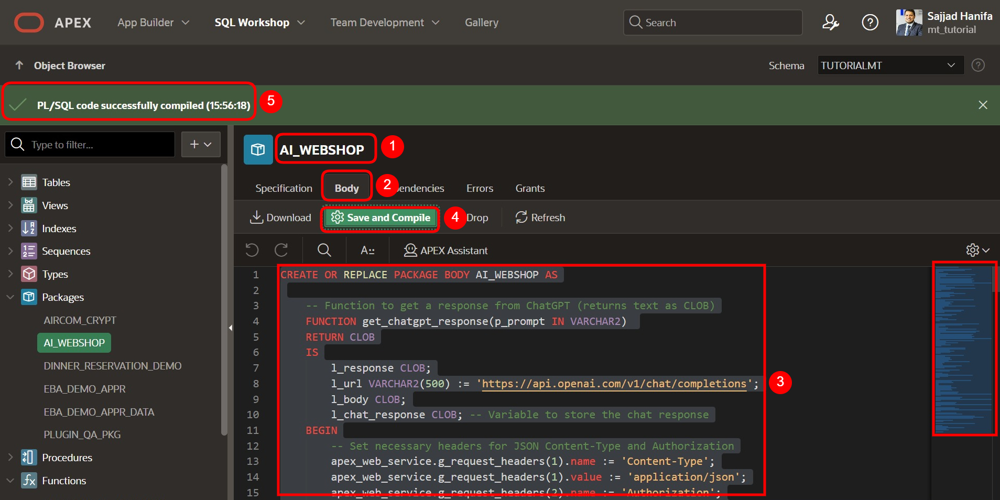

Summary:
- **`get_chatgpt_response`** → This function retrieves a response from the AI for the article name and description.
- **`get_dalle_image`** → This function retrieves a URL for the AI-generated image.
- **`generate_article`** → This procedure generates the article based on the article name and stores it in the database.

## <a name="erstellung-des-prozesses-zum-hinzufuegen-eines-artikels">6. Creating the Process to Add an Article

1. Now go back to the **Page Designer** on page 200 and create a new process with the following settings:

  | | |  
  |--|--|
  | **Page** | *200* | 
  | **Process Name** | *Generate new article*| 
  | **Type** | *Invoke API*| 
  | **Package** | *AI_WEBSHOP*|  
  | **Procedure or Function** | *GENERATE_ARTICLE*|  
  | | |

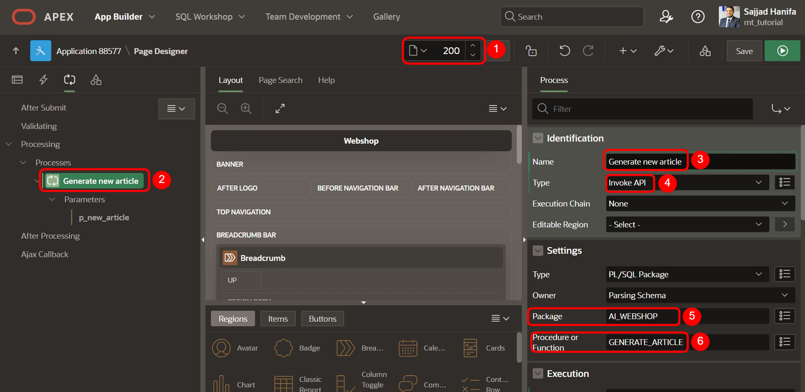

2. Add a success message and ensure that the process only executes when the corresponding button is clicked.
  
  | | |  
  |--|--|
  | **Success Message** | *The article has been successfully generated by AI and is now available in the webshop!* | 
  | **When Button Pressed** | *P200_ADD_ARTICLE*| 
  | | |

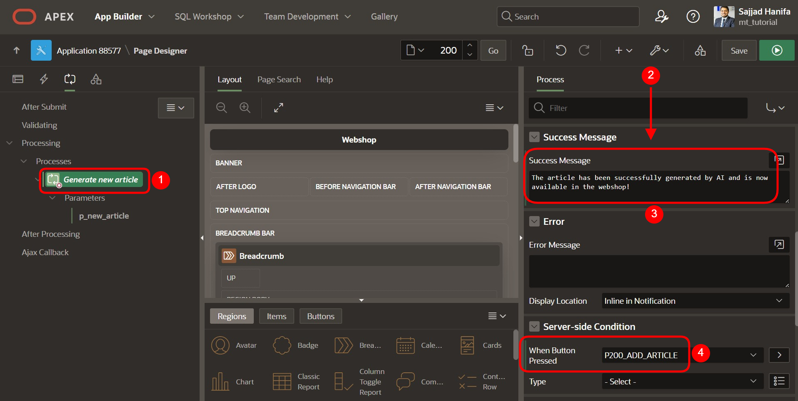

## <a name="ueberpruefung-des-parameters">7. Verify the `p_new_article` Parameter

1. Ensure the parameter `p_new_article` is correctly linked to the item. If not, establish the connection manually.
  
  | | |  
  |--|--|
  | **Name** | *p_new_article* | 
  | **Item** | *P200_NEW_ARTICLE*| 
  | | |
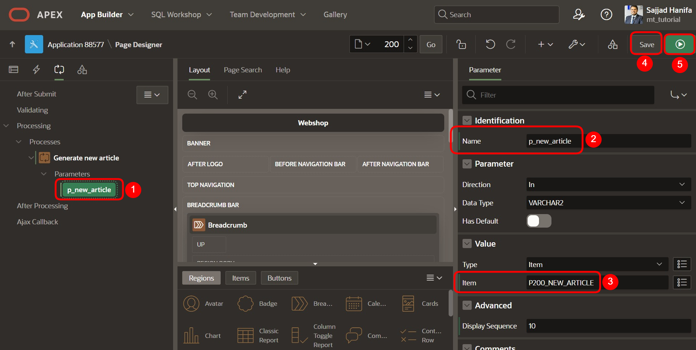

## <a name="endgueltige-Seitenvorschau">8. Final Page Preview

1. Once the user interface is complete, the page should look something like this. You can now enter an article name and click the **Add Article** button.
  
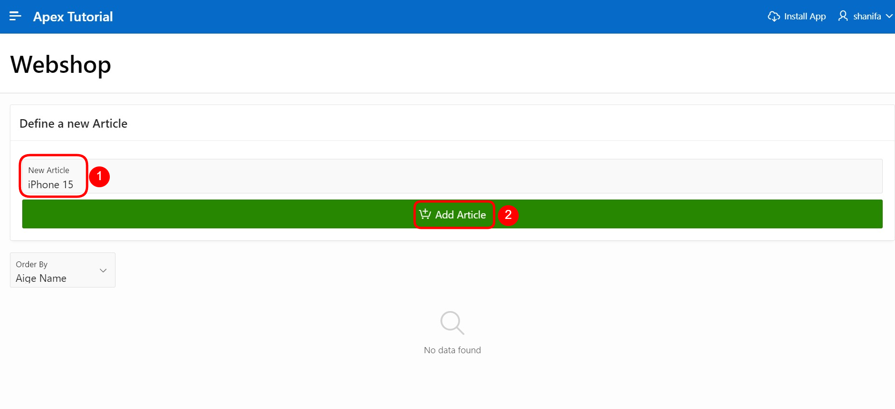

2. After about 5-10 seconds, the AI will generate the article, and you should see the article in the **Card View**, initially without an image.
  
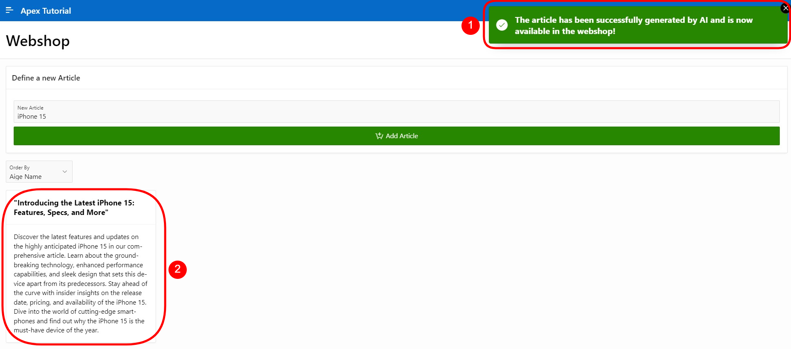

## <a name="bild-url-hinzufügen">9. Add Image URL

1. To integrate the image as a URL, set the following settings, save, and reload the page.
    
  | | |  
  |--|--|
  | **Card Region** | *Webshop* | 
  | **Media** | **| 
  | **Source** | *URL Column*| 
  | **Appearance** | *Widescreen*| 
  | **Sizing** | *Cover*| 
  | | |

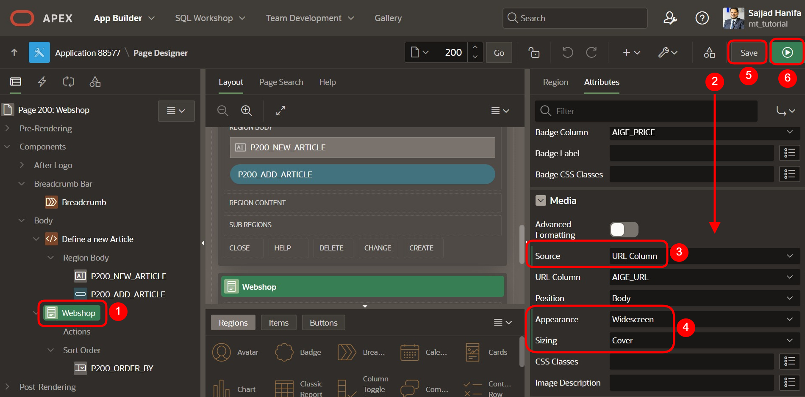

2. Now you can create additional articles, and the final result should look something like this:
  
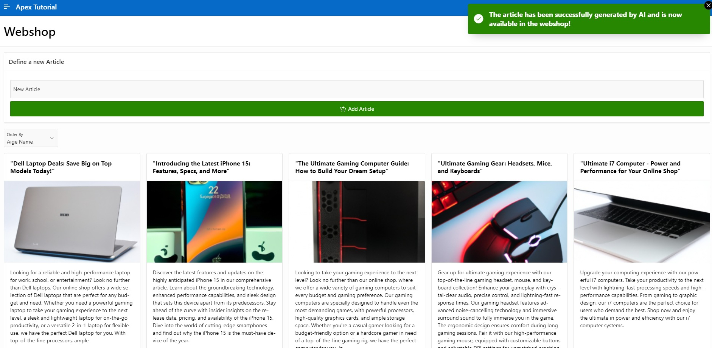