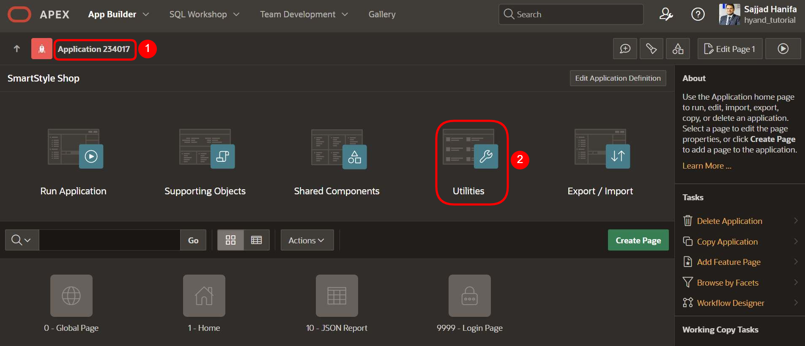
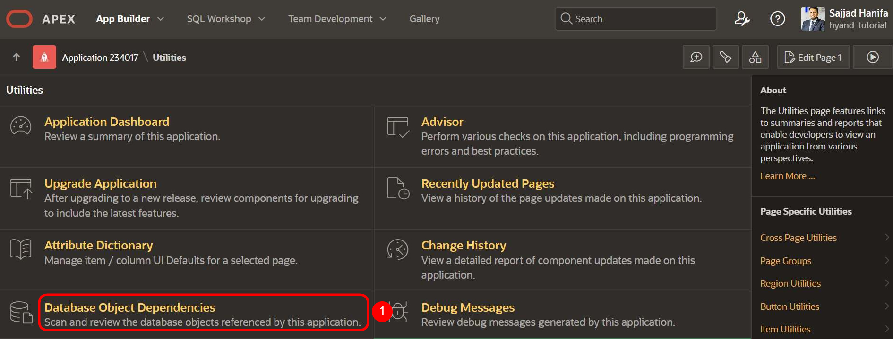
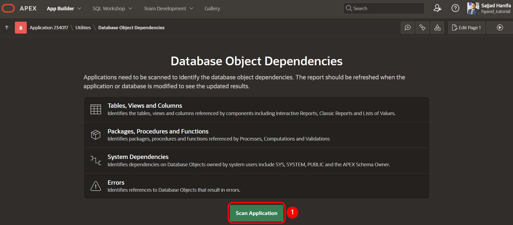
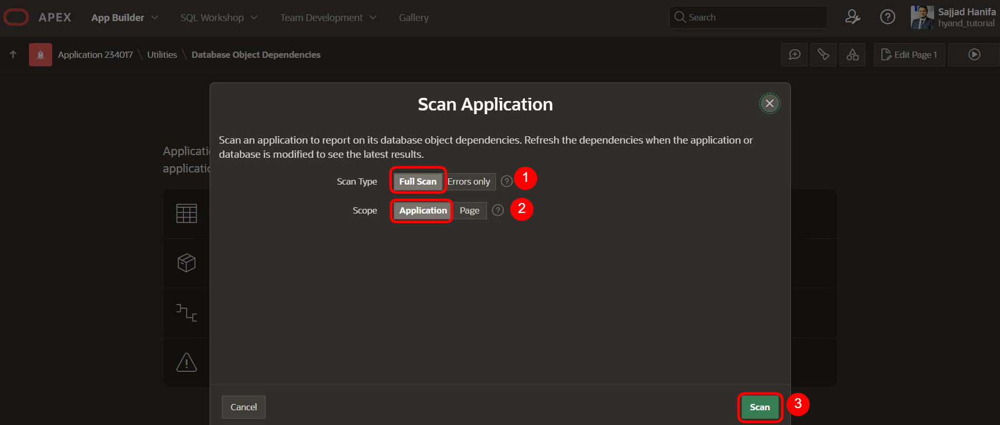
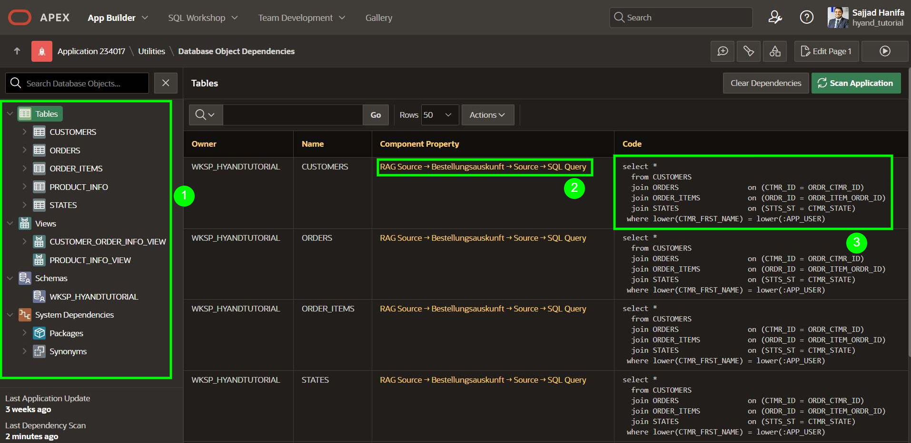

# Chapter-23 - Database Object Dependencies

## Introduction  

With APEX 24.2, a new feature was introduced that allows for detailed tracing of **dependencies between APEX components and database objects**. This extension supports you in specifically analyzing changes to tables, views, packages, or functions and better understanding their impact on your APEX applications.

The "Database Object Dependencies" feature provides you with a transparent insight into the connection between the database structure and your APEX components – a valuable aid for maintenance, refactoring, and quality assurance.

## Benefits  
- **Transparent tracking of dependencies** between APEX and the database  
- **Faster error analysis** during structural changes  
- **Optimized maintainability** of your applications  
- **Improved team collaboration** through traceable data flows

In the further course of this chapter, you will learn how to activate, interpret, and specifically use the new feature in your development process.

---

## Step 1: Open Application and Navigate to Utilities

1. Open your desired **APEX application** in the App Builder  
   (in this example: *Application 234017*).

2. Click on the **Utilities** tile on the application dashboard to access the utility functions.

> Through the utilities, you will next access the new **Database Object Dependencies** feature introduced in APEX 24.2.

---

## Step 2: Open Database Object Dependencies

1. Scroll down on the **Utilities page** to the section "Database Object Dependencies".

2. Click on **Database Object Dependencies** to open the overview of the used database objects and their dependencies within the application.

   

> In the following view, you can see which tables, views, packages, functions, and other objects are referenced in your APEX application.

---

## Step 3: Scan Application

1. Click on the **Scan Application** button to analyze the current APEX application for database dependencies.

2. The scan identifies, among others, the following types of objects:
   - Tables, views, and columns
   - Packages, procedures, and functions
   - System dependencies (e.g., on `SYS`, `SYSTEM`, `PUBLIC`)
   - References leading to errors (e.g., no longer existing objects)

   

> After the scan, the complete results are available in different views. These help you better understand changes to the database and make informed decisions in the further development of your application.

---

## Step 4: Choose and Start Scan Options

1. Select **Full Scan** under **Scan Type** to analyze all referenced objects (not just faulty ones).

2. Set **Scope** to **Application** to scan the entire application (not just a single page).

3. Then click on **Scan** to start the analysis process.

   

> Upon completion of the scan, you will receive a detailed overview of all the database objects used by the application – including tables, views, packages, functions, and any errors.

---

## Step 5: Analyze Results

Upon completion of the scan, a structured overview of all referenced database objects is displayed.

1. On the left-hand side, you will find the **categorization of objects** – e.g., tables, views, packages, or system dependencies.

2. In the middle column, you can see **which component** in your APEX application accesses which object (e.g., through an SQL query in a data source).

3. The corresponding **SQL code** from which the reference originates is displayed in the right column.

   

> This way, you can see at a glance where exactly a particular database object is used in your application – an enormous help in refactoring, debugging, or analyzing side effects after changes to database structures.

## Conclusion

With the new **Database Object Dependencies** feature in Oracle APEX 24.2, you receive a transparent and detailed overview of how your application interacts with the database.

Especially in larger applications or in teams with multiple developers, this tool helps reliably identify dependencies, recognize risks of changes early on, and significantly improve maintainability.

Take advantage of this opportunity to make your applications even more sustainable, stable, and future-proof.