# <a name="oracle-apex-und-json"></a> 23. Using JSON Data in Oracle APEX

## <a name="einleitung-json"></a>Introduction  
  
JSON is a flexible data format commonly used for API integrations and structured data. In **Oracle APEX**, JSON can be directly processed from the database and displayed in reports.  

## Benefits  
- **Flexible data structure** without rigid tables  
- **Seamless integration with APIs and external systems**  
- **Easy processing and display in APEX**  

## Steps  
1. **Create a JSON column in the database**  
2. **Store JSON data in a table**  
3. **Create a JSON source in APEX**  
4. **Create a Classic Report with JSON data**  
5. **Organize columns and customize report**  

Integrating JSON in **Oracle APEX** enables dynamic, API-friendly applications with flexible data models.

---

## <a name="schritt-sql-workshop-json"></a>Step 1: Open SQL Workshop and Prepare JSON Data

To use JSON data in Oracle APEX, you first need to create a JSON column in the `CUSTOMERS` table and insert data.

### 1. Open SQL Workshop
1. In **Oracle APEX**, navigate to **SQL Workshop**.
2. Click on **SQL Commands** to enter a new SQL query.

### 2. Prepare and Execute SQL Commands
Insert the following SQL commands into the SQL Commands window and execute the first two commands:

#### **Command 1: Add JSON Column to Table**
```sql
ALTER TABLE CUSTOMERS ADD (CTMR_JSON_DATA CLOB CHECK (CTMR_JSON_DATA IS JSON));  -- 1
```
This command adds a new column `CTMR_JSON_DATA` to the `CUSTOMERS` table, which stores JSON data.

#### **Command 2: Generate and Insert JSON Data**
```sql
UPDATE CUSTOMERS                                                                 -- 2
SET CTMR_JSON_DATA = JSON_OBJECT(
    'customer_id' VALUE CTMR_ID,
    'first_name' VALUE CTMR_FRST_NAME,
    'last_name' VALUE CTMR_LAST_NAME,
    'address' VALUE JSON_OBJECT(
        'street' VALUE CTMR_STREET_ADDRESS1,
        'city' VALUE CTMR_CITY,
        'state' VALUE CTMR_STATE,
        'postal_code' VALUE CTMR_POSTAL_CODE
    )
) ;
```
This command generates JSON data from existing columns in the `CUSTOMERS` table and stores it in `CTMR_JSON_DATA`.

#### **Command 3: Display JSON Data**
```sql
select CTMR_JSON_DATA from CUSTOMERS;                                            -- 3
```
This lets you verify if the data has been successfully stored.

#### **Command 4: Extract JSON Values**
```sql
SELECT 
    JSON_VALUE(CTMR_JSON_DATA, '$.first_name') AS first_name,                    -- 4
    JSON_VALUE(CTMR_JSON_DATA, '$.address.city') AS city
FROM CUSTOMERS;
```
This command extracts specific JSON values from the `CTMR_JSON_DATA` column.

### 3. Execute SQL Commands
1. Insert **Commands 1 and 2** into the **SQL Commands** window.
2. Click **Run** to execute them.
3. Afterwards, you can execute **Commands 3 and 4** to verify the results.

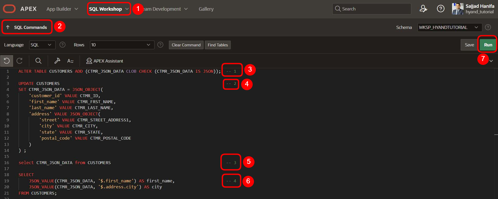  

---

## <a name="schritt-json-daten-abfragen"></a>Step 2: Query JSON Data  

1. Execute the following command in the **SQL Commands** window:  

   ```sql
   SELECT CTMR_JSON_DATA FROM CUSTOMERS;
   ```
2. Compare the result with the display in the image.

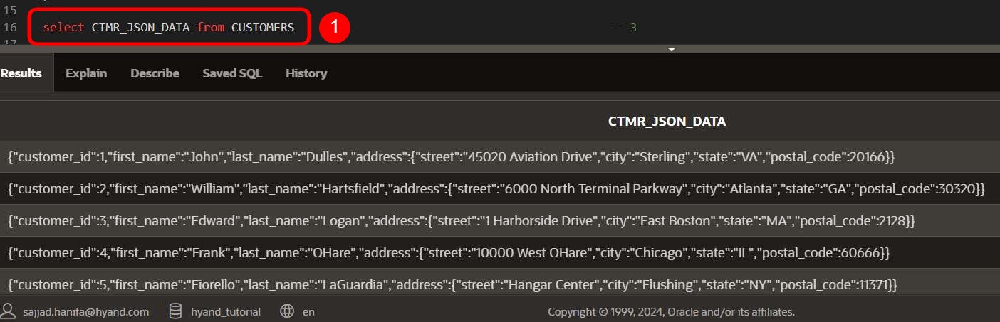 

---

## <a name="schritt-json-werte-extrahieren"></a>Step 3: Extract JSON Values  

1. Execute the following command in the **SQL Commands** window to retrieve specific JSON values:  

   ```sql
   SELECT 
       JSON_VALUE(CTMR_JSON_DATA, '$.first_name') AS first_name,
       JSON_VALUE(CTMR_JSON_DATA, '$.address.city') AS city
   FROM CUSTOMERS;
   ```
2. Compare the result with the display in the image.

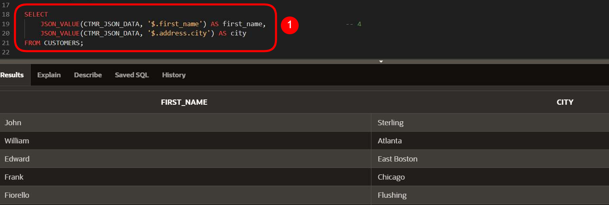 

---

## <a name="schritt-json-datenquelle-erstellen"></a>Step 4: Create JSON Data Source  

1. Click on **Application** to switch to the current application.  
2. Select the **Shared Components** tab.  
3. Scroll down to the **Data Sources** section.  
4. Click on **JSON Sources** to create a new JSON data source.  

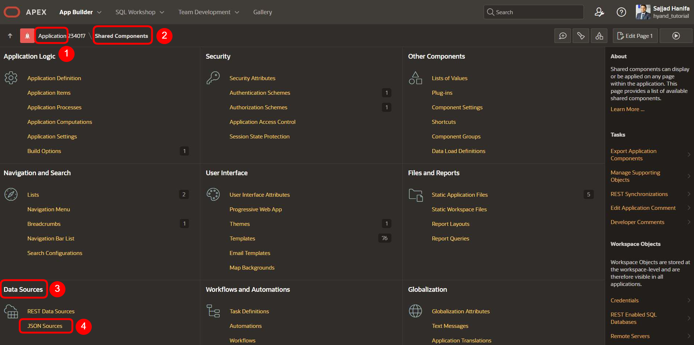  

---

## <a name="schritt-neue-json-datenquelle-erstellen"></a>Step 5: Create New JSON Data Source  

1. The **JSON Sources** section is currently empty as no JSON data source exists yet.  
2. Click **Create** to add a new JSON data source.  

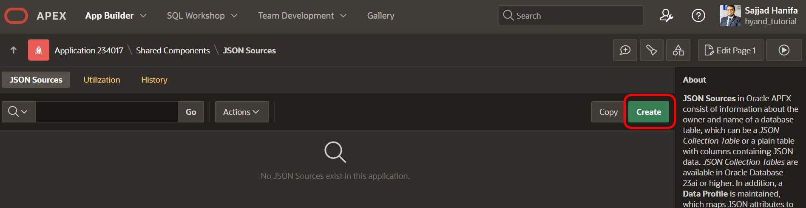  

---

## <a name="schritt-json-datenquelle-konfigurieren"></a>Step 6: Configure JSON Data Source  

After clicking **Create**, a **Pop-up window** opens to configure the JSON data source. Here you will enter the basic information for the JSON source.  

1. Enter **customer_json_table** in the **Name** field to name the JSON data source.  
2. Select **Table with JSON Columns** and choose the **CUSTOMERS** table that contains the JSON data.  
3. Click **Next** to continue.  

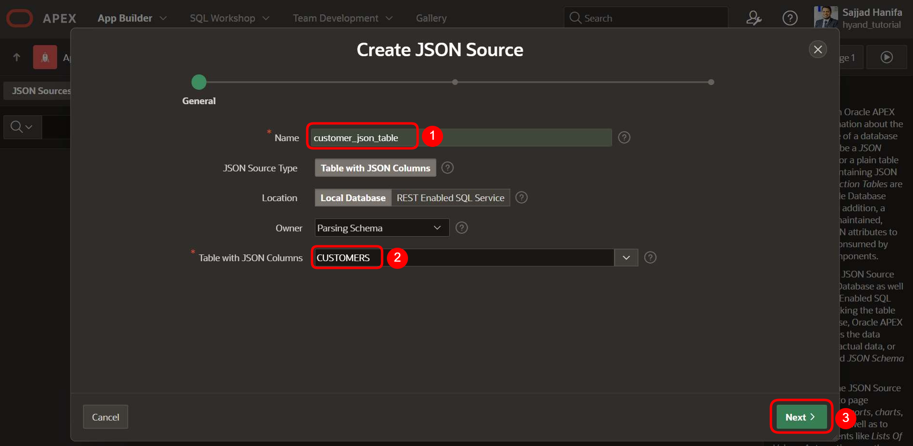  

---

## <a name="schritt-json-spalte-auswählen"></a>Step 7: Select JSON Column  

In the next step, you need to define the JSON column to be used for the data source.  

1. In the dropdown menu under **JSON Column 1**, select the column **CTMR_JSON_DATA (Clob)** that contains the JSON data.  
2. Then click **Next** to proceed.  

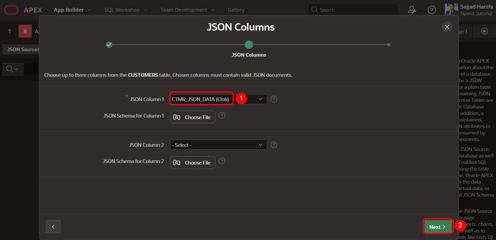  

---

## <a name="schritt-datenprofil-überprüfen"></a>Step 8: Review Data Profile  

Oracle APEX automatically creates a **Data Profile** based on the JSON source. Some adjustments are required here.  

1. Check the **Primary Key** column for **CTMR_ID** to define it as the primary key.  
2. Scroll down to review the remaining columns.   

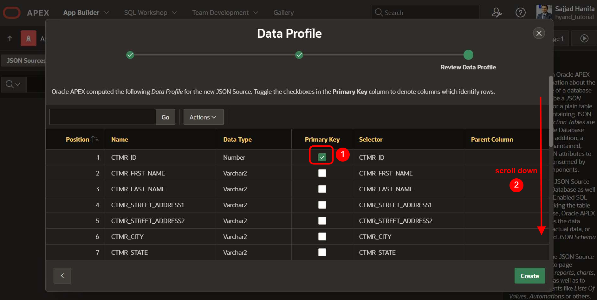  

---

## <a name="schritt-datenprofil-fertigstellen"></a>Step 9: Finalize Data Profile  

After selecting the primary key column, additional relevant columns need to be marked for JSON processing.  

1. Scroll down again to see additional columns.  
2. Check the boxes for the following columns:  
   - **address.city**  
   - **address.state**  
   - **address.street**  
   - **address.postal_code**  
   - **last_name**  
   - **first_name**  
   - **customer_id**  
3. Click **Create** to complete the JSON source.  

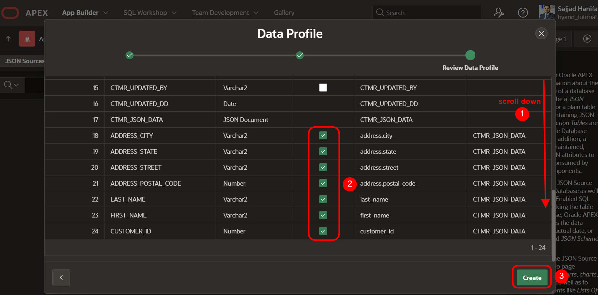  

---

## <a name="schritt-json-source-überprüfen"></a>Step 10: Verify JSON Source Successfully Created  

After the JSON Source is successfully created, a confirmation message appears, and the entry is visible in the list.  

1. Verify the green confirmation message **"JSON Source created."** to ensure successful creation.  
2. The newly created JSON Source **customer_json_table** should now appear in the table.  

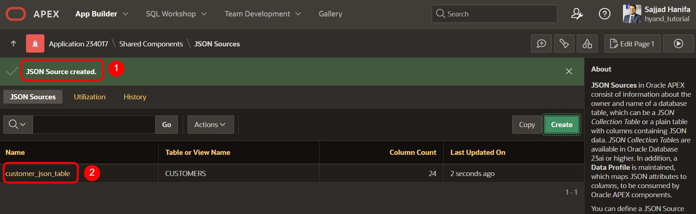  

---

## <a name="schritt-neue-seite-erstellen"></a>Step 11: Create New Page  

To display JSON data in a report, a new page must be created in the APEX application.  

1. Return to the **Application Overview**.  
2. Click **Create Page** to add a new page.  
3. Select **Classic Report** as the page type.  
4. Click **Next** to continue.  

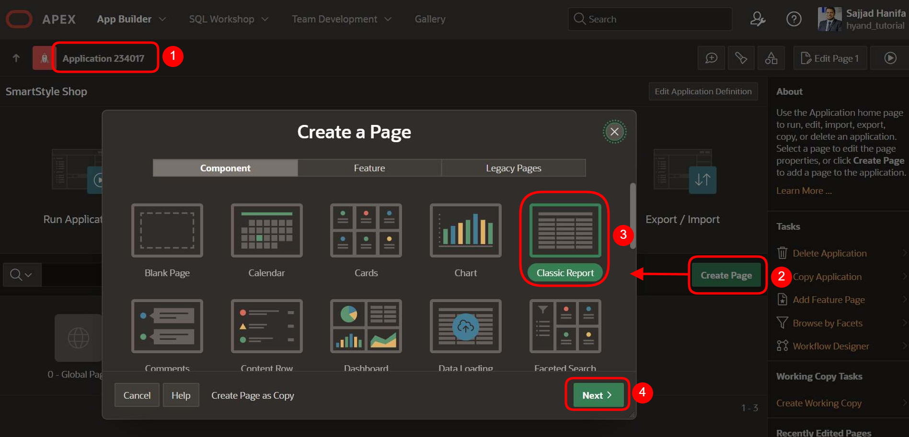  

---

## <a name="schritt-classic-report-definieren"></a>Step 12: Define Classic Report  

After the new page is created, the settings for the **Classic Report** need to be configured.  

1. **Page Number**: Enter a page number, e.g., **10**.  
2. **Name**: Set the name to **JSON Report**.  
3. **Data Source**: Select **JSON Source** as the data source.  
4. **JSON Source**: Choose **customer_json_table**.  
5. **Icon**: Use the icon **fa-file-json-o** for visual identification of the page.  
6. Click **Create Page** to add the page.  

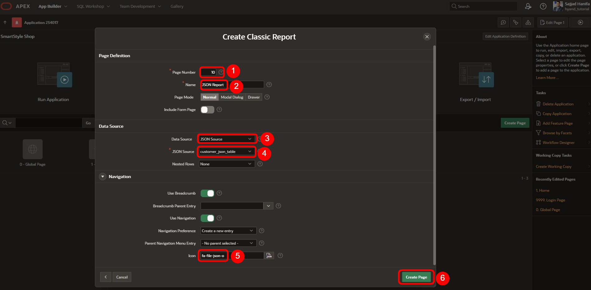  

---

## <a name="schritt-json-report-überprüfen"></a>Step 13: Check JSON Report and Open Columns  

After the page is created, a confirmation message appears. Now you can adjust the columns for the report.  

1. Ensure you are on **Page 10 (JSON Report)**.  
2. Verify the confirmation message **"Classic Report page created."** to ensure the page was successfully created.  
3. Expand the **Columns** section to manage the report's columns.  

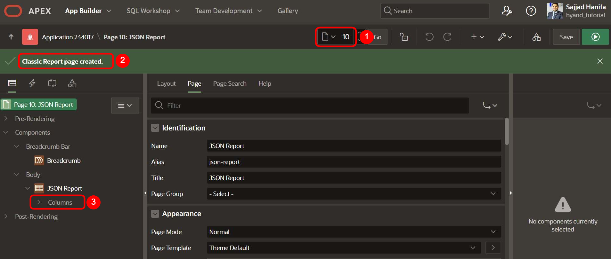  

---

## <a name="schritt-spalten-sortieren"></a>Step 14: Sort and Hide Columns  

After the JSON report page is created, the columns need to be sorted and unnecessary columns hidden.  

1. **Organize Columns**  
   - Only keep the following columns visible:
     - **FIRST_NAME**  
     - **LAST_NAME**  
     - **ADDRESS_STREET**  
     - **ADDRESS_POSTAL_CODE**  
     - **ADDRESS_CITY**  
     - **ADDRESS_STATE**  
   - Mark all other columns as **commented (hidden)**.  

2. **Then save and execute**  
   - Click the **Save Button**.  
   - Click the **Run Button** to verify changes.  

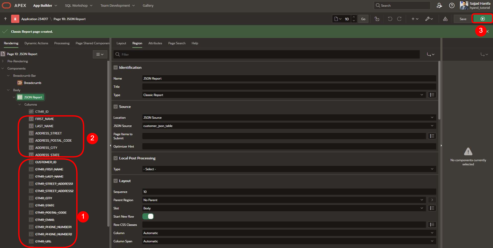  

---

## <a name="schritt-ergebnisprüfung"></a>Step 15: Verify Results  

After making all adjustments, the JSON report page should now be correctly displayed.  

1. **Execute Page**  
   - Click the **Run Button** to open the page in the application.  

2. **Data Verification**  
   - The page should display a **table with the selected columns**:  
     - **First Name**  
     - **Last Name**  
     - **Address Street**  
     - **Address Postal Code**  
     - **Address City**  
     - **Address State**  

3. **Final Validation**  
   - Ensure the data is correctly loaded from the JSON source and matches the previous steps.  

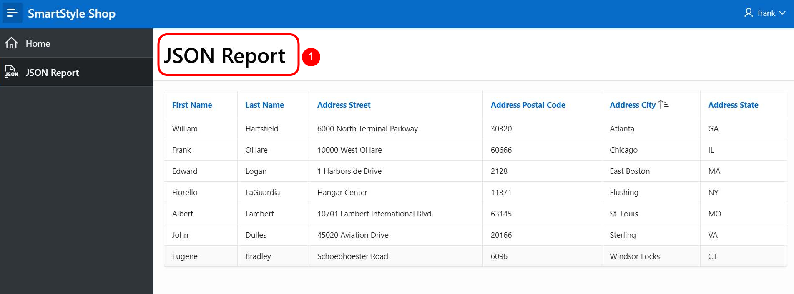  

---

## <a name="abschluss-json"></a>Conclusion  

Congratulations! You have successfully integrated a **JSON data source in Oracle APEX** and created a **dynamic JSON report**.  

Thank you for participating!