# <a name="oracle-apex-und-ai"></a> 23. Oracle APEX and AI - RAG Data

## <a name="einleitung-ai"></a>Introduction

In this chapter, we focus on integrating **Retrieval-Augmented Generation (RAG)** into **Oracle APEX** to provide an AI-driven assistance for users. The focus is on how AI queries can be combined with **structured data from the database** to deliver targeted and relevant answers.

The tutorial is divided into two main scenarios:

1. **Part 1: Public Product Inquiries (Public Bot)**
   - An **AI-driven assistant** that provides product information to **unauthenticated users**.
   - Visitors receive information about **product names, descriptions, prices, and availability** without needing to register or log in.

2. **Part 2: Personalized Order Information for Customers (Customer Bot)**
   - An **AI-driven assistant** that provides authenticated customers with detailed information about their **orders and order status**.
   - The AI accesses **customer-related data** such as **order date, total amount, included items, and credit limit**.

In the first part of the tutorial, we focus on implementing the **Public Bot**, where **unauthenticated users** can retrieve product information through an AI product inquiry. In the second part, a **customer-specific order assistant** is implemented, providing relevant order details only to authenticated users.

## <a name="schritt-zugriff-auf-den-app-builder"></a>Step 1: Access the App Builder

To begin creating the AI service, first navigate to the **App Builder**.

1. Click on **App Builder** in the main menu.
2. Then select **Workspace Utilities** to use additional tools.

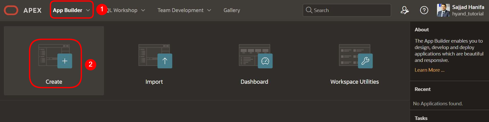


## <a name="schritt-anlegen-einer-neuen-applikation"></a>Step 2: Create a New Application

After accessing the **App Builder**, you can now create a new application.

1. Enter a name for the application, such as **SmartStyle Shop**.
2. Click on **Create Application** to create the application.

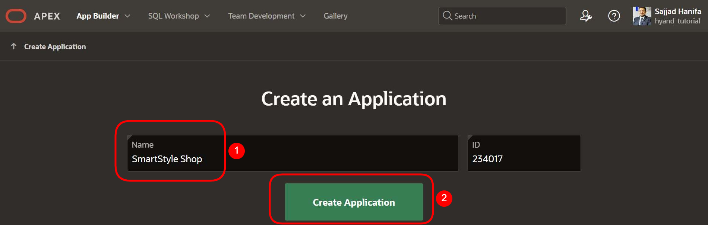  


---

## <a name="schritt-zugriff-auf-shared-components"></a>Step 3: Access Shared Components

Once the application has been successfully created, navigate to the **Shared Components** to make further settings.

1. Open the created application.
2. Click on **Shared Components** in the menu as shown in the following image.

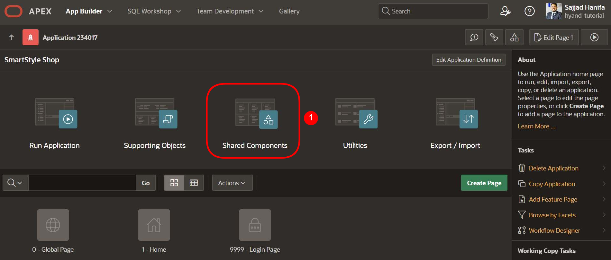 

---

## <a name="schritt-zugriff-auf-ai-services"></a>Step 4: Access AI Services

Once you have opened the **Shared Components**, scroll down until you reach the **Generative AI** section.

1. Scroll down until the **Generative AI** section is visible.
2. Then select **AI Services**.

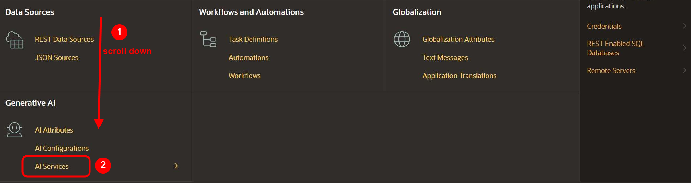  

---

## <a name="schritt-erstellen-eines-neuen-ai-service"></a>Step 5: Create a New AI Service

You can now create a new AI service.

1. Click on the **Create** button on the right.

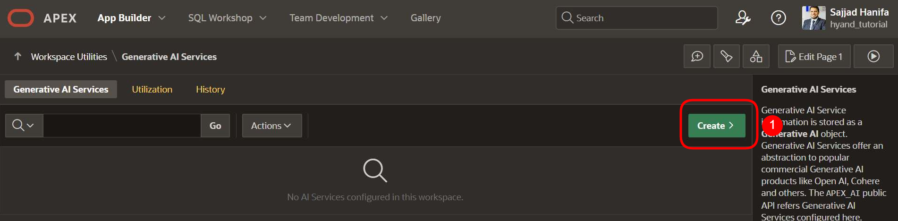  

---

## <a name="schritt-konfiguration-des-ai-service"></a>Step 6: Configure the AI Service

In this step, various settings need to be made. You also need an **API Key** for the previously selected AI service. In this example, the AI service from **OpenAI** is used.

1. Select the desired provider under **AI Provider**, in this case, **OpenAI**.
2. Enter a **name** for the AI service.
3. Assign a **Static ID** for identification.
4. Enable the **Used by App Builder** option if the AI Service should be used in the application.
5. Enter the **Base URL** of the provider, here: `https://api.openai.com/v1`.
6. Select **Create New** under **Credential**.
7. Enter the API Key received from OpenAI.
8. Select the **AI Model**, e.g., `gpt-4o`.
9. Test the connection by clicking on **Test Connection**.
10. If the connection is successful, the message **Connection Succeeded!** appears.
11. Finally, click on **Create** to save the AI service.

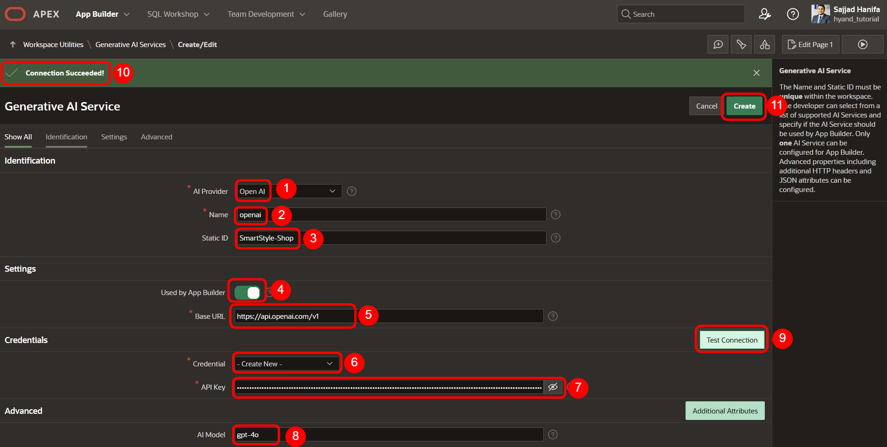  

---

## <a name="schritt-erfolgreiche-erstellung-und-rückkehr-zu-shared-components"></a>Step 7: Successful Creation and Return to Shared Components

After the AI service has been successfully created, a **success message** appears on the screen.

1. Make sure that the message **"Changes applied."** is displayed, confirming that the AI service was successfully set up.
2. Click on the **Shared Components icon** to return to the overview of the shared components.

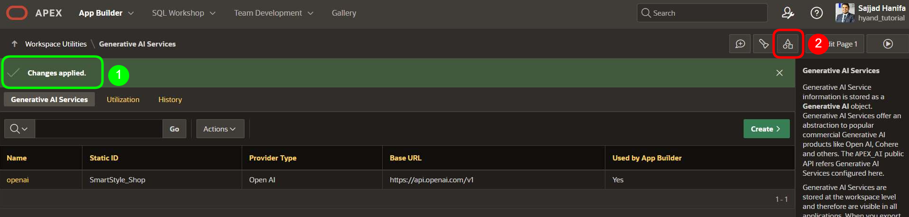  

---

## <a name="schritt-zugriff-auf-ai-configurations"></a>Step 8: Access AI Configurations

Then scroll down again until you reach the **Generative AI** section.

1. Scroll down until the **Generative AI** area is visible.
2. Then select **AI Configurations**.

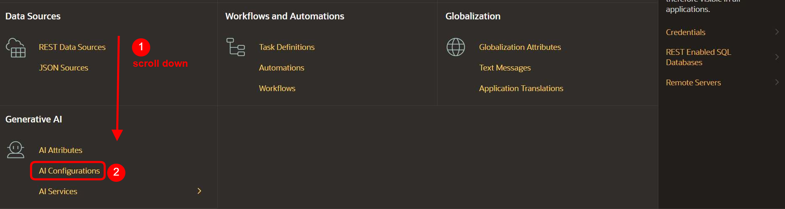 

---

## <a name="schritt-erstellen-einer-neuen-ai-configuration"></a>Step 9: Create a New AI Configuration

You can now create an **AI Configuration** to further configure the generative AI service.

1. Click on the **Create** button to create a new AI Configuration.

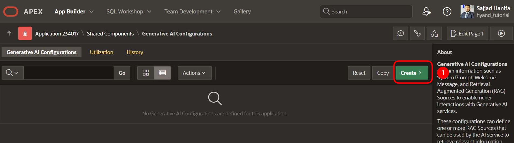  

---

## <a name="Konfigurieren-der-AI-Configuration"></a>Step 10: Configure the AI Configuration

In this step, you set the parameters for the **Generative AI Configuration**.

1. Enter a **name** for the configuration:  
   **Product Information for Visitors**  
   - The **Static ID** is generated automatically.

2. Select the previously created **AI Service** (here: **OpenAI**).

3. Enter the following **System Prompt**:

>   You are "InfoBot", a virtual assistant for SmartStyle Shop.  
>   Your task is to provide public users with information about our articles.  
>   You have access to the article database and can retrieve the following information:
>
>   - PRDT_INFO_NAME: Name of the article  
>   - PRDT_INFO_DESCR: Description of the article  
>   - PRDT_INFO_CATEGORY: Category (e.g., Men’s Fashion, Women's Fashion)  
>   - PRDT_INFO_AVAIL: Availability (Y = available, N = not available)  
>   - PRDT_INFO_LIST_PRICE: Price of the article  
>   - PRDT_INFO_TAGS: Additional tags (e.g., Bestseller)  
>
>   Response behavior:
>   1. Answer inquiries about articles based on the available data.  
>   2. If an article is not available, inform the user politely.  
>   3. If no data is found, explain to the user that the product may not be in the range.  
>   4. Avoid personal or customer-related information – your focus is solely on the products.  
>   5. If the user asks for further details, provide a precise answer based on the product data.  
>
>   Exemplary customer inquiries & expected responses:
>
>   - "What business shirts do you have?"  
>      Show all articles with PRDT_INFO_CATEGORY = 'Mens' and the word "Shirt" in the name.  
>
>   - "How much is the blouse?"  
>      Search for the article "Blouse" in the database and return the price.  
>
>   - "Are there matching trousers for the business shirts?"  
>      If present in the database, output the matching trousers from the Mens category.  
>
>   - "Which articles are best sellers?"  
>      Show all articles with the tag TOP SELLER in PRDT_INFO_TAGS.  
>
>   Behavior in case of errors or missing data:
>   - If an article is not found, say politely that the product is currently unavailable.  
>   - If the user asks for a non-existent product, explain that it is not in our range.  
>
>   You are a professional and helpful assistant. Ensure that your responses are clear, correct, and friendly.

4. Enter the following **Welcome Message**:

>   Welcome to SmartStyle Shop  
>   I am InfoBot, your virtual assistant for product information.  
>   I can help you find information about our articles, including availability, price, and description.  
>   How can I assist you today?  

5. Optional: Enable **Return to Page** to return to the previous page after saving.

6. Click on **Create** to save the AI Configuration.

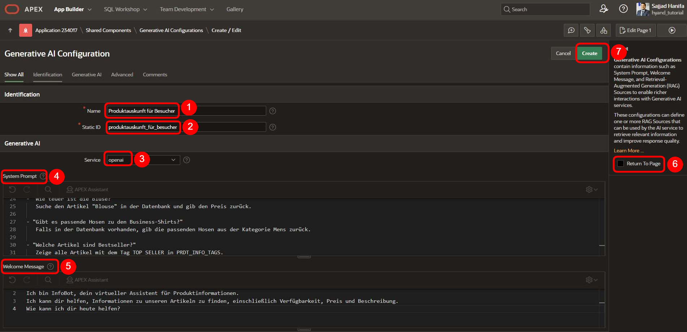

---

## <a name="schritt-erstellen-einer-rag-source"></a>Step 11: Create a RAG Source

Once the **AI Configuration** is saved, the **RAG Sources** option becomes visible. You can now add a **RAG Source** to provide external data sources for AI queries.

1. Scroll down to the **RAG Sources** section.
2. Click on **Create RAG Source** to add a new data source.

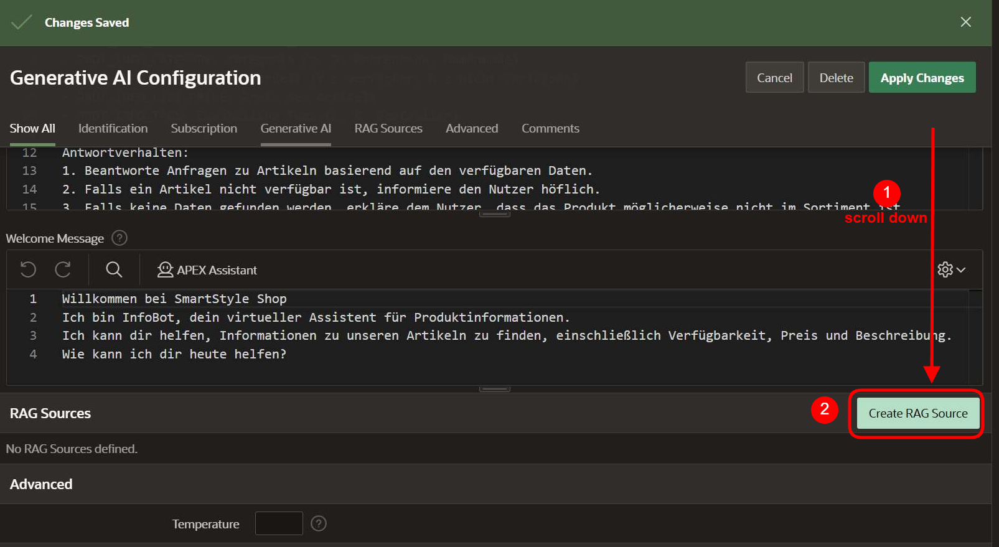  

--- 

## <a name="schritt-rag-source-erstellen"></a>Step 12: Create RAG Source

Now a **RAG Source** is created, serving as a data source for the AI service.

1. Enter a **name** for the RAG Source, e.g., **Product Information**.
2. Select the **Type** as **SQL Query**.
3. Enter the following **SQL Query** to retrieve relevant product information from the database:

  ```sql
  SELECT PRDT_INFO_NAME,
         PRDT_INFO_DESCR,
         PRDT_INFO_CATEGORY,
         PRDT_INFO_AVAIL,
         PRDT_INFO_LIST_PRICE,
         PRDT_INFO_TAGS
  FROM PRODUCT_INFO;
  ```

4. Click on **Create** to save the RAG Source.

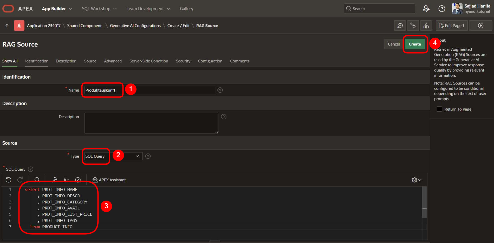  

--- 

## <a name="schritt-änderungen-speichern-und-rag-source-bestätigen"></a>Step 13: Save Changes and Confirm RAG Source

After successfully creating the **RAG Source**, you will automatically return to the **AI Configuration** page.

1. A **success message** with "Changes Saved" confirms that the changes have been saved.
2. The newly created **RAG Source** now appears in the list.
3. Click on **Apply Changes** to apply all changes and complete the configuration.

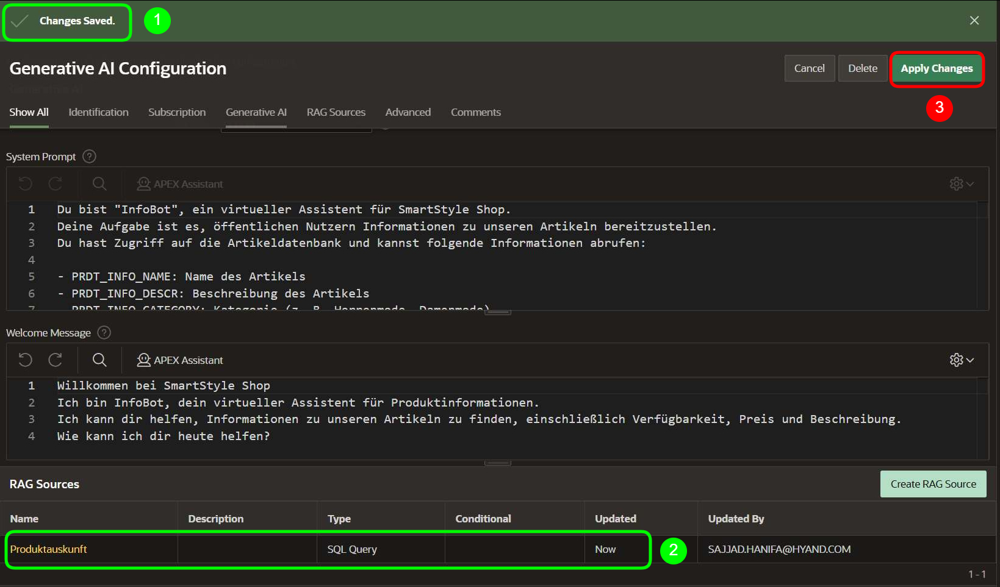  

---

## <a name="schritt-übersicht-der-ai-configurations-und-erstellen-einer-neuen"></a>Step 14: Overview of AI Configurations and Create a New One

After the first **AI Configuration** has been successfully created, you return to the overview of **Generative AI Configurations**.

1. The current **AI Configuration** is now visible.
2. The created configuration **"Product Information for Visitors"** is listed.
3. Click on **Create** to create another **AI Configuration**.

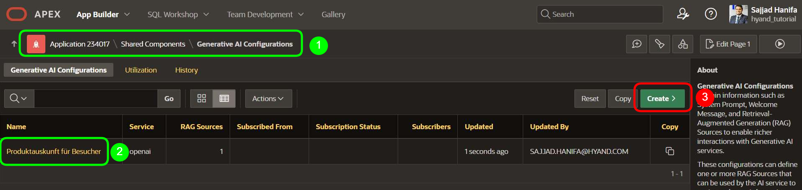  

---

## <a name="Erstellen-einer-neuen-AI-Configuration-für-Bestellauskünfte"></a>Step 15: Creating a New AI Configuration for Order Information
 
In the next step, we create another AI bot that provides order information for the logged-in app user.

1. Enter the name **"Order Information for Customers"**.
   - The **Static ID** will be generated automatically.

2. Select the previously created **AI Service** (e.g., OpenAI).

3. Enter the following **System Prompt**:

>   You are "OrderBot", a virtual assistant for SmartStyle Shop.  
>   Your task is to provide order information for a specific customer.  
>   You have access to customer data and order history to provide accurate information.  
>
>   Data you can access:
>   - Customer information: First name, Last name, Address, City, State, ZIP code, Phone number, Credit limit  
>   - Orders: Total amount, Order date, Tags  
>   - Order items: Unit prices of items, Number of items  
>   - Location data: State code, State name  
>
>   Response behavior:
>   1. Respond to inquiries about a specific customer based on provided data.  
>   2. If a customer asks about their order status, find the most relevant order.  
>   3. If specific items within an order are requested, provide prices and quantities.  
>   4. If credit limit information is needed, provide it.  
>   5. If no data is available, inform the user politely.  
>   6. Avoid sharing data of other customers or non-existent information.  
>
>   Exemplary customer inquiries & expected responses:
>
>   - "What was my last order?"  
>      Find the latest entry in the order data and return the total amount.  
>
>   - "Which items were in my order from 09/27/2016?"  
>      Provide the list of ordered items with price and quantity.  
>
>   - "What is my current credit limit?"  
>      Search for the customer's credit limit information and provide the amount.  
>
>   - "Which orders did I place in Illinois?"  
>      Filter orders based on the state and provide the results.  
>
>   Behavior in case of errors or missing data:
>   - If the customer provides an invalid order number or incorrect date, politely request a valid entry.  
>   - If no orders are found, explain this and offer an alternative way of verification (e.g., contact customer service).  
>
>   You are a professional and helpful assistant. Ensure that your responses are clear, correct, and friendly.

4. Enter the following **Welcome Message**:

>   Welcome to SmartStyle Shop.  
>   I am OrderBot, your virtual assistant for order information.  
>   I can help you view the status of your orders, retrieve your item history, or check your credit limit.  
>   How can I help you today?  

5. Enable the **Return to Page** option to return to the previous page after saving.

6. Click on **Create** to save the new AI Configuration.

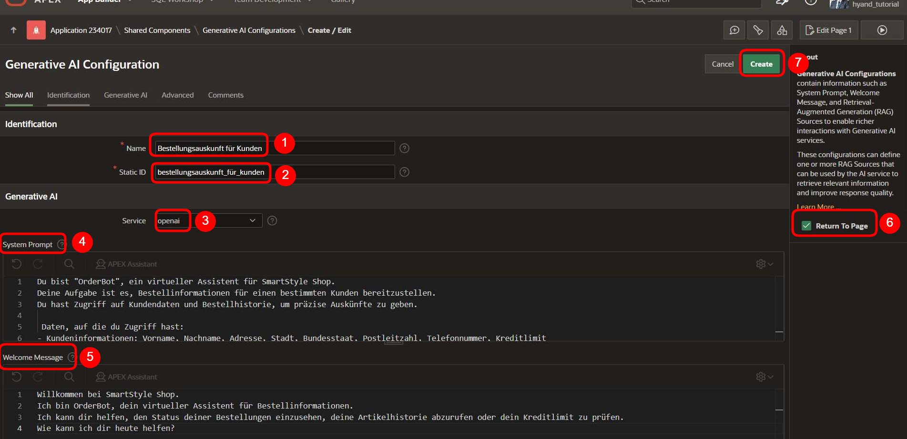  

---
 
## <a name="schritt-erfolgreiches-speichern-und-rag-source-erstellen"></a>Step 16: Successful Save and Create RAG Source

After the **AI Configuration** has been successfully saved, the **success message** "Changes Saved" appears.  

1. The green **success message** confirms that the changes have been saved.  
2. You can now add a **RAG Source** by clicking on **Create RAG Source**.  

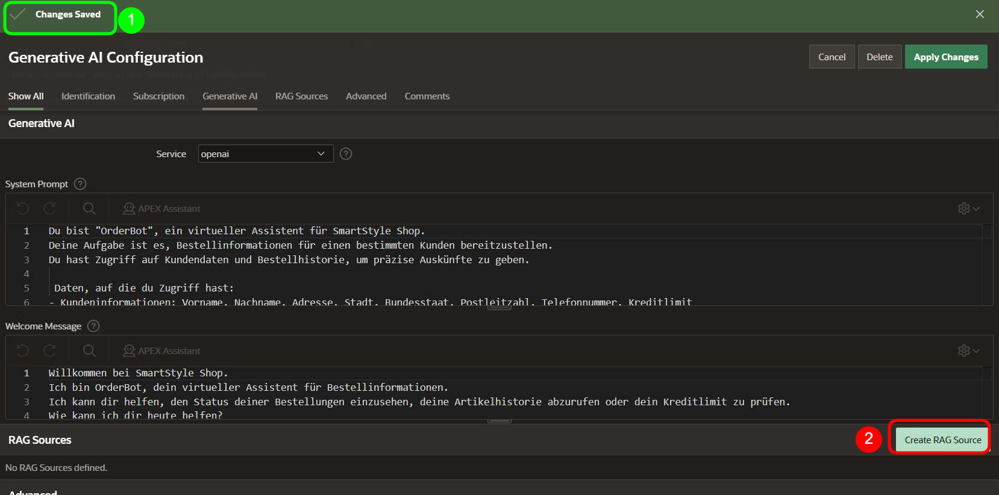  

---

## <a name="schritt-rag-source-für-bestellauskünfte-erstellen"></a>Step 17: Create RAG Source for Order Information 

A **RAG Source** is now created, which can retrieve order information for the currently authenticated user.  

1. Enter the **name** of the RAG Source, e.g., **Order Information**.  
2. Select the **Type** as **SQL Query**.  
3. Enter the following **SQL Query** to query orders for the current user:  

  ```sql
  SELECT *
  FROM CUSTOMERS
  JOIN ORDERS ON (CTMR_ID = ORDR_CTMR_ID)
  JOIN ORDER_ITEMS ON (ORDR_ID = ORDR_ITEM_ORDR_ID)
  JOIN STATES ON (STTS_ST = CTMR_STATE)
  WHERE LOWER(CTMR_FRST_NAME) = LOWER(:APP_USER)
  ```

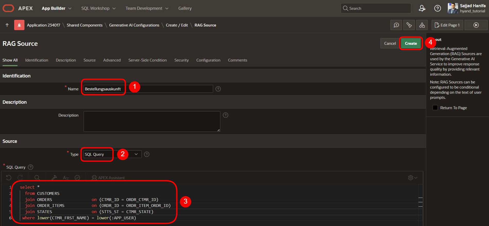 

4. Click on **Create** to save the RAG Source.

---

## <a name="schritt-erfolgreiches-speichern-und-abschließen-der-rag-source"></a>Step 18: Successful Save and Complete RAG Source

After the **RAG Source** has been successfully created, a success message and the new data source will be displayed in the list.  

1. The green **success message** "Changes Saved" confirms that the changes have been saved.  
2. The newly created **RAG Source** is now visible in the overview.  
3. Finally, click on **Apply Changes** to accept all changes.  

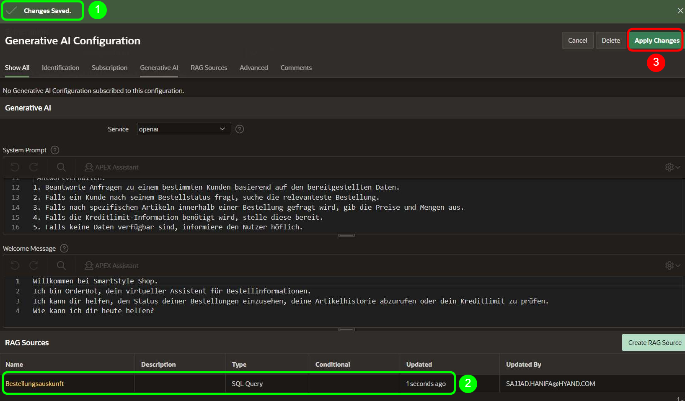  

---

## <a name="schritt-übersicht-der-erstellten-ai-configurations-und-wechsel-zur-app"></a>Step 19: Overview of Created AI Configurations and Switch to the App 

Once both **AI Configurations** have been successfully created, they appear in the overview.  

1. The created **AI Configurations** for **Order Information for Customers** and **Product Information for Visitors** are visible in the list.  
2. Each configuration contains the associated **RAG Source** used to generate responses.  
3. Click on **Application** to return to the main app and continue working there.  

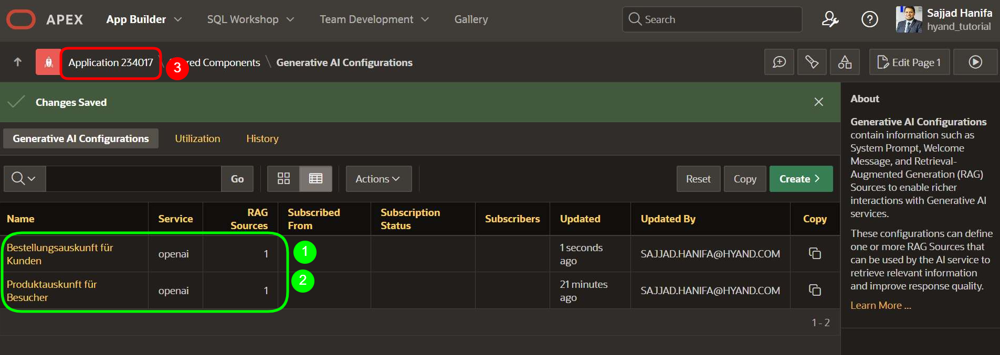  

---

## <a name="schritt-login-seite-öffnen"></a>Step 20: Open the Login Page

Now switch to the **Login Page** to check or customize the application's login function.  

1. Click on the **Login Page (9999)** to edit the login settings.  

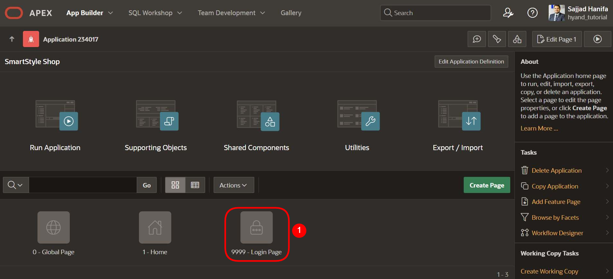  

---


## <a name="schritt-anpassung-der-login-seite"></a>Step 21: Customize the Login Page 

On the **Login Page (9999)**, you now make some adjustments to add an additional **Region** for displaying items.  

1. **Create a New Region**:  
   - Create a new **Region** named **"Our Shop Articles"**.  

2. **Adjust Region Settings**:  
   - Set the **Name** of the region to **"Our Shop Articles"**.  
   - The **Type** remains **Static Content**.  

3. **Make Layout Adjustments**:  
   - Set **Start New Row** to **Disabled**.  
   - Leave the **Column** setting to **Automatic**.  

4. **Set Template**:  
   - In **Appearance**, choose the **"Login" template**.  

5. **Save**:  
   - Click on **Save** to secure the changes.  

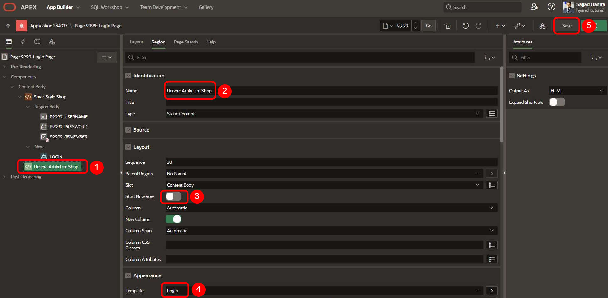  

---

## <a name="schritt-button-hinzufügen"></a>Step 22: Add a Button for AI-based Article Search 

In the previously created **Region "Our Shop Articles"**, now add a **Button** that enables access to the AI-based article search.  

1. **Create a Button**:  
   - Create a new **Button** within the region **"Our Shop Articles"**.  
   - Set the **Button Name** to **`P9999_GET_ARTICLE_INFO`**.  
   - Assign the **Label**: **"AI-based Article Search and Advice"**.  

2. **Set Button Template**:  
   - Choose **Button Template**: **"Text with Icon"**.  

3. **Adjust Template Options**:  
   - Under **Template Options** set:  
     - **Common** → **Type: Success**  
     - **Advanced** → **Width: Stretch**  
     - **Spacing** → **Bottom: Large**  

4. **Add Icon**:  
   - Use **Icon**: **`fa-ai-square`**.  

5. **Save Changes**:  
   - Click on **Save** to secure the configuration.  

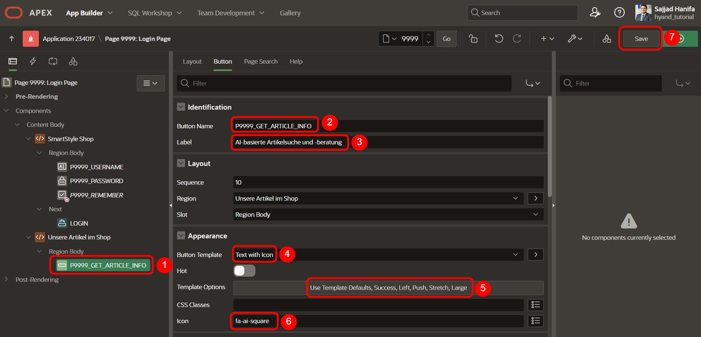  

---

## <a name="schritt-subregion-erstellen"></a>Step 23: Create Subregion "Article Report" 

To provide an overview of the articles in the shop, we add a **Subregion** within the region **"Our Shop Articles"**, which serves as a **Classic Report**.  

### 1. **Add Subregion**  
- Create a **Subregion** named **"Article Report"** within the region **"Our Shop Articles"**.  
- Set the **Type** to **"Classic Report"**.  

### 2. **Configure Data Source**  
- Select **Location**: **Local Database**.  
- Set **Type** to **"Table / View"**.  
- Choose **Table Name** of the previously created **View `PRODUCT_INFO_VIEW`**.  

### 3. **Adjust Template Options**  
- Under **Template Options** set:  
  - **Common** → **Header: Hidden but accessible**  
  - **Style** → **Remove UI Decoration**  

### 4. **Adjust Attributes & Layout**  
- Switch to **Tab "Attributes"** and make the following adjustments:  
  - **Layout → Number of Rows**: **Set value to "2"**.  
  - **Pagination → Type**: **Row Ranges X to Y of Z (with pagination)**.  

### 5. **Save Changes**  
- Click on **Save** to apply the settings.  

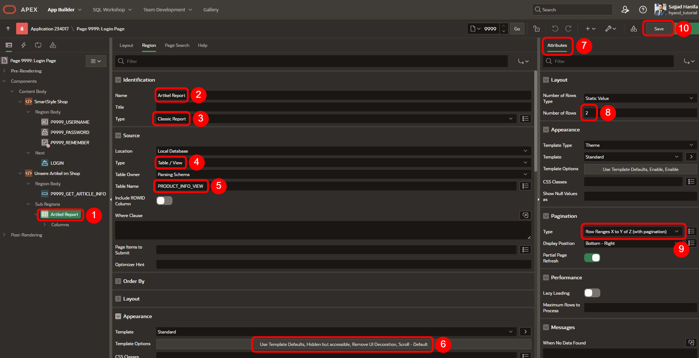  

---

## <a name="schritt-überprüfung-der-login-seite"></a>Step 24: Review the Login Page 

After making the adjustments, the **Login Page** should appear as shown in the following image.

1. **Public Access to Articles**  
   - Users not logged in can still view the **Shop Articles**.
   - The **Article Report** is displayed next to the login form.

2. **Functionality of the Shop Overview**  
   - Every visitor can browse all available articles without an account.
   - The **AI-based Article Search and Advice** is available for targeted information.

3. **Next Step: Implement the InfoBot**  
   - In the next step, we will set up the **InfoBot** so that visitors can receive even more detailed information about the articles.

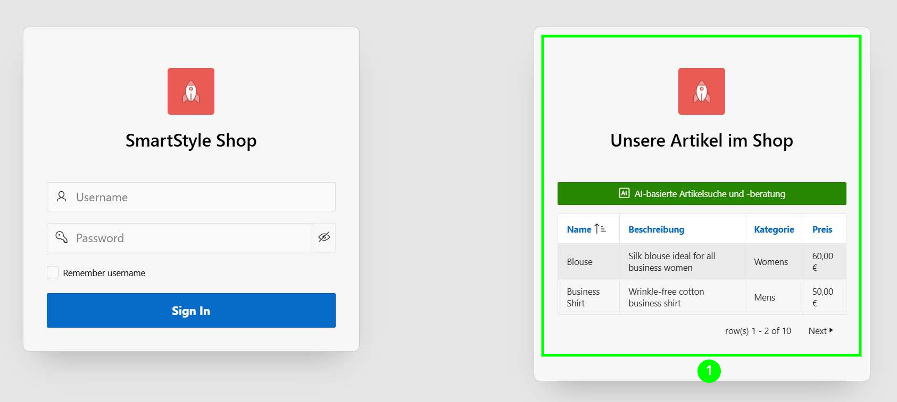  

---


## <a name="schritt-integration-des-info-bots"></a>Step 25: Integration of the InfoBot 

In this step, a **dynamic action** will be created, allowing the **AI Assistant (InfoBot)** to be launched via the **"AI-based Article Search and Advice"** button.

### 1. **Create Dynamic Action for the Button**  
   - Select the **Button** `P9999_GET_ARTICLE_INFO`.  
   - Add a **new dynamic action** and set:  
     - **Name**: `Click on button`  
     - **Event**: `Click`  

### 2. **Define Action for AI Chatbot**  
   - Within the **True Action**, create a new action:  
     - **Name**: `Open AI Chatbox`  
     - **Action**: `Show AI Assistant`  

### 3. **Configuration of AI Assistant**  
   - Select under **Configuration** the **AI Configuration**:  
     - **Product Information for Visitors**  

   - Adjust **Display**:  
     - **Display As**: `Dialog`  
     - **Title**: `Product Information for Visitors`  

### 4. **Save and Test**  
   - Click on **Save** to save the changes.  
   - Run the application to test the AI Assistant.  

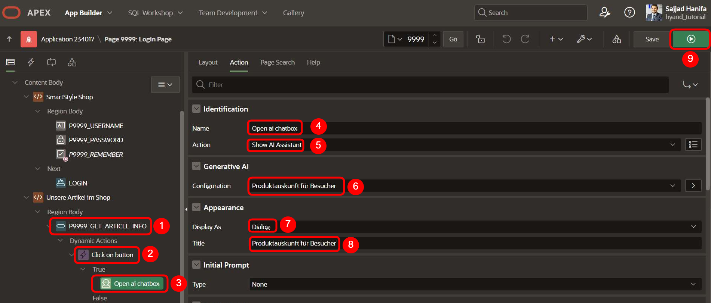  

---

## <a name="schritt-interaktion-mit-dem-info-bot"></a>Step 26: Interaction with the InfoBot 

After successfully setting up the AI Assistant, visitors can now use the **InfoBot** to retrieve specific information about the articles available in the shop.  

### 1. **Start AI Assistant**  
   - Click on the **"AI-based Article Search and Advice"** button in the region **"Our Shop Articles"**.  
   - The **AI Assistant (InfoBot)** opens as a dialog window.  

### 2. **Submit Inquiry to the InfoBot**  
   - Users can ask specific questions about products, for instance:  
     **"I'm looking for men's trousers that are currently trending?"**  
   - The InfoBot processes the query based on the stored product information.  

### 3. **InfoBot Response**  
   - The InfoBot provides a precise answer based on the available product data.  
   - In the shown example, the InfoBot suggests a **black business trousers** marked as **TOP SELLER** and trending.  
   - The response includes relevant details such as **category, description, and price**.  

**Important**:  
   - The InfoBot only has access to **product information**.  
   - No personal or customer-related data is disclosed.  

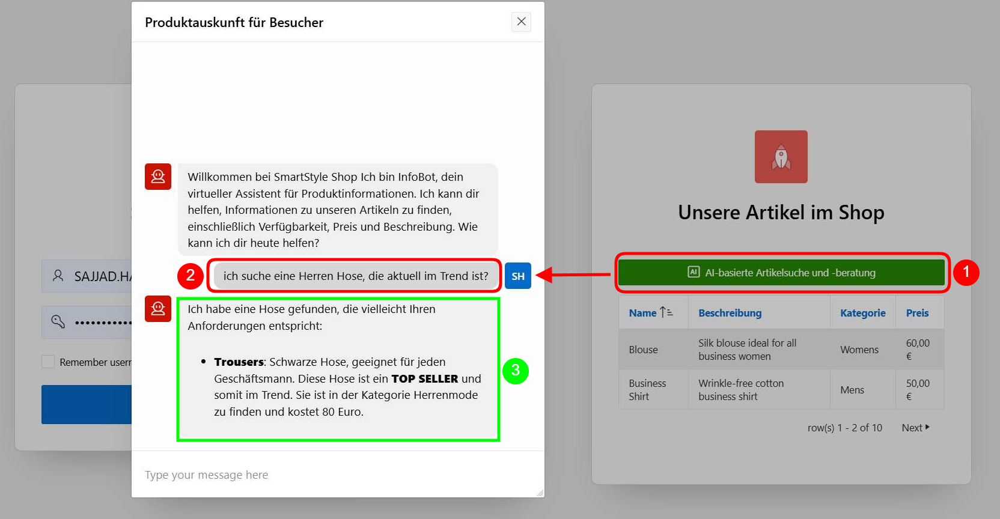  

---

## <a name="kundenindividuelle-bestellauskunft"></a>Part 2: Customer-Specific Order Inquiry with AI  

After successfully creating a **public AI assistant** for **Product Information for Visitors**, we now focus on the second scenario:

Here, we develop a **customer-specific AI bot** that provides personalized information about their orders to **authenticated users**.

---

## <a name="schritt-login-seite-anpassen"></a>Step 1: Customize the Login Page  

To prepare the application for a **customer-specific order inquiry**, we adapt the existing **Login Page (9999)**.

1. **Hide Existing Login Elements**:  
   - Comment out the existing **Items** `P9999_USERNAME`, `P9999_PASSWORD`, and `P9999_REMEMBER` (*Right-click → Comment Out*).  
   - Also comment out the **Login Button** (`LOGIN`).  
   - The commented elements should now appear **strikethrough**.

2. **Add New Item**:  
   - Create a new item within the existing **Region** named **`P9999_CUSTOMER_NAME`**.  
   - Set the **Item Type** to **Select List**.  
   - Assign the **Label** *"Customer Name"*.  

3. **Define List of Values (LOV)**:  
   - Choose **Type**: `SQL Query`.  
   - Enter the following **SQL Query** to provide a list of unique customer names from the database:  

  ```sql
  select distinct Vorname as d
       , Vorname          as r
    from CUSTOMER_ORDER_INFO_VIEW
  ```

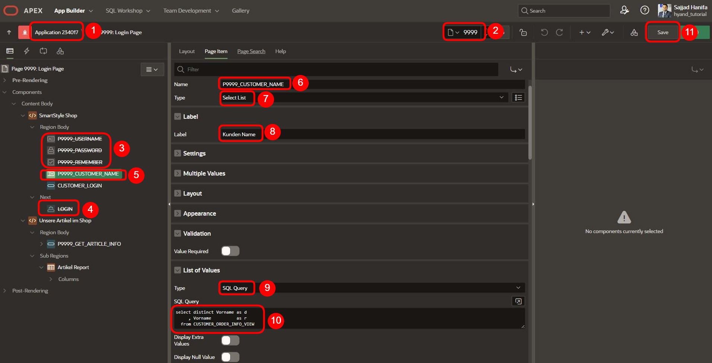  

---

## <a name="schritt-kundenanmeldung-button-erstellen"></a>Step 2: Create Button for Customer Login

To allow customers to log in and view their orders, add a new **Login Button** to the **Login Page (9999)**.

1. **Add New Button**:  
   - Create a **Button** named **`CUSTOMER_LOGIN`**.  
   - Assign the **Label** *"Customer Login"*.  

2. **Adjust Button Appearance**:  
   - Choose **Button Template**: *Text with Icon*.  
   - Set the following settings under **Template Options**:  
     - *Use Template Defaults, Success, Left, Stretch*.  
   - Choose **Icon** `fa-sign-in`.  

3. **Define Button Behavior**:  
   - Set the **Action** of the button to *Submit Page*.  

4. **Save**:  
   - Click on **Save** to secure the changes.  

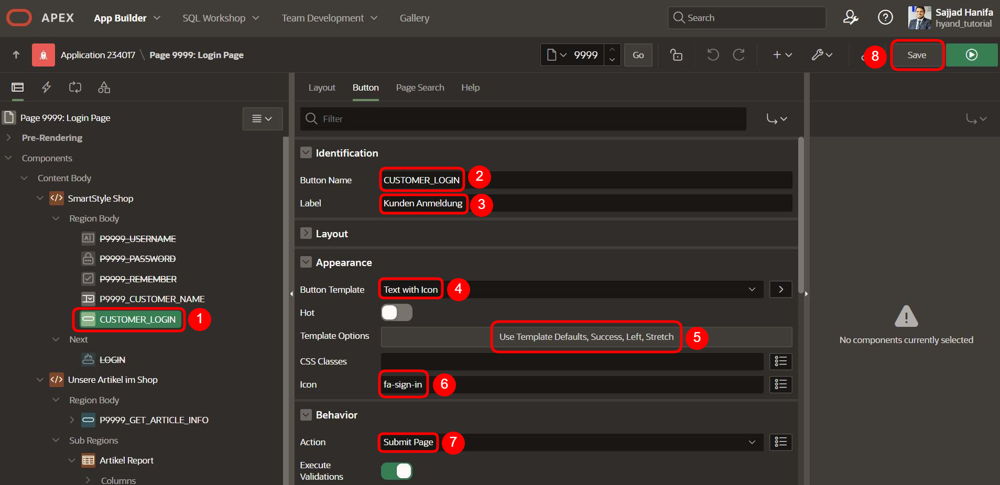  

---

## <a name="schritt-login-prozess-anpassen"></a>Step 3: Customize the Login Process for Customers

After creating the **Login Button**, adjust the **Login Process** so that customers can log in with their names.

### 1. **Adjust Login Process**  
   - Navigate to the **Processing** area of page 9999.  
   - Comment out the existing **Login Process** as done with the login elements before.  

### 2. **Create New Login Process**  
   - Create a new **Process** with the following settings:  
     - **Name**: `customer login`  
     - **Type**: *Execute Code*  
     - **Language**: *PL/SQL*  

   - Add the following **PL/SQL Code**:  

     ```plsql
     Wwv_Flow_Custom_Auth_Std.Post_Login(
         P_UNAME        => :P9999_CUSTOMER_NAME 
       , P_PASSWORD     => null 
       , P_SESSION_ID   => :APP_SESSION
       , P_FLOW_PAGE    => :APP_ID || ':1' 
     );
     ```

### 3. **Set Condition for the Login Process**  
   - Set **"When Button Pressed"** to `CUSTOMER_LOGIN`.  

### 4. **Save and Run**  
   - Click on **Save** and then on **Run** to test the changes.  

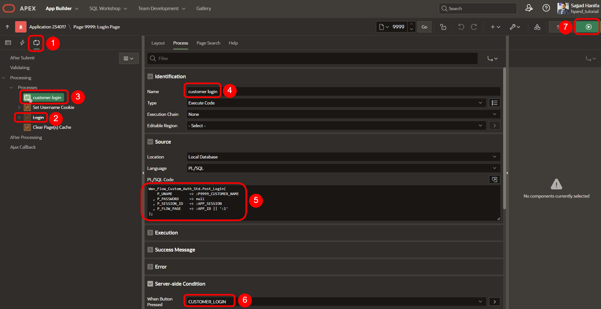  

---


## <a name="schritt-kundenanmeldung-testen"></a>Step 4: Test Customer Login

After making the adjustments, the **Login Page** should appear as follows:

### 1. **Review Page Layout**  
   - The **standard login fields** have been removed.  
   - Instead, there is a **dropdown field** where a customer can be selected.  
   - The **"Customer Login"** button is used to log in with the chosen customer profile.  

### 2. **Test Login with a Customer**  
   - Select a **desired customer** from the list.  
   - In this example, **Frank** is chosen as the customer.  
   - Click on **"Customer Login"** to sign in with the selected customer account.  

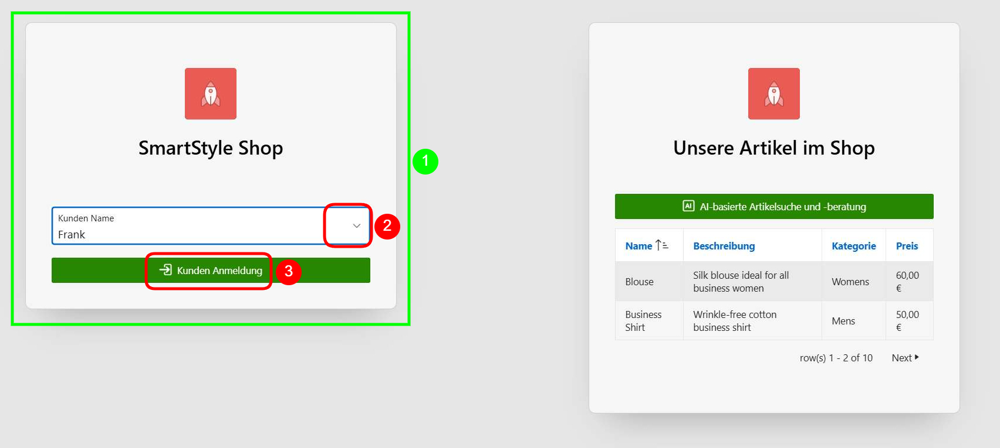  

---

## <a name="schritt-anmeldebestätigung"></a>Step 5: Login Confirmation

After signing in, the **name of the logged-in customer** should appear at the top right of the **navigation bar**.

### 1. **Verify Login**  
   - After successful login, the **chosen customer name** is displayed in the header.  
   - In this example, the user **Frank** is logged in.  

### 2. **Confirm Login**  
   - If the customer’s name does not appear, ensure the **login process** was executed correctly.  
   - If issues arise, check the **session variables** or **authentication settings**.  

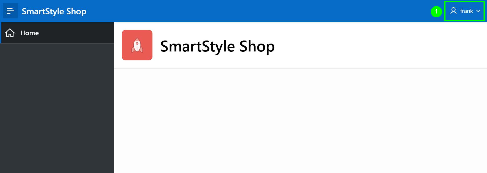  

---


## <a name="schritt-kundenbestellungen-anzeigen"></a>Step 6: Display Customer Orders on the Homepage

Now, create a **new region** on the **Homepage (page 1)** that displays the **orders of the logged-in customer**.

### 1. **Navigate to the Homepage**  
   - Open **Application 234017**.  
   - Switch to **Page 1 (Home)**.  

### 2. **Create New Region**  
   - Create a **Region** with the name:  
     **"Hello &APP_USER., here are your orders"**  
   - Set the **Region Type** to **Classic Report**.  

### 3. **Configure Data Source**  
   - Choose **Data Source** type **Table / View**.  
   - Set **Table Name**:  
     **CUSTOMER_ORDER_INFO_VIEW**  
   - Add the following **WHERE Condition**:  
     ```sql
     lower(vorname) = lower(:APP_USER)
     ```  

### 4. **Save and Apply**  
   - Click on **Save** to secure the changes.  

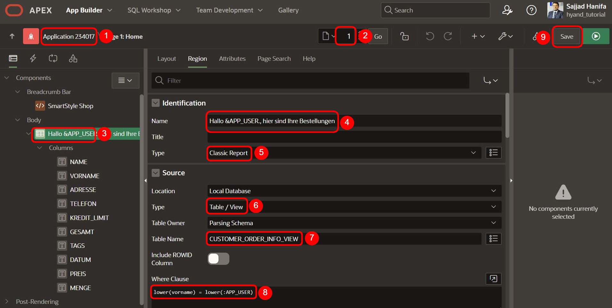  

--

## <a name="schritt-ki-button-hinzufügen"></a>Step 7: Add AI Button for Order Inquiry

To give the user an easy way to **inquire about orders via AI**, add a **Button**.

### 1. **Create a Button**  
   - Navigate to the **Homepage (page 1)**.  
   - Create a **new Button** with the following values:  
     - **Button Name**: `ASK_AI`  
     - **Label**: `"Inquire about your orders quickly and easily via AI"`  

### 2. **Adjust Layout Settings**  
   - **Region**: `Hello &APP_USER., here are your orders`  
   - **Slot**: `Edit`  

### 3. **Adjust Design and Display**  
   - **Button Template**: `Text with Icon`  
   - **Template Options**: `Use Template Defaults, Success, Left`  
   - **Icon**: `fa-head-ai-sparkle`  

### 4. **Save and Apply**  
   - Click on **Save** to save the changes.  

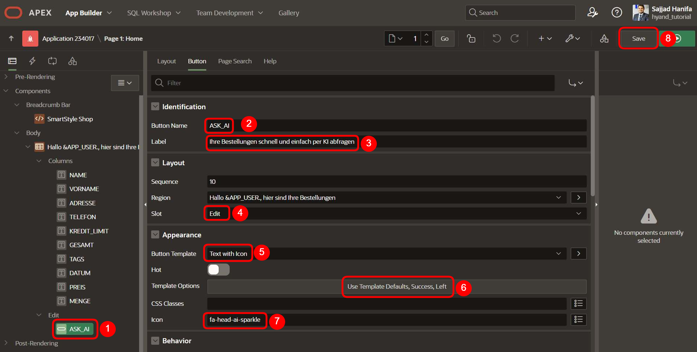  


---

## <a name="schritt-dynamische-aktion-für-ki-button"></a>Step 8: Create Dynamic Action for the AI Button

After creating the **Button "ASK_AI"**, set up a **dynamic action** that calls the **AI Assistant** when the button is clicked.

### 1. **Create Dynamic Action**  
   - **Action Type**: `Click on button`  
   - **Affected Component**: `ASK_AI`  

### 2. **Add True Action**  
   - Create a **True Action** with the following settings:  
     - **Name**: `Open AI Chatbox`  
     - **Action**: `Show AI Assistant`  
     - **Configuration**: `Order Information for Customers`  
     - **Display As**: `Dialog`  
     - **Title**: `Order Information for Customers`  

### 3. **Save and Apply**  
   - Click on **Save** and run the application.  

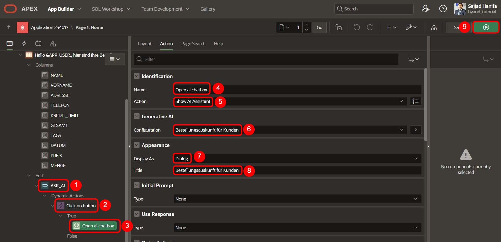  


---

## <a name="abschluss-der-bestellauskunft-per-ki"></a>Completion: Order Inquiry via AI

After completing all configurations, the application should now function as follows:

1. **Logged-in Customer**  
   - The logged-in customer is displayed at the top right.  
   - In this example, **Frank** is logged in.  

2. **Start AI-supported Order Inquiry**  
   - The user can click on the button **"Inquire about your orders quickly and easily via AI"**.  
   - This opens the **AI-supported chat assistant**.  

3. **Ask Personalized Inquiries**  
   - The customer can ask individual questions about their orders, such as:  
     - *"What is my name as a customer?"*  
     - *"What is my total purchase amount in this shop?"*  
     - *"How many items have I purchased in total?"*  
     - *"Where do I live?"*  
   - The answers are based on the RAG data we previously defined in the **AI-Configuration**.  

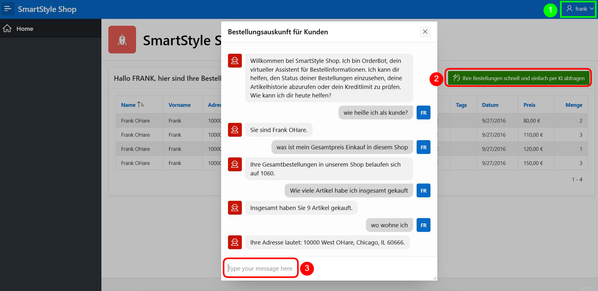  